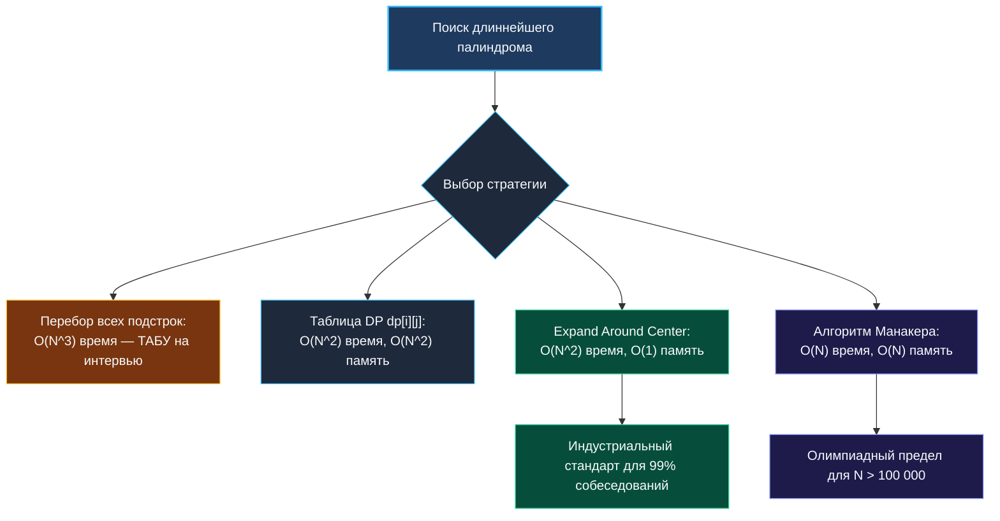

> *«Всякое сложное геометрическое расширение начинается с правильного и точного выбора точки отсчета».*  
> — Брайан Керниган

## Поиск самого длинного палиндрома: От Expand Around Center до линейного Манакера

Задача **Longest Palindromic Substring** (LeetCode 5) — фундаментальный классический фильтр на алгоритмическую и инженерную зрелость. Она проверяет не только умение писать циклы без ошибок смещения на единицу (off-by-one), но и понимание того, как срезы строк живут в памяти, когда динамическое программирование проигрывает прямому обходу и как работает предел оптимизации строковых алгоритмов.

```
Вход:  s = "babad"
Выход: "bab" (или "aba")

Вход:  s = "cbbd"
Выход: "bb"
```



---

## 1. Базовый индустриальный подход: Expand Around Center

Наивный перебор всех пар $(i, j)$ с последующей проверкой палиндрома занимает кубическое время $O(N^3)$.  
Динамическое программирование требует двумерную матрицу `dp[N][N]` типа `bool`, которая при $N = 10\,000$ потребует около 100 МБ памяти в куче и породит частые промахи кэша.

Подход **Expand Around Center (Расширение от центра)** использует фундаментальное геометрическое свойство палиндрома: зеркальную симметрию относительно своей оси.

В строке длины $N$ существует ровно **$2N - 1$ возможных центров**:
* $N$ центров нечетной длины (одиночный символ `s[i]`).
* $N - 1$ центров четной длины (виртуальный зазор между `s[i]` и `s[i+1]`).

```
Строка:   a   b   a   b   a
Центры:  [0]  |  [1]  |  [2]  |  [3]  |  [4]
         Нечет Чет Нечет Чет Нечет Чет Нечет Чет Нечет
```

### Формула восстановления начального индекса

Если расширение от центра дало палиндром максимальной длины `currLen`:
* Для нечетного центра $i$ длина $2k+1$: начало находится в $i - k = i - \frac{\text{currLen}-1}{2}$.
* Для четного центра между $i$ и $i+1$ длина $2k$: начало находится в $i - k + 1 = i - \frac{\text{currLen}-1}{2}$ (благодаря целочисленному делению).

Единая формула для обоих случаев:
$$\text{start} = i - \frac{\text{currLen} - 1}{2}$$

---

## Идиоматичная реализация на Go

```go
package palindrome

// LongestPalindrome находит наибольшую палиндромную подстроку за O(N^2) времени и O(1) памяти.
func LongestPalindrome(s string) string {
	if len(s) < 2 {
		return s
	}

	start, maxLen := 0, 1

	for i := 0; i < len(s); i++ {
		// Нечетный палиндром: центр s[i] (например, "aba")
		len1 := expandAroundCenter(s, i, i)
		// Четный палиндром: центр между s[i] и s[i+1] (например, "abba")
		len2 := expandAroundCenter(s, i, i+1)

		currLen := max(len1, len2)
		if currLen > maxLen {
			maxLen = currLen
			start = i - (currLen-1)/2
		}
	}

	// Срез строки в Go не копирует байты — O(1) возврат 16-байтового заголовка
	return s[start : start+maxLen]
}

// expandAroundCenter возвращает длину палиндрома с заданным центром
func expandAroundCenter(s string, left, right int) int {
	for left >= 0 && right < len(s) && s[left] == s[right] {
		left--
		right++
	}
	// Длина между (left+1) и (right-1) включительно:
	// (right - 1) - (left + 1) + 1 = right - left - 1
	return right - left - 1
}
```

> [!NOTE]
> **Почему возврат среза `s[start : start+maxLen]` в Go безопасен и быстр?**  
> В рантайме Go операция среза строки `s[start:end]` не вызывает вызова аллокатора кучи. Создается новая 16-байтовая структура `stringStruct`, у которой указатель `str` равен `s.str + start`, а `len` равен `maxLen`. Это дает $0$ байт аллокаций памяти (`0 B/op`).

---

## 2. Адаптация под Unicode (UTF-8)

Если строка содержит символы не из набора ASCII (кириллица, эмодзи, CJK), побайтовое сравнение `s[left] == s[right]` разрушит многобайтовые руны.

```go
// LongestPalindromeUnicode корректно обрабатывает произвольные руны Unicode.
// Временная сложность: O(N^2)
// Пространственная сложность: O(N) — аллокация среза []rune
func LongestPalindromeUnicode(s string) string {
	if len(s) < 2 {
		return s
	}

	runes := []rune(s)
	n := len(runes)
	start, maxLen := 0, 1

	for i := 0; i < n; i++ {
		len1 := expandRunes(runes, i, i, n)
		len2 := expandRunes(runes, i, i+1, n)

		currLen := max(len1, len2)
		if currLen > maxLen {
			maxLen = currLen
			start = i - (currLen-1)/2
		}
	}

	return string(runes[start : start+maxLen])
}

func expandRunes(runes []rune, left, right, n int) int {
	for left >= 0 && right < n && runes[left] == runes[right] {
		left--
		right++
	}
	return right - left - 1
}
```

---

## 3. Линейный алгоритм Манакера: $O(N)$ Время и $O(N)$ Память

Когда длина строки $N \ge 10^5$, алгоритм Expand Around Center выполняет порядка $10^{10}$ операций и не проходит по Time Limit.  
Алгоритм Манакера устраняет избыточные сравнения, переиспользуя ранее вычисленные радиусы палиндромов благодаря осевой симметрии.


### Полная реализация алгоритма Манакера на Go

```go
// LongestPalindromeManacher находит палиндром за строго линейное время O(N).
func LongestPalindromeManacher(s string) string {
	if len(s) < 2 {
		return s
	}

	// 1. Преобразование строки: "aba" -> "^#a#b#a#$"
	// Специальные символы '^' и '$' исключают проверки выхода за границы среза
	t := make([]byte, 0, len(s)*2+3)
	t = append(t, '^')
	for i := 0; i < len(s); i++ {
		t = append(t, '#', s[i])
	}
	t = append(t, '#', '$')

	n := len(t)
	p := make([]int, n) // p[i] — радиус палиндрома вокруг t[i]
	c, r := 0, 0        // c — центр самого правого палиндрома, r — его правая граница

	for i := 1; i < n-1; i++ {
		mirror := 2*c - i // Зеркальная позиция i относительно центра c

		if i < r {
			p[i] = min(r-i, p[mirror])
		}

		// Дорасширение палиндрома (выполняется амортизировано O(1) раз)
		for t[i+1+p[i]] == t[i-1-p[i]] {
			p[i]++
		}

		// Если палиндром с центром i вышел за правую границу r — сдвигаем окно
		if i+p[i] > r {
			c = i
			r = i + p[i]
		}
	}

	// Поиск максимального радиуса
	maxLen, centerIndex := 0, 0
	for i := 1; i < n-1; i++ {
		if p[i] > maxLen {
			maxLen = p[i]
			centerIndex = i
		}
	}

	// Восстановление исходных координат в оригинальной строке s
	start := (centerIndex - maxLen) / 2
	return s[start : start+maxLen]
}
```

> [!NOTE]
> **Почему сложность Манакера строго $O(N)$?**  
> Внутренний цикл `while t[i+1+P[i]] == t[i-1-P[i]]` расширяется только тогда, когда правая граница $R$ сдвигается вправо. Поскольку $R$ может сдвинуться максимум $2N$ раз (длина преобразованной строки), суммарное количество успешных проверок равенства во всей программе не превышает $2N$. Каждая ячейка участвует в расширении не более одного раза!

---

## Сравнительный анализ подходов

| Метод | Время | Память | Аллокации | Сложность реализации | Рекомендация для интервью |
|---|---|---|---|---|---|
| **Expand Around Center** | $O(N^2)$ | $O(1)$ | $0$ | Простая ($\sim 20$ строк) | **Выбирать по умолчанию**. Отличная кэш-локальность. |
| **Динамическое программирование** | $O(N^2)$ | $O(N^2)$ | Высокая | Средняя ($\sim 30$ строк) | Только если задача требует вернуть матрицу всех подпалиндромов. |
| **Алгоритм Манакера** | $O(N)$ | $O(N)$ | $2$ слайса | Высокая ($\sim 50$ строк) | Описывать концепцию устно. Писать код только по прямому требованию $O(N)$. |

---

## Вопросы для собеседования

> [!INTERVIEW]
> **Вопрос 1:** Почему на строках средней длины ($N < 2000$) Expand Around Center на практике часто работает быстрее, чем Манакер?  
> **Ответ:**  
> 1. **Нулевой оверхед по памяти:** Expand работает прямо в кэше CPU L1d над исходной строкой без выделения массивов `t` и `P`.  
> 2. **Эффективность константы:** Манакер выделяет память в куче, форматирует строку удвоенной длины, тратит время на сборщик мусора. На небольших данных константа Манакера перевешивает выигрыш в асимптотике.

> [!INTERVIEW]
> **Вопрос 2:** Как доказать, что количество возможных центров палиндрома ровно $2N - 1$?  
> **Ответ:** Строка длины $N$ имеет $N$ символов (каждый символ — центр нечетной длины) и $N - 1$ межсимвольных промежутков (каждый промежуток — центр четной длины). Сумма: $N + (N - 1) = 2N - 1$.

> [!INTERVIEW]
> **Вопрос 3:** Можно ли применить ранний выход (Early Exit) во внешнем цикле Expand Around Center?  
> **Ответ:** Да! Если оставшееся количество символов до конца строки `len(s) - i` меньше или равно `maxLen / 2`, то ни один палиндром с центром $i$ или правее физически не сможет превзойти текущий `maxLen`. Мы можем прервать цикл по `break`, сэкономив до 50% итераций на случайных строках.

---

## Резюме

* **Expand Around Center** — практический эталон решения задачи поиска палиндромов: $O(N^2)$ времени, строго $O(1)$ памяти и ноль аллокаций.
* Корректный расчет стартового индекса: $\text{start} = i - \lfloor(\text{currLen}-1)/2\rfloor$.
* Для поддержки полного Unicode требуется предварительная конвертация в `[]rune`.
* **Алгоритм Манакера** обеспечивает теоретический оптимум $O(N)$ времени за счет сохранения радиусов и зеркальной симметрии, устраняя повторные сравнения.

В следующей лекции мы перейдем к эффективной группировке множеств строк: [[5. Group Anagrams]], где разберем канонические ключи, работу с хэш-таблицами и оптимизацию аллокаций в Go.