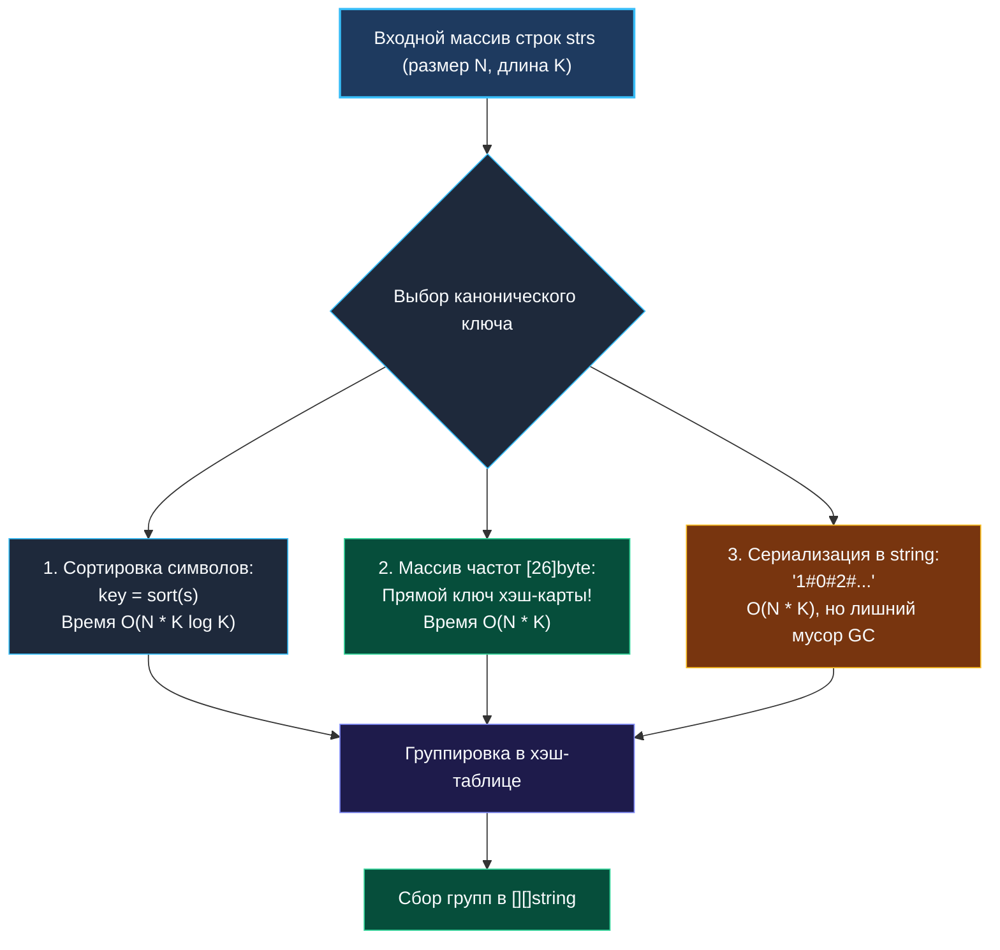
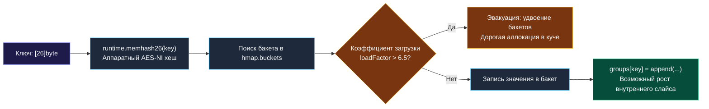

> *«Всякая надежная группировка требует канонического инварианта — признака, остающегося неизменным при любых перестановках».*  
> — Брайан Керниган

## Группировка анаграмм: Стратегии ключей, аллокации и механика map в Go

Задача **Group Anagrams** (LeetCode 49) требует разбить массив строк на группы так, чтобы каждая группа содержала только взаимные анаграммы.

```
Вход:  ["eat", "tea", "tan", "ate", "nat", "bat"]
Выход: [
  ["eat", "tea", "ate"],
  ["tan", "nat"],
  ["bat"]
]
```

В реальных распределенных архитектурах этот паттерн применяется повсеместно:
* Дедупликация и нормализация текстовых сообщений и логов.
* Группировка запросов в поисковых системах с учетом опечаток и перестановок слов.
* Кластеризация биологических последовательностей (ДНК/РНК мутаций).
* Построение обратных индексов в полнотекстовых движках.

На собеседованиях уровня Middle+/Senior эта задача служит отличным тестом на знание внутренней механики хэш-таблиц (`hmap`) в Go, понимание сравнимости типов (Comparable types) и способность оптимизировать распределение памяти в куче.



---

## Подход 1: Сортировка символов слова (Каноническая строка)

Самый наглядный подход: отсортировать буквы каждого слова по алфавиту. Для слов `"eat"`, `"tea"`, `"ate"` каноническим ключом станет строка `"aet"`.

```go
package anagram

import (
	"slices"
)

// GroupAnagramsSort группирует анаграммы через сортировку срезов байт.
// Временная сложность: O(N * K log K), где N — число строк, K — максимальная длина слова.
// Пространственная сложность: O(N * K)
func GroupAnagramsSort(strs []string) [][]string {
	// Предвыделение хэш-таблицы (эвристика начальной емкости)
	groups := make(map[string][]string, len(strs)/2+1)

	// Переиспользуемый буфер байт для снижения аллокаций
	buf := make([]byte, 0, 64)

	for _, s := range strs {
		buf = append(buf[:0], s...)
		slices.Sort(buf) // pdqsort на Go 1.21+

		key := string(buf) // Конвертация в string (ключ хэш-карты)
		groups[key] = append(groups[key], s)
	}

	result := make([][]string, 0, len(groups))
	for _, group := range groups {
		result = append(result, group)
	}

	return result
}
```

> [!NOTE]
> **Паттерн переиспользования буфера `buf[:0]`:**  
> Конструкция `buf = append(buf[:0], s...)` сбрасывает логическую длину среза в 0, но **сохраняет выделенную емкость `cap`**. Это исключает повторные вызовы аллокатора кучи внутри цикла обработки тысяч слов.

---

## Подход 2: Фиксированный массив `[26]byte` как ключ (Go-специфичный шедевр)

Можем ли мы избавиться от множителя $\log K$ при сортировке и прийти к линейной сложности $O(N \cdot K)$?  
Да! Для каждого слова можно подсчитать частоты букв.

Но как использовать частоты в качестве ключа хэш-карты?  
В Python или Java массив нельзя напрямую использовать как ключ словаря (он мутабелен и нехэшируем). Но **в языке Go массивы фиксированного размера являются сравниваемыми типами (Comparable)!**

> [!IMPORTANT]
> **Фундаментальное правило Go:**  
> Тип `[26]byte` (в отличие от слайса `[]byte`) имеет фиксированный размер 26 байт и реализует операторы `==` и `!=`. Рантайм Go умеет автоматически вычислять хэш от плоского массива фиксированной длины. Это означает, что тип `map[[26]byte][]string` **полностью валиден и компилируется без единой строковой конвертации!**

```go
// GroupAnagramsArray использует массив [26]byte прямо в качестве ключа хэш-таблицы.
// Временная сложность: O(N * K) — строго линейная!
// Пространственная сложность: O(N * K)
func GroupAnagramsArray(strs []string) [][]string {
	// Ключ мапы — фиксированный массив [26]byte!
	groups := make(map[[26]byte][]string, len(strs)/2+1)

	for _, s := range strs {
		var count [26]byte
		for i := 0; i < len(s); i++ {
			count[s[i]-'a']++
		}
		// Массив передается по значению (26 байт) прямо в хэш-функцию
		groups[count] = append(groups[count], s)
	}

	result := make([][]string, 0, len(groups))
	for _, group := range groups {
		result = append(result, group)
	}

	return result
}
```

### Почему `map[[26]byte]` — идеальный выбор на интервью?

1. **Линейная сложность $O(N \cdot K)$:** Подсчет частот занимает ровно $K$ шагов, никакой сортировки.
2. **Нулевые аллокации строк:** Нам не нужно вызывать `fmt.Sprintf` или `strings.Builder`, чтобы преобразовать частоты в строку вроде `"1#0#2#..."`.
3. **Минимум давления на GC:** Массив `count` живет на стеке, а ключ мапы занимает всего 26 байт прямо внутри бакета `hmap`.

---

## Под капотом: Механика `hmap` и цена роста

Когда вы выполняете `groups[key] = append(groups[key], s)`, рантайм Go осуществляет сложный каскад операций:



1. **Хэширование:** Для ключа `[26]byte` рантайм использует специализированную ассемблерную инструкцию `memhash` (часто с использованием аппаратного AES-NI).
2. **Коэффициент загрузки (Load Factor):** Когда среднее число элементов на бакет превышает 6.5, хэш-таблица инициирует инкрементальное удвоение количества бакетов (`hashGrow`).
3. **Предвыделение (Capacity Hint):** Передача подсказки размера `make(map[...], len(strs)/2+1)` гарантирует, что таблица выделит достаточное количество бакетов сразу, предотвратив дорогие фазы эвакуации памяти.

---

## Сравнение подходов

| Параметр | Подход 1: Сортировка | Подход 2: `map[[26]byte]` | Подход 3: Сериализация строки |
|---|---|---|---|
| **Время** | $O(N \cdot K \log K)$ | **$O(N \cdot K)$** | $O(N \cdot K)$ |
| **Доп. память на ключ** | Строка длины $K$ в куче | **26 байт in-place** | Строка $\approx 60$ байт в куче |
| **Аллокаций на слово** | $\ge 1$ (строка-ключ) | **$0$ (массив на стеке)** | $\ge 2$ (builder + string) |
| **Домен символов** | ASCII / Unicode | **Строго ASCII `'a'..'z'`** | Любой алфавит |

---

## Вопросы для собеседования

> [!INTERVIEW]
> **Вопрос 1:** Что произойдет, если длина слова превысит 255 символов одной и той же буквы при использовании `[26]byte`?  
> **Ответ:** Произойдет переполнение типа `byte` (`uint8` переполнится после 255: $255 + 1 = 0$).  
> Если по условиям задачи длина слова может достигать тысяч символов, тип ключа заменяется на `[26]uint16` (до 65 535) или `[26]int`. На 64-битной архитектуре `[26]int` занимает 208 байт, что также отлично укладывается в кэш-линии процессора.

> [!INTERVIEW]
> **Вопрос 2:** Почему в Go нельзя использовать `map[[]byte][]string`?  
> **Ответ:** Слайсы в Go **не являются сравниваемыми типами (not comparable)**, поскольку они ссылаются на изменяемую память, и язык не определяет семантику глубокого сравнения слайсов в рантайме. Единственное допустимое сравнение для слайса — это `s == nil`. Попытка скомпилировать `map[[]byte]` приведет к ошибке компилятора: `invalid map key type []byte`. Массив фиксированного размера `[N]byte` лишен этого недостатка.

> [!INTERVIEW]
> **Вопрос 3:** Как поддержать группировку для произвольного Unicode (например, слов на русском или китайском)?  
> **Ответ:** Для произвольного Unicode размер алфавита огромен, и фиксированный массив `[26]byte` не подходит.  
> Оптимальное решение — **Сортировка рун**: для каждого слова создается `[]rune(s)`, сортируется через `slices.Sort`, конвертируется обратно в каноническую строку `string(runes)` и используется как ключ стандартной `map[string][]string`.

---

## Резюме

* **Канонический ключ** — основа решения задач на группировку эквивалентных структур.
* Сортировка слов дает надежное решение за $O(N \cdot K \log K)$, универсальное для любых алфавитов.
* Использование сравниваемого типа **`[26]byte` в качестве ключа хэш-карты** — визитная карточка профессионального Go-инженера: строго линейная сложность $O(N \cdot K)$ и ноль аллокаций на формирование ключа.
* Предвыделение емкости хэш-карты и итогового слайса существенно снижает накладные расходы на сборщик мусора.

В следующей лекции мы перейдем к синтаксическому анализу и работе со стеком в строках: [[6. Decode String]], где научимся распаковывать рекурсивные вложенные структуры без риска падения по Stack Overflow.