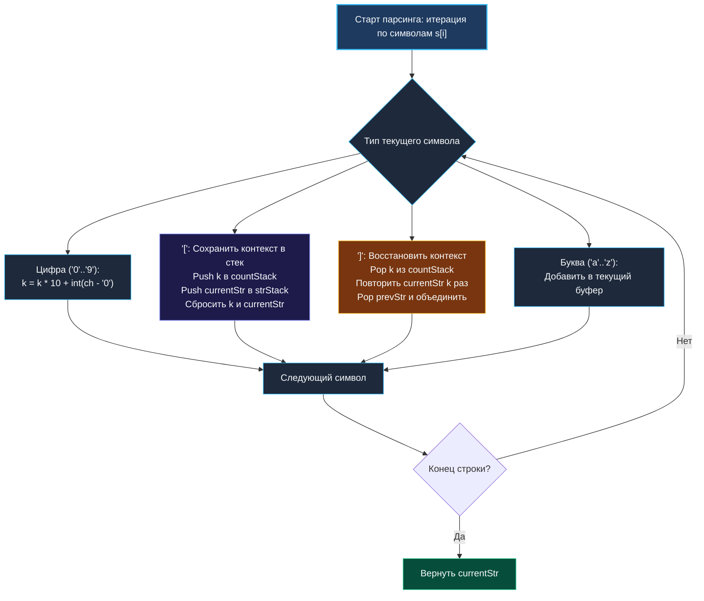

> *«Всякая вложенность — это лишь отложенное вычисление: сохрани текущий контекст, реши подзадачу и аккуратно соедини результаты».*  
> — Брайан Керниган

## Распаковка вложенных строк: Парсинг, стек и управление памятью

Задача **Decode String** (LeetCode 394) моделирует классический синтаксический анализ рекурсивно сжатых или вложенных текстовых структур.

Условие задачи: дана закодированная строка вида `k[encoded_string]`, где фрагмент внутри квадратных скобок должен быть повторен ровно `k` раз. Вложенность может быть произвольной глубины.

```
Вход:  "3[a]2[bc]"
Выход: "aaabcbc"

Вход:  "3[a2[c]]"
Выход: "accaccacc"

Вход:  "2[abc]3[cd]ef"
Выход: "abcabccdcdcdef"
```

В реальной бэкенд-инженерии данный паттерн лежит в основе:
* Десериализации бинарных и текстовых сетевых протоколов со сжатием (Run-Length Encoding / TLV).
* Парсинга выражений в шаблонных движках (Template Engines вроде Mustache или Go `html/template`).
* Распаковки вложенных конфигураций (Macro Expansion, HCL, JSON-patch).
* Разбора абстрактных синтаксических деревьев (AST) в компиляторах и интерпретаторах DSL.

На собеседованиях уровня Middle+/Senior эта задача проверяет умение кандидата проектировать детерминированные конечные автоматы (FSM), управлять состоянием стека без утечек памяти и защищать распределенные сервисы от атак типа «Zip-бомба» (Memory Exhaustion).



---

## Архитектурный каркас: Явный стек против рекурсии

Задачу можно решить двумя путями:

1. **Рекурсивный спуск:**  
   Естественный математический подход. Но в Go каждый рекурсивный вызов занимает место на стеке горутины. При глубокой вложенности (например, $10\,000$ уровней скобок) рантайм Go будет непрерывно выделять новые блоки памяти (`runtime.morestack`), что чревато аварийным падением сервиса: `runtime: goroutine stack exceeds 1000000000-byte limit`.
2. **Итеративный парсер с явными стеками (Production-Ready):**  
   Мы выделяем два среза-стека в куче:
   * `countStack []int` — хранит коэффициенты повторения `k`.
   * `strStack []string` — хранит накопленные префиксы строк до входа во вложенность.

Такой подход защищен от переполнения стека горутины, полностью контролируется программистом и легко профилируется через `pprof`.

---

## Идиоматичная реализация на Go

```go
package parser

import (
	"strings"
)

// DecodeString распаковывает вложенную строку вида k[encoded_string].
// Временная сложность: O(S), где S — длина итоговой декодированной строки.
// Пространственная сложность: O(D + S), где D — максимальная глубина вложенности скобок.
func DecodeString(s string) string {
	countStack := make([]int, 0, 16)
	strStack := make([]string, 0, 16)

	var currentStr strings.Builder
	currentStr.Grow(len(s)) // Предвыделение базовой емкости

	k := 0

	for i := 0; i < len(s); i++ {
		ch := s[i]

		switch {
		case ch >= '0' && ch <= '9':
			// Накопление многозначного числа (например, 125)
			k = k*10 + int(ch-'0')

		case ch == '[':
			// Вход во вложенный уровень: сохраняем состояние
			countStack = append(countStack, k)
			strStack = append(strStack, currentStr.String())

			// Сбрасываем контекст для сбора внутреннего блока
			k = 0
			currentStr.Reset()

		case ch == ']':
			// Выход из вложенного уровня: извлекаем множитель
			repeatCount := countStack[len(countStack)-1]
			countStack = countStack[:len(countStack)-1]

			// Текущая декодированная подстрока
			innerStr := currentStr.String()

			// Восстанавливаем сохраненный префикс
			prevStr := strStack[len(strStack)-1]
			strStack = strStack[:len(strStack)-1]

			// Собираем новый объединенный результат: prevStr + (innerStr * repeatCount)
			var nextBuilder strings.Builder
			nextBuilder.Grow(len(prevStr) + len(innerStr)*repeatCount)
			nextBuilder.WriteString(prevStr)

			for r := 0; r < repeatCount; r++ {
				nextBuilder.WriteString(innerStr)
			}

			currentStr = nextBuilder

		default:
			// Обычный литерал (буква)
			currentStr.WriteByte(ch)
		}
	}

	return currentStr.String()
}
```

> [!NOTE]
> **Механика `strings.Builder.Reset()`:**  
> Метод `Reset()` не освобождает базовый массив байт в куче, а лишь обнуляет длину среза. Однако в нашей реализации при выходе из скобки `]` создается новый `nextBuilder`, так как мы заранее знаем точный размер итоговой строки `len(prevStr) + len(innerStr)*repeatCount` и выделяем память ровно один раз через `Grow()`, предотвращая фрагментацию кучи.

---

## Безопасность в продакшене: Защита от «Zip-бомбы» (Billion Laughs Attack)

В боевом сервисе нельзя слепо доверять входящей строке.  
Злоумышленник может отправить компактный payload:
```
100[100[100[100[100[a]]]]]
```
Размер входной строки — всего **26 байт**.  
Но размер распакованного текста равен $100^5 = 10\,000\,000\,000$ байт $\approx$ **10 Гигабайт!**  
Сервис мгновенно исчерпает оперативную память контейнера и будет убит Linux OOM Killer.

### Паттерн защитного лимита (Quota Guard)

```go
const maxAllowedDecodedLength = 10 << 20 // Защитный лимит: 10 МБ

// Внутри цикла обработки скобки ']':
predictedLen := len(prevStr) + len(innerStr)*repeatCount
if predictedLen > maxAllowedDecodedLength {
    // Немедленное прерывание до аллокации памяти!
    return "", errors.New("decoded string exceeds memory safety limit (zip bomb detected)")
}
```

---

## Подводные камни и граничные случаи

1. **Многозначные коэффициенты повтора:**  
   Случай `100[leetcode]`. Формула `k = k * 10 + int(ch - '0')` корректно обрабатывает числа любой разрядности.
2. **Литералы без скобок:**  
   Случай `"abc3[cd]xyz"`. Литералы `"abc"` накапливаются в `currentStr` до встречи скобки. При встрече `[` они сохраняются в `strStack` как `prevStr`, а `"xyz"` корректно дописываются в конец после выхода из скобок.
3. **Пустые скобки:**  
   Случай `"3[]"`. Внутренняя строка `innerStr` пустая, повторение пустой строки дает пустую строку без паники и сбоев.

---

## Вопросы для собеседования

> [!INTERVIEW]
> **Вопрос 1:** Как изменить алгоритм, если распакованная строка не помещается в RAM и ее нужно сразу отдавать клиенту по HTTP?  
> **Ответ:** Применяется **потоковый парсер через `io.Writer`**:  
> Вместо накопления строк в `strings.Builder`, мы пишем данные напрямую в сетевой сокет `w io.Writer`.  
> Если блок не содержит вложенности, мы пишем его в `w` `repeatCount` раз. Для вложенных блоков создается временный буфер на диске или кольцевой буфер в памяти, содержимое которого стримится в сокет без удержания 10 ГБ в куче.

> [!INTERVIEW]
> **Вопрос 2:** Почему в Go явный стек надежнее рекурсивного для этой задачи?  
> **Ответ:** Рекурсивный спуск размещает стек-фреймы на стеке горутины. При глубокой вложенности рантайм Go вынужден непрерывно выполнять `runtime.morestack` (копирование стека горутины в куче). Явный стек в виде среза `[]string` выделяется в куче сразу нужной емкости, не блокирует горутину и позволяет наложить жесткий предел на глубину вложенности `if len(countStack) > maxDepth { return err }`.

> [!INTERVIEW]
> **Вопрос 3:** В чем разница по сложности между `"1000[a]"` и `"2[2[2[...[a]...]]]"`?  
> **Ответ:**  
> В первой строке вложенность равна $1$, глубина стека $O(1)$.  
> Во второй строке глубина вложенности равна $D$, стек вырастает до $O(D)$. Однако время выполнения в обоих случаях пропорционально суммарному количеству записанных символов в итоговой строке $O(S)$.

---

## Резюме

* **Decode String** элегантно решается детерминированным конечным автоматом с двумя явными стеками: `countStack` (множители) и `strStack` (префиксы).
* Итеративный стек превосходит рекурсию по предсказуемости памяти и защите от Stack Overflow.
* Для высоконагруженных API обязателен **защитный лимит на максимальный размер распаковки** для предотвращения атак типа «Zip-бомба».
* Использование `strings.Builder` с предвыделением `Grow()` обеспечивает оптимальную линейную скорость без фрагментации памяти.

В заключительной лекции строкового модуля мы разберем классическую задачу системного синтаксического анализа: [[7. String to Integer atoi]], где исследуем опережающий контроль целочисленных переполнений и битовую проверку границ.