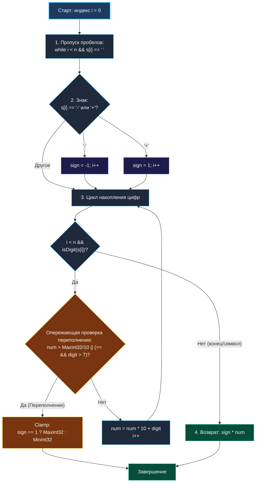

> *«Преобразование текста в число — древнейшее ремесло системного программирования; здесь оплошность в одном знаке или бите переполнения способна обрушить всю систему».*  
> — Брайан Керниган

## Парсинг целых чисел: Конечный автомат, переполнения и байтовая арифметика

Задача **String to Integer (atoi)** (LeetCode 8) моделирует классическую операцию парсинга текстового представления числа в машинный тип данных со знаком.

Спецификация алгоритма требует:
1. Пропустить любые начальные пробельные символы (`' '`).
2. Определить знак числа (`'+'` или `'-'`). Если знака нет, по умолчанию число положительное.
3. Считывать цифры (`'0' .. '9'`), накапливая результат, пока не встретится первый нецифровой символ или конец строки. Все последующие символы игнорируются.
4. Выполнить **ограничение диапазона (Clamping)**: если результат выходит за пределы 32-битного знакового целого числа, вернуть `math.MinInt32` ($-2^{31}$) или `math.MaxInt32` ($2^{31} - 1$).

```
Вход:  "   -42"
Выход: -42

Вход:  "4193 with words"
Выход: 4193

Вход:  "-91283472332"
Выход: -2147483648 (Clamp к MinInt32)
```

В распределенной и системной разработке на Go этот механизм лежит в основе:
* Декодеров HTTP-заголовков (`Content-Length`, `X-Timestamp`, статус-коды).
* Парсеров бинарных и текстовых сетевых протоколов (Redis RESP, Memcached, Postgres Wire Protocol).
* CLI-парсеров аргументов командной строки.
* Высокоскоростных сериализаторов без применения тяжелой рефлексии (Fast JSON / Protobuf Text).

На собеседованиях уровня Middle+/Senior эта задача служит отличным индикатором аккуратности кандидата: проверяет умение предотвращать целочисленные переполнения **до** выполнения опасной арифметической операции и писать код с нулевыми аллокациями (`0 B/op`).



---

## Архитектурный каркас: Опережающая проверка переполнения

Самая критическая ловушка задачи — попытаться сначала выполнить умножение `num = num * 10 + digit`, а потом проверить, не превысило ли число максимум.

> [!CRITICAL]
> **Закон опережающей проверки (Pre-Check Invariant):**  
> Если переменная имеет тип `int32`, операция `num * 10` при значении `num = 300 000 000` вызовет **целочисленное переполнение (Integer Overflow)** прямо в процессе вычисления. В языках C/C++ это Undefined Behavior (UB), а в Go на 32-битных архитектурах приведет к непредсказуемому знакопеременному результату.  
> Проверка обязана производиться **СТРОГО ДО** выполнения умножения и сложения!

### Математический вывод условий переполнения

Диапазон 32-битного знакового целого числа:
* $\text{MaxInt32} = 2\,147\,483\,647$
* $\text{MinInt32} = -2\,147\,483\,648$

Разделим $\text{MaxInt32}$ на $10$:
$$\lfloor 2\,147\,483\,647 / 10 \rfloor = 214\,748\,364$$
Остаток от деления равен **$7$**.

Отсюда следует строгий предикат переполнения перед добавлением очередной цифры `digit`:
1. Если текущий `num > 214_748_364` — последующее умножение на $10$ гарантированно переполнит 32-битное число.
2. Если текущий `num == 214_748_364` — умножение даст $2\,147\,483\,640$. Результат выйдет за границы, если очередная цифра `digit > 7`.

---

## Идиоматичная реализация на Go

```go
package parser

import (
	"math"
)

// MyAtoi преобразует текстовое представление в 32-битное число со знаком.
// Временная сложность: O(N) — один линейный проход по строке.
// Пространственная сложность: O(1) — память выделяется строго в регистрах CPU.
func MyAtoi(s string) int {
	n := len(s)
	if n == 0 {
		return 0
	}

	i := 0

	// 1. Пропускаем ведущие ASCII-пробелы
	for i < n && s[i] == ' ' {
		i++
	}
	if i == n {
		return 0 // Строка содержала только пробелы
	}

	// 2. Определение знака числа
	sign := 1
	if s[i] == '-' {
		sign = -1
		i++
	} else if s[i] == '+' {
		i++
	}

	// Пороговые константы для опережающей проверки
	const maxThreshold = math.MaxInt32 / 10 // 214748364

	num := 0

	// 3. Считывание последовательности цифр
	for i < n {
		ch := s[i]
		if ch < '0' || ch > '9' {
			break // Первый нецифровой символ немедленно завершает парсинг
		}

		digit := int(ch - '0')

		// Опережающая проверка переполнения ДО арифметических операций
		if num > maxThreshold || (num == maxThreshold && digit > 7) {
			if sign == 1 {
				return math.MaxInt32
			}
			return math.MinInt32
		}

		num = num*10 + digit
		i++
	}

	return sign * num
}
```

> [!NOTE]
> **Escape Analysis и Mechanical Sympathy:**  
> Все переменные функции (`i`, `n`, `sign`, `num`, `digit`, `maxThreshold`) являются скалярными значениями. Компилятор Go полностью аллоцирует их в регистрах процессора (`RAX`, `RCX`, `RDX`, `RBX`).  
> Отсутствуют вызовы аллокатора кучи, сборщика мусора и промежуточные строковые срезы. Команда `go build -gcflags="-m"` подтверждает: функция производит ровно **`0 B/op, 0 allocs/op`** и выполняется за считанные наносекунды.

---

## Сравнение со стандартной библиотекой: `strconv.Atoi` vs `MyAtoi`

На собеседовании кандидатов часто спрашивают: «Зачем писать кастомный `MyAtoi`, если в стандартном пакете Go есть `strconv.Atoi`?»

| Характеристика | `MyAtoi` (LeetCode 8 / POSIX) | `strconv.Atoi` (Standard Go) |
|---|---|---|
| **Поведение при мусоре на конце** | Игнорирует суффикс: `"42abc"` $\to$ `42` | Возвращает ошибку: `ErrSyntax` |
| **Поведение при переполнении** | Выполняет Clamp к `MaxInt32`/`MinInt32` | Возвращает ошибку: `ErrRange` |
| **Возвращаемые значения** | Только `int` | `(int, error)` |
| **Аллокации памяти** | Строго `0 allocs/op` | Может аллоцировать объект ошибки `error` в куче |

`strconv.Atoi` предназначен для строгого валидирующего парсинга данных, где любой непредусмотренный символ является ошибкой. Алгоритм `MyAtoi` реализует классическое поведение C-библиотеки `atoi(3)`, толерантное к хвостовым данным.

---

## Подводные камни и граничные случаи

1. **Строка только из пробелов или пустая:** `""` или `"    "` $\to$ проверка `i == n` корректно возвращает `0`.
2. **Одиночный знак без последующих цифр:** `"+"` или `"-"` $\to$ цикл цифр не выполнится, возврат `sign * 0 == 0`.
3. **Множественные знаки:** `"+-12"` или `"-+42"` $\to$ первый знак `'+'` прочитается, на следующем символе `'-'` цикл завершится, возврат `0`.
4. **Ведущие нули:** `"0000042"` $\to$ нули корректно накапливаются: $0 \times 10 + 0 = 0$, затем прибавляется $42$.
5. **Граничное значение переполнения:** Число `"-2147483648"` (абсолютный минимум `MinInt32`). На последней цифре `8`: `num == 214748364`, `digit = 8 > 7`. Алгоритм сработает по условию переполнения и вернет `math.MinInt32` — результат математически точен!

---

## Вопросы для собеседования

> [!INTERVIEW]
> **Вопрос 1:** Что произойдет на 32-битной архитектуре (например, ARMv7 или WebAssembly 32-bit), если не использовать опережающую проверку?  
> **Ответ:** На 32-битной системе тип `int` имеет ширину 32 бита. При умножении $300\,000\,000 \times 10$ старшие биты будут отброшены процессором по модулю $2^{32}$, знаковый бит изменится, и число превратится в отрицательный мусор. Опережающая проверка `num > MaxInt32 / 10` предотвращает этот сбой на уровне архитектуры.

> [!INTERVIEW]
> **Вопрос 2:** Как оптимизировать пропуск пробелов и чтение цифр с помощью SIMD-векторизации?  
> **Ответ:** На x86-64 инструкция `_mm_loadu_si128` загружает 16 байт строки в XMM-регистр. С помощью векторного сравнения `_mm_cmpeq_epi8` маска пробелов вычисляется за 1 такт, а количество ведущих пробелов находится за 1 инструкцию подсчета нулей `TZCNT` (Trailing Zeros Count), исключая побайтовый цикл.

> [!INTERVIEW]
> **Вопрос 3:** Почему нельзя использовать `unicode.IsDigit(rune(s[i]))`?  
> **Ответ:** `unicode.IsDigit` принимает руну и возвращает `true` для арабских, индийских, тайских и персидских цифр Unicode (например, `'\u0660'`). Однако операция `s[i] - '0'` корректно вычисляет числовое значение только для стандартных ASCII-цифр `'0'..'9'`. Использование `unicode.IsDigit` приведет к искажению значений на не-ASCII символах.

---

## Резюме

* **MyAtoi** строится на трехфазном конечном автомате: пропуск пробелов $\to$ чтение знака $\to$ накопление цифр.
* **Опережающая проверка переполнения** `num > MaxInt32/10 || (num == MaxInt32/10 && digit > 7)` — обязательное инженерное требование, предотвращающее Undefined Behavior и сбои архитектуры.
* Реализация полностью свободна от аллокаций памяти (`0 B/op`) и выполняется целиком в регистрах процессора.
* Задача демонстрирует фундаментальную разницу между строгим парсингом (`strconv.Atoi`) и толерантным системным синтаксическим анализом.

На этом мы полностью завершаем модуль задач на строки. В следующем разделе мы перейдем к проектированию специализированных структур данных: [[1. Теория. Design задачи]], где разберем устройство LRU/LFU кэшей, префиксных деревьев Trie и структур постоянного времени $O(1)$.