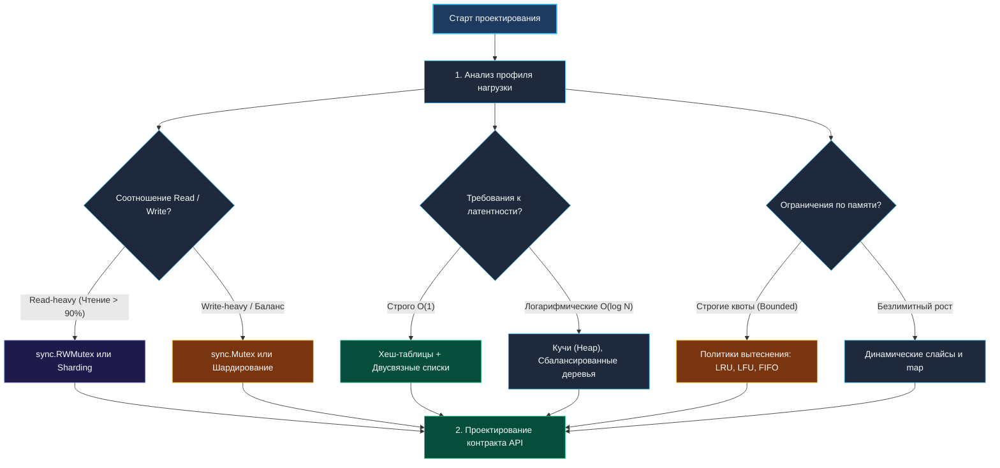
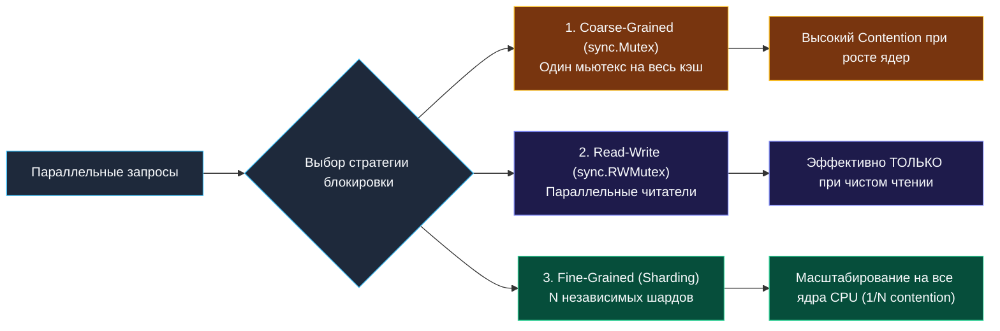

> *«Проектирование структур данных — это вечный поиск баланса между временем, памятью и простотой; ни одно из этих качеств нельзя максимизировать в ущерб остальным».*  
> — Брайан Керниган

## Теория Design-задач: От API до внутренней механики в Go

Design-задачи (Design & Implement) — это не просто поиск алгоритмического трюка, а проверка глубокой инженерной зрелости. Здесь интервьюер оценивает способность кандидата проектировать законченные программные компоненты, выбирать правильные структуры данных под заданный профиль нагрузки, гарантировать потокобезопасность и предвидеть скрытые компромиссы между скоростью, памятью и сложностью поддержки в продакшене.

В языке Go такие задачи требуют кристального понимания работы со структурами, указателями, примитивами синхронизации пакета `sync`, планировщиком горутин и сборщиком мусора (Garbage Collector).



---

## 1. Философия Design-задач: Что проверяет интервьюер

В отличие от стандартных олимпиадных задач, где фокус направлен на асимптотику $O(N)$ и обход графов, Design-задачи оценивают комплексные инженерные навыки:

1. **Чистота и идиоматичность интерфейса:**  
   Сигнатуры методов обязаны быть лаконичными и следовать идиомам Go (`ok-idiom`, возврат ошибок `error` вместо вызова `panic`, использование контекстов при необходимости).
2. **Осознанный выбор структур данных:**  
   Умение четко аргументировать: почему здесь выбран `map + list`, а не слайс? Почему `sync.Mutex` эффективнее каналов для защиты локального состояния?
3. **Потокобезопасность (Concurrency Safety):**  
   Любой production-сервис в Go многопоточен по умолчанию (горутины на каждый HTTP/gRPC запрос). Способность защитить инварианты структуры данных без состояния гонки (data race) — обязательное требование.
4. **Управление памятью и давление на GC:**  
   Предсказуемость аллокаций, отсутствие утечек памяти (memory retention), минимизация количества указателей в куче для облегчения фазы разметки сборщика мусора.

---

## 2. Архитектура структуры данных в Go: Pointer vs Value Receiver

В Go отсутствуют классы и наследование. Структуры данных проектируются через **композицию типов**, инкапсуляцию полей и методы с получателем-указателем (pointer receiver).

```go
package design

import "sync"

// Item представляет полезную нагрузку элемента кэша
type Item struct {
	Value any
}

// MyCache инкапсулирует состояние кэша и примитив синхронизации
type MyCache struct {
	mu   sync.RWMutex
	data map[string]*Item
	cap  int
}

// NewMyCache — конструктор-фабрика, стандартный идиоматичный паттерн Go
func NewMyCache(capacity int) *MyCache {
	if capacity <= 0 {
		capacity = 16
	}
	return &MyCache{
		data: make(map[string]*Item, capacity),
		cap:  capacity,
	}
}

// Get использует pointer receiver (*MyCache), так как RLock защищает общие данные
func (c *MyCache) Get(key string) (*Item, bool) {
	c.mu.RLock()
	defer c.mu.RUnlock()

	item, ok := c.data[key]
	return item, ok
}
```

> [!CRITICAL]
> **Примитивы синхронизации Go (`sync.Mutex`, `sync.RWMutex`) категорически нельзя копировать!**  
> Мьютекс содержит внутренние поля состояния (счетчик блокировок, семафор ожидания). Если передать структуру `MyCache` по значению (`func (c MyCache) Get()`), мьютекс скопируется вместе со всем состоянием. Это приведет к тому, что разные горутины будут блокировать разные копии мьютекса, порождая гонки данных или фатальный крах рантайма.  
> Все методы, оперирующие синхронизацией, обязаны принимать **указатель** `*MyCache`. Утилита `go vet` автоматически отслеживает копирование структур с мьютексами.

---

## 3. Выбор базовых структур: Map, Slice или кастомная хеш-таблица

| Структура | Доступ | Вставка / Удаление | Кэш-локальность | Когда применять |
|---|:---:|:---:|:---:|---|
| **Встроенный `map`** | $O(1)$ аморт. | $O(1)$ аморт. | Средняя (бакеты по 8 элементов) | Стандарт для 95% задач. Быстрый поиск по ключу. Не потокобезопасен на запись. |
| **Слайс `[]T`** | $O(1)$ по индексу | $O(N)$ в середине, $O(1)$ в конце | Идеальная (непрерывная память L1/L2) | Стеки, очереди, кольцевые буферы, фиксированные пулы. |
| **Двусвязный список** | $O(N)$ поиск | $O(1)$ при наличии указателя | Низкая (pointer chasing, разрозненные узлы) | Очереди вытеснения LRU/LFU при совмещении с `map`. |
| **Кастомная таблица** | $O(1)$ | $O(1)$ | Отличная (открытая адресация) | Zero-allocation архитектуры, устранение пауз на рехаширование. |

> [!WARNING]
> **Ловушка `sync.Map`:**  
> Никогда не используйте `sync.Map` для структур с частыми записями и обновлениями ключей!  
> `sync.Map` спроектирован рантаймом Go строго для двух сценариев:
> 1. Ключ записывается один раз, а читается миллионы раз (read-only конфигурации).
> 2. Множество горутин читают, записывают и обновляют непересекающиеся множества ключей.  
> При частых операциях `Store`/`Delete` происходит непрерывная миграция данных между внутренними таблицами `read` и `dirty`, что создает огромную нагрузку на атомики и проигрывает связке `map + sync.RWMutex` в разы.

---

## 4. Потокобезопасность: Стратегии синхронизации



### 1. Единый мьютекс (`sync.Mutex`)
Простота и отсутствие deadlock'ов. Однако при десятках тысяч RPS на многоядерном процессоре горутины выстраиваются в очередь, рантайм переводит их в системные вызовы ядра `futex`, и латентность стремительно растет.

### 2. Разделяемый мьютекс (`sync.RWMutex`)
Разрешает параллельное чтение сотням горутин. Но помните: в структурах вроде LRU-кэша метод `Get` **мутирует** порядок элементов в списке (перемещает в голову). Следовательно, `Get` в LRU является операцией записи и требует эксклюзивного `Lock()`, сводя на нет преимущества `RWMutex`!

### 3. Шардирование (Striped Locking)
Данные разбиваются на $N$ независимых сегментов (обычно $N$ равно степени двойки, например 32 или 64). Каждый сегмент защищен своим собственным мьютексом:
$$\text{shardIndex} = \text{hash}(\text{key}) \pmod N$$
Конкуренция за блокировку падает ровно в $N$ раз. Именно так устроены боевые библиотеки Go-кэширования (`bigcache`, `freecache`, `ristretto`).

---

## 5. Управление памятью и Escape Analysis

При проектировании долгоживущих структур данных разработчик обязан учитывать сборщик мусора Go:

1. **Предвыделение емкости (`Capacity Hint`):**  
   `make(map[string]*Item, expectedSize)` предотвращает непрерывный рост внутреннего массива бакетов `hmap` и исключает паузы на инкрементальное рехаширование.
2. **Указатели против значений в `map`:**
   * `map[string]*Item`: В бакете хранятся 8-байтовые указатели. Меньше размер бакета, но в куче создается множество мелких объектов `Item`, которые сборщик мусора обязан проверять на каждом цикле фазы Mark.
   * `map[string]Item`: Данные хранятся непосредственно внутри бакетов. Если структура `Item` мала (до 64–128 байт), сборщик мусора сканирует память значительно быстрее, так как указателей на внешние объекты кучи нет.
3. **Паттерн переиспользования (`sync.Pool`):**  
   Для временных буферов, нод или структур запросов используйте пул объектов, исключая циклические выделения памяти в горячем пути.

---

## Вопросы для собеседования

> [!INTERVIEW]
> **Вопрос 1:** Когда для защиты структуры данных следует предпочесть каналы (`chan`), а когда мьютексы (`sync.Mutex`)?  
> **Ответ:**  
> Каналы предназначены для **передачи владения данными** и координации потоков выполнения (Fan-Out/Fan-In, пайплайны, graceful shutdown).  
> Мьютексы предназначены для **защиты общего разделяемого состояния** (счетчики, кэши, словари, очереди). Использование каналов для тривиальной синхронизации доступа к `map` порождает скрытые аллокации буферов каналов, контекстные переключения планировщика и работает в 3–5 раз медленнее прямого мьютекса.

> [!INTERVIEW]
> **Вопрос 2:** Что такое «False Sharing» и как его избежать в шардированных структурах на Go?  
> **Ответ:**  
> Кэш-память процессора обменивается данными блоками по 64 байта (Cache Line). Если мьютексы двух независимых шардов расположены в памяти рядом (внутри одного массива `[]sync.Mutex`), то изменение состояния мьютекса первой горутиной на Core 1 инвалидирует всю 64-байтную кэш-линию на Core 2, где вторая горутина пытается захватить свой мьютекс.  
> Для устранения False Sharing структуры выравнивают по границе кэш-линии с помощью пустого заполнения: `type Shard struct { mu sync.Mutex; _ [56]byte; ... }`.

> [!INTERVIEW]
> **Вопрос 3:** Почему возврат указателя `*Item` из метода `Get` потокобезопасного кэша нарушает инкапсуляцию?  
> **Ответ:**  
> Возврат прямого указателя позволяет вызывающей горутине мутировать поля структуры `Item` вне критической секции кэша в то время, как другая горутина может читать эти же поля. Для обеспечения строгой потокобезопасности кэш обязан возвращать либо копию значения, либо иммутабельный интерфейс, либо сериализованный срез байт.

---

## Резюме

* Design-задачи в Go требуют гармонии чистого API, осознанного выбора структур данных и глубокого понимания модели памяти.
* Примитивы синхронизации (`sync.Mutex`, `sync.RWMutex`) **нельзя копировать по значению** — методы структур обязаны использовать pointer receiver.
* `sync.Map` эффективен только при преобладании чтения неизменяемых данных; для высоконагруженных кэшей стандартом является шардированный `map` с локальными мьютексами.
* Сборщик мусора чувствителен к количеству указателей: хранение компактных структур по значению снижает время фазы Mark GC.

В следующей лекции мы детально разберем проектирование кэш-структур: [[2. Кэш структуры]], где сопоставим политики вытеснения, борьбу со штормом запросов (Cache Stampede) и оптимизацию кэш-линий CPU.