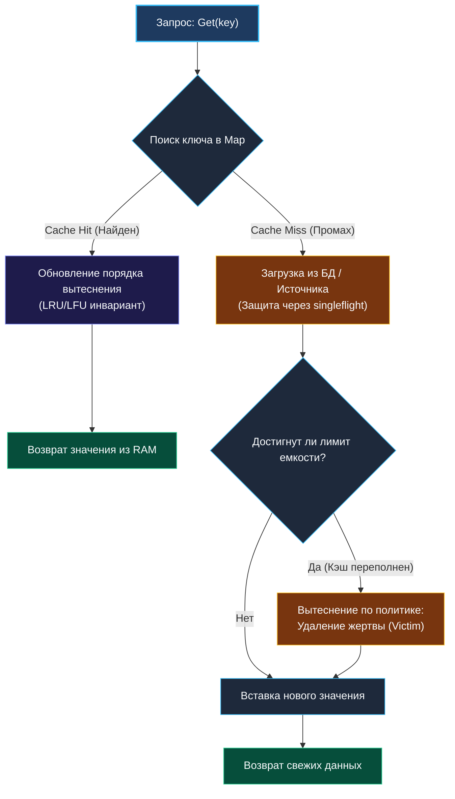
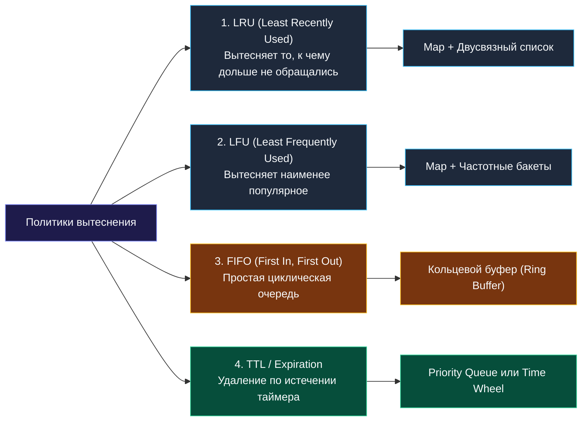

> *«Кэширование подобно заготовке дров на зиму: в доме будет тепло лишь тогда, когда вовремя выносишь золу и освобождаешь место для свежих поленьев».*  
> — Брайан Керниган

## Кэш-структуры: Архитектура, политики вытеснения и механика памяти

In-memory кэш — это не просто примитивная обертка над хэш-таблицей `map`. Это высоконагруженная, конкурентная система хранения данных с жесткими лимитами по памяти, детерминированной латентностью и гарантированной защитой от утечек ресурсов.

В распределенной бэкенд-инженерии на Go проектирование кэша требует глубокого понимания:
* Как предотвратить шторм запросов к основной базе данных (**Cache Stampede / Thundering Herd**)?
* Как структура двусвязного списка влияет на промахи процессорного кэша (**Pointer Chasing vs Array-backed buffers**)?
* Почему удаление ключей из стандартного `map` в Go не возвращает оперативную память операционной системе (**Memory Bloat**)?
* Как мягкий лимит памяти `GOMEMLIMIT` защищает сервис от аварийного завершения по Linux OOM Killer?



---

## 1. Фундаментальная триада архитектуры кэша

Любой промышленный кэш состоит из трех взаимосвязанных подсистем:

1. **Индекс (Fast Lookup):**  
   Обеспечивает доступ к значению по ключу за $O(1)$. В Go это либо встроенный `map[K]V`, либо открыто-адресованная хэш-таблица.
2. **Хранилище значений и метаданных (Storage):**  
   Полезная нагрузка (`payload`), метки времени создания, счетчики обращений, TTL (Time-To-Live).
3. **Очередь вытеснения (Eviction Policy):**  
   Детерминированный алгоритм, определяющий, какой именно элемент должен быть уничтожен, когда память кэша исчерпана.

---

## 2. Сравнение политик вытеснения (Eviction Policies)



| Политика | Сложность Get / Put | Структура данных | Преимущества | Недостатки / Границы применимости |
|---|:---:|---|---|---|
| **LRU (Least Recently Used)** | $O(1)$ / $O(1)$ | `map` + Двусвязный список | Быстрая реакция на смену интересов пользователей; универсален. | Уязвим к однократным массовым сканированиям (Scan Resistance Problem). |
| **LFU (Least Frequently Used)** | $O(1)$ / $O(1)$ | `map` + Список частотных бакетов | Идеален для стабильных «горячих» данных (метаданные, каталоги). | Накапливает «исторический мусор»; медленно адаптируется к новым трендам. |
| **FIFO (First In First Out)** | $O(1)$ / $O(1)$ | Очередь / Кольцевой буфер | Минимальный оверхед по памяти; нулевые модификации при `Get`. | Низкий Cache Hit Rate: может вытеснить супер-популярный элемент. |
| **TTL (Time To Live)** | $O(1)$ / $O(\log N)$ | Min-Heap таймстампов / Timerwheel | Гарантирует свежесть данных; автоматическая инвалидация. | Не спасает от мгновенного переполнения памяти всплеском новых ключей. |

---

## 3. Механическая симпатия: Память, кэш-линии и сборщик мусора

### 1. Проблема Pointer Chasing в двусвязных списках
Классический LRU использует узлы `type Node struct { key, val string; prev, next *Node }`.  
Каждый узел выделяется в куче отдельно. Адреса разбросаны хаотично.  
При обходе списка процессор вынужден непрерывно загружать новые несвязанные 64-байтные кэш-линии из DRAM, теряя до 150 тактов на каждый промах кэша.

**Решение High-Performance систем (Array-backed LRU):**  
Все узлы размещаются в едином непрерывном срезе `nodes := make([]Node, capacity)`. Ссылки `prev` и `next` становятся не указателями, а целочисленными индексами `int32` в срезе.  
Это обеспечивает идеальную локальность данных (Spatial Locality) и позволяет аппаратному префетчеру процессора работать на полной скорости шины памяти.

### 2. Ловушка `delete()` в Go map: Memory Bloat
Когда вы удаляете ключ из стандартного `map` с помощью функции `delete(c.items, key)`, рантайм Go **не возвращает память операционной системе**. Он лишь помечает слот в бакете как пустой.  
Если кэш непрерывно вставляет и удаляет миллионы ключей, размер карты в памяти (RSS процесса) никогда не уменьшится!

```go
// Паттерн периодического компактирования карты (Rebuild)
func (c *Cache) CompactIfNecessary() {
    if len(c.items) < c.maxCapacity/4 {
        newMap := make(map[string]*Item, len(c.items))
        for k, v := range c.items {
            newMap[k] = v
        }
        c.items = newMap // Старая раздутая карта будет утилизирована GC
    }
}
```

---

## 4. Паттерны надежности: Борьба со штормом запросов (Cache Stampede)

В высоконагруженном API сброс популярного ключа (например, главной страницы каталога) приводит к тому, что тысячи параллельных горутин одновременно получают `Cache Miss` и синхронно обрушиваются с тяжелыми запросами на базу данных. Это явление называют **Cache Stampede** или **Thundering Herd**.

### Защита через пакет `golang.org/x/sync/singleflight`

Паттерн Singleflight подавляет дублирующие параллельные вызовы, объединяя их в один единственный запрос к источнику:

```go
package cache

import (
	"sync"
	"golang.org/x/sync/singleflight"
)

type RobustCache struct {
	mu    sync.RWMutex
	items map[string]string
	group singleflight.Group
}

// GetOrFetch возвращает значение из кэша либо вызывает fetcher строго один раз
func (c *RobustCache) GetOrFetch(key string, fetcher func() (string, error)) (string, error) {
	// 1. Быстрый путь: проверка в кэше под RLock
	c.mu.RLock()
	val, ok := c.items[key]
	c.mu.RUnlock()
	if ok {
		return val, nil
	}

	// 2. Защита от Cache Stampede: только 1 горутина идет в БД, остальные ждут ее результат
	v, err, _ := c.group.Do(key, func() (any, error) {
		data, fetchErr := fetcher()
		if fetchErr != nil {
			return nil, fetchErr
		}

		c.mu.Lock()
		c.items[key] = data
		c.mu.Unlock()
		return data, nil
	})

	if err != nil {
		return "", err
	}
	return v.(string), nil
}
```

---

## 5. Граничные случаи и ловушки продакшена

1. **Утечки горутин при использовании `time.After`:**  
   Никогда не очищайте TTL-кэш конструкцией `select { case <-time.After(ttl): }` внутри цикла запросов! Функция `time.After` выделяет новый таймер в рантайме, который не освобождается до истечения времени. При миллионе запросов сервис падает по OOM.  
   Используйте **единую фоновую горутину-уборщик** с `time.NewTicker(interval)`.
2. **Pointer Aliasing:**  
   Если кэш хранит изменяемые структуры по указателю `map[string]*User`, возврат `*User` клиенту позволяет клиенту изменить внутреннее состояние кэша без мьютекса. Всегда возвращайте глубокую копию либо сериализованный срез `[]byte`.
3. **Ограничение RSS через `debug.SetMemoryLimit` (GOMEMLIMIT):**  
   В Go 1.19+ мягкий лимит памяти позволяет сборщику мусора агрессивно очищать неиспользуемые блоки кэша до того, как контейнер в Kubernetes будет убит OOMKilled.

---

## Вопросы для собеседования

> [!INTERVIEW]
> **Вопрос 1:** Чем отличается кэш с лимитом по количеству записей (Max Count) от кэша с лимитом по объему памяти (Max Bytes)?  
> **Ответ:**  
> Кэш по количеству записей наивен: 1000 строк по 10 байт занимают 10 КБ, а 1000 картинок по 10 МБ займут 10 ГБ, вызвав падение системы.  
> Промышленный кэш (например, `groupcache`, `bigcache`) отслеживает суммарный размер в байтах: `currentBytes += len(key) + len(val) + structOverhead`. При превышении `maxBytes` алгоритм вытесняет элементы пачками, пока размер не вернется в безопасный коридор.

> [!INTERVIEW]
> **Вопрос 2:** Почему в кэш-структурах с политикой LRU разделяемый `sync.RWMutex` часто работает медленнее, чем обычный `sync.Mutex`?  
> **Ответ:**  
> При вызове `Get(key)` в LRU найденный узел перемещается в голову двусвязного списка (`moveToHead`). Это **операция записи**, изменяющая указатели `prev` и `next` списка. Следовательно, `Get` требует эксклюзивной блокировки `Lock()`, а не `RLock()`. Использование `RWMutex` в таком случае добавляет накладные расходы на работу с атомарными счетчиками читателей, не давая никакого параллелизма.

> [!INTERVIEW]
> **Вопрос 3:** Как устроена инвалидация кэша по механизму Time Wheel (Колесо таймеров)?  
> **Ответ:**  
> Вместо поддержания тяжелой кучи таймеров (Min-Heap со сложностью $O(\log N)$ на добавление), память разбивается на циклический массив слотов (бакетов), где каждый слот представляет квант времени (например, 1 секунда). Указатель текущей секунды шагает по кругу за $O(1)$, очищая весь бакет просроченных ключей без сортировок и блокировок всей базы кэша.

---

## Резюме

* Кэш строится на союзе быстрого индекса (`map`), хранилища и политики вытеснения (Eviction Policy).
* LRU эффективен для большинства сценариев; LFU защищает долгоживущие популярные ключи; FIFO минимизирует оверхед синхронизации.
* `delete()` в Go map не освобождает выделенную память; для долгоживущих кэшей требуется периодическое пересоздание карты или использование открытой адресации.
* Паттерн `singleflight.Group` — индустриальный стандарт защиты базы данных от шторма запросов (Cache Stampede).

В следующей лекции мы детально разберем практическую реализацию классического кэша: [[3. LRU Cache]], где с нуля построим потокобезопасный двусвязный список с dummy-узлами и протестируем его поведение под высокой нагрузкой.