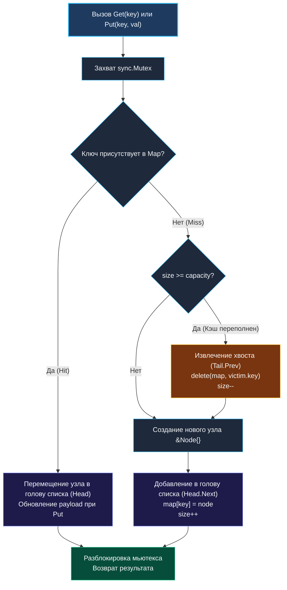
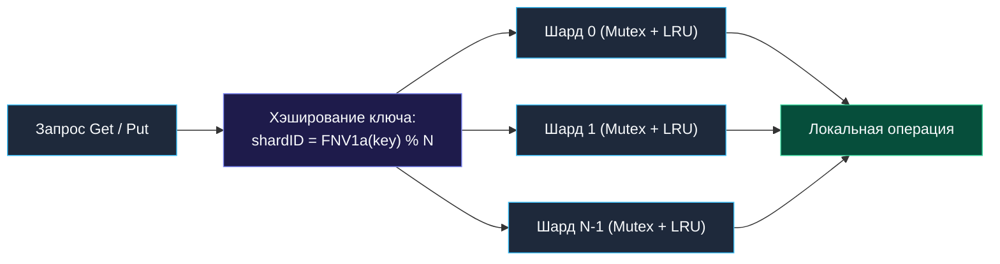

> *«Старое уступает место новому не из прихоти, а из суровой нехватки пространства».*  
> — Брайан Керниган

## Архитектура LRU-кэша: Композиция структур, конкуренция и механика памяти

**Least Recently Used (LRU)** кэш — один из наиболее часто запрашиваемых архитектурных паттернов на техническом интервью уровня Middle+ и Senior. Его задача обманчиво проста: хранить ограниченный объем данных и при нехватке памяти вытеснять те элементы, к которым дольше всего не было обращений.

Однако реализация LRU-кэша, способного стабильно выдерживать конкурентную нагрузку, не создающего утечек памяти и сводящего к минимуму латентность в горячем пути, требует глубокого знания устройства рантайма Go, кэш-линий процессора и поведения сборщика мусора (GC).



---

## 1. Архитектурный паттерн: Симбиоз Map и Двусвязного списка

LRU-кэш требует выполнения двух взаимоисключающих требований с константной сложностью $O(1)$:
1. **Мгновенный поиск элемента по ключу** $\to$ $O(1)$ через хэш-таблицу `map[string]*Node`.
2. **Мгновенное изменение приоритета и удаление жертвы** $\to$ $O(1)$ через двусвязный список.

Массивы и слайсы здесь неприменимы: удаление или вставка в середину слайса требует сдвига элементов за линейное время $O(N)$. Хэш-таблица сама по себе не хранит хронологический порядок доступа. Только комбинация `map` (хранящего указатели на узлы списка) и двусвязного списка (связывающего узлы по времени обращения) обеспечивает честное $O(1)$ для всех операций.

> [!WARNING]
> **Почему `container/list` из стандартной библиотеки — антипаттерн для продакшена?**  
> Многие кандидаты на собеседованиях используют стандартный пакет `container/list`. В production-коде с высокими требованиями к латентности это серьезный недостаток:  
> 1. `container/list` оперирует нетипизированными значениями `any` (`interface{}`). Каждая вставка упаковывает данные в кучу (boxing), увеличивая нагрузку на Garbage Collector и порождая дополнительные разыменования указателей.  
> 2. Ручная реализация типизированного двусвязного списка с фиктивными (dummy) узлами `head` и `tail` занимает всего 30 строк, полностью исключает boxing/unboxing и гарантирует отсутствие проверок на `nil`.

---

## 2. Идиоматичная реализация на Go

```go
package lru

import "sync"

// Node представляет элемент двусвязного списка
type Node struct {
	key   string
	value any
	prev  *Node
	next  *Node
}

// LRUCache реализует потокобезопасный LRU-кэш с O(1) операциями
type LRUCache struct {
	mu       sync.Mutex
	capacity int
	size     int
	items    map[string]*Node
	head     *Node // Фиктивная голова (самый свежий элемент — head.next)
	tail     *Node // Фиктивный хвост (кандидат на вытеснение — tail.prev)
}

// NewLRUCache создает новый кэш заданной емкости
func NewLRUCache(capacity int) *LRUCache {
	if capacity <= 0 {
		capacity = 16
	}

	c := &LRUCache{
		capacity: capacity,
		items:    make(map[string]*Node, capacity),
		head:     &Node{},
		tail:     &Node{},
	}

	// Замыкаем фиктивные узлы друг на друга
	c.head.next = c.tail
	c.tail.prev = c.head

	return c
}

// Get возвращает значение и обновляет приоритет элемента
func (c *LRUCache) Get(key string) (any, bool) {
	c.mu.Lock()
	defer c.mu.Unlock()

	node, ok := c.items[key]
	if !ok {
		return nil, false
	}

	// Элемент запрошен — перемещаем его в начало как самый свежий
	c.moveToHead(node)
	return node.value, true
}

// Put вставляет или обновляет элемент, при необходимости вытесняя старый
func (c *LRUCache) Put(key string, value any) {
	c.mu.Lock()
	defer c.mu.Unlock()

	if node, ok := c.items[key]; ok {
		// Ключ уже существует: обновляем payload и двигаем в голову
		node.value = value
		c.moveToHead(node)
		return
	}

	// Создаем новый узел
	newNode := &Node{
		key:   key,
		value: value,
	}

	c.items[key] = newNode
	c.addToHead(newNode)
	c.size++

	// Проверяем превышение емкости
	if c.size > c.capacity {
		// Удаляем наименее используемый элемент (хвост списка)
		victim := c.removeTail()
		delete(c.items, victim.key)
		c.size--
	}
}

// Вспомогательные методы управления двусвязным списком

func (c *LRUCache) addToHead(node *Node) {
	node.prev = c.head
	node.next = c.head.next
	c.head.next.prev = node
	c.head.next = node
}

func (c *LRUCache) removeNode(node *Node) {
	node.prev.next = node.next
	node.next.prev = node.prev
}

func (c *LRUCache) moveToHead(node *Node) {
	c.removeNode(node)
	c.addToHead(node)
}

func (c *LRUCache) removeTail() *Node {
	victim := c.tail.prev
	c.removeNode(victim)
	return victim
}
```

> [!NOTE]
> **Изящество Dummy-узлов (`head` и `tail`):**  
> Использование двух фиктивных терминальных узлов полностью исключает граничные проверки `if node.prev == nil` или `if node.next == nil`. Любой реальный узел всегда находится строго между двумя другими узлами. Компилятор Go инлайнит операции `addToHead` и `removeNode`, генерируя плотный машинный код без лишних переходов.

---

## 3. Механика памяти: Кэш-линии CPU и сборщик мусора

### 1. Pointer Chasing и промахи L1/L2 кэша
В классической реализации каждый `Node` аллоцируется отдельно в куче через `runtime.mallocgc`.  
Узлы разбросаны по разным виртуальным страницам памяти. При перемещении узла процессор выполняет доступ по 4 указателям (`node.prev`, `node.next`, `c.head.next` и т.д.). Каждый такой скачок может вызывать промах L1d-кэша процессора с задержкой в ~100–150 тактов.

**Решение для High-Performance сервисов (Array-backed / Indexed LRU):**  
Вместо связных списков на указателях узлы упаковываются в один сплошной плоский слайс `nodes := make([]Node, capacity)`.  
Вместо указателей `*Node` используются целочисленные индексы `int32`:
```go
type IndexedNode struct {
    key   string
    value any
    prev  int32 // Индекс в слайсе, -1 если нет
    next  int32
}
```
Такой подход устраняет фрагментацию памяти, кардинально снижает нагрузку на сборщик мусора и позволяет аппаратному префетчеру CPU работать с максимальной эффективностью.

### 2. Парадокс синхронизации в LRU: Почему `sync.RWMutex` вреден?

В классических структурах данных `sync.RWMutex` позволяет десяткам горутин одновременно читать данные через `RLock()`.  
Но в LRU-кэше операция **`Get(key)` не является чистым чтением!**  
При каждом успешном `Get` вызывается `moveToHead(node)`, который **мутирует** ссылки `prev` и `next` списка. Это операция записи!

Если использовать `RLock()` при чтении, то параллельные вызовы `Get` приведут к одновременной мутации указателей списка без эксклюзивной блокировки, что мгновенно вызовет **Data Race и повреждение связности списка**.  
Следовательно, в LRU операция `Get` обязана брать полный `Lock()`, и разделяемый `RWMutex` теряет свой смысл, лишь добавляя накладные расходы на атомарный счетчик читателей.

---

## 4. Оптимизация для продакшена: Шардирование кэша

Чтобы масштабировать LRU-кэш на десятки ядер CPU без блокировки единым мьютексом, применяют **шардирование (Striped / Sharded LRU)**:



```go
type ShardedLRU struct {
	shardMask uint32
	shards    []*LRUCache
}

func NewShardedLRU(numShards, totalCapacity int) *ShardedLRU {
	// Количество шардов приводим к степени двойки для быстрой битовой маски
	shardCap := totalCapacity / numShards
	shards := make([]*LRUCache, numShards)
	for i := 0; i < numShards; i++ {
		shards[i] = NewLRUCache(shardCap)
	}
	return &ShardedLRU{
		shardMask: uint32(numShards - 1),
		shards:    shards,
	}
}

func (s *ShardedLRU) getShard(key string) *LRUCache {
	// Быстрый FNV-1a хэш
	var h uint32 = 2166136261
	for i := 0; i < len(key); i++ {
		h = (h ^ uint32(key[i])) * 16777619
	}
	return s.shards[h&s.shardMask]
}

func (s *ShardedLRU) Get(key string) (any, bool) {
	return s.getShard(key).Get(key)
}

func (s *ShardedLRU) Put(key string, value any) {
	s.getShard(key).Put(key, value)
}
```

Шардирование снижает вероятность contention ровно в $N$ раз, позволяя разным ядрам процессора обрабатывать запросы параллельно.

---

## Вопросы для собеседования

> [!INTERVIEW]
> **Вопрос 1:** Что произойдет, если забыть удалить элемент из `items map` при вызове `removeTail()`?  
> **Ответ:**  
> Элемент будет удален из двусвязного списка, но останется в хэш-таблице `items`. Это приведет к утечке памяти (Memory Leak) и логической ошибке: последующий `Get(key)` найдет висячий узел (Dangling Node) в `map` и попытается вставить его обратно в список, нарушив связность указателей.

> [!INTERVIEW]
> **Вопрос 2:** Как предотвратить Cache Stampede при использовании LRU-кэша?  
> **Ответ:**  
> Интегрировать паттерн **Singleflight** (`golang.org/x/sync/singleflight`). При промахе кэша (`Get` вернул `false`) запрос к базе данных оборачивается в `singleflight.Group.Do(key, fetcher)`. Все параллельные горутины, запросившие один и тот же ключ, блокируются и ждут завершения ровно одного вызова к источнику, после чего результат записывается в кэш.

> [!INTERVIEW]
> **Вопрос 3:** В чем заключается проблема Scan Resistance в классическом LRU?  
> **Ответ:**  
> Если приложение выполняет полный скан большой таблицы или пакетную выгрузку (Batch Job), тысячи однократно читаемых ключей попадут в кэш и вытеснят действительно популярные «горячие» данные.  
> Для защиты от этой проблемы применяют усовершенствованные алгоритмы: **LRU-2 / 2Q** (элемент попадает в основной LRU только после второго обращения) или адаптивный **ARC (Adaptive Replacement Cache)**.

---

## Резюме

* Архитектура LRU строится на симбиозе хэш-таблицы (поиск за $O(1)$) и двусвязного списка (обновление порядка за $O(1)$).
* Использование фиктивных узлов `head` и `tail` исключает проверки на `nil` и делает код устойчивым к ошибкам.
* Операция `Get` в LRU является операцией записи (мутирует список), поэтому требует эксклюзивного `sync.Mutex`.
* Для высоконагруженных систем стандартом является шардирование кэша по битовой маске FNV-хэша.

В следующей лекции мы разберем кэш, ориентированный на частоту обращений: [[4. LFU Cache]], где научимся поддерживать двухуровневые списки с минимальной частотой за константное время $O(1)$.