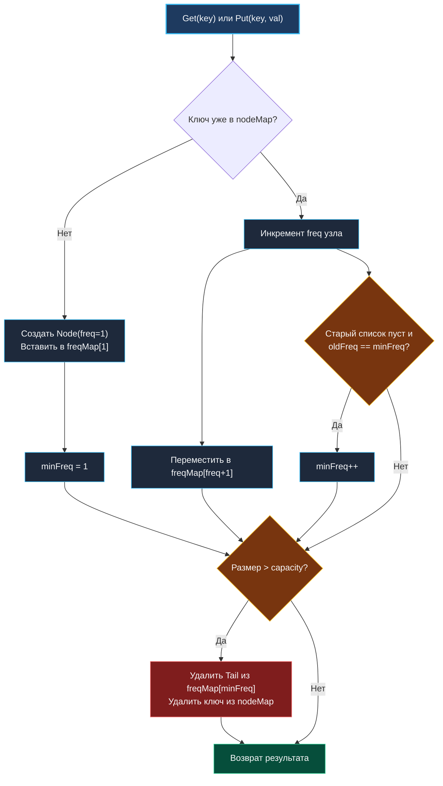
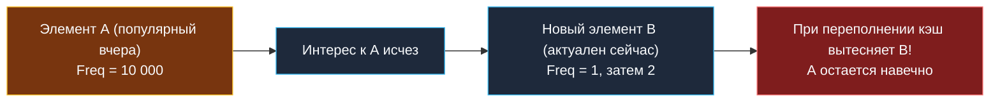

> *«В реальных системах частота использования обманчива: вчерашний фаворит сегодня становится балластом».*  
> — Брайан Керниган

## LFU Cache: архитектура O(1), частотные списки и управление памятью

Least Frequently Used (LFU) кэш решает задачу вытеснения элементов, к которым обращались наименьшее количество раз. В отличие от LRU ([[3. LRU Cache]]), который ориентирован исключительно на временную локальность (recency), LFU оптимизирован под частотную локальность (frequency). Это делает его естественным выбором для рабочих нагрузок со стабильным ядром «горячих» данных: кэширование популярных каталогов товаров, часто запрашиваемых конфигураций сервисов, схем валидации или системных метаданных.

Однако плата за частотный учет высока: реализация LFU с гарантированным временем выполнения операций $O(1)$ требует заметно более сложной композиции структур данных, чем LRU, и создает уникальные вызовы для планировщика Go, кэш-линий процессора и сборщика мусора.



В этой статье мы разберем, как достичь честного $O(1)$ при работе с частотами, почему наивные подходы порождают скрытые аллокации, как LFU взаимодействует с кэш-линиями CPU, как решается проблема «загрязнения кэша» (cache poisoning) через LFU-Aging и TinyLFU, и как написать эталонную потокобезопасную реализацию на Go.

---

## 1. Алгоритмическая механика: почему O(1) требует двух хеш-таблиц

Наивный подход к LFU заключается в хранении счетчика частоты внутри элемента и использовании очереди с приоритетом (Min-Heap) или сканировании среза при эвикции. Но очередь с приоритетом дает сложность обновления $O(\log N)$, а сканирование — $O(N)$. 

Чтобы получить гарантированное $O(1)$ для `Get` и `Put`, нам требуется двухуровневая координатная сетка:
1. `nodeMap: map[K]*Node` — мгновенный поиск узла по ключу за $O(1)$.
2. `freqMap: map[int]*DoubleList` — группировка узлов по частоте обращений. Каждая корзина частот представляет собой двусвязный список, упорядоченный по времени добавления/использования (LRU внутри одной частоты).
3. Переменная `minFreq: int` — текущая минимальная частота среди всех элементов в кэше.

Благодаря переменной `minFreq` мы избавлены от необходимости искать непустой список наименьшей частоты: мы сразу обращаемся к `freqMap[minFreq]`.

### Правила перехода состояний
- **Вставка нового ключа (`Put`):** новый элемент всегда получает частоту `freq = 1`. Следовательно, `minFreq` гарантированно сбрасывается в `1`.
- **Обращение к существующему ключу (`Get` или повторный `Put`):**
  1. Узел извлекается из двусвязного списка с частотой `f`.
  2. Если список для частоты `f` стал пуст, мы удаляем его из `freqMap`. Если при этом `f == minFreq`, минимальная частота увеличивается: `minFreq++`.
  3. Частота узла инкрементируется: `f++`.
  4. Узел помещается в начало (голову) списка для частоты `f+1`.
- **Эвикция при превышении `capacity`:**
  1. Берется список `freqMap[minFreq]`.
  2. Из его хвоста (Tail) удаляется самый старый элемент (least recently used среди наименее часто используемых).
  3. Ключ удаляется из `nodeMap`, а счетчик размера уменьшается.

> [!NOTE]
> В рантайме Go `map[int]*DoubleList` — это стандартная хеш-таблица `hmap` (или Swiss Table в Go 1.24+). Хеширование целочисленного ключа чрезвычайно дешево (тождественная функция или простое умножение на константу золотого сечения `2654435761`), однако создание новых списков для каждой уникальной частоты приводит к аллокациям в куче. Если частоты растут медленно и монотонно, можно использовать динамический срез `[]*DoubleList`, где индекс равен частоте, что повышает кэш-локальность за счет устранения хеширования.

---

## 2. Идиоматичная реализация на Go

Для корректной и надежной реализации структуры связного списка применим технику фиктивных граничных узлов (`dummy Head` и `dummy Tail`). Это полностью избавляет алгоритм от проверки граничных условий `node == nil`, `node.Prev == nil` и защищает от случайных паник при разыменовании указателей.

```go
package lfu

import (
	"sync"
)

// Node представляет элемент данных кэша.
type Node struct {
	Key   string
	Value any
	Freq  int
	Prev  *Node
	Next  *Node
}

// DoubleList — строго типизированный двусвязный список с dummy-узлами.
type DoubleList struct {
	head *Node
	tail *Node
	size int
}

func newDoubleList() *DoubleList {
	head := &Node{}
	tail := &Node{}
	head.Next = tail
	tail.Prev = head
	return &DoubleList{
		head: head,
		tail: tail,
		size: 0,
	}
}

// AddFirst добавляет узел в начало списка (MRU позиция внутри корзины частоты).
func (l *DoubleList) AddFirst(node *Node) {
	node.Prev = l.head
	node.Next = l.head.Next
	l.head.Next.Prev = node
	l.head.Next = node
	l.size++
}

// Remove извлекает произвольный узел из списка за O(1).
func (l *DoubleList) Remove(node *Node) {
	node.Prev.Next = node.Next
	node.Next.Prev = node.Prev
	node.Next = nil
	node.Prev = nil
	l.size--
}

// RemoveLast удаляет наименее востребованный узел из хвоста списка (LRU позиция).
func (l *DoubleList) RemoveLast() *Node {
	if l.size == 0 {
		return nil
	}
	last := l.tail.Prev
	l.Remove(last)
	return last
}

func (l *DoubleList) IsEmpty() bool {
	return l.size == 0
}

// LFUCache реализует LFU кэш с алгоритмической сложностью O(1).
type LFUCache struct {
	mu       sync.Mutex
	capacity int
	minFreq  int
	nodeMap  map[string]*Node
	freqMap  map[int]*DoubleList
}

// NewLFUCache создает новый экземпляр кэша заданной емкости.
func NewLFUCache(capacity int) *LFUCache {
	return &LFUCache{
		capacity: capacity,
		minFreq:  0,
		nodeMap:  make(map[string]*Node, capacity),
		freqMap:  make(map[int]*DoubleList),
	}
}

// Get возвращает значение по ключу и обновляет его частоту.
func (c *LFUCache) Get(key string) (any, bool) {
	c.mu.Lock()
	defer c.mu.Unlock()

	if c.capacity <= 0 {
		return nil, false
	}

	node, ok := c.nodeMap[key]
	if !ok {
		return nil, false
	}

	c.incrementFreq(node)
	return node.Value, true
}

// Put вставляет или обновляет значение по ключу.
func (c *LFUCache) Put(key string, value any) {
	c.mu.Lock()
	defer c.mu.Unlock()

	if c.capacity <= 0 {
		return
	}

	// Случай 1: ключ уже существует — обновляем значение и частоту
	if node, ok := c.nodeMap[key]; ok {
		node.Value = value
		c.incrementFreq(node)
		return
	}

	// Случай 2: кэш переполнен — вытесняем LFU/LRU элемент
	if len(c.nodeMap) >= c.capacity {
		minList := c.freqMap[c.minFreq]
		evicted := minList.RemoveLast()
		if evicted != nil {
			delete(c.nodeMap, evicted.Key)
			if minList.IsEmpty() {
				delete(c.freqMap, c.minFreq)
			}
		}
	}

	// Создаем новый узел с частотой 1
	newNode := &Node{
		Key:   key,
		Value: value,
		Freq:  1,
	}
	c.nodeMap[key] = newNode
	c.minFreq = 1

	list, ok := c.freqMap[1]
	if !ok {
		list = newDoubleList()
		c.freqMap[1] = list
	}
	list.AddFirst(newNode)
}

// incrementFreq перемещает узел в корзину частоты f + 1.
func (c *LFUCache) incrementFreq(node *Node) {
	oldFreq := node.Freq
	oldList := c.freqMap[oldFreq]
	oldList.Remove(node)

	// Если список опустел, очищаем запись в freqMap
	if oldList.IsEmpty() {
		delete(c.freqMap, oldFreq)
		// Если это была минимальная частота, инкрементируем minFreq
		if c.minFreq == oldFreq {
			c.minFreq++
		}
	}

	node.Freq++
	newList, ok := c.freqMap[node.Freq]
	if !ok {
		newList = newDoubleList()
		c.freqMap[node.Freq] = newList
	}
	newList.AddFirst(node)
}
```

---

## 3. Под капотом: память, GC и аппаратные ограничения

### Escape Analysis и аллокации
Каждый вызов `Put` для нового ключа порождает минимум три объекта в динамической памяти:
1. Структура `*Node` (56 байт на 64-битной платформе с полями указателей и строкой).
2. Запись в `nodeMap`.
3. Новый `*DoubleList` (24 байта), если частота `1` встретилась впервые после очистки.

Компилятор Go не может аллоцировать `*Node` на стеке, поскольку ссылки на него сохраняются в `nodeMap` и `DoubleList`. В нагруженных системах непрерывный поток `Put` с вытеснением приводит к высокой скорости генерации мусора (allocation churn).

### Pointer Chasing и Cache Misses
При вызове `incrementFreq` процессор вынужден выполнить несколько переходов по указателям:
- Чтение бакета в `freqMap` по хешу частоты.
- Разыменование `node.Prev` и `node.Next` для связывания соседей.
- Разыменование головы целевого списка `newList.head`.

Поскольку узлы распределяются аллокатором рантайма в произвольные страницы кучи, каждый переход с высокой вероятностью приводит к промаху кэша L1/L2 (Cache Miss, штраф 15–50 нс). По сравнению с плоским кольцевым буфером или массивом с индексом связности, связанный список на указателях тратит до 70% времени CPU на ожидание доставки данных из контроллера памяти.

> [!WARNING]
> **Утечка пустых списков в `freqMap`:**  
> Если забыть строку `delete(c.freqMap, oldFreq)` при опустошении списка, `freqMap` будет бесконечно разрастаться, удерживая в памяти тысячи пустых объектов `DoubleList`. Это классический пример логической утечки памяти в Go: сборщик мусора бессилен, поскольку на списки указывают ссылки из хеш-таблицы.

---

## 4. Проблема «загрязнения кэша» (Cache Poisoning) и современные решения

Классический LFU страдает фундаментальным недостатком, из-за которого в чистом виде его редко используют в продакшене без модификаций: **проблема накопленной частоты (Frequency Starvation / Cache Poisoning)**.



Если элемент $A$ был крайне популярен в прошлый час (набрал частоту $10\,000$), а затем интерес к нему угас, он будет заблокирован в кэше. Любые новые элементы с частотой $1, 2, 3$ будут немедленно вытесняться при нехватке места.

### Способы решения в индустрии
1. **LFU-Aging (Периодическое затухание):**  
   Периодически (по таймеру или каждые $N$ операций) все счетчики частот делятся на $2$: $\text{freq} = \lfloor\text{freq} / 2\rfloor$. Это снижает вес исторического багажа.
2. **Count-Min Sketch + TinyLFU (библиотеки Caffeine, Ristretto):**  
   Вместо хранения точного счетчика частоты внутри узла используется вероятностная структура данных Count-Min Sketch (4-битные счетчики). При вытеснении сравнивается частота кандидата на вставку и текущего кандидата на вытеснение (Admission Policy). Если новый элемент менее популярен, чем старый, он даже не допускается в кэш!

---

## 5. Шардирование и многопоточность

Поскольку метод `Get` в LFU обязан модифицировать частоту и перелинковывать узлы в списках, он является **мутирующей операцией**. Применение `sync.RWMutex` с вызовом `RLock()` для `Get` невозможно — требуется полноценный `Lock()`.

Чтобы исключить глобальный контеншн на единственном мьютексе, кэш шардируют по ключу:

```go
type ShardedLFU struct {
	shards    []*LFUCache
	numShards uint64
}

func NewShardedLFU(numShards int, capacityPerShard int) *ShardedLFU {
	shards := make([]*LFUCache, numShards)
	for i := 0; i < numShards; i++ {
		shards[i] = NewLFUCache(capacityPerShard)
	}
	return &ShardedLFU{
		shards:    shards,
		numShards: uint64(numShards),
	}
}

func (s *ShardedLFU) getShard(key string) *LFUCache {
	// Быстрый расчет FNV-1a хеша
	var h uint64 = 14695981039346656037
	for i := 0; i < len(key); i++ {
		h ^= uint64(key[i])
		h *= 1099511628211
	}
	return s.shards[h%s.numShards]
}

func (s *ShardedLFU) Get(key string) (any, bool) {
	return s.getShard(key).Get(key)
}

func (s *ShardedLFU) Put(key string, value any) {
	s.getShard(key).Put(key, value)
}
```

---

## 6. Вопросы для собеседования

> [!INTERVIEW]
> **Вопрос:** Почему при равенстве минимальных частот в LFU вытесняется именно тот элемент, к которому обращались дольше всего (LRU-order)?  
> **Ответ:** Двусвязный список для конкретной частоты поддерживает порядок по времени обращения. Новые или обновленные элементы всегда добавляются в голову (`AddFirst`), а вытеснение происходит с хвоста (`RemoveLast`). Это гарантирует детерминированное разрешение коллизий частот по принципу LRU без дополнительных затрат памяти.

> [!INTERVIEW]
> **Вопрос:** Чем отличается поведение LFU и LRU при сканировании большого массива данных (Database Table Scan)?  
> **Ответ:** LRU полностью вымывается однократным линейным сканированием большого набора данных (Cache Pollution). LFU более устойчив: новые сканируемые элементы получают частоту 1 и быстро вытесняют друг друга, не затрагивая элементы с частотами $\ge 2$. Однако если сканирование повторяется несколько раз, LFU также засорится без механизма затухания частот (Aging).

---

## Резюме

1. Реализация LFU за $O(1)$ требует двух хеш-таблиц (`nodeMap` и `freqMap`) и глобального отслеживания `minFreq`.
2. Внутри каждой корзины частот элементы связываются в двусвязный список для разрешения конфликтов по политике LRU.
3. Очистка пустых списков в `freqMap` строго обязательна для предотвращения утечек памяти.
4. В чистом виде классический LFU подвержен проблеме «устаревших фаворитов». В современных высоконагруженных кэшах применяются гибридные схемы W-TinyLFU и деградация частот по времени.

В следующей статье мы спроектируем собственную хеш-таблицу с нуля, изучив методы разрешения коллизий, открытую адресацию и механику Swiss Tables: [[5. Design HashMap]].