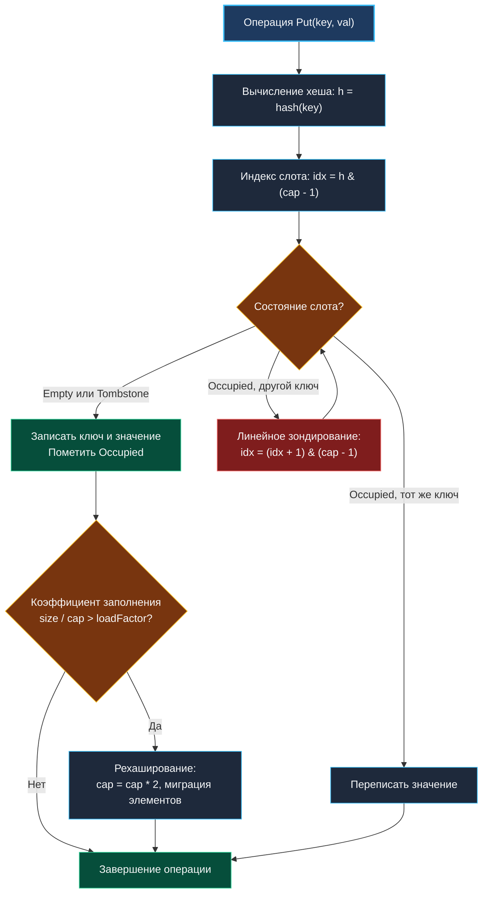
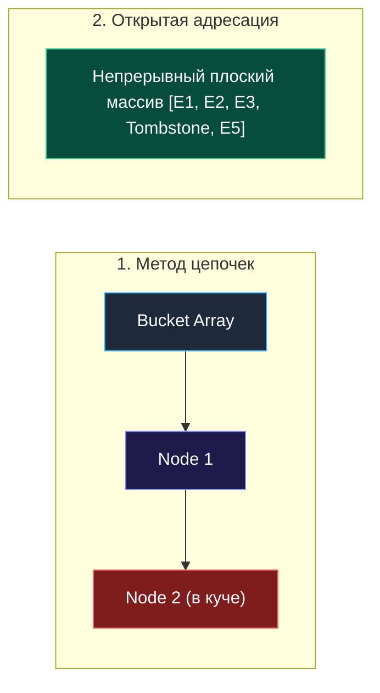

> *«Хеш-таблицы — это компромисс между пространством и временем, возведенный в ранг абсолюта».*  
> — Брайан Керниган

## Проектирование хеш-таблицы: от открытой адресации до механики Swiss Tables

Хеш-таблица — ключевой строительный блок современных программных систем. Внутренние кэши, индексы баз данных, маршрутизаторы HTTP-запросов, таблицы символов компилятора — все они опираются на амортизированный доступ за $O(1)$. 

На технических собеседованиях задача **Design HashMap** (LeetCode 706) является лакмусовой бумажкой: она проверяет не знание синтаксиса `map[K]V`, а глубокое инженерное понимание аппаратных компромиссов: локальности кэша L1/L2/L3, штрафов за ветвления (branch misprediction), фрагментации кучи и стоимости рехаширования под нагрузкой.



---

## 1. Архитектурные парадигмы: цепочки vs открытая адресация vs Swiss Tables

Разрешение коллизий хеш-функции — фундаментальная развилка в дизайне ассоциативных массивов:

| Подход | Суть механизма | Плюсы | Минусы | Где применяется |
| :--- | :--- | :--- | :--- | :--- |
| **Метод цепочек (Separate Chaining)** | В бакетах хранятся связные списки или динамические массивы. | Простота реализации; удаление тривиально. | Множество мелких аллокаций; ужасная кэш-локальность (pointer chasing). | Java `HashMap` (до перестроения в дерево), C++ `std::unordered_map`. |
| **Открытая адресация (Open Addressing)** | Все элементы хранятся в непрерывном массиве. Коллизия = зондирование следующих ячеек. | Максимальная плотность упаковки; превосходная кэш-локальность. | Проблема кластеризации; удаление требует маркеров `tombstone`; чувствительность к высокому Load Factor. | Python `dict`, Rust `hashbrown`, многие high-performance кэши. |
| **Бакеты Go (до Go 1.23)** | Массив `bmap` по 8 слотов + `tophash` + `overflow buckets`. | Компромисс: плоские 8 элементов в бакете + цепочка переполнения. | Дополнительные переходы по указателям при затяжных коллизиях. | Go runtime (`runtime/map.go`). |
| **Swiss Tables (Go 1.24+)** | Группы по 8 слотов (в Go) / 16 слотов (в C++) с контрольными байтами (Ctrl bytes) и SWAR/SIMD поиском. | Параллельный опрос слотов группы за единичные инструкции CPU; минимальные накладные расходы памяти. | Сложность низкоуровневой логики зондирования. | Go 1.24+, Abseil C++, Rust `std::collections::HashMap`. |



> [!NOTE]
> **Революция Swiss Tables в Go 1.24:**  
> Исторически рантайм Go использовал бакеты по 8 элементов. В Go 1.24 внедрена архитектура Swiss Tables (на базе алгоритма SwissMap от Google). Она хранит метаданные (старшие 7 бит хеша каждого слота) в отдельном плоском 16-байтном массиве. С помощью векторных инструкций SIMD (или побитовой SWAR-магии) процессор за 1 такт определяет, есть ли искомый ключ в группе из 16 элементов, полностью исключая лишние чтения из оперативной памяти.

---

## 2. Идиоматичная реализация на Go: открытая адресация с линейным зондированием

Для интервью и системного программирования эталоном прозрачности и скорости является реализация с открытой адресацией, битовой маской степени двойки и поддержкой `tombstone` (маркеров удаления).

```go
package hashmap

const (
	stateEmpty uint8 = iota
	stateOccupied
	stateTombstone
)

// entry представляет ячейку таблицы.
type entry struct {
	key   int
	value int
	state uint8
}

// HashMap реализует хеш-таблицу с открытой адресацией и линейным зондированием.
type HashMap struct {
	buckets    []entry
	size       int     // количество активных элементов
	capacity   int     // размер массива buckets (всегда степень 2)
	mask       int     // capacity - 1 для быстрого взятия модуля
	loadFactor float64 // порог рехаширования (обычно 0.70)
}

// NewHashMap создает новую таблицу с заданной начальной емкостью.
func NewHashMap(initialCap int, loadFactor float64) *HashMap {
	if initialCap < 8 {
		initialCap = 8
	}
	if loadFactor <= 0.1 || loadFactor >= 0.9 {
		loadFactor = 0.70
	}

	// Округляем емкость до ближайшей степени двойки
	cap := 1
	for cap < initialCap {
		cap <<= 1
	}

	return &HashMap{
		buckets:    make([]entry, cap),
		size:       0,
		capacity:   cap,
		mask:       cap - 1,
		loadFactor: loadFactor,
	}
}

// hash возвращает перемешанный 32-битный хеш целого числа (хэш Томаса Ванга).
func (m *HashMap) hash(key int) int {
	k := uint64(key)
	k = (^k) + (k << 21) // k = (k << 21) - k - 1
	k = k ^ (k >> 24)
	k = (k + (k << 3)) + (k << 8) // k * 265
	k = k ^ (k >> 14)
	k = (k + (k << 2)) + (k << 4) // k * 21
	k = k ^ (k >> 28)
	k = k + (k << 31)
	return int(k)
}

// Put вставляет или перезаписывает значение ключа.
func (m *HashMap) Put(key, val int) {
	// Проверка коэффициента заполнения перед вставкой
	if float64(m.size+1) > float64(m.capacity)*m.loadFactor {
		m.resize(m.capacity * 2)
	}

	idx := m.hash(key) & m.mask
	firstTombstone := -1

	for i := 0; i < m.capacity; i++ {
		slot := (idx + i) & m.mask
		curr := &m.buckets[slot]

		if curr.state == stateOccupied {
			if curr.key == key {
				curr.value = val // Ключ найден — обновляем значение
				return
			}
			continue
		}

		if curr.state == stateTombstone {
			if firstTombstone == -1 {
				firstTombstone = slot
			}
			continue
		}

		// Достигли пустого слота (stateEmpty)
		targetSlot := slot
		if firstTombstone != -1 {
			targetSlot = firstTombstone // Переиспользуем могильный маркер
		}

		m.buckets[targetSlot] = entry{
			key:   key,
			value: val,
			state: stateOccupied,
		}
		m.size++
		return
	}

	// Если дошли сюда — все слоты заняты tombstones
	if firstTombstone != -1 {
		m.buckets[firstTombstone] = entry{
			key:   key,
			value: val,
			state: stateOccupied,
		}
		m.size++
	}
}

// Get ищет значение по ключу, возвращая значение и флаг наличия.
func (m *HashMap) Get(key int) (int, bool) {
	idx := m.hash(key) & m.mask

	for i := 0; i < m.capacity; i++ {
		slot := (idx + i) & m.mask
		curr := &m.buckets[slot]

		if curr.state == stateEmpty {
			// Цепочка зондирования прервалась — ключ гарантированно отсутствует
			return 0, false
		}

		if curr.state == stateOccupied && curr.key == key {
			return curr.value, true
		}
		// При встрече stateTombstone продолжаем поиск дальше
	}

	return 0, false
}

// Delete помечает ячейку маркером удаления (Tombstone).
func (m *HashMap) Delete(key int) bool {
	idx := m.hash(key) & m.mask

	for i := 0; i < m.capacity; i++ {
		slot := (idx + i) & m.mask
		curr := &m.buckets[slot]

		if curr.state == stateEmpty {
			return false
		}

		if curr.state == stateOccupied && curr.key == key {
			curr.state = stateTombstone
			m.size--
			return true
		}
	}

	return false
}

// resize переаллоцирует массив и переносит только активные элементы.
func (m *HashMap) resize(newCap int) {
	oldBuckets := m.buckets

	m.buckets = make([]entry, newCap)
	m.capacity = newCap
	m.mask = newCap - 1
	m.size = 0 // Пересчитается в Put

	for _, e := range oldBuckets {
		if e.state == stateOccupied {
			m.Put(e.key, e.value)
		}
	}
}
```

---

## 3. Механика памяти: битовая маска, Tombstones и инкрементальный ресайз

### Степень двойки vs остаток от деления
Операция деления `key % capacity` в микроархитектуре процессора требует порядка 15–40 тактов (инструкция `IDIV`).  
Если размер массива всегда является степенью двойки ($2^k$), операция вычисления остатка заменяется на битовое `AND`:
$$\text{slot} = h \ \& \ (\text{capacity} - 1)$$
Битовая маска выполняется ровно за **1 такт CPU**.

### Зачем нужен Tombstone?
При открытой адресации удаление элемента не может просто очистить слот в `stateEmpty`. Если при зондировании элемент $B$ был помещен после элемента $A$ из-за коллизии, физическая очистка ячейки $A$ разорвет цепочку поиска: метод `Get(B)` наткнется на `stateEmpty` и ошибочно решит, что $B$ в таблице нет!  
Поэтому ячейка помечается как `stateTombstone`. Поиск продолжает зондирование сквозь tombstones, а новая вставка `Put` имеет право переиспользовать ячейку с tombstone.

> [!WARNING]
> **Tombstone Saturation (Засорение могильниками):**  
> Если в таблице происходит интенсивный поток чередующихся вставок и удалений (`Put` → `Delete`), массив быстро заполнится маркерами `stateTombstone`. Число активных элементов мало (`size` невелик), но длина зондирования при `Get` для отсутствующих ключей вырастает до $O(N)$. Решение — триггерить рехаширование (компактификацию) не только при росте `size`, но и когда сумма $\text{size} + \text{tombstones} > \text{capacity} \times 0.85$.

---

## 4. Конкурентность и шардирование

Встроенный `map` в Go защищен от гонок на уровне рантайма: при обнаружении параллельной записи и чтения процесс немедленно аварийно завершается с паникой `fatal error: concurrent map writes`.

В кастомных реализациях для высоконагруженных систем применяют **Striped Locking (Шардирование)**:

```go
type ShardedHashMap struct {
	shards    []*ConcurrentShard
	numShards int
	mask      int
}

type ConcurrentShard struct {
	mu sync.RWMutex
	m  *HashMap
}
```

Шардирование распределяет запросы к разным мьютексам по хешу ключа, уменьшая время ожидания горутин в очереди на блокировку до пренебрежимо малых величин.

---

## 5. Вопросы для собеседования

> [!INTERVIEW]
> **Вопрос:** Что такое HashDoS атака и как стандартная библиотека Go защищается от нее?  
> **Ответ:** Если злоумышленник знает алгоритм хеш-функции, он может передать специально подобранный набор ключей с одинаковым хешем. Это вырождает хеш-таблицу в связный список или длинную цепочку коллизий ($O(N)$ на операцию), что вызывает 100% утилизацию CPU и отказ в обслуживании (DoS).  
> В Go при запуске каждого процесса генерируется случайный криптографический сид (`hashkey`), который примешивается ко всем операциям хеширования в рантайме. Поэтому порядок обхода `map` не детерминирован, а предсказать коллизии извне невозможно.

> [!INTERVIEW]
> **Вопрос:** Почему Go runtime реализует инкрементальное (эвакуационное) рехаширование?  
> **Ответ:** При синхронном удвоении таблицы на миллионы записей операция `Put` заблокирует выполнение горутины на десятки миллисекунд (Stop-The-World для таблицы), вызвав резкий скачок латентности (P99 latency spike). Рантайм Go выделяет `oldbuckets` и переносит бакеты постепенно: ровно по два бакета при каждой последующей операции записи или удаления.

---

## Резюме

1. Метод цепочек проще в реализации, но открытая адресация обеспечивает непревзойденную кэш-локальность благодаря непрерывному массиву памяти.
2. Использование степеней двойки в качестве емкости заменяет медленное деление на битовую маску `cap - 1` ($1$ такт CPU).
3. Маркеры `tombstone` необходимы для сохранения целостности цепочки линейного зондирования при удалениях.
4. В Go 1.24+ архитектура ассоциативных массивов перешла на Swiss Tables, сочетающие 8-слотовые группы с SWAR/SIMD фильтрацией по контрольным байтам.

В следующей статье мы применим изученные структуры для проектирования распределенной социальной ленты твитов: [[6. Design Twitter]].