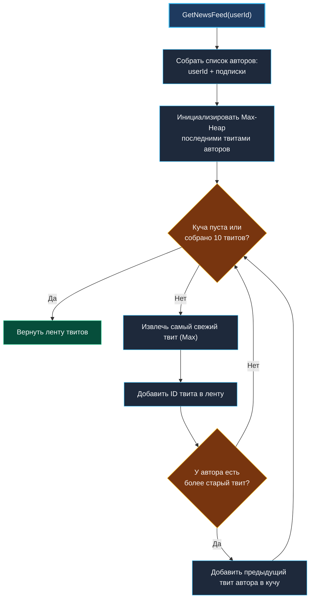
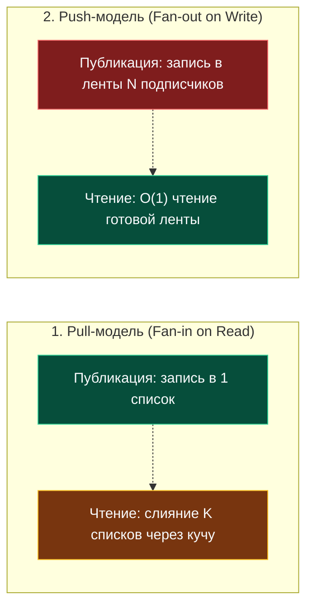

> *«Архитектура системы раскрывается не тогда, когда всё работает, а когда миллионы пользователей одновременно хотят одного и того же».*  
> — Брайан Керниган

## Архитектура Twitter-ленты: слияние K упорядоченных списков, Push vs Pull и celebrity-проблема

Задача **Design Twitter** (LeetCode 355) — классический мост между алгоритмическими структурами данных и архитектурой распределенных систем (System Design). Она моделирует ядро социальной сети: динамический граф подписок и формирование персонализированной новостной ленты в реальном времени.

На собеседованиях эта задача выявляет инженеров уровня Senior: умеете ли вы не просто сложить твиты в массив и вызвать `sort.Slice`, а применить потоковое слияние через кучу ($K$-Way Merge), оценить влияние кэш-линий процессора и аргументированно объяснить переход от Pull-модели (Fan-in on Read) к Push-модели (Fan-out on Write).



---

## 1. Алгоритмический базис: слияние K упорядоченных списков

Каждый пользователь публикует твиты последовательно. Если твиты каждого пользователя уже упорядочены по монотонно растущему таймстампу, задача формирования ленты из $10$ самых свежих записей эквивалентна задаче **Merge K Sorted Lists** ([[4. Merge K Sorted Lists]]).

### Сравнение подходов

1. **Наивный сбор и сортировка:**  
   Собрать все твиты от всех авторов, на которых подписан пользователь, в единый срез и отсортировать:
   $$O(M \log M)$$
   где $M$ — суммарное количество твитов всех подписок. Если у пользователя $500$ подписок и у каждого по $200$ твитов, $M = 100\,000$. Сортировать сто тысяч элементов ради выборки первых десяти — катастрофический расход тактов CPU.

2. **Слияние через Max-Heap (Очередь с приоритетом):**  
   В кучу кладутся только самые свежие твиты от каждого из $K$ авторов (размер кучи не превышает $K$). Мы извлекаем максимум $10$ раз. На каждом шаге в кучу добавляется следующий по старшинству твит от автора только что извлеченного твита.
   $$O(K + 10 \log K)$$
   При любых объемах архивов твитов сложность зависит только от числа подписок $K$.

---

## 2. Идиоматичная реализация на Go

Для максимальной производительности твиты автора хранятся в плоском срезе значений `[]Tweet`, а не указателей `[]*Tweet`. Для работы с кучей используется стандартный пакет `container/heap`.

```go
package twitter

import (
	"container/heap"
	"sync"
	"sync/atomic"
)

// Tweet представляет опубликованное сообщение.
type Tweet struct {
	ID   int
	Time int64
}

// User инкапсулирует твиты пользователя и граф его подписок.
type User struct {
	mu        sync.RWMutex
	id        int
	following map[int]struct{}
	tweets    []Tweet // плоский срез, новые твиты в конце
}

func newUser(id int) *User {
	return &User{
		id:        id,
		following: make(map[int]struct{}),
		tweets:    make([]Tweet, 0, 32),
	}
}

// heapNode хранит состояние обхода ленты конкретного автора.
type heapNode struct {
	tweet Tweet
	uid   int
	index int // индекс следующего твита для просмотра в tweets автора
}

// maxTweetHeap реализует интерфейс heap.Interface для поиска самых свежих твитов.
type maxTweetHeap []heapNode

func (h maxTweetHeap) Len() int           { return len(h) }
func (h maxTweetHeap) Less(i, j int) bool { return h[i].tweet.Time > h[j].tweet.Time } // Max-Heap
func (h maxTweetHeap) Swap(i, j int)      { h[i], h[j] = h[j], h[i] }
func (h *maxTweetHeap) Push(x any)        { *h = append(*h, x.(heapNode)) }
func (h *maxTweetHeap) Pop() any {
	old := *h
	n := len(old)
	item := old[n-1]
	*h = old[0 : n-1]
	return item
}

// Twitter координирует пользователей и глобальное время.
type Twitter struct {
	mu      sync.RWMutex
	users   map[int]*User
	clock   atomic.Int64 // монотонный генератор логического времени
}

func Constructor() Twitter {
	return Twitter{
		users: make(map[int]*User),
	}
}

func (t *Twitter) getOrCreateUser(userId int) *User {
	t.mu.RLock()
	u, ok := t.users[userId]
	t.mu.RUnlock()
	if ok {
		return u
	}

	t.mu.Lock()
	defer t.mu.Unlock()
	// Double-check locking
	if u, ok = t.users[userId]; ok {
		return u
	}
	u = newUser(userId)
	t.users[userId] = u
	return u
}

// PostTweet публикует твит от имени пользователя.
func (t *Twitter) PostTweet(userId int, tweetId int) {
	u := t.getOrCreateUser(userId)
	timestamp := t.clock.Add(1)

	u.mu.Lock()
	u.tweets = append(u.tweets, Tweet{ID: tweetId, Time: timestamp})
	u.mu.Unlock()
}

// GetNewsFeed формирует ленту из 10 самых свежих твитов.
func (t *Twitter) GetNewsFeed(userId int) []int {
	u := t.getOrCreateUser(userId)

	// Собираем снимок списка авторов: сам пользователь + подписки
	u.mu.RLock()
	authors := make([]int, 0, len(u.following)+1)
	authors = append(authors, userId)
	for fid := range u.following {
		authors = append(authors, fid)
	}
	u.mu.RUnlock()

	// Инициализируем кучу
	h := make(maxTweetHeap, 0, len(authors))

	for _, aid := range authors {
		author := t.getOrCreateUser(aid)
		author.mu.RLock()
		n := len(author.tweets)
		if n > 0 {
			// Берем самый последний (самый свежий) твит
			lastTweet := author.tweets[n-1]
			h = append(h, heapNode{
				tweet: lastTweet,
				uid:   aid,
				index: n - 2, // указатель на предыдущий твит
			})
		}
		author.mu.RUnlock()
	}

	heap.Init(&h)

	result := make([]int, 0, 10)

	// Извлекаем до 10 твитов
	for h.Len() > 0 && len(result) < 10 {
		top := heap.Pop(&h).(heapNode)
		result = append(result, top.tweet.ID)

		if top.index >= 0 {
			author := t.getOrCreateUser(top.uid)
			author.mu.RLock()
			if top.index < len(author.tweets) {
				prevTweet := author.tweets[top.index]
				heap.Push(&h, heapNode{
					tweet: prevTweet,
					uid:   top.uid,
					index: top.index - 1,
				})
			}
			author.mu.RUnlock()
		}
	}

	return result
}

// Follow подписывает followerId на followeeId.
func (t *Twitter) Follow(followerId int, followeeId int) {
	if followerId == followeeId {
		return
	}
	u := t.getOrCreateUser(followerId)
	t.getOrCreateUser(followeeId) // гарантируем существование цели

	u.mu.Lock()
	u.following[followeeId] = struct{}{}
	u.mu.Unlock()
}

// Unfollow отписывает followerId от followeeId.
func (t *Twitter) Unfollow(followerId int, followeeId int) {
	if followerId == followeeId {
		return
	}
	u := t.getOrCreateUser(followerId)

	u.mu.Lock()
	delete(u.following, followeeId)
	u.mu.Unlock()
}
```

---

## 3. Механика аппаратуры и кэш-памяти: почему `[]Tweet`, а не `[]*Tweet`

Структура `Tweet` занимает всего $16$ байт ($8$ байт `int` ID + $8$ байт `int64` Time).
Стандартная кэш-линия процессора (x86-64 и ARM64) равна **64 байтам**.

```
[ Кэш-линия L1: 64 байта ]
| Tweet 0 (16B) | Tweet 1 (16B) | Tweet 2 (16B) | Tweet 3 (16B) |
```

Когда мы обращаемся к `author.tweets[n-1]`, контроллер памяти загружает в L1-кэш сразу **четыре последних твита** за один такт шины. Переход к `top.index - 1` происходит мгновенно — данные уже находятся в регистре или кэше L1.

Если бы мы хранили срез указателей `[]*Tweet`:
- Каждый элемент среза — это указатель $8$ байт, ведущий в случайную область кучи.
- Каждое разыменование указателя — это потенциальный L3/RAM Cache Miss (задержка до 60–100 наносекунд).
- Сборщик мусора Go вынужден был бы сканировать миллионы отдельных объектов в куче.

---

## 4. Архитектурный масштаб: Push vs Pull и проблема «Джастина Бибера»

При переносе алгоритма в реальную распределенную систему возникает дилемма двух моделей:



### Проблема суперзвезд (Celebrity Problem)
Представьте пользователя (например, Илона Маска или Джастина Бибера), у которого $100\,000\,000$ подписчиков.
В чистой **Push-модели** одна публикация такого аккаунта потребует:
- $100$ миллионов операций записи в очереди и кэши подписчиков.
- Огромный write amplification и всплеск нагрузки на сеть и диски.

В продакшене Twitter (X) использует **гибридную модель**:
1. Для $99.9\%$ обычных пользователей действует **Push-модель**: твит раскладывается по предрассчитанным таймлайнам подписчиков в Redis. Чтение ленты выполняется за $O(1)$.
2. Для аккаунтов со статусом **Celebrity** (более $20\,000$ фолловеров) Push отключается.
3. При открытии ленты клиентом сервис читает готовый кэш подписчика ($O(1)$) и на лету подмешивает твиты суперзвезд через описанный выше алгоритм слияния потоков.

---

## 5. Вопросы для собеседования

> [!INTERVIEW]
> **Вопрос:** Почему для монотонного времени в коде использован `atomic.Int64`, а не `time.Now().UnixNano()`?  
> **Ответ:** Физические системные часы операционной системы (`time.Now()`) не гарантируют строгой монотонности при конкурентных вызовах на разных ядрах CPU (возможен дрифт или синхронизация по NTP назад во времени). Атомарный счетчик `atomic.AddInt64` обеспечивает строгую линеаризуемость: если операция $B$ началась после завершения $A$, ее метка времени гарантированно больше.

> [!INTERVIEW]
> **Вопрос:** Как организовать пагинацию ленты, если пользователь листает глубже 10 твитов?  
> **Ответ:** Использовать Cursor-based пагинацию. Клиенту возвращается маркер (cursor), содержащий `Time` и `TweetID` последнего отображенного элемента. Следующий запрос `GetNewsFeed(cursor)` передает этот маркер в кучу, отсекая все твиты с меткой времени моложе переданной.

---

## Резюме

1. Алгоритм слияния $K$ списков через Max-Heap позволяет получить 10 самых свежих твитов за время $O(K + 10 \log K)$, исключая необходимость сортировки всей массы сообщений.
2. Хранение плоских структур `Tweet` по значению использует 64-байтные кэш-линии процессора на $100\%$, исключая Cache Misses.
3. В распределенных системах выбор между Push и Pull сводится к гибридной схеме, изолирующей суперзвезд от массового fan-out.

В следующей статье мы разберем оптимизацию базового стека для поиска минимума за константное время: [[7. Min Stack]].