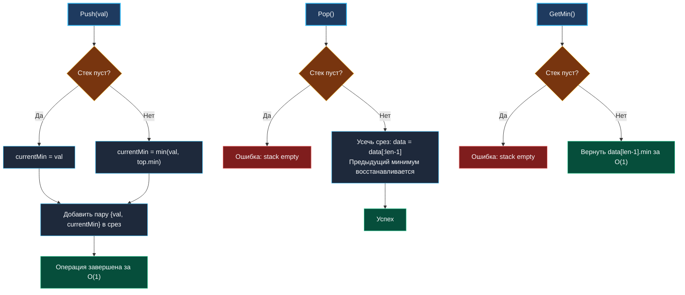

> *«Стек прост, пока вы не потребуете от него помнить всё лучшее, что с ним происходило».*  
> — Брайан Керниган

## Проектирование Min Stack: O(1) минимумы, кэш-локальность и механика срезов

Стек (LIFO — Last In, First Out) — одна из простейших структур данных в Computer Science. Однако добавление всего одного требования — возвращать текущий минимальный элемент за строго константное время $O(1)$ без ухудшения асимптотики операций `Push` и `Pop` — превращает **Min Stack** (LeetCode 155) в классический вопрос собеседований любого уровня.

Эта задача проверяет фундаментальные инженерные навыки: умение рассуждать о компромиссах между памятью и процессорным временем, понимание кэш-линий процессора, работу аллокатора Go при росте динамических срезов (`growslice`) и предотвращение скрытых утечек памяти (memory retention).



---

## 1. Архитектурные подходы: два среза vs срез пар

Существуют два основных способа поддержки состояния минимума в стеке:

### Подход А: Два независимых среза (`data []int` и `minStack []int`)
В первом срезе хранятся все значения, во втором — только минимумы.  
- **Плюс:** если новые элементы больше текущего минимума, во второй срез можно ничего не добавлять (оптимизация редких минимумов).
- **Минус:** две независимые аллокации в куче, двойная нагрузка на рантайм, ухудшение локальности данных. Процессор вынужден читать две разные области виртуальной памяти.

### Подход Б: Единый срез пар `[]pair{val, min int}`
Каждый элемент хранит снимок актуального минимума на момент своей вставки.
- **Плюс:** максимальная кэш-локальность. Все данные упакованы в один непрерывный кусок памяти. Процессорный аппаратный префетчер (Hardware Prefetcher) читает данные блоками по $64$ байта.
- **Минус:** дополнительный расход памяти на хранение поля `min` для каждого элемента.

В современных архитектурах стоимость промаха кэша (Cache Miss — до $50$–$100$ нс) многократно превышает стоимость лишних нескольких байт оперативной памяти. Поэтому подход с единым срезом пар является предпочтительным.

```
[ Кэш-линия CPU: 64 байта ]
| Pair 0 (16B) | Pair 1 (16B) | Pair 2 (16B) | Pair 3 (16B) |
| {val, min}   | {val, min}   | {val, min}   | {val, min}   |
```

---

## 2. Идиоматичная реализация на Go

Реализуем обобщенный (Generic) стек, совместимый с любыми упорядоченными типами (`cmp.Ordered` из стандартного пакета Go 1.21+):

```go
package minstack

import (
	"cmp"
	"errors"
	"sync"
)

var ErrEmptyStack = errors.New("minstack: stack is empty")

// pair упаковывает полезную нагрузку и текущий минимум.
type pair[T cmp.Ordered] struct {
	val T
	min T
}

// MinStack реализует стек с константным доступом к минимуму.
type MinStack[T cmp.Ordered] struct {
	mu       sync.RWMutex
	elements []pair[T]
}

// New создает MinStack с возможностью предвыделения емкости.
func New[T cmp.Ordered](capacity int) *MinStack[T] {
	if capacity < 0 {
		capacity = 0
	}
	return &MinStack[T]{
		elements: make([]pair[T], 0, capacity),
	}
}

// Push помещает элемент на вершину стека за O(1).
func (s *MinStack[T]) Push(val T) {
	s.mu.Lock()
	defer s.mu.Unlock()

	currentMin := val
	n := len(s.elements)
	if n > 0 {
		topMin := s.elements[n-1].min
		if cmp.Less(topMin, currentMin) {
			currentMin = topMin
		}
	}

	s.elements = append(s.elements, pair[T]{
		val: val,
		min: currentMin,
	})
}

// Pop удаляет верхний элемент стека.
func (s *MinStack[T]) Pop() (T, error) {
	s.mu.Lock()
	defer s.mu.Unlock()

	n := len(s.elements)
	if n == 0 {
		var zero T
		return zero, ErrEmptyStack
	}

	val := s.elements[n-1].val
	// Усекаем срез без реаллокации
	s.elements = s.elements[:n-1]
	return val, nil
}

// Top возвращает значение на вершине стека без удаления.
func (s *MinStack[T]) Top() (T, error) {
	s.mu.RLock()
	defer s.mu.RUnlock()

	n := len(s.elements)
	if n == 0 {
		var zero T
		return zero, ErrEmptyStack
	}
	return s.elements[n-1].val, nil
}

// GetMin возвращает минимальный элемент стека за O(1).
func (s *MinStack[T]) GetMin() (T, error) {
	s.mu.RLock()
	defer s.mu.RUnlock()

	n := len(s.elements)
	if n == 0 {
		var zero T
		return zero, ErrEmptyStack
	}
	return s.elements[n-1].min, nil
}

// Len возвращает текущее количество элементов.
func (s *MinStack[T]) Len() int {
	s.mu.RLock()
	defer s.mu.RUnlock()
	return len(s.elements)
}
```

---

## 3. Механика рантайма: рост среза и ловушка Memory Retention

### Поведение аллокатора при росте среза
Когда в методе `Push` текущая длина среза достигает его емкости (`len == cap`), рантайм Go выполняет вызов внутренней функции `runtime.growslice`.  
- До размера в $256$ элементов емкость обычно удваивается.
- Для больших срезов рост замедляется по плавной кривой (коэффициент около $1.25$ плюс выравнивание по классам памяти Go).
- Стоимость вызова `runtime.growslice` — это аллокация нового непрерывного блока памяти и копирование всех элементов (`memmove`). Это операция $O(N)$.
- Однако благодаря геометрическому росту амортизированная сложность `Push` остается строго $O(1)$.

> [!WARNING]
> **Ловушка удержания памяти (Memory Retention):**  
> При операции `s.elements = s.elements[:n-1]` базовый массив (backing array) **не освобождает память**.  
> Если элемент `val` содержит указатели (например, `*BigDataStruct`, слайсы или карты), ссылка на этот объект останется в невидимой части базового массива за пределами `len`. Сборщик мусора Go не сможет освободить эту память!  
> В случае хранения указателей перед усечением среза необходимо явно занулить элемент:
> ```go
> s.elements[n-1] = pair[T]{} // обнуляем ссылку для сборщика мусора
> s.elements = s.elements[:n-1]
> ```

---

## 4. Вопросы для собеседования

> [!INTERVIEW]
> **Вопрос:** Можно ли реализовать Min Stack с расходом дополнительной памяти $O(1)$ без хранения минимума в каждом узле?  
> **Ответ:** Да, для числовых типов (например, `int64`) существует математический трюк с сохранением дельты: в стек пушится не само значение, а разность $2 \times \text{val} - \text{min}$. Однако этот трюк:
> 1. Не работает для обобщенных типов (строк, структур).
> 2. Подвержен риску переполнения целых чисел (integer overflow).
> 3. Добавляет дополнительные инструкции ветвления при каждом вызове `Pop` и `Top`.  
> В промышленном коде такой трюк категорически не рекомендуется в пользу предсказуемого и безопасного среза пар.

> [!INTERVIEW]
> **Вопрос:** Почему в многопоточной версии использован `sync.RWMutex`, хотя в LRU/LFU мы применяли обычный `sync.Mutex`?  
> **Ответ:** В отличие от LRU или LFU кэшей, где метод `Get` перемещает узел в списке и обновляет частоту (является мутацией), методы `Top`, `GetMin` и `Len` в `MinStack` являются **чистыми операциями чтения**. Они никак не меняют состояние среза. Поэтому параллельные вызовы `GetMin` могут безопасно выполняться десятками горутин под `RLock()`.

---

## Резюме

1. Min Stack достигает константного времени $O(1)$ для поиска минимума за счет сохранения истории локальных минимумов.
2. Использование единого непрерывного среза пар гарантирует плотную упаковку в кэш-линии процессора и отсутствие промахов памяти.
3. При хранении структур с указателями необходимо явно занулять удаляемый элемент перед срезанием `[:len-1]`, чтобы не мешать сборщику мусора.

На этом мы завершаем кластер проектирования структур данных. В следующей главе мы переходим к кластеру вероятностных и рандомизированных алгоритмов, начав с теории рандомизации: [[1. Теория. Рандомизированные алгоритмы]].