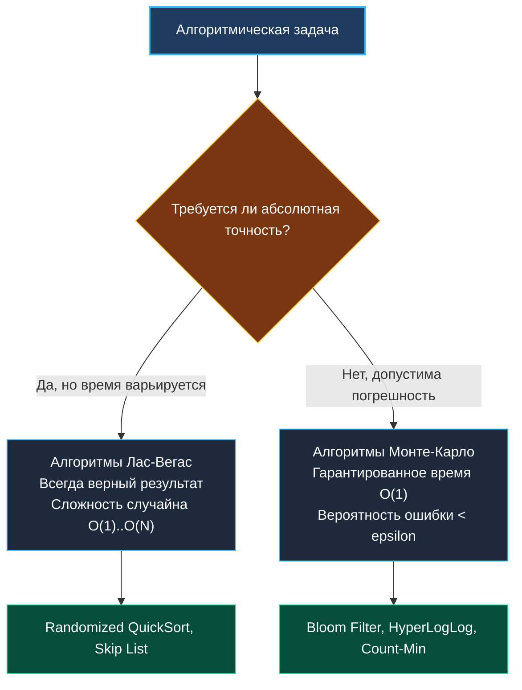

> *«Случайность — слишком важная вещь, чтобы оставлять её на волю случая».*  
> — Брайан Керниган

## Философия рандомизации: детерминизм против вероятности в бэкенде

Рандомизированные алгоритмы — это не «случайный код», а строгий математический инструмент для усреднения худших случаев, распределения нагрузки, защиты от атак и создания эффективных вероятностных структур данных. В бэкенд-разработке они встречаются повсеместно: от `QuickSort` и `Consistent Hashing` до `Bloom Filters`, `Rate Limiting` с jitter и A/B-тестирования. Понимание того, как генераторы псевдослучайных чисел (ГПСЧ) работают под капотом, как они влияют на кэш процессора, системные вызовы ядра Linux и сборщик мусора, отличает инженера, который «вызывает `rand.Int()`», от архитектора, который проектирует предсказуемые высоконагруженные системы.



В этой статье мы разберем, почему рандомизация спасает от worst-case сценариев, как устроены ГПСЧ в Go 1.22+, почему `crypto/rand` на порядки медленнее `math/rand/v2`, как избежать модульного смещения (modulo bias) и какие ловушки ждут на технических собеседованиях.

---

## 1. Источники энтропии: от аппаратного шума до пространства пользователя

Истинная случайность в цифровом компьютере невозможна без внешнего физического источника. В архитектуре операционных систем мы работаем с двумя принципиально разными категориями:

1. **Аппаратная энтропия и криптографические ГСЧ:**  
   Сбор шума терморезисторов, джиттера сетевых прерываний и квантовых флуктуаций контроллеров (`/dev/urandom` в Linux, `getrandom(2)` syscall). В Go за это отвечает пакет `crypto/rand`. Он гарантирует криптографическую стойкость (невозможность предсказать следующее число по предыдущим), но требует переключения контекста в ядро (syscall overhead).
2. **Псевдослучайные генераторы (PRNG):**  
   Детерминированный математический алгоритм, преобразующий короткое начальное состояние (seed) в длинную квазислучайную последовательность. В Go это пакеты `math/rand` и `math/rand/v2`. Работает полностью в пространстве пользователя (User Space), без системных вызовов, удерживая состояние в регистрах процессора и кэше L1.

> [!NOTE]
> **Архитектура PCG в `math/rand/v2` (Go 1.22+):**  
> Начиная с Go 1.22, пакет `math/rand/v2` перешел на алгоритм **PCG** (Permuted Congruential Generator) вместо устаревшего LCG. Состояние PCG занимает всего $16$ байт (два `uint64`). Оно идеально ложится в одну кэш-линию процессора, а генерация нового 64-битного числа сводится к нескольким инструкциям умножения и побитовых сдвигов без единой аллокации в куче.

---

## 2. Модульное смещение (Modulo Bias) и rejection sampling

Классическая ошибка многих программистов: получение случайного числа в диапазоне $[0, N)$ через взятие остатка от деления:
```go
val := rand.Int() % N // ❌ ОШИБКА: Modulo Bias
```
Если диапазон генератора (например, $2^{64}$) не делится нацело на $N$, числа в начале интервала будут выпадать статистически чаще, чем в конце. При больших объемах данных в распределенных системах это приводит к неравномерному шардированию и горячим партициям (Hot Spots).

Go 1.22+ решает это на уровне рантайма через **Rejection Sampling** в функции `rand.IntN(n)`:

```go
// Логика Rejection Sampling без смещения
func IntN(n int) int {
	v := rand.Uint64()
	if n&(n-1) == 0 { // Если n — степень двойки
		return int(v) & (n - 1) // Быстрая битовая маска за 1 такт CPU
	}
	
	// Отбрасываем хвост диапазона, чтобы исключить смещение
	threshold := (1<<64 - 1) - (1<<64-1)%uint64(n)
	for v >= threshold {
		v = rand.Uint64() // Повторная генерация
	}
	return int(v % uint64(n))
}
```

> [!WARNING]
> Вероятность повторной генерации в rejection sampling ничтожно мала (менее $0.0001\%$), поэтому предсказатель ветвлений процессора почти никогда не сбрасывает конвейер (pipeline flush). Никогда не используйте оператор `%` для ограничения диапазона — всегда вызывайте `rand.IntN(n)`.

---

## 3. Потокобезопасность и конкурентность генераторов

Глобальный генератор `math/rand/v2` потокобезопасен (внутри используется атомарный CAS или мьютекс). Однако в горячих путях микросервисов (миллионы RPS) конкуренция за глобальный генератор порождает кэш-контеншн на ядрах CPU.

Для максимальной пропускной способности в высоконагруженных сервисах применяется пул генераторов `sync.Pool`:

```go
package random

import (
	"math/rand/v2"
	"sync"
)

var rngPool = sync.Pool{
	New: func() any {
		// Инициализируем генератор с уникальным сидом из криптографического источника
		return rand.New(rand.NewPCG(rand.Uint64(), rand.Uint64()))
	},
}

func FastIntN(n int) int {
	rng := rngPool.Get().(*rand.Rand)
	res := rng.IntN(n)
	rngPool.Put(rng)
	return res
}
```

---

## 4. Сравнение производительности: `math/rand/v2` vs `crypto/rand`

| Характеристика | `math/rand/v2` (PCG / ChaCha8) | `crypto/rand` |
| :--- | :--- | :--- |
| **Пространство выполнения** | User Space (регистры CPU) | Kernel Space (системный вызов) |
| **Время генерации числа** | **~2–4 наносекунды** | **~200–450 наносекунд** |
| **Системные вызовы** | 0 syscalls | 1 syscall на чтение буфера |
| **Криптографическая стойкость** | **Нет** (детерминированная последовательность) | **Да** (непредсказуемо) |
| **Сфера применения** | Алгоритмы, Shuffle, Jitter, A/B тесты, хэширование | Пароли, токены сессий, ключи шифрования, соли |

> [!INTERVIEW]
> **Вопрос:** Почему категорически запрещено использовать `math/rand` для генерации Session ID или CSRF-токенов?  
> **Ответ:** Псевдослучайные генераторы детерминированы. Злоумышленник, перехватив несколько последовательных токенов, с помощью линейного криптоанализа может полностью восстановить внутреннее состояние генератора (seed) и с вероятностью $100\%$ предсказать токены всех будущих пользователей системы. Для безопасности допустим исключительно `crypto/rand`.

---

## 5. Рандомизация в системном бэкенд-дизайне

1. **Jitter при повторных попытках (Exponential Backoff with Jitter):**  
   Если сервис падает, тысячи клиентов с детерминированным интервалом повтора штурмуют сервер синхронно (Thundering Herd Problem). Добавление случайного разброса:
   $$\text{sleep} = \text{backoff} + \text{rand.IntN}(\text{backoff})$$
   размазывает пики нагрузки по времени и предотвращает каскадные отказы.
2. **Вероятностные фильтры (Bloom Filter & Cuckoo Filter):**  
   Используют $k$ независимых псевдослучайных хеш-функций для проверки принадлежности элемента множеству за константное время при экономии $99\%$ памяти.
3. **Резервуарная выборка (Reservoir Sampling):**  
   Позволяет отобрать $K$ равновероятных элементов из бесконечного потока событий без сохранения потока в памяти.

---

## Резюме

1. Рандомизация переводит алгоритмическую сложность из жесткой зависимости от худших входных данных в плоскость математического ожидания.
2. `math/rand/v2` в Go 1.22+ на базе PCG работает в User Space за единицы наносекунд и не создает давления на GC.
3. Всегда используйте `rand.IntN(n)` вместо оператора остатка от деления `%` для исключения модульного смещения.
4. В конкурентных сетевых сервисах используйте `sync.Pool` для локальных экземпляров `rand.Rand`.

В следующей статье мы разберем практическую реализацию равновероятной выборки из потока неизвестного размера: [[2. Reservoir sampling]].