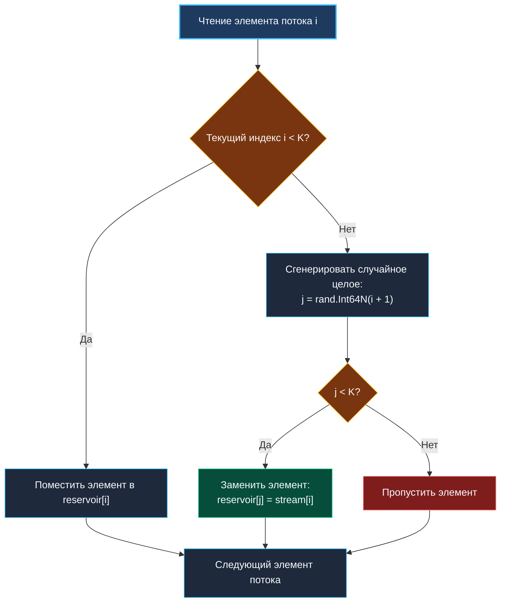

> *«Когда поток бесконечен, а память ограничена, единственный способ быть справедливым — меняться с убывающей вероятностью».*  
> — Брайан Керниган

## Резервуарная выборка (Reservoir Sampling): случайная выборка из бесконечного потока

Задача выбора $K$ случайных элементов из потока данных, размер которого $N$ заранее неизвестен или настолько огромен, что не помещается в оперативную память — одна из фундаментальных проблем потоковой обработки данных. 

**Reservoir Sampling (Алгоритм R)** решает эту задачу с математической безупречностью:
1. За один последовательный проход по потоку.
2. Используя строго фиксированную память $O(K)$.
3. Гарантируя, что в любой момент времени каждый прочитанный элемент присутствует в выборке с точностью $\frac{K}{N}$.



---

## 1. Математическое доказательство равновероятности

Почему этот простой жадный алгоритм гарантирует идеальную равномерность?

Пусть $N$ — общее количество элементов в потоке на данный момент. Докажем по индукции, что любой элемент $X$, встретившийся на шаге $i$ ($1 \le i \le N$), окажется в резервуаре размера $K$ с вероятностью $\frac{K}{N}$.

1. **Вероятность попасть в резервуар на шаге $i$:**  
   По условию алгоритма, элемент попадает в резервуар, если сгенерированное случайное число $j \in [0, i]$ строго меньше $K$:
   $$P(\text{попал на шаге } i) = \frac{K}{i}$$

2. **Вероятность выжить (не быть вытесненным) на последующих шагах:**  
   На каждом следующем шаге $m > i$ новый элемент попадает в резервуар с вероятностью $\frac{K}{m}$ и вытесняет именно наш элемент с вероятностью $\frac{1}{K}$.  
   Следовательно, вероятность быть вытесненным на шаге $m$:
   $$\frac{K}{m} \times \frac{1}{K} = \frac{1}{m}$$
   А вероятность **не быть вытесненным** на шаге $m$:
   $$1 - \frac{1}{m} = \frac{m-1}{m}$$

3. **Итоговая вероятность (телескопическое произведение):**  
   Чтобы элемент остался в резервуаре к моменту $N$, он должен попасть туда на шаге $i$ и выжить на всех шагах от $i+1$ до $N$:
   $$P = \frac{K}{i} \times \left(\frac{i}{i+1}\right) \times \left(\frac{i+1}{i+2}\right) \times \dots \times \left(\frac{N-1}{N}\right)$$
   Все промежуточные числители и знаменатели взаимно сокращаются:
   $$P = \frac{K}{i} \times \frac{i}{N} = \frac{K}{N}$$

Что и требовалось доказать. Равномерность абсолютна и не зависит от порядка элементов.

---

## 2. Идиоматичная реализация на Go

Реализуем обобщенную функцию семплирования из канала или итератора с защитой от переполнения 32-битных счетчиков:

```go
package sampling

import (
	"errors"
	"math/rand/v2"
)

var ErrInvalidK = errors.New("sampling: k must be greater than zero")

// ReservoirSampling выбирает k равновероятных элементов из входного канала.
func ReservoirSampling[T any](stream <-chan T, k int) ([]T, error) {
	if k <= 0 {
		return nil, ErrInvalidK
	}

	reservoir := make([]T, 0, k)
	var count int64 = 0

	for item := range stream {
		count++

		// Шаг 1: Первые k элементов заполняют резервуар целиком
		if len(reservoir) < k {
			reservoir = append(reservoir, item)
			continue
		}

		// Шаг 2: Для каждого последующего элемента генерируем индекс j в [0, count)
		// rand.Int64N исключает модульное смещение
		j := rand.Int64N(count)
		if j < int64(k) {
			reservoir[j] = item
		}
	}

	return reservoir, nil
}
```

---

## 3. Механика памяти и производительности

### Снижение давления на GC
При обработке потока из $10^9$ событий резервуар размера $K = 100$ аллоцируется в куче ровно один раз (`make([]T, 0, k)`). В процессе работы новые элементы перезаписывают существующие слоты среза, не вызывая дополнительных аллокаций памяти (`0 B/op`).

> [!WARNING]
> **Удержание ссылок (Pointer Retention):**  
> Если тип `T` является указателем (`*Event`) или структурой с полями-указателями, перезапись слота `reservoir[j] = item` разрывает ссылку на старый объект, позволяя сборщику мусора утилизировать его. Однако если вы сохраняете ссылки на элементы резервуара во внешних структурах данных, это приведет к незаметной утечке памяти.

### Ветвление процессора (Branch Prediction)
В цикле проверки `if j < int64(k)` вероятность перехода в ветку замены равна $\frac{K}{\text{count}}$. По мере роста `count` эта вероятность стремится к нулю.  
Аппаратный предсказатель ветвлений современных ядер CPU быстро адаптируется к этой ситуации: практически все итерации предсказываются как «ветка не выполняется» (branch not taken), предотвращая сброс конвейера инструкций.

---

## 4. Распределенная резервуарная выборка (MapReduce паттерн)

В распределенных системах (Kafka, Spark, ClickHouse) терабайты логов шардированы по $M$ серверам. Невозможно прогнать все логи через одну горутину.

Решение состоит в двухуровневом сэмплировании:
1. **Этап Map (Локальный):** Каждый узел $m$ обрабатывает свой локальный поток размером $N_m$ и получает локальный резервуар из $K$ элементов.
2. **Этап Reduce (Агрегация):** Центральный координатор собирает $M$ локальных резервуаров вместе с метаданными о количестве обработанных строк $N_m$.
3. Координатор выполняет взвешенную выборку (Weighted Pick), где каждый локальный резервуар имеет вес, пропорциональный $N_m$.

---

## 5. Вопросы для собеседования

> [!INTERVIEW]
> **Вопрос:** Что произойдет, если размер входного потока $N$ окажется меньше, чем запрашиваемый размер резервуара $K$?  
> **Ответ:** Условие `len(reservoir) < k` будет выполняться для каждого входящего элемента. Алгоритм благополучно вернет срез всех $N$ элементов без каких-либо ошибок.

> [!INTERVIEW]
> **Вопрос:** Как модифицировать алгоритм, если элементы потока имеют разные веса (Weighted Reservoir Sampling)?  
> **Ответ:** Классический алгоритм R неприменим. Используется алгоритм Эфраимидиса-Спиракиса (Algorithm A-Res): для каждого входящего элемента вычисляется псевдослучайный ключ $k_i = u_i^{1/w_i}$, где $u_i \sim \text{Uniform}(0, 1)$, а $w_i$ — вес элемента. В резервуаре поддерживаются $K$ элементов с наибольшими ключами с помощью Min-Heap.

---

## Резюме

1. Reservoir Sampling позволяет получить равномерную случайную выборку за один проход по потоку с $O(K)$ памяти.
2. Телескопическое сокращение вероятностей строго доказывает равновероятность попадания каждого элемента.
3. Использование `rand.Int64N(count)` предотвращает как переполнение счетчиков, так и модульное смещение.

В следующей статье мы разберем алгоритм взвешенного выбора с логарифмической сложностью на основе префиксных сумм: [[3. Random Pick with Weight]].