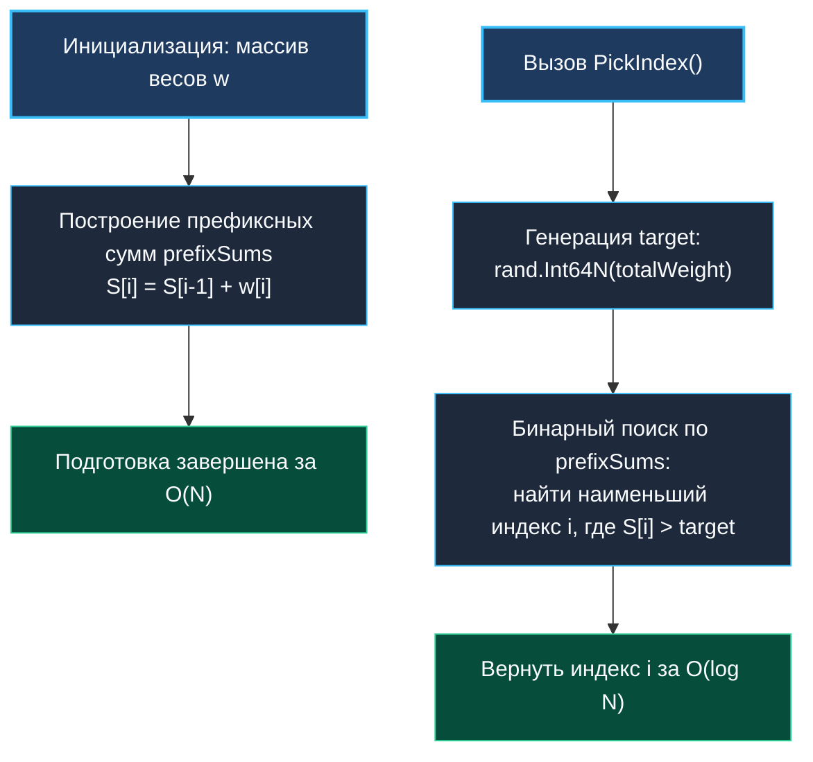

> *«Взвешенный жребий превращает непрерывную вероятность в дискретные отрезки, где поиск ответа — дело чистого логарифма».*  
> — Брайан Керниган

## Взвешенный случайный выбор (Random Pick with Weight): префиксные суммы и бинарный поиск

Задача выбора случайного элемента в соответствии с весовыми коэффициентами (**Random Pick with Weight**, LeetCode 528) — классическая модель дискретного распределения вероятностей. 

В прикладном бэкенде она встречается повсюду:
- Взвешенная балансировка входящего трафика (Weighted Round-Robin / Weighted Random Load Balancing) между серверами разной мощности.
- A/B-тестирование (направление $80\%$ пользователей на стабильную ветку и $20\%$ на экспериментальную).
- Показ контекстной рекламы с оплатой за клик (eCPM biddings).
- Системы генерации дропа в игровых движках.



---

## 1. Алгоритмическая модель: числовая прямая и префиксные суммы

Представим веса как отрезки на числовой оси:
Если даны веса $w = [1, 3, 2]$, то их общая сумма равна $1 + 3 + 2 = 6$.
- Элемент $0$ занимает полуинтервал $[0, 1)$ длины $1$ (вероятность $1/6$).
- Элемент $1$ занимает полуинтервал $[1, 4)$ длины $3$ (вероятность $3/6$).
- Элемент $2$ занимает полуинтервал $[4, 6)$ длины $2$ (вероятность $2/6$).

Массив префиксных сумм:
$$\text{prefixSums} = [1, 4, 6]$$

Сгенерировав случайное число $\text{target} \in [0, 6)$, мы ищем первый индекс $i$, для которого $\text{prefixSums}[i] > \text{target}$.  
Так как массив префиксных сумм строго монотонен по определению (все веса строго положительны), для поиска идеально подходит **бинарный поиск** за $O(\log N)$.

---

## 2. Идиоматичная реализация на Go

Используем стандартный пакет `sort.Search` и генератор `math/rand/v2`:

```go
package weighted

import (
	"errors"
	"math/rand/v2"
	"sort"
)

var ErrEmptyWeights = errors.New("weighted: weights slice cannot be empty")
var ErrInvalidWeight = errors.New("weighted: weight must be strictly positive")

// WeightedPicker реализует быстрый взвешенный выбор на базе префиксных сумм.
type WeightedPicker struct {
	prefixSums []int64
	total      int64
}

// NewWeightedPicker создает и подготавливает структуру для взвешенного выбора.
func NewWeightedPicker(weights []int) (*WeightedPicker, error) {
	if len(weights) == 0 {
		return nil, ErrEmptyWeights
	}

	prefixSums := make([]int64, len(weights))
	var sum int64 = 0

	for i, w := range weights {
		if w <= 0 {
			return nil, ErrInvalidWeight
		}
		sum += int64(w)
		prefixSums[i] = sum
	}

	return &WeightedPicker{
		prefixSums: prefixSums,
		total:      sum,
	}, nil
}

// PickIndex возвращает индекс элемента в соответствии с его весом за O(log N).
func (p *WeightedPicker) PickIndex() int {
	// Генерируем случайное число в полуинтервале [0, total)
	target := rand.Int64N(p.total)

	// sort.Search выполняет бинарный поиск наименьшего индекса, где предикат true
	idx := sort.Search(len(p.prefixSums), func(i int) bool {
		return p.prefixSums[i] > target
	})

	return idx
}
```

---

## 3. Нюансы аппаратного уровня и кэш-памяти

### Предотвращение переполнения типов (Integer Overflow)
В Go базовый тип `int` на 32-битных платформах (или при кросс-компиляции под некоторые архитектуры) занимает 4 байта (до $2 \times 10^9$). При накоплении весов сотен тысяч элементов сумма может молчаливо переполниться, превратившись в отрицательное число, что вызовет фатальные сбои в алгоритме.  
Использование `int64` для поля `prefixSums` и `total` гарантирует поддержку сумм вплоть до $9 \times 10^{18}$, исключая переполнение на любых практических нагрузках.

### Кэш-локальность бинарного поиска
Срез `prefixSums []int64` представляет собой непрерывный блок памяти.  
На 64-битной архитектуре один элемент занимает 8 байт. В стандартную процессорную кэш-линию ($64$ байта) помещается ровно **8 смежных префиксных сумм**.  
На последних шагах бинарного поиска, когда интервал `[left, right]` сужается до нескольких элементов, все они гарантированно находятся в кэше L1 процессора, делая финальные сравнения практически мгновенными ($1$ такт CPU).

> [!NOTE]
> **Альтернатива за $O(1)$: Метод Alias (Vose's Alias Method):**  
> Если в высокочастотном бэкенде (например, в рекламных RTB-аукционах) операция `PickIndex` вызывается миллионы раз в секунду, а веса фиксированы, логарифмическая сложность $O(\log N)$ может стать узким местом.  
> В таких сценариях используют **Vose's Alias Method**: за счет предобработки $O(N)$ формируются две таблицы размера $N$ (`prob` и `alias`), позволяющие делать взвешенный выбор за гарантированное время $O(1)$ без бинарного поиска.

---

## 4. Вопросы для собеседования

> [!INTERVIEW]
> **Вопрос:** Почему в условии предиката используется строгое неравенство `prefixSums[i] > target`, а не нестрогое `>=`?  
> **Ответ:** Мы генерируем число $\text{target} \in [0, \text{total})$. Первый интервал имеет вид $[0, w_0)$, второй — $[w_0, w_0 + w_1)$ и так далее.  
> Если $\text{target} = 0$, то при положительных весах $\text{prefixSums}[0] = w_0 > 0$, условие истинно и возвращается индекс $0$.  
> Если $\text{target} = w_0 - 1$, условие $w_0 > w_0 - 1$ все еще истинно (возвращается индекс $0$).  
> Но для $\text{target} = w_0$ условие $\text{prefixSums}[0] > w_0$ ложно ($w_0 > w_0$ — false), и бинарный поиск корректно переходит к индексу $1$. Строгое неравенство идеально совпадает с полуоткрытыми интервалами.

> [!INTERVIEW]
> **Вопрос:** Требуется ли синхронизация через `sync.Mutex` для метода `PickIndex()` в многопоточной среде?  
> **Ответ:** Нет, структура `WeightedPicker` является неизменяемой (immutable) после вызова `NewWeightedPicker()`. Метод `PickIndex()` производит только операции чтения из среза `prefixSums`. Параллельные вызовы абсолютно безопасны и могут обслуживаться десятками горутин без накладных расходов на блокировки.

---

## Резюме

1. Префиксные суммы трансформируют задачу выбора с неравномерными вероятностями в задачу поиска точки на монотонно возрастающей оси.
2. Бинарный поиск обеспечивает логарифмическую сложность $O(\log N)$ при выборке.
3. Хранение префиксных сумм в `[]int64` предотвращает целочисленное переполнение.
4. Структура неизменяема, что делает вызовы `PickIndex` естественно потокобезопасными без мьютексов.

В следующей статье мы разберем классический алгоритм перемешивания массивов: [[4. Shuffle an Array]].