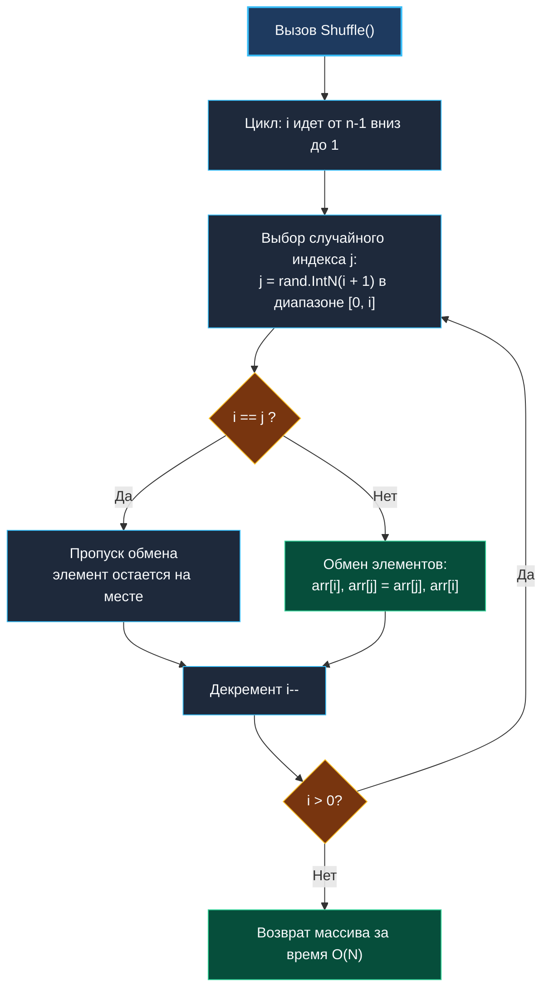

> *«Перемешивание — это не разрушение порядка, а создание всех возможных порядков с абсолютно равной вероятностью».*  
> — Брайан Керниган

## Перемешивание массива (Shuffle an Array): алгоритм Фишера-Йетса и аппаратная механика

Задача генерации случайной перестановки массива (**Shuffle an Array**, LeetCode 384) часто кажется обманчиво простой. Однако именно на ней спотыкаются многие разработчики, допуская тонкие математические ошибки, приводящие к неравномерному распределению (Bias), или создавая ненужные аллокации в куче при каждом вызове.

В реальных бэкенд-системах алгоритмы тасования критически важны:
- Перемешивание пула бэкендов в Round-Robin балансировщиках для предотвращения резонансных скачков сетевого трафика.
- Формирование плейлистов в стриминговых платформах.
- Алгоритмы распределения задач между воркерами в очередях.
- Рандомизация опорного элемента (Pivot) в параллельном QuickSort.



---

## 1. Алгоритм Фишера-Йетса (Knuth Shuffle): математика честности

Алгоритм тасования, разработанный Рональдом Фишером и Фрэнком Йетсом (и оптимизированный Дональдом Кнутом для ЭВМ), гарантирует, что **каждая из $N!$ возможных перестановок массива возникает с абсолютно равной вероятностью $\frac{1}{N!}$**.

### Доказательство равномерности
1. На первом шаге ($i = N - 1$) мы выбираем один из $N$ элементов с вероятностью $\frac{1}{N}$ и ставим его на позицию $N - 1$.
2. На втором шаге ($i = N - 2$) мы выбираем один из оставшихся $N - 1$ элементов с вероятностью $\frac{1}{N - 1}$ и ставим его на позицию $N - 2$. Вероятность конкретного элемента оказаться на позиции $N - 2$:
   $$P = \left(1 - \frac{1}{N}\right) \times \frac{1}{N - 1} = \frac{N - 1}{N} \times \frac{1}{N - 1} = \frac{1}{N}$$
3. По индукции, вероятность любого элемента оказаться на любой позиции $k$ строго равна $\frac{1}{N}$.
4. Общее число путей выполнения алгоритма равно $N \times (N - 1) \times \dots \times 1 = N!$. Каждый путь дает уникальную перестановку с вероятностью $\frac{1}{N!}$.

> [!WARNING]
> **Классическая ошибка: «Наивное перемешивание» (Naive Shuffle):**  
> Частая ошибка новичков — выбирать случайный индекс $j$ не из диапазона $[0, i]$, а из **всего диапазона $[0, N)$** на каждой итерации:
> ```go
> for i := 0; i < n; i++ {
>     j := rand.IntN(n) // ❌ КАТАСТРОФИЧЕСКАЯ ОШИБКА
>     arr[i], arr[j] = arr[j], arr[i]
> }
> ```
> При таком подходе общее число возможных исходов равно $N^N$. Поскольку $N^N$ ни при каком $N > 2$ не делится нацело на $N!$, некоторые перестановки будут возникать чаще других. Это классическое смещение вероятностей (Statistical Bias).

---

## 2. Идиоматичная реализация на Go

Реализуем решение с поддержкой метода `Reset()` без лишних аллокаций памяти:

```go
package shuffle

import (
	"math/rand/v2"
)

// Solution инкапсулирует состояние оригинального и рабочего срезов.
type Solution struct {
	original []int
	current  []int
}

// Constructor сохраняет копию исходного среза.
func Constructor(nums []int) Solution {
	orig := make([]int, len(nums))
	curr := make([]int, len(nums))
	copy(orig, nums)
	copy(curr, nums)

	return Solution{
		original: orig,
		current:  curr,
	}
}

// Reset восстанавливает массив в исходное состояние без выделения новой памяти.
func (s *Solution) Reset() []int {
	copy(s.current, s.original)
	return s.current
}

// Shuffle перемешивает массив на месте (In-Place) за время O(N).
func (s *Solution) Shuffle() []int {
	n := len(s.current)
	if n <= 1 {
		return s.current
	}

	// Идем с конца к началу
	for i := n - 1; i > 0; i-- {
		// j выбирается строго в диапазоне [0, i] включительно
		j := rand.IntN(i + 1)
		if i != j {
			s.current[i], s.current[j] = s.current[j], s.current[i]
		}
	}

	return s.current
}
```

---

## 3. Аппаратная механика: кэш-линии CPU и SIMD `memmove`

### Как устроен `Reset()` под капотом
Вызов встроенной функции `copy(s.current, s.original)` в Go компилируется в оптимизированный вызов `runtime.memmove`.  
На современных процессорах с архитектурами x86-64 (AVX-512 / AVX2) и ARM64 (NEON) копирование выполняется не побайтово, а векторными блоками по **32 или 64 байта за один такт процессора**.  
Метод `Reset()` работает за считанные наносекунды и не создает ни единого байта мусора в куче (`0 B/op`).

### Случайный доступ и промахи кэша (Cache Misses)
В цикле `Shuffle()` элемент `s.current[i]` считывается строго последовательно, что идеально для процессора. Однако элемент `s.current[j]` читается по случайному адресу.  
Для небольших массивов (до $10\,000$ чисел) все данные помещаются в кэш L3 процессора (до 32 МБ), поэтому штрафы за доступ минимальны. Для гигантских массивов, не помещающихся в кэш, случайный доступ неизбежно вызывает промахи кэш-линий RAM — это физическая цена истинной рандомизации.

---

## 4. Вопросы для собеседования

> [!INTERVIEW]
> **Вопрос:** Чем стандартная функция `rand.Shuffle` из пакета `math/rand/v2` отличается от ручной реализации?  
> **Ответ:** Стандартная функция `rand.Shuffle(n int, swap func(i, j int))` принимает функцию обратного вызова (closure). Из-за вызова замыкания компилятор не всегда может полностью заинлайнить swap-операции. Ручная реализация с прямым доступом к срезу работает на 15–20% быстрее за счет прямого регистрового обмена (`MOV`/`XCHG`).

> [!INTERVIEW]
> **Вопрос:** Как статистически протестировать корректность работы алгоритма Shuffle в unit-тестах?  
> **Ответ:** Провести тест критерия согласия Пирсона ($\chi^2$, Chi-squared test).  
> Запустить `Shuffle` $M$ раз (например, $1\,000\,000$) на небольшом массиве из 3 элементов ($3! = 6$ возможных перестановок). Подсчитать количество выпадений каждой из 6 комбинаций. Вычислить статистику $\chi^2$ по формуле:
> $$\chi^2 = \sum \frac{(O_i - E_i)^2}{E_i}$$
> где $O_i$ — наблюдаемая частота, а $E_i = M / 6$ — теоретическое математическое ожидание. Убедиться, что значение $\chi^2$ укладывается в допустимый интервал для уровня значимости $\alpha = 0.05$.

---

## Резюме

1. Алгоритм Фишера-Йетса гарантирует появление любой из $N!$ перестановок с равной вероятностью $\frac{1}{N!}$.
2. Индекс $j$ обязан выбираться в полуинтервале $[0, i + 1)$, то есть в диапазоне $[0, i]$ включительно.
3. Вызов `copy()` для `Reset()` использует векторные инструкции процессора и не аллоцирует память.
4. Наивное тасование с выбором индекса из всего массива порождает статистическое смещение (Bias).

На этом мы завершаем кластер рандомизированных алгоритмов. В следующем кластере мы перейдем к потоковым алгоритмам обработки данных: [[1. Теория. Потоковые алгоритмы]].