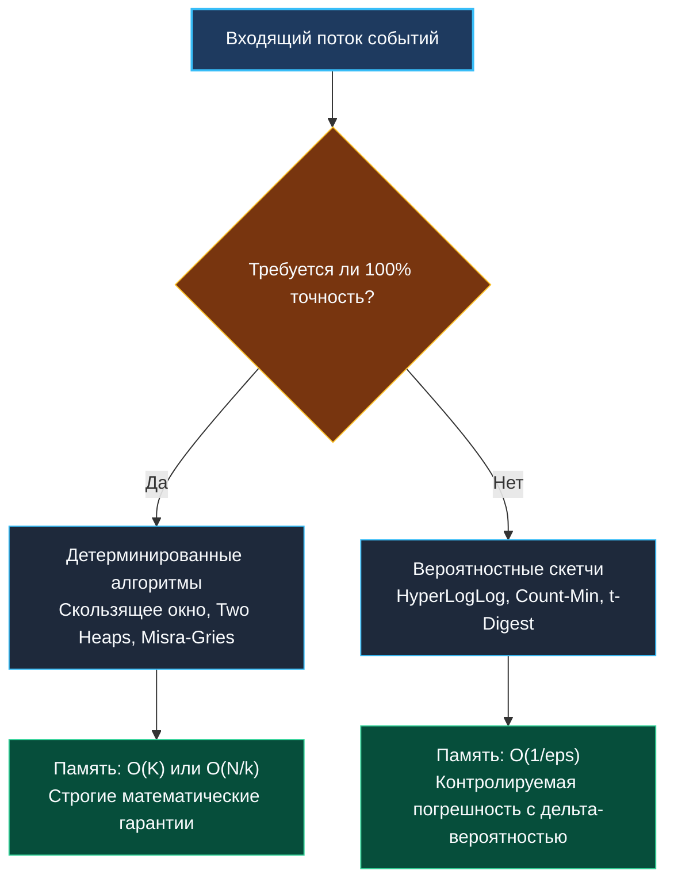

> *«В потоке данных вы не можете позволить себе роскошь оглянуться назад: либо вы поняли суть на лету, либо она потеряна навсегда».*  
> — Брайан Керниган

## Потоковые алгоритмы: обработка бесконечных данных в ограниченной памяти

Потоковые алгоритмы (Streaming Algorithms) предназначены для обработки непрерывных потоков данных, размер которых $N$ заранее неизвестен или настолько колоссален, что данные физически невозможно сохранить на диске или в оперативной памяти.

Ключевые ограничения потоковой модели:
1. **Строго однопроходный режим (One-Pass Processing):** каждый входящий элемент считывается ровно один раз.
2. **Сублинейная память:** расход оперативной памяти ограничен константой $O(1)$ либо логарифмической шкалой $O(\text{polylog}(N))$ или $O(\varepsilon^{-1})$.
3. **Минимальная латентность:** обработка каждого элемента обязана укладываться в единицы или десятки наносекунд.

В современной инфраструктуре потоковые алгоритмы лежат в фундаменте систем мониторинга (Prometheus, VictoriaMetrics), распределенных брокеров (Apache Kafka), брокеров сетевой безопасности (детекция DDoS, L7 rate-limiting) и аналитических СУБД (ClickHouse).



---

## 1. Фундаментальные задачи потоковой обработки

В потоковой обработке выделяют четыре классические задачи:

| Задача | Наивный подход | Потоковое решение | Потребление RAM | Точность |
| :--- | :--- | :--- | :--- | :--- |
| **Cardinality (Уникальные элементы)** | Хеш-таблица всех уникальных ключей (`map[K]struct{}`) | **HyperLogLog (HLL)** | **1.5 КБ** (при ошибке $\approx 1\%$) | Вероятностная ($\pm \varepsilon$) |
| **Heavy Hitters (Частые элементы)** | Счётчик по каждому ключу (`map[K]int`) | **Misra-Gries** / **Count-Min Sketch** | **Несколько килобайт** | Гарантированное превышение порога |
| **Frequency Estimation (Оценка частоты)** | Полный словарь частот | **Count-Min Sketch (CMS)** | Фиксированная матрица $d \times w$ | Никогда не занижает частоту |
| **Quantiles & Percentiles (p50, p95, p99)** | Сохранение и сортировка массива ($O(N \log N)$) | **Two Heaps** (точная медиана) / **t-Digest** / **P²** | $O(K)$ или $O(1)$ | Зависит от алгоритма |

> [!NOTE]
> **Почему вероятностные структуры столь компактны:**  
> Вероятностные структуры данных (Probabilistic Data Structures) отказываются от сохранения самих элементов. Они оперируют исключительно компактными битовыми регистрами, хеш-сигнатурами и интерполяционными кластерами. В результате миллионы входящих событий сворачиваются в пару килобайт оперативной памяти.

---

## 2. Архитектура Go: потоковый ввод-вывод и сборщик мусора

В высоконагруженных сетевых сервисах на Go потоковые алгоритмы упираются не в вычислительную сложность, а в накладные расходы рантайма: системные вызовы и паузы сборщика мусора.

### Буферизация и предотвращение аллокаций
Наивное чтение через `bufio.Scanner` с вызовом `scanner.Text()` выделяет новую строку в куче на каждой строке:

```go
// ❌ ПЛОХО: 1 000 000 аллокаций в секунду вызовет деградацию GC
for scanner.Scan() {
    process(scanner.Text())
}

// ✅ ОТЛИЧНО: Zero-allocation потоковая обработка
for scanner.Scan() {
    lineBytes := scanner.Bytes() // Срез указывает на внутренний буфер scanner
    processBytes(lineBytes)      // Обработка без выделения памяти в куче
}
```

### Итераторы Go 1.23+ (`iter.Seq`)
Начиная с Go 1.23, в язык встроена поддержка стандартных итераторов (`iter.Seq`), позволяющая создавать чистые конвейеры потоковой обработки без накладных расходов каналов (`chansend`/`chanrecv`) и блокировок планировщика:

```go
package stream

import (
	"bufio"
	"io"
	"iter"
)

// ScanLinesSeq возвращает pull-итератор по строкам без создания горутин
func ScanLinesSeq(r io.Reader) iter.Seq[[]byte] {
	return func(yield func([]byte) bool) {
		scanner := bufio.NewScanner(r)
		for scanner.Scan() {
			if !yield(scanner.Bytes()) {
				return
			}
		}
	}
}
```

---

## 3. Backpressure и устойчивость систем

В распределенных потоковых системах критически важен механизм **обратного давления (Backpressure)**.  
Если генератор событий (Kafka, TCP-сокет) поставляет данные со скоростью $200\,000$ сообщений/сек, а процессор способен обработать только $100\,000$, буферы неизбежно переполнятся, вызвав аварийное завершение по OOM (Out Of Memory).

Способы управления давлением потока:
1. **Синхронное торможение (TCP Flow Control):** приостановка чтения из сетевого сокета (`net.Conn`), заставляющая операционную систему заполнить TCP Receive Window и замедлить отправителя.
2. **Буферизованные каналы ограниченной емкости:** блокировка горутины-продюсера при заполнении очереди.
3. **Вероятностное прореживание (Load Shedding):** контролируемый сброс входящих пакетов при превышении порогового SLA очереди.

---

## 4. Вопросы для собеседования

> [!INTERVIEW]
> **Вопрос:** В чем разница между алгоритмами классов Монте-Карло и Лас-Вегас в контексте потоковой обработки?  
> **Ответ:** Алгоритмы **Лас-Вегас** (например, рандомизированный QuickSort или двукучевая медиана) всегда возвращают $100\%$ математически точный результат, но время их работы или объем требуемой памяти являются случайной величиной.  
> Алгоритмы **Монте-Карло** (например, Count-Min Sketch или HyperLogLog) работают за строго фиксированное, детерминированное время и память, но возвращают ответ с вероятностной погрешностью (например, с ошибкой $\varepsilon$ и надежностью $1 - \delta$).

> [!INTERVIEW]
> **Вопрос:** Почему для расчета 99-го перцентиля (p99) времени ответа серверов нельзя просто усреднять перцентили, собранные с разных нод кластера?  
> **Ответ:** Перцентили и медианы не являются аддитивными величинами. Среднее арифметическое от p99 по пяти серверам математически бессмысленно и занижает реальные хвостовые задержки. Для корректной распределенной агрегации квантилей необходимо использовать объединяемые структуры данных (Mergeable Summaries), такие как **t-Digest** или **HdrHistogram**.

---

## Резюме

1. Потоковые алгоритмы решают задачи анализа данных за один последовательный проход в условиях жестких ограничений памяти.
2. Вероятностные скетчи жертвуют абсолютной точностью ради фиксированного расхода оперативной памяти ($O(1)$ или $O(\text{polylog} N)$).
3. В Go потоковая производительность зависит от исключения лишних аллокаций (`scanner.Bytes()`, отсутствие упаковки в интерфейсы) и управления обратным давлением (Backpressure).

В следующей статье мы разберем поиск наиболее частых элементов в потоке с помощью алгоритмов Misra-Gries и Count-Min Sketch: [[2. Heavy hitters]].