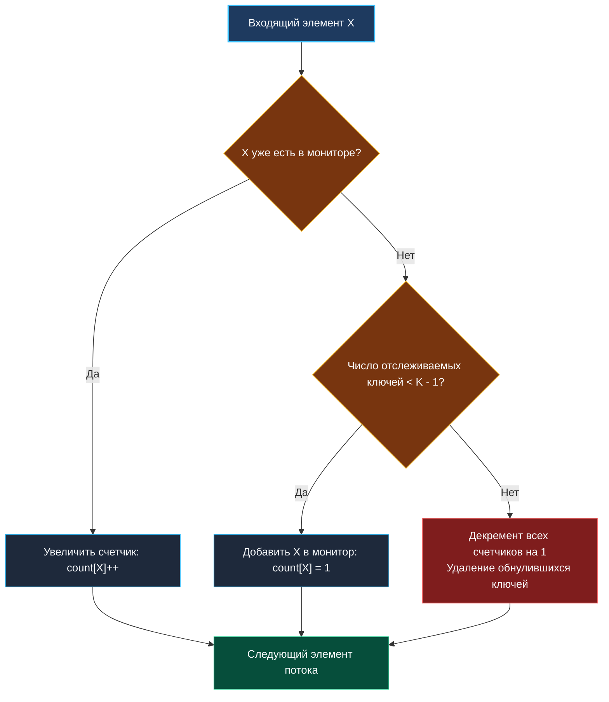
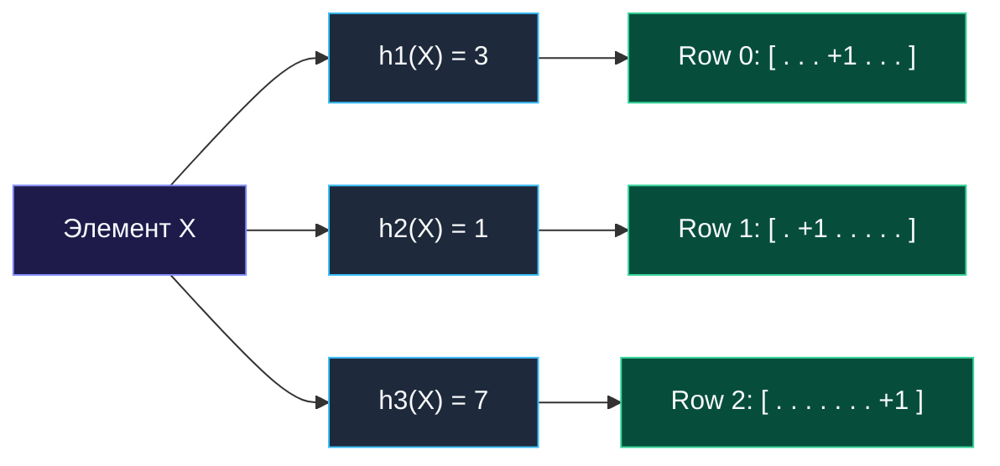

> *«Большинство явлений в распределенных системах подчиняются закону Парето: ничтожная часть ключей порождает львиную долю нагрузки».*  
> — Брайан Керниган

## Поиск частых элементов (Heavy Hitters): от алгоритма Мисры-Гриса до Count-Min Sketch

Задача поиска «тяжеловесов» (**Heavy Hitters**) — фундаментальная проблема потоковой телеметрии и сетевой безопасности.  
Дана последовательность из $N$ событий. Требуется найти все элементы, частота появления которых превышает заданную долю от общего объема потока:
$$\text{freq}(X) > \varphi \times N \quad (0 < \varphi < 1)$$

Примеры в реальной индустрии:
- **Детекция DDoS и брутфорс-атак:** выявление IP-адресов, генерирующих более $1\%$ входящего сетевого трафика.
- **Мониторинг микросервисов:** нахождение эндпоинтов, на которые приходится $80\%$ серверных ошибок HTTP 500.
- **Кэширование:** определение «горячих» ключей для помещения в локальный In-Memory кэш (Hot Keys Detection).

Поскольку $N$ может достигать миллиардов, хранить точную карту `map[string]int` невозможно из-за исчерпания RAM. Мы разберем два краеугольных подхода: детерминированный алгоритм **Мисры-Гриса** и вероятностный скетч **Count-Min Sketch**.



---

## 1. Детерминированный подход: алгоритм Мисры-Гриса (Misra-Gries)

Алгоритм Мисры-Гриса — это элегантное обобщение классического алгоритма большинства Бойера-Мура (Boyer-Moore Majority Vote).  
Чтобы гарантированно найти все элементы, встречающиеся с частотой более $\frac{N}{K}$, алгоритм поддерживает карту максимум из $K - 1$ кандидатов.

### Принцип работы
1. Если входящий элемент $X$ уже присутствует среди кандидатов, его счетчик увеличивается на $1$.
2. Если в карте менее $K - 1$ элементов, $X$ добавляется со счетчиком $1$.
3. Если места нет, **счетчики всех кандидатов уменьшаются на $1$**. Элементы со счетчиком $0$ удаляются из карты.

### Математическая гарантия
Каждый раз, когда выполняется массовый декремент, мы отбрасываем $K$ различных элементов (новый входящий плюс $K - 1$ кандидат из карты).  
Поскольку всего в потоке $N$ элементов, операция массового декремента может произойти максимум $\frac{N}{K}$ раз.  
Следовательно, счетчик любого элемента может быть занижен максимум на $\frac{N}{K}$.  
Если истинная частота элемента $X$ строго больше $\frac{N}{K}$, его финальный счетчик гарантированно останется $> 0$. Ни один тяжеловес не будет пропущен!

```go
package heavyhitters

import (
	"sync"
)

// MisraGries отслеживает элементы с частотой > N/k
type MisraGries struct {
	mu       sync.Mutex
	k        int
	counters map[string]int
}

func NewMisraGries(k int) *MisraGries {
	if k < 2 {
		k = 2
	}
	return &MisraGries{
		k:        k,
		counters: make(map[string]int, k-1),
	}
}

// Process обрабатывает очередной элемент потока
func (mg *MisraGries) Process(item string) {
	mg.mu.Lock()
	defer mg.mu.Unlock()

	// 1. Элемент уже отслеживается
	if count, exists := mg.counters[item]; exists {
		mg.counters[item] = count + 1
		return
	}

	// 2. Есть свободный слот среди k-1 кандидатов
	if len(mg.counters) < mg.k-1 {
		mg.counters[item] = 1
		return
	}

	// 3. Слоты заняты: уменьшаем счетчики всех кандидатов
	for key, count := range mg.counters {
		if count <= 1 {
			delete(mg.counters, key)
		} else {
			mg.counters[key] = count - 1
		}
	}
}

// Candidates возвращает текущих претендентов на статус Heavy Hitters
func (mg *MisraGries) Candidates() map[string]int {
	mg.mu.Lock()
	defer mg.mu.Unlock()

	result := make(map[string]int, len(mg.counters))
	for k, v := range mg.counters {
		result[k] = v
	}
	return result
}
```

---

## 2. Вероятностный подход: Count-Min Sketch

Если требуется оценивать частоту любого произвольного ключа в реальном времени с фиксированным объемом памяти, стандартом индустрии является **Count-Min Sketch (CMS)**.

CMS представляет собой двумерную матрицу счетчиков размера $d \times w$:
- $w = \lceil \frac{e}{\varepsilon} \rceil$ — ширина таблицы (определяет предельную погрешность $\varepsilon$).
- $d = \lceil \ln(\frac{1}{\delta}) \rceil$ — глубина таблицы (определяет вероятность ошибки $\delta$).
- $d$ независимых хеш-функций: $h_1, h_2, \dots, h_d$.



### Свойства Count-Min Sketch:
1. **Никогда не занижает частоту:** из-за коллизий хеш-функций счетчики в ячейках могут только накапливаться. Поэтому:
   $$\text{Estimate}(X) \ge \text{TrueCount}(X)$$
2. **Оценка через минимум:** при запросе частоты элемента $X$ мы вычисляем его ячейки во всех $d$ строках и берем **минимальное** значение:
   $$\text{Estimate}(X) = \min_{1 \le i \le d} \text{Table}[i][h_i(X)]$$
   Взятие минимума отсекает коллизии в остальных строках!

---

## 3. Аппаратная механика и предотвращение False Sharing

В многопоточных бэкенд-серверах десятки горутин параллельно вызывают инкремент счетчиков CMS.  
Если хранить матрицу в виде среза срезов `[][]uint32`:
- Возникает разрыв кэш-локальности (двойной переход по указателям).
- Несколько смежных 32-битных счетчиков попадают в одну и ту же 64-байтную кэш-линию CPU. Когда ядро 1 обновляет счетчик `Table[0][1]`, а ядро 2 обновляет `Table[0][2]`, протокол когерентности кэшей (MESI) принудительно инвалидирует кэш-линию, приводя к эффекту **False Sharing** и падению пропускной способности в 10–15 раз.

Решение:
1. Использование единого плоского одномерного среза `table []uint32` размера $w \times d$.
2. Вычисление индекса ячейки: $\text{idx} = \text{row} \times w + \text{col}$.
3. Атомарный инкремент через `atomic.AddUint32(&table[idx], 1)`.

---

## 4. Вопросы для собеседования

> [!INTERVIEW]
> **Вопрос:** Почему алгоритм Мисры-Гриса требует второго прохода по данным, если требуется подтвердить точный статус Heavy Hitters?  
> **Ответ:** Первый проход Мисры-Гриса отсеивает заведомо редкие элементы и формирует список кандидатов (гарантируя отсутствие False Negatives). Однако из-за специфики декрементов в список кандидатов могут случайно попасть элементы, чья реальная частота ниже порога (возможны False Positives). Второй проход производит точный подсчет частот только среди оставшихся $K - 1$ кандидатов.

> [!INTERVIEW]
> **Вопрос:** Чем алгоритм Space-Saving отличается от классического Мисры-Гриса?  
> **Ответ:** В отличие от Мисры-Гриса, который при отсутствии места вычитает единицу из всех счетчиков и удаляет обнулившиеся, алгоритм Space-Saving находит кандидата с наименьшим текущим счетчиком $\text{minVal}$ и заменяет его на новый элемент, присваивая ему счетчик $\text{minVal} + 1$. Это позволяет избежать дорогостоящего сканирования всей таблицы на каждой итерации.

---

## Резюме

1. Алгоритм Мисры-Гриса гарантированно находит всех тяжеловесов с частотой $> \frac{N}{K}$ при расходе памяти $O(K)$.
2. Count-Min Sketch обеспечивает оценку частоты любого произвольного ключа за $O(d)$ времени без хранения самих ключей.
3. Оценка частоты в CMS никогда не бывает ниже истинной, а взятие минимума по строкам минимизирует влияние коллизий.
4. В конкурентном коде матрицу скетча следует упаковывать в плоский одномерный срез памяти.

В следующей статье мы объединим кучи и скетчи для отслеживания Top-K частых элементов в режиме реального времени: [[3. Top K Frequent Elements stream]].