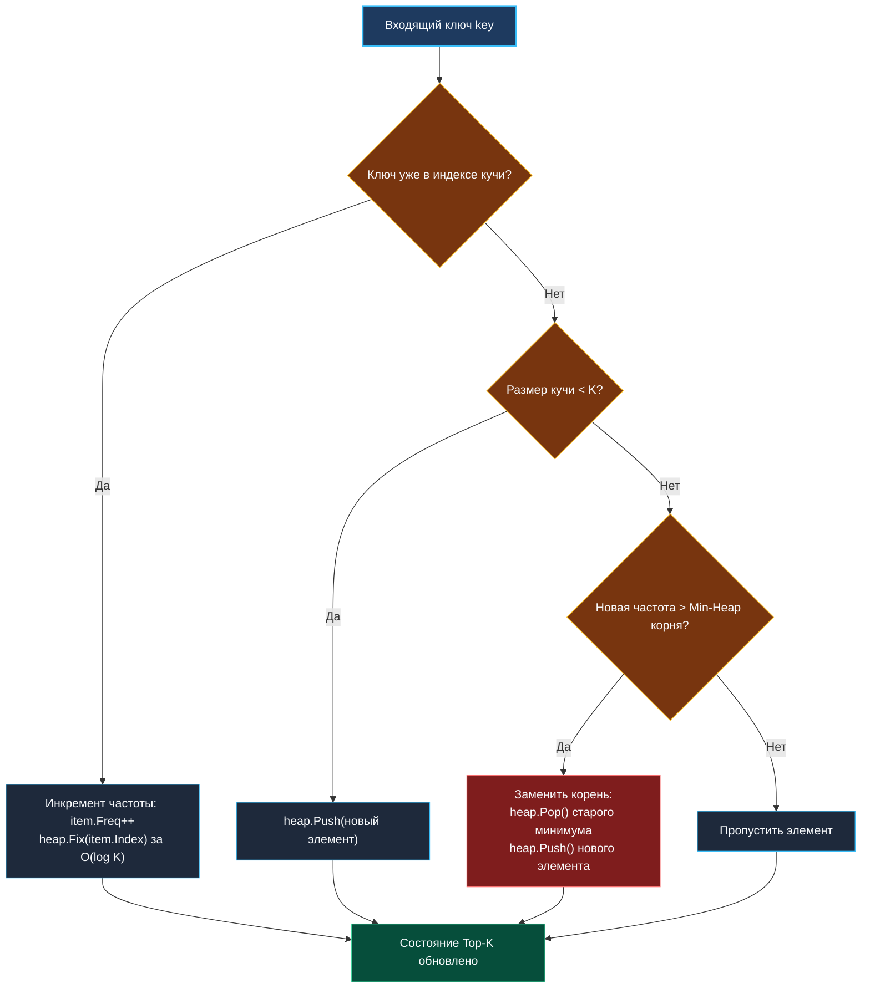

> *«Хранить всё — удел неэффективных программ; мастерство заключается в том, чтобы удерживать лишь верхушку айсберга».*  
> — Брайан Керниган

## Поиск Top-K элементов в потоке: Min-Heap, хеш-индексация и алгоритм Space-Saving

Задача отслеживания $K$ наиболее часто встречающихся элементов в режиме реального времени (**Top-K Frequent Elements in Stream**) — одна из ключевых в архитектуре высоконагруженных бэкенд-систем:
- Расчет трендов поисковых запросов в реальном времени.
- Мониторинг топ-10 самых медленных или часто вызываемых API-ручек.
- Защита от спама и rate-limiting по пользователям с аномальной активностью.

Если для статического массива данных задачу можно решить за $O(N)$ через алгоритм QuickSelect или Bucket Sort, то в бесконечном потоке событий сортировка невозможна в принципе. Требуется алгоритм, поддерживающий онлайн-состояние с фиксированным расходом памяти $O(K)$.



---

## 1. Архитектурная связка: Min-Heap + Хеш-таблица индексов

Чтобы удерживать $K$ максимальных элементов, парадоксальным образом используется **минимальная куча (Min-Heap)** размера $K$:
- В корне кучи всегда находится элемент с **наименьшей** частотой среди текущей элиты Top-$K$.
- Если новый претендент имеет частоту больше, чем корень кучи, корень немедленно вытесняется.
- Для быстрого обновления элементов при повторных вызовах куча связывается с хеш-таблицей: `map[string]*Item`.  
  Каждый объект `Item` хранит свой текущий индекс в куче (`item.index`), что позволяет вызывать `heap.Fix()` за $O(\log K)$ вместо полного перестроения кучи за $O(K)$.

---

## 2. Идиоматичная реализация на Go

```go
package topkstream

import (
	"container/heap"
	"sync"
)

// Item инкапсулирует ключ, частоту и позицию в срезе кучи
type Item struct {
	Key   string
	Freq  int
	Index int // необходим для вызова heap.Fix
}

// minHeap реализует heap.Interface для поиска минимальной частоты
type minHeap []*Item

func (h minHeap) Len() int           { return len(h) }
func (h minHeap) Less(i, j int) bool { return h[i].Freq < h[j].Freq } // Min-Heap
func (h minHeap) Swap(i, j int) {
	h[i], h[j] = h[j], h[i]
	h[i].Index = i
	h[j].Index = j
}
func (h *minHeap) Push(x any) {
	n := len(*h)
	item := x.(*Item)
	item.Index = n
	*h = append(*h, item)
}
func (h *minHeap) Pop() any {
	old := *h
	n := len(old)
	item := old[n-1]
	old[n-1] = nil // зануляем для GC
	item.Index = -1
	*h = old[0 : n-1]
	return item
}

// StreamTracker поддерживает Top-K самых частых элементов в потоке
type StreamTracker struct {
	mu    sync.RWMutex
	k     int
	h     minHeap
	index map[string]*Item
}

func NewStreamTracker(k int) *StreamTracker {
	if k < 1 {
		k = 1
	}
	return &StreamTracker{
		k:     k,
		h:     make(minHeap, 0, k),
		index: make(map[string]*Item, k),
	}
}

// Add регистрирует появление ключа в потоке
func (st *StreamTracker) Add(key string) {
	st.mu.Lock()
	defer st.mu.Unlock()

	// Случай 1: ключ уже находится в Top-K
	if item, exists := st.index[key]; exists {
		item.Freq++
		heap.Fix(&st.h, item.Index)
		return
	}

	// Случай 2: в Top-K еще есть свободные места
	if len(st.h) < st.k {
		newItem := &Item{Key: key, Freq: 1}
		st.index[key] = newItem
		heap.Push(&st.h, newItem)
		return
	}

	// В строгом потоке для новых ключей частота равна 1.
	// Если минимальный элемент в куче имеет частоту >= 1, новый элемент с частотой 1 не может его вытеснить.
	// При интеграции со Space-Saving/Count-Min Sketch здесь запрашивается реальная накопленная частота ключа.
}

// TopK возвращает текущий снимок Top-K элементов
func (st *StreamTracker) TopK() []Item {
	st.mu.RLock()
	defer st.mu.RUnlock()

	result := make([]Item, len(st.h))
	for i, item := range st.h {
		result[i] = *item
	}
	return result
}
```

---

## 3. Двухуровневая архитектура: Space-Saving + Top-K Heap

Если поток данных содержит миллионы уникальных «холодных» ключей с частотой $1$, наивное ведение хеш-таблицы приведет к переполнению оперативной памяти.

В промышленном продакшене применяется **двухуровневый конвейер (Two-Tier Architecture)**:
1. **Первый эшелон (Фильтрация шума):** входящий поток проходит через фильтр **Space-Saving** или матрицу **Count-Min Sketch** фиксированного размера ($10\,000$ ячеек). Все ключи с частотой $1$ затухают или отбрасываются.
2. **Второй эшелон (Top-K элита):** только те ключи, чья оценка частоты в скетче превысила порог корня `minHeap`, допускаются к операции вытеснения в основной куче.

Это сокращает нагрузку на мьютекс и количество вызовов `heap.Fix()` в сотни раз, удерживая общее потребление памяти строго в пределах десятков килобайт.

---

## 4. Вопросы для собеседования

> [!INTERVIEW]
> **Вопрос:** Зачем в структуре `Item` хранится поле `Index` и почему оно обновляется в методе `Swap`?  
> **Ответ:** Метод `heap.Fix(h, index)` выполняет просеивание элемента вверх или вниз за время $O(\log K)$, если его приоритет изменился. Без хранения поля `Index` внутри структуры нам пришлось бы выполнять линейное сканирование массива кучи за $O(K)$, чтобы найти текущую позицию элемента. Обновление `h[i].Index = i` внутри метода `Swap` гарантирует, что индекс всегда актуален при любых внутренних перестановках в куче.

> [!INTERVIEW]
> **Вопрос:** Что произойдет с алгоритмом при резкой смене тренда (например, если старый популярный ключ перестал приходить, а новый набирает популярность)?  
> **Ответ:** Без механизма затухания старые ключи с огромной накопленной частотой будут бесконечно блокировать кучу (Problem of Historical Inertia). Для решения этой проблемы в потоковых системах используют **скользящие окна по времени (Time-decay / Sliding Windows)**: частоты домножаются на коэффициент затухания $\alpha < 1$ (например, каждые 10 секунд), позволяя свежим трендам быстро вытеснять устаревшие рекорды.

---

## Резюме

1. Поиск Top-K в потоке опирается на Min-Heap размера $K$: минимальный элемент находится в корне и служит барьером входа.
2. Хранение поля `Index` в сочетании с `heap.Fix()` ускоряет обновление частоты элемента до $O(\log K)$.
3. Для потоков с огромным разнообразием ключей куча объединяется со скетчем фильтрации (Space-Saving или CMS), отсекающим шум редких событий.

В следующей статье мы разберем расчет текущей медианы потока с помощью балансировки двух куч: [[4. Median from Data Stream]].