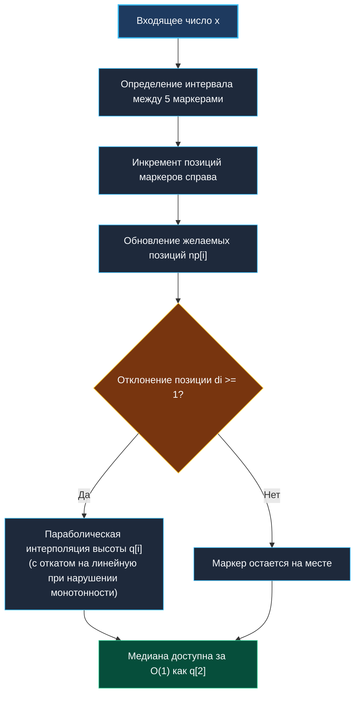

> *«Бесконечность ставит крест на абсолютной точности: когда нельзя объять необъятное, инженерия заменяет равенство приближением».*  
> — Брайан Керниган

## Медиана в бесконечном потоке: алгоритм $P^2$, $O(1)$ память и вероятностная инженерия

Классическое решение задачи поиска медианы через две кучи ([[4. Median from Data Stream]]) требует объема оперативной памяти, строго линейного относительно количества прочитанных элементов: $O(N)$.  
В реальных высоконагруженных бэкенд-системах (обработка сотен миллионов метрик в секунду в системах мониторинга уровня Prometheus или VictoriaMetrics) линейный рост памяти недопустим: процесс неизбежно завершится аварийно по OOM (Out Of Memory).

Для работы с бесконечными потоками применяются **онлайн-алгоритмы аппроксимации квантилей**. Они жертвуют абсолютной математической точностью ради:
1. **Строго константного расхода оперативной памяти:** $O(1)$ или $O(K)$, не зависящего от триллионов входящих чисел.
2. **Константного времени обработки:** $O(1)$ на добавление нового числа.
3. **Контролируемой погрешности:** ошибка аппроксимации обычно не превышает $1–2\%$.

Ключевым алгоритмом с памятью $O(1)$ для вычисления заданного квантиля является алгоритм **$P^2$ (Piecewise-Parabolic Quantile Estimation)**, предложенный Раджем Джайном и Имрихом Хлавачкой.



---

## 1. Математический каркас алгоритма $P^2$

Алгоритм отслеживает распределение потока с помощью всего **пяти маркеров**:
- Маркер $0$: минимум выборки.
- Маркер $1$: нижний квартиль ($p/2$, для медианы — $0.25$).
- Маркер $2$: целевой квантиль ($p$, для медианы — $0.50$).
- Маркер $3$: верхний квартиль ($(1+p)/2$, для медианы — $0.75$).
- Маркер $4$: максимум выборки.

У каждого маркера $i$ есть:
- $q_i$ — текущая высота маркера (значение числа из потока).
- $n_i$ — текущая целочисленная позиция маркера в воображаемом отсортированном ряде.
- $n'_i$ — желаемая (дробная) позиция маркера, которая непрерывно растет при поступлении новых элементов.

Когда разница между желаемой и реальной позицией $n'_i - n_i$ достигает $1$, маркер смещается на одну позицию, а его высота $q_i$ пересчитывается с помощью **кусочно-параболической интерполяции** по трем соседним маркерам. Если парабола нарушает монотонность ряда ($q_{i-1} < q_i < q_{i+1}$), алгоритм автоматически переключается на линейную интерполяцию.

---

## 2. Идиоматичная реализация на Go

Все маркеры упаковываются в фиксированные плоские массивы `[5]float64` прямо в теле структуры. Ноль аллокаций памяти в горячем цикле!

```go
package infinitequantiles

import (
	"errors"
	"math"
	"sync"
)

var ErrInvalidQuantile = errors.New("p2: quantile must be between 0 and 1")

// P2Estimator вычисляет квантиль потока за строго O(1) памяти
type P2Estimator struct {
	mu sync.RWMutex
	p  float64 // целевой квантиль (0.5 для медианы)

	q  [5]float64 // высоты 5 маркеров
	n  [5]int     // фактические позиции
	np [5]float64 // желаемые позиции
	dn [5]float64 // шаг прироста желаемых позиций

	count int
}

func NewP2Estimator(p float64) (*P2Estimator, error) {
	if p <= 0 || p >= 1 {
		return nil, ErrInvalidQuantile
	}

	est := &P2Estimator{
		p: p,
	}

	est.np[0] = 1
	est.np[1] = 1 + 2*p
	est.np[2] = 1 + 4*p
	est.np[3] = 3 + 2*p
	est.np[4] = 5

	est.dn[0] = 0
	est.dn[1] = p / 2
	est.dn[2] = p
	est.dn[3] = (1 + p) / 2
	est.dn[4] = 1

	return est, nil
}

// Add регистрирует новое число в потоке за время O(1)
func (est *P2Estimator) Add(x float64) {
	est.mu.Lock()
	defer est.mu.Unlock()

	est.count++

	// Инициализация первыми 5 числами
	if est.count <= 5 {
		est.q[est.count-1] = x
		if est.count == 5 {
			est.initMarkers()
		}
		return
	}

	// Шаг 1: Определение интервала вставки
	k := 0
	if x < est.q[0] {
		est.q[0] = x
		k = 0
	} else if x < est.q[1] {
		k = 0
	} else if x < est.q[2] {
		k = 1
	} else if x < est.q[3] {
		k = 2
	} else if x < est.q[4] {
		k = 3
	} else {
		est.q[4] = x
		k = 3
	}

	// Шаг 2: Сдвиг фактических позиций
	for i := k + 1; i < 5; i++ {
		est.n[i]++
	}

	// Шаг 3: Обновление желаемых позиций
	for i := 0; i < 5; i++ {
		est.np[i] += est.dn[i]
	}

	// Шаг 4: Коррекция высот маркеров 1, 2, 3
	for i := 1; i <= 3; i++ {
		d := est.np[i] - float64(est.n[i])
		if (d >= 1 && est.n[i+1]-est.n[i] > 1) || (d <= -1 && est.n[i-1]-est.n[i] < -1) {
			step := int(math.Copysign(1, d))
			qNew := est.parabolic(i, step)

			if est.q[i-1] < qNew && qNew < est.q[i+1] {
				est.q[i] = qNew
			} else {
				est.q[i] = est.linear(i, step)
			}
			est.n[i] += step
		}
	}
}

// Median возвращает приближенную медиану за O(1)
func (est *P2Estimator) Median() float64 {
	est.mu.RLock()
	defer est.mu.RUnlock()

	if est.count == 0 {
		return 0
	}
	if est.count <= 5 {
		return est.q[est.count/2]
	}
	return est.q[2] // Маркер 2 всегда хранит квантиль p (медиану)
}

func (est *P2Estimator) initMarkers() {
	// Сортировка первых 5 чисел на месте
	for i := 0; i < 4; i++ {
		for j := 0; j < 4-i; j++ {
			if est.q[j] > est.q[j+1] {
				est.q[j], est.q[j+1] = est.q[j+1], est.q[j]
			}
		}
	}
	est.n = [5]int{1, 2, 3, 4, 5}
}

func (est *P2Estimator) parabolic(i, d int) float64 {
	step := float64(d)
	n0, n1, n2 := float64(est.n[i-1]), float64(est.n[i]), float64(est.n[i+1])
	q0, q1, q2 := est.q[i-1], est.q[i], est.q[i+1]

	return q1 + (step/(n2-n0))*(
		(n1-n0+step)*(q2-q1)/(n2-n1)+
			(n2-n1-step)*(q1-q0)/(n1-n0))
}

func (est *P2Estimator) linear(i, d int) float64 {
	step := float64(d)
	if d > 0 {
		return est.q[i] + step*(est.q[i+1]-est.q[i])/float64(est.n[i+1]-est.n[i])
	}
	return est.q[i] - step*(est.q[i-1]-est.q[i])/float64(est.n[i-1]-est.n[i])
}
```

---

## 3. Сравнение подходов к вычислению квантилей

| Алгоритм | Память | Скорость вставки | Точность медианы | Точность p99 / p99.9 | Мержабельность |
| :--- | :--- | :--- | :--- | :--- | :--- |
| **Two Heaps** | $O(N)$ (утечка в бесконечном потоке) | $O(\log N)$ | **$100\%$ (точная)** | Не применим (только медиана) | Нет |
| **$P^2$ Algorithm** | **$O(1)$ (180 байт)** | **$O(1)$** | **Очень высокая ($\approx 1\%$)** | Средняя | Нет |
| **t-Digest** | $O(K)$ ($\approx 10$ КБ) | $O(\log K)$ | Высокая | **Экстремальная** | **Да (идеален для распределенных систем)** |
| **HdrHistogram** | $O(1)$ ($\approx 100$ КБ) | $O(1)$ | Зависит от бинов | Высокая (в заданном диапазоне) | Да |

---

## 4. Вопросы для собеседования

> [!INTERVIEW]
> **Вопрос:** Почему алгоритм $P^2$ редко используют для агрегации метрик в распределенных кластерах из сотен серверов?  
> **Ответ:** Алгоритм $P^2$ не поддерживает математически корректное **объединение (Merge)** двух независимых структур. Если 10 серверов локально посчитали свои маркеры $P^2$, их нельзя корректно «сложить» на центральном дашборде. Для распределенного сбора метрик стандартом является **t-Digest**, чьи кластеры тривиально объединяются с сохранением точности.

> [!INTERVIEW]
> **Вопрос:** Как алгоритм $P^2$ ведет себя при дрейфе распределения (Concept Drift)?  
> **Ответ:** Поскольку маркеры смещаются строго на одну позицию при каждом отклонении, при резком скачке распределения (например, латентность выросла с 10 мс до 500 мс) $P^2$ потребуется некоторое количество шагов для адаптации. Для ускорения адаптации в продакшене используют коэффициент затухания (Exponential Decay) или скользящие окна.

---

## Резюме

1. В бесконечных потоках данных точные структуры с памятью $O(N)$ неизбежно приводят к исчерпанию RAM.
2. Алгоритм $P^2$ вычисляет медиану с памятью строго $O(1)$ (всего 5 маркеров) за счет параболической интерполяции.
3. Отсутствие динамических аллокаций памяти в $P^2$ полностью исключает нагрузку на Garbage Collector в Go.
4. Для распределенных кластеров с объединением метрик предпочтительнее использовать структуру t-Digest.

На этом мы завершаем кластер потоковых алгоритмов. В следующем кластере мы перейдем к решению сложных алгоритмических задач повышенной трудности (Hard level): [[1. Теория. Подход к сложным задачам]].