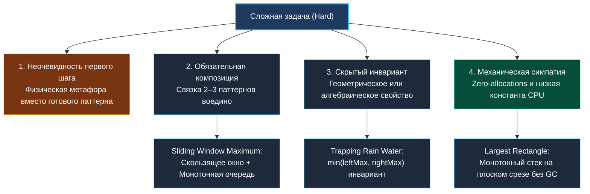
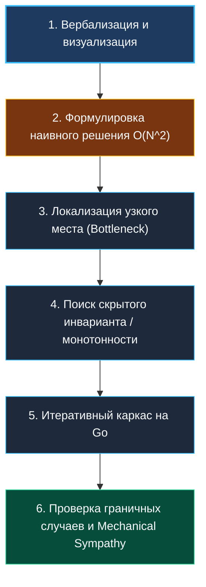

> *«Сложные проблемы почти всегда распадаются на простые, если смотреть на них под правильным углом».*  
> — Брайан Керниган

## Подход к сложным алгоритмическим задачам: методология декомпозиции и поиск скрытых свойств

Вы прошли через фундаментальный базис: массивы, строки, два указателя, скользящее окно, префиксные суммы, деревья, графы, бинарный поиск, кучи и динамическое программирование. Вы научились распознавать паттерны ([[4. Как распознавать паттерн в задаче]]), комбинировать их ([[12. Как комбинировать алгоритмические паттерны]]) и выходить из тупика, когда решение не очевидно ([[13. Когда решение задачи не очевидно]]). 

Но на собеседованиях уровня Senior и Staff инженеры сталкиваются с классом задач **Hard**. В них условие может быть лаконичным, но наивное решение дает неприемлемую сложность $O(N^2)$ или $O(2^N)$, а оптимальное требует двухэтапной композиции нескольких структур, нестандартного инварианта и филигранной работы с памятью.

В этом кластере собраны ключевые задачи этого уровня:
- **Trapping Rain Water** ([[3. Trapping Rain Water]])
- **Merge K Sorted Lists** ([[4. Merge K Sorted Lists]])
- **Largest Rectangle in Histogram** ([[5. Largest Rectangle in Histogram]])
- **Sliding Window Maximum** ([[6. Sliding Window Maximum]])
- **Serialize and Deserialize Binary Tree** ([[7. Serialize and Deserialize Binary Tree]])

В этой статье мы сформируем систематическую методологию штурма сложных задач, которая превращает панику в холодный инженерный анализ.

---

## 1. Анатомия сложности: почему задачи становятся Hard

Сложность задачи обычно складывается из четырех барьеров:

1. **Семантический разрыв:**  
   Условие описывает реальный мир (например, «вода, собирающаяся в рельефе после дождя» или «прямоугольники в гистограмме»), не называя структуры данных. Требуется перевести геометрическую задачу на язык инвариантов массивов.
2. **Многослойность паттернов:**  
   Один паттерн не справляется. Например, `Merge K Sorted Lists` объединяет «слияние упорядоченных списков» с «очередью с приоритетом на куче». Ошибка в согласовании инвариантов одного компонента ломает всю конструкцию.
3. **Скрытое монотонное свойство:**  
   Для достижения амортизированного времени $O(N)$ необходимо обнаружить свойство монотонности (например, в `Largest Rectangle in Histogram` высота столбца ограничена ближайшими меньшими элементами слева и справа). Пока вы не увидели это свойство, алгоритм обречен на квадратичный брутфорс $O(N^2)$.
4. **Требование низкой константы и $O(1)$ памяти:**  
   Решение за $O(N)$ времени с $O(N)$ памяти на LeetCode может пройти, но на Senior-интервью от вас ждут решение за $O(N)$ с константной памятью $O(1)$ (два указателя вместо двух массивов префиксных максимумов).

---

## 2. Системный протокол штурма сложной задачи

Когда на собеседовании вы получаете сложную задачу, следуйте жесткому протоколу:

### Шаг 1: Вербализация и визуализация
Не молчите. Нарисуйте пример от руки (на доске или в онлайн-редакторе ASCII-графикой). Для `Trapping Rain Water` нарисуйте столбцы разной высоты и заштрихуйте воду. Визуализация включает пространственное мышление полушарий мозга, переводя абстрактные индексы в геометрические факты.

### Шаг 2: Наивный базис
Всегда проговорите брутфорс:  
*«Наивное решение — для каждого столбца $i$ найти максимум слева и максимум справа за $O(N)$. Это даст $O(N^2)$. Что здесь является узким местом? Повторный поиск одних и тех же максимумов на каждом шаге».*

### Шаг 3: Декомпозиция и предподсчет
Спросите себя: можно ли устранить повторные вычисления с помощью предподсчета?  
Заведите два среза `leftMax` и `rightMax` за $O(N)$ времени и $O(N)$ памяти. Вы уже поднялись с уровня Junior на уверенный Middle.

### Шаг 4: Сжатие пространства до $O(1)$
Задайте вопрос: *«Обязательно ли мне знать точный максимум с обеих сторон одновременно?»*  
Если левый максимум меньше правого, уровень воды на левом указателе **гарантированно определяется левым максимумом**, независимо от того, какие пики спрятаны между ними! Это наблюдение открывает путь к двум указателям с памятью $O(1)$.

---

## 3. Механическая симпатия Go-разработчика

В задачах уровня Hard выбор структуры данных определяет не только асимптотику Big O, но и наносекундную производительность в рантайме Go:

1. **Плоские срезы вместо указателей:**  
   В `Sliding Window Maximum` монотонная очередь на плоском срезе `[]int` с предвыделенной емкостью $K$ работает в 5–8 раз быстрее, чем `container/list` из стандартной библиотеки, полностью исключая аллокации в куче и разыменование указателей.
2. **Стек на срезе с усечением длины:**  
   В `Largest Rectangle in Histogram` монотонный стек реализуется через обычный срез. Операция `stack = stack[:len(stack)-1]` выполняется за 1 инструкцию процессора, не вызывая деаллокаций памяти.
3. **Отсутствие рекурсии на вырожденных деревьях:**  
   В `Serialize and Deserialize Binary Tree` рекурсивный DFS рискует переполнить стек при глубине вырожденного дерева $10^4$. Итеративный обход или аккуратный посимвольный парсинг срезов строк без вызова `strings.Split` экономит мегабайты памяти.

> [!NOTE]
> **Принцип zero-allocation в строковых задачах:**  
> Использование срезов строк `data[start:end]` не копирует байты базового массива, а лишь создает новый 16-байтный заголовок `StringHeader` в регистрах процессора. Это ключевой трюк для написания парсеров с производительностью в миллионы операций в секунду.

---

## 4. Вопросы для собеседования

> [!INTERVIEW]
> **Вопрос:** Как реагировать, если на собеседовании попалась незнакомая сложная задача, и вы не видите оптимального решения за первые 5 минут?  
> **Ответ:** Сохраняйте спокойствие и прозрачность мышления. Начните писать и тестировать наивное решение за $O(N^2)$ или $O(2^N)$, проговаривая вслух: *«Я начну с рабочего прототипа, чтобы зафиксировать контракт и граничные условия, а затем оптимизирую узкие места»*. Интервьюер оценивает не скорость угадывания заученного трюка, а системность инженерного подхода. Часто в процессе написания наивного алгоритма скрытый инвариант становится очевидным.

> [!INTERVIEW]
> **Вопрос:** В чем разница между асимптотической сложностью $O(N)$ и реальной производительностью на современном «железе»?  
> **Ответ:** Два алгоритма со сложностью $O(N)$ могут различаться по скорости в 10–20 раз. Алгоритм, выполняющий последовательный обход непрерывного среза в памяти (L1/L2 Cache Hits, эффективный Prefetcher), будет на порядок быстрее алгоритма, обходящего связный список или дерево на указателях (Pointer Chasing, постоянные Cache Misses в RAM).

---

## Резюме

1. Сложные задачи отличаются необходимостью многоуровневой декомпозиции и поиска неочевидного геометрического или алгебраического инварианта.
2. Всегда начинайте с вербализации наивного решения — оно служит отправной точкой для оптимизации.
3. В Go максимальная производительность достигается за счет плоских срезов, исключения интерфейсного боксинга и минимизации давления на GC.

В следующей статье мы разберем коллекцию нестандартных приемов и математических инсайтов: [[2. Нестандартные решения]].