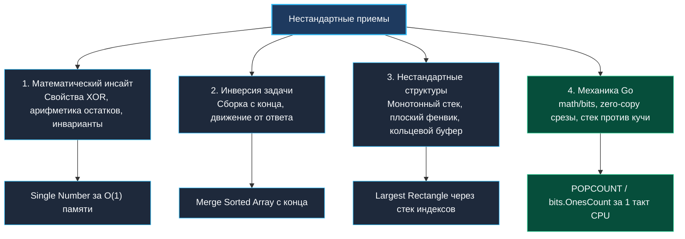

> *«Нестандартное решение — это не нарушение правил, а открытие правил более глубокого уровня».*  
> — Брайан Керниган

## Нестандартные алгоритмические решения: математические инсайты, инверсия и трюки рантайма Go

Стандартные алгоритмические шаблоны (Два указателя, Скользящее окно, BFS/DFS, Бинарный поиск) покрывают подавляющее большинство задач уровня Easy и Medium. Однако в задачах категории Hard механическое прикладывание шаблонов часто приводит либо к комбинаторному взрыву $O(2^N)$, либо к тяжеловесным конструкциям, требующим сотни строк кода.

**Нестандартное решение** — это инженерный прорыв, позволяющий обойти лобовую сложность за счет:
1. Алгебраического или теоретико-числового свойства задачи.
2. Инверсии направления мысли (от ответа к началу, разрушение вместо построения).
3. Использования низкоуровневых аппаратных инструкций процессора и особенностей рантайма Go.



---

## 1. Категория 1: Математический инсайт (Формула вместо перебора)

Часто сложнейшая переборная задача мгновенно схлопывается в константную формулу при взгляде через призму алгебры или дискретной математики.

### Свойства побитового XOR ($\oplus$)
Операция XOR обладает фундаментальными свойствами:
1. $x \oplus x = 0$ (самоуничтожение одинаковых битов).
2. $x \oplus 0 = x$ (нейтральный элемент).
3. Коммутативность и ассоциативность ($a \oplus b \oplus c = c \oplus a \oplus b$).

**Пример (LeetCode 136. Single Number):** Найти единственный уникальный элемент в массиве, где все остальные повторяются дважды.  
Вместо хеш-таблицы с памятью $O(N)$ мы применяем последовательный XOR всех элементов за $O(1)$ памяти:

```go
func singleNumber(nums []int) int {
	res := 0
	for _, v := range nums {
		res ^= v
	}
	return res
}
```

Все парные дубликаты взаимоуничтожаются в $0$, оставляя единственное уникальное число в регистре процессора.

---

## 2. Категория 2: Инверсия задачи (Движение от ответа к входу)

Когда прямое моделирование процесса вызывает необходимость постоянных сдвигов массива за $O(N)$, инвертирование направления обработки снижает сложность до строгого $O(1)$ дополнительной памяти.

### Слияние с конца (Merge Sorted Array, LeetCode 88)
Даны два отсортированных массива, первый имеет запас памяти в конце.  
Если сливать элементы с начала, каждый перенос потребует сдвига элементов вправо ($O(N^2)$).  
**Инверсия:** начинаем заполнять массив **с самого конца**, сравнивая максимальные элементы обоих массивов:

```go
func merge(nums1 []int, m int, nums2 []int, n int) {
	p1 := m - 1
	p2 := n - 1
	p := m + n - 1

	for p1 >= 0 && p2 >= 0 {
		if nums1[p1] > nums2[p2] {
			nums1[p] = nums1[p1]
			p1--
		} else {
			nums1[p] = nums2[p2]
			p2--
		}
		p--
	}

	// Копируем остаток nums2, если он остался
	for p2 >= 0 {
		nums1[p] = nums2[p2]
		p2--
		p--
	}
}
```

Ни один еще не прочитанный элемент `nums1` не будет перезаписан, так как свободного места в конце всегда строго достаточно!

---

## 3. Категория 3: Низкоуровневые возможности Go

Go предоставляет уникальный баланс высокой выразительности и прямого контроля над аппаратурой.

### Пакет `math/bits` и аппаратные инструкции
Подсчет установленных битов (`POPCOUNT`) или поиск лидирующих нулей (`CLZ`) в ручном цикле требует десятков инструкций и ветвлений.  
Функции `math/bits.OnesCount64`, `math/bits.LeadingZeros64` компилятор Go заменяет **одной аппаратной машинной инструкцией** процессора (`POPCNT`, `LZCNT` на x86-64):

```go
import "math/bits"

// Выполняется за ровно 1 такт CPU без сбросов конвейера
count := bits.OnesCount64(mask)
```

### Zero-Copy преобразования срезов
При парсинге больших объемов данных вызов `string(b)` выделяет новую память в куче и копирует байты.  
В Go 1.20+ доступен пакет `unsafe` с функциями `unsafe.String` и `unsafe.Slice`, позволяющими конструировать строковые заголовки над существующими буферами без единой аллокации:

```go
import "unsafe"

// Zero-copy создание строки над байтовым буфером
func BytesToString(b []byte) string {
	if len(b) == 0 {
		return ""
	}
	return unsafe.String(&b[0], len(b))
}
```

> [!WARNING]
> Используйте `unsafe` на собеседованиях только с явным комментарием о контракте иммутабельности: базовый массив байтов не должен изменяться во время жизни полученной строки.

---

## 4. Вопросы для собеседования

> [!INTERVIEW]
> **Вопрос:** Как найти дубликат в массиве чисел от $1$ до $N$ размера $N+1$ за время $O(N)$ и память $O(1)$, если массив запрещено модифицировать?  
> **Ответ:** Применить **алгоритм черепахи и зайца Флойда (Floyd's Tortoise and Hare)** для поиска цикла.  
> Поскольку каждое число лежит в диапазоне $[1, N]$, массив можно интерпретировать как функцию перехода в связном списке: `next = nums[curr]`. Наличие дубликата означает, что в один узел ведут две стрелки, то есть в графе гарантированно существует цикл. Медленный и быстрый указатели найдут точку входа в цикл (дубликат) за $O(N)$ времени без выделения памяти.

> [!INTERVIEW]
> **Вопрос:** Как реализовать хранение множества чисел из диапазона $[0, 63]$ с максимальной скоростью проверки наличия и минимальной памятью?  
> **Ответ:** Использовать битовую маску `uint64`. Добавление элемента: `mask |= (1 << x)`. Проверка наличия: `(mask & (1 << x)) != 0`. Память: ровно 8 байт. Все операции выполняются в регистрах процессора за 1 такт CPU.

---

## Резюме

1. Нестандартные решения рождаются из понимания скрытых алгебраических свойств (XOR, битовые маски, теория графов).
2. Инверсия порядка обхода (например, слияние с конца) позволяет преобразовать $O(N^2)$ алгоритм в $O(N)$ in-place решение.
3. Пакет `math/bits` использует аппаратные инструкции процессора для битовой арифметики с нулевыми накладными расходами.

Теперь мы переходим к подробному разбору сложнейших задач, начиная с классики: [[3. Trapping Rain Water]].