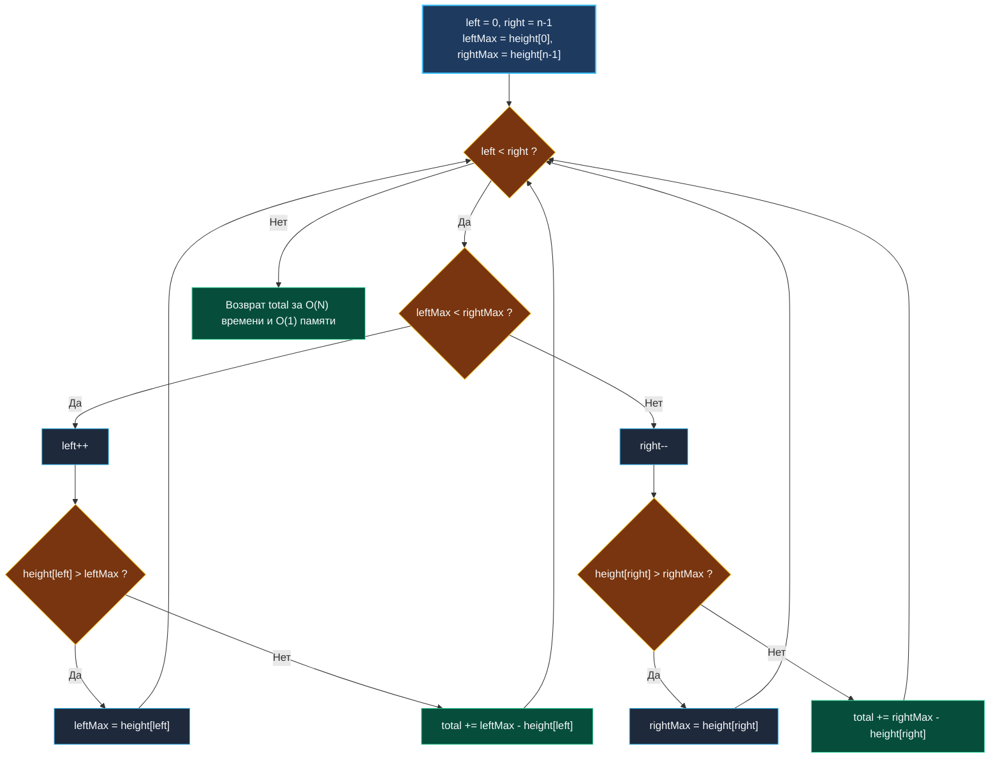

> *«Простота — это не просто отсутствие сложности, это способность увидеть суть за нагромождением деталей».*  
> — Брайан Керниган

## Удержание дождевой воды (Trapping Rain Water): геометрический инвариант и два указателя

Задача **Trapping Rain Water** (LeetCode 42) — золотой стандарт сложного алгоритмического собеседования.  
Дан массив неотрицательных целых чисел `height`, представляющий профиль рельефа гистограммы, где ширина каждого столбика равна $1$. Требуется вычислить, сколько единиц воды задержится в ложбинах после дождя.

```
       [ ]
 [ ]~~~[ ][ ]~[ ]
_[ ][ ][ ][ ][ ][ ]_
```

На первый взгляд задача кажется сложным двумерным моделированием физики жидкости. Однако за физической метафорой скрывается строгий локальный инвариант: **уровень воды над столбцом $i$ определяется исключительно минимумом из наивысших барьеров слева и справа от него**:
$$\text{water}[i] = \max\Big(0, \; \min\big(\max_{j \le i} h[j], \; \max_{k \ge i} h[k]\big) - h[i]\Big)$$



---

## 1. Эволюция решений: от $O(N^2)$ к двум указателям за $O(1)$ памяти

### Подход 1: Наивный брутфорс ($O(N^2)$ времени, $O(1)$ памяти)
Для каждого столбца $i$ запускаем два вложенных цикла: один ищет максимум слева, второй — максимум справа.  
При $N = 20\,000$ это дает $4 \times 10^8$ операций — гарантированный вердикт **Time Limit Exceeded**.

### Подход 2: Динамическое программирование / Преподсчет ($O(N)$ времени, $O(N)$ памяти)
Создаем два массива: `leftMax` (префиксные максимумы) и `rightMax` (суффиксные максимумы).  
За два линейных прохода заполняем их, а на третьем суммируем воду.  
- **Плюс:** линейное время $O(N)$.
- **Минус:** выделение памяти под два среза по $N$ элементов (для $N = 10^5$ это $1.6$ МБ аллокаций в куче).

### Подход 3: Два указателя ($O(N)$ времени, $O(1)$ памяти)
Зададимся вопросом: *«Обязательно ли нам знать оба точных максимума одновременно?»*  
Ответ: **нет!** Достаточно знать, какая из сторон в данный момент ниже.  
Если `leftMax < rightMax`, то для текущего левого указателя правая граница гарантированно не ниже `rightMax` (а значит, строго выше `leftMax`). Уровень воды над левым столбцом лимитируется именно `leftMax`.  
Симметричное рассуждение работает для правого указателя.

---

## 2. Идиоматичная реализация на Go

```go
package trappingwater

// Trap вычисляет суммарный объем удержанной воды за O(N) времени и O(1) памяти
func Trap(height []int) int {
	n := len(height)
	if n <= 2 {
		return 0 // Для удержания воды требуется минимум 3 столбца
	}

	left := 0
	right := n - 1
	leftMax := height[left]
	rightMax := height[right]
	totalWater := 0

	for left < right {
		if leftMax < rightMax {
			left++
			if height[left] > leftMax {
				leftMax = height[left]
			} else {
				totalWater += leftMax - height[left]
			}
		} else {
			right--
			if height[right] > rightMax {
				rightMax = height[right]
			} else {
				totalWater += rightMax - height[right]
			}
		}
	}

	return totalWater
}
```

---

## 3. Аппаратная механика и кэш-память процессора

1. **Zero-Allocation на стеке:**  
   Функция использует ровно пять целочисленных переменных (`left`, `right`, `leftMax`, `rightMax`, `totalWater`). Все они аллоцируются в регистрах процессора (General Purpose Registers: `RAX`, `RBX`, `RCX`, `RDX`, `RSI`). Сборщик мусора Go не производит ни единой операции.
2. **Аппаратный Prefetcher памяти:**  
   Указатели `left` и `right` двигаются навстречу друг другу. Контроллер памяти CPU легко распознает два линейных потока чтения из массива `height`, заранее подгружая кэш-линии L1/L2 до того, как инструкция сравнения будет выполнена.
3. **Предсказание ветвлений (Branch Prediction):**  
   Внутри цикла выполняются ветвления `if leftMax < rightMax`. В реальных рельефах условия имеют высокую локальную стабильность (указатель долго двигается в одном направлении к наивысшему пику), поэтому штрафы за сброс процессорного конвейера (Pipeline Flush) минимальны.

---

## 4. Вопросы для собеседования

> [!INTERVIEW]
> **Вопрос:** Можно ли решить эту задачу с помощью монотонного стека?  
> **Ответ:** Да. Монотонно убывающий стек позволяет вычислять воду горизонтальными слоями (по слоям между текущим столбцом и предыдущими барьерами). Это решение также имеет сложность $O(N)$, но требует $O(N)$ памяти под стек индексов. Решение с двумя указателями считается эталонным, так как оно требует строго $O(1)$ памяти.

> [!INTERVIEW]
> **Вопрос:** Почему мы сначала сдвигаем указатель (`left++`), а затем обновляем максимум и считаем воду?  
> **Ответ:** Крайние столбцы (индексы $0$ и $n-1$) физически не могут удерживать воду сверху (вода стечет за границы массива). Они служат исключительно опорными стенками. Поэтому при сдвиге указателя мы переходим к столбцу, над которым потенциально может стоять столб воды, ограниченный предыдущим максимумом.

---

## Резюме

1. Уровень воды над столбцом зависит исключительно от $\min(\text{leftMax}, \text{rightMax})$.
2. Техника двух указателей позволяет отслеживать лимитирующую сторону без предподсчета массивов, сокращая память с $O(N)$ до $O(1)$.
3. Алгоритм выполняется за один проход ($O(N)$ времени) и работает исключительно в регистрах CPU без аллокаций.

В следующей статье мы применим приоритетные очереди и кучи для слияния $K$ отсортированных списков: [[4. Merge K Sorted Lists]].