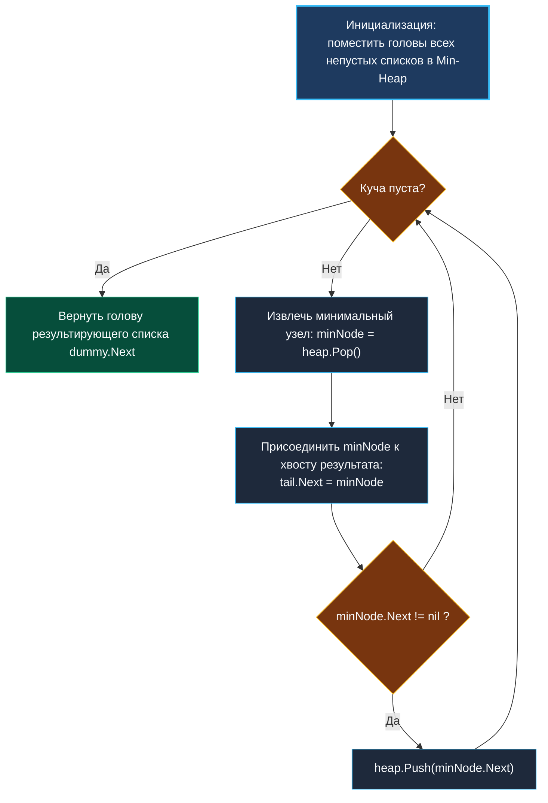

> *«Разделяй и властвуй — это не просто военная тактика, это единственный способ победить комбинаторный взрыв».*  
> — Брайан Керниган

## Слияние K отсортированных списков (Merge K Sorted Lists): приоритетные очереди и Divide & Conquer

Задача **Merge K Sorted Lists** (LeetCode 23) — эталонная проверка навыков работы со связными списками и приоритетными очередями.  
Дан массив из $K$ односвязных списков, каждый из которых уже упорядочен по возрастанию. Требуется объединить их в один общий отсортированный связный список.

Пусть $N$ — общее число узлов во всех $K$ списках.  
- Наивное последовательное слияние (список $1$ со списком $2$, затем результат со списком $3$ и т.д.) дает худшую сложность $O(K \times N)$ — каждый узел участвует в сравнениях до $K$ раз.
- Оптимальные алгоритмы снижают время до $O(N \log K)$.



---

## 1. Стратегия 1: Приоритетная очередь (Min-Heap)

Мы заводим минимальную кучу емкостью $K$, в которую помещаем головы всех доступных списков.
1. Извлекаем из кучи глобально минимальный узел за $O(\log K)$ и прикрепляем его к результирующему списку.
2. Если у извлеченного узла есть следующий элемент (`minNode.Next != nil`), помещаем его в кучу за $O(\log K)$.
3. Повторяем, пока куча не опустеет.

Итоговое время: ровно $N$ извлечений и $N$ вставок в кучу размера $K$ — сложность строго $O(N \log K)$.  
Память: $O(K)$ для хранения указателей в срезе кучи.

```go
package mergek

import (
	"container/heap"
)

// ListNode представляет узел односвязного списка
type ListNode struct {
	Val  int
	Next *ListNode
}

// nodeHeap реализует интерфейс heap.Interface для среза указателей
type nodeHeap []*ListNode

func (h nodeHeap) Len() int           { return len(h) }
func (h nodeHeap) Less(i, j int) bool { return h[i].Val < h[j].Val } // Min-Heap
func (h nodeHeap) Swap(i, j int)      { h[i], h[j] = h[j], h[i] }

func (h *nodeHeap) Push(x any) {
	*h = append(*h, x.(*ListNode))
}

func (h *nodeHeap) Pop() any {
	old := *h
	n := len(old)
	x := old[n-1]
	*h = old[0 : n-1]
	return x
}

// MergeKLists объединяет K отсортированных списков через Min-Heap
func MergeKLists(lists []*ListNode) *ListNode {
	if len(lists) == 0 {
		return nil
	}

	h := make(nodeHeap, 0, len(lists))
	for _, head := range lists {
		if head != nil {
			h = append(h, head)
		}
	}
	heap.Init(&h)

	dummy := &ListNode{}
	tail := dummy

	for h.Len() > 0 {
		smallest := heap.Pop(&h).(*ListNode)
		tail.Next = smallest
		tail = tail.Next

		if smallest.Next != nil {
			heap.Push(&h, smallest.Next)
		}
	}

	return dummy.Next
}
```

---

## 2. Стратегия 2: Попарное слияние (Divide & Conquer)

Вместо использования кучи можно объединять списки парами по принципу турнирной сетки:
- На первом раунде сливаем: `lists[0]` с `lists[1]`, `lists[2]` с `lists[3]` и т.д. Число списков уменьшается вдвое: $K \to \lceil K/2 \rceil$.
- Повторяем раунды слияния до тех пор, пока не останется ровно один объединенный список.

Число уровней дерева слияния равно $\lceil \log_2 K \rceil$.  
На каждом уровне каждый из $N$ узлов участвует в слиянии ровно один раз.  
Сложность по времени: $O(N \log K)$.  
Память: $O(1)$ при итеративной реализации (без рекурсивного стека).

```go
func MergeKListsDivideConquer(lists []*ListNode) *ListNode {
	k := len(lists)
	if k == 0 {
		return nil
	}

	interval := 1
	for interval < k {
		for i := 0; i+interval < k; i += interval * 2 {
			lists[i] = mergeTwoLists(lists[i], lists[i+interval])
		}
		interval *= 2
	}

	return lists[0]
}

func mergeTwoLists(l1, l2 *ListNode) *ListNode {
	dummy := &ListNode{}
	tail := dummy

	for l1 != nil && l2 != nil {
		if l1.Val <= l2.Val {
			tail.Next = l1
			l1 = l1.Next
		} else {
			tail.Next = l2
			l2 = l2.Next
		}
		tail = tail.Next
	}

	if l1 != nil {
		tail.Next = l1
	} else {
		tail.Next = l2
	}

	return dummy.Next
}
```

---

## 3. Сравнение подходов на практике

| Параметр | Min-Heap подход | Divide & Conquer подход |
| :--- | :--- | :--- |
| **Время выполнения** | $O(N \log K)$ | $O(N \log K)$ |
| **Дополнительная память** | $O(K)$ для среза кучи | **$O(1)$** (чистый in-place указателей) |
| **Потоковая обработка** | **Идеален для стримов** (новые элементы добавляются на лету) | Требует наличия всех списков заранее |
| **Сложность кода** | Требует реализации `heap.Interface` | Простой цикл слияния двух списков |

---

## 4. Вопросы для собеседования

> [!INTERVIEW]
> **Вопрос:** Зачем мы используем фиктивный узел `dummy := &ListNode{}`?  
> **Ответ:** Фиктивный узел (Sentinel / Dummy Head) исключает проверку граничного условия `if head == nil` на первой итерации цикла. Указатель `tail` всегда указывает на валидную структуру памяти, а результирующая голова списка возвращается через `dummy.Next`.

> [!INTERVIEW]
> **Вопрос:** Почему создание нового узла через `new(ListNode)` внутри цикла слияния считается ошибкой?  
> **Ответ:** Алгоритм обязан переиспользовать уже существующие узлы входных списков, лишь переставляя их поля `Next` (in-place rearrangement). Создание новых объектов в куче привело бы к $N$ ненужным аллокациям памяти и вызвало тяжелую работу сборщика мусора Go.

---

## Резюме

1. Наивное последовательное слияние неэффективно и дает сложность $O(K \times N)$.
2. Алгоритмы на базе Min-Heap и Divide & Conquer сокращают время до строгого $O(N \log K)$.
3. Min-Heap является стандартом для потокового онлайн-слияния, а Divide & Conquer обеспечивает наименьший расход памяти $O(1)$.

В следующей статье мы перейдем к монотонному стеку и задаче поиска максимального прямоугольника в гистограмме: [[5. Largest Rectangle in Histogram]].