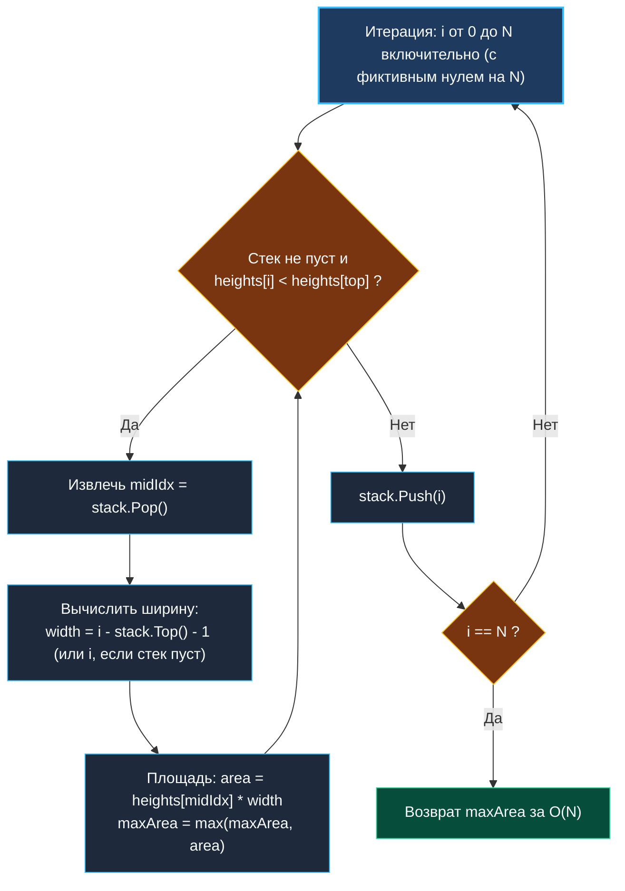

> *«Инвариант в алгоритме подобен закону сохранения в физике: пока он соблюдается, система предсказуема».*  
> — Брайан Керниган

## Наибольший прямоугольник в гистограмме (Largest Rectangle in Histogram): монотонный стек и поиск границ

Задача о наибольшем прямоугольнике в гистограмме (**Largest Rectangle in Histogram**, LeetCode 84) — вершина применения концепции **монотонного стека (Monotonic Stack)**.  
Дан массив целых неотрицательных чисел `heights`, представляющий высоты смежных столбцов гистограммы одинаковой ширины $1$. Требуется найти максимальную площадь непрерывного прямоугольника, который можно вписать в данную фигуру.

Наивный перебор всех возможных пар границ требует $O(N^2)$ времени. Использование монотонного стека сокращает время поиска до строгого **линейного времени $O(N)$**.



---

## 1. Фундаментальный принцип: ограничение по наименьшему столбцу

Любой прямоугольник в гистограмме полностью определяется своим **самым низким (лимитирующим) столбцом**:
- Пусть $h = \text{heights}[i]$ — высота некоторого столбца.
- Этот столбец может быть распространен влево до первого столбца, чья высота **строго меньше** $h$.
- Этот столбец может быть распространен вправо до первого столбца, чья высота **строго меньше** $h$.

Таким образом, задача сводится к классической формулировке: **для каждого элемента найти ближайший меньший элемент слева и ближайший меньший элемент справа**.  
Эту задачу монотонный стек решает ровно за один проход по массиву.

---

## 2. Инвариант монотонного стека

Стек хранит **индексы** столбцов.  
Высоты столбцов по индексам в стеке образуют **строго монотонно возрастающую последовательность**:
$$\text{heights}[\text{stack}[0]] < \text{heights}[\text{stack}[1]] < \dots < \text{heights}[\text{stack}[\text{top}]]$$

### Механика выталкивания
Когда мы рассматриваем текущий столбец $i$ и видим, что $\text{heights}[i] < \text{heights}[\text{top}]$:
1. Текущий индекс $i$ является **правой границей** для столбца на вершине стека (`top`). Правее индекса $i$ прямоугольник высоты $\text{heights}[\text{top}]$ продлить невозможно.
2. Новой вершиной стека после извлечения становится индекс **левой границы** (элемент, который строго ниже извлеченного).
3. Ширина вычисляется мгновенно:
   $$\text{width} = i - \text{newTop} - 1$$
   (а если стек опустел, прямоугольник простирается от самого начала: $\text{width} = i$).
4. Площадь: $\text{area} = \text{heights}[\text{mid}] \times \text{width}$.

> [!NOTE]
> **Прием с фиктивным нулем (Sentinel):**  
> Чтобы не писать отдельный цикл опустошения стека после окончания массива, мы запускаем цикл до индекса $i = N$, где условно считаем $\text{heights}[N] = 0$. Нулевая высота гарантированно вытолкнет все оставшиеся элементы из стека и корректно рассчитает их площади.

---

## 3. Идиоматичная реализация на Go

```go
package histogram

// LargestRectangleArea находит площадь максимального прямоугольника за O(N)
func LargestRectangleArea(heights []int) int {
	n := len(heights)
	if n == 0 {
		return 0
	}

	// Стек хранит индексы столбцов
	stack := make([]int, 0, n)
	maxArea := 0

	// Идем до n включительно (n — фиктивный нулевой sentinel)
	for i := 0; i <= n; i++ {
		curHeight := 0
		if i < n {
			curHeight = heights[i]
		}

		// Пока текущий столбец ниже вершины стека, выталкиваем и считаем площади
		for len(stack) > 0 && curHeight < heights[stack[len(stack)-1]] {
			midIdx := stack[len(stack)-1]
			stack = stack[:len(stack)-1] // Pop

			h := heights[midIdx]
			width := i
			if len(stack) > 0 {
				leftBoundary := stack[len(stack)-1]
				width = i - leftBoundary - 1
			}

			area := h * width
			if area > maxArea {
				maxArea = area
			}
		}

		stack = append(stack, i) // Push
	}

	return maxArea
}
```

---

## 4. Сложность и Mechanical Sympathy

### Анализ асимптотики:
- **Время:** строго **$O(N)$**. Несмотря на вложенный цикл `for`, каждый из $N$ индексов добавляется в стек ровно один раз и извлекается из него не более одного раза. Суммарное число операций со стеком $\le 2N$.
- **Память:** **$O(N)$**. В худшем случае (монотонно возрастающий массив) в стеке единовременно хранятся все индексы.

### Локальность в кэше процессора
Стек реализован на базе предвыделенного среза `make([]int, 0, n)`.  
- Операции `append` и усечения `stack[:len-1]` не производят системных вызовов аллокатора кучи.
- Доступ к элементам среза происходит строго последовательно, что исключает промахи кэш-линий L1.

---

## 5. Вопросы для собеседования

> [!INTERVIEW]
> **Вопрос:** Почему при вычислении ширины мы берем индекс текущего элемента на вершине стека после Pop, а не `midIdx - 1`?  
> **Ответ:** Между `leftBoundary` и `midIdx` в массиве могли находиться более высокие столбцы, которые уже были ранее вытолкнуты из стека. Прямоугольник высоты `heights[midIdx]` свободно распространяется влево сквозь них вплоть до первого столбца, который строго ниже него (то есть до оставшегося в стеке `leftBoundary`). Поэтому формула $i - \text{leftBoundary} - 1$ математически точна.

> [!INTERVIEW]
> **Вопрос:** Как модифицировать этот алгоритм для решения задачи поиска наибольшего прямоугольника из единиц в бинарной матрице 0/1 (LeetCode 85)?  
> **Ответ:** Задача с матрицей сводится к $M$ независимым вызовам алгоритма гистограммы. Мы поддерживаем массив высот длиной $N$ (количество колонок). Проходя по строкам матрицы сверху вниз, для каждой строки $j$ инкрементируем высоту столбца, если ячейка равна $1$, и сбрасываем в $0$, если ячейка равна $0$. Для каждой строки запускаем `LargestRectangleArea`. Итоговая сложность: $O(M \times N)$.

---

## Резюме

1. Монотонный стек позволяет за $O(N)$ времени найти ближайшие меньшие элементы с обеих сторон для всех элементов массива.
2. Использование фиктивного нуля на индексе $N$ устраняет необходимость в дополнительном коде очистки стека.
3. Реализация стека на плоском срезе с предвыделением памяти гарантирует отсутствие накладных расходов сборщика мусора Go.

В следующей статье мы применим монотонную очередь для поиска максимума в скользящем окне: [[6. Sliding Window Maximum]].