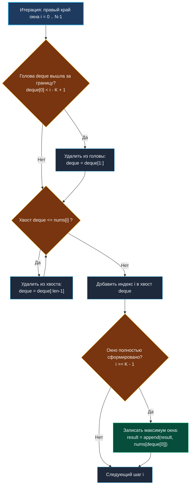

> *«Отсекайте лишнее без сожаления: элементы, уступающие новому конкуренту и по времени, и по силе, не заслуживают места в памяти».*  
> — Брайан Керниган

## Максимум в скользящем окне (Sliding Window Maximum): монотонная двусторонняя очередь (Deque)

Задача **Sliding Window Maximum** (LeetCode 239) — квинтэссенция высокопроизводительной потоковой обработки.  
Дан массив целых чисел `nums` и размер скользящего окна $K$. Окно перемещается слева направо с шагом $1$. Для каждой позиции окна требуется мгновенно определить **максимальный элемент**, сформировав результирующий срез длиной $N - K + 1$.

Наивный поиск максимума в каждом окне занимает $O(K)$, что дает общую квадратичную сложность $O(N \times K)$ (при $N, K = 10^5$ это $10^{10}$ операций — безусловный TLE).  
Использование кучи (Max-Heap) дает $O(N \log K)$.  
Однако существует эталонное решение за строго **линейное время $O(N)$ с константной дополнительной памятью $O(K)$** на основе **монотонной очереди (Monotonic Deque)**.



---

## 1. Концепция монотонной очереди: почему отсечение безопасно?

В двусторонней очереди (Deque) мы храним не значения, а **индексы** элементов.  
Очередь подчиняется двум строгим инвариантам:

1. **Инвариант монотонного убывания значений:**  
   Значения элементов по индексам в очереди строго убывают от головы к хвосту:
   $$\text{nums}[\text{deque}[0]] \ge \text{nums}[\text{deque}[1]] \ge \dots \ge \text{nums}[\text{deque}[\text{last}]]$$
   Следовательно, в голове очереди (`deque[0]`) **всегда находится глобальный максимум текущего окна**.
2. **Инвариант актуальности диапазона:**  
   В очереди содержатся только индексы, принадлежащие текущему окну $[i - K + 1, \; i]$.

### Почему элементы с хвоста удаляются безвозвратно?
Пусть мы рассматриваем входящий элемент с индексом $i$.  
Если на хвосте очереди находится элемент $j < i$, для которого $\text{nums}[j] \le \text{nums}[i]$, то элемент $j$ **никогда более не сможет стать максимумом ни в текущем, ни в будущих окнах**:
- Элемент $i$ больше или равен $j$.
- Элемент $i$ появился позже, а значит, останется в окне дольше, чем $j$.  
Элемент $j$ морально и физически устарел, поэтому его можно немедленно удалить с хвоста очереди.

---

## 2. Идиоматичная реализация на Go

В Go нет встроенного типа `deque` в стандартной библиотеке, однако обычный срез `[]int` идеально выполняет роль двусторонней очереди за счет быстрых срезов:

```go
package slidingwindow

// MaxSlidingWindow возвращает максимумы во всех окнах за O(N)
func MaxSlidingWindow(nums []int, k int) []int {
	n := len(nums)
	if n == 0 || k <= 0 {
		return nil
	}

	result := make([]int, 0, n-k+1)
	// Монотонная очередь индексов с предвыделенной емкостью k
	deque := make([]int, 0, k)

	for i := 0; i < n; i++ {
		// 1. Очистка головы: удаляем элементы, вышедшие за пределы левой границы окна
		if len(deque) > 0 && deque[0] < i-k+1 {
			deque = deque[1:]
		}

		// 2. Очистка хвоста: удаляем все элементы, которые меньше или равны входящему
		for len(deque) > 0 && nums[deque[len(deque)-1]] <= nums[i] {
			deque = deque[:len(deque)-1]
		}

		// 3. Добавляем текущий индекс в хвост
		deque = append(deque, i)

		// 4. Записываем максимум окна, если первое окно сформировалось
		if i >= k-1 {
			result = append(result, nums[deque[0]])
		}
	}

	return result
}
```

---

## 3. Аппаратная эффективность и Mechanical Sympathy

1. **Амортизированная сложность $O(1)$ на шаг:**  
   Каждый индекс добавляется в срез ровно один раз (`append`) и удаляется не более одного раза (либо из головы сдвигом указателя, либо с хвоста усечением `len`). Суммарное количество манипуляций с очередью за весь цикл не превышает $2N$.
2. **Zero Allocations в горячем цикле:**  
   Очередь создается один раз с емкостью $K$: `make([]int, 0, k)`.  
   Операции `deque = deque[1:]` и `deque = deque[:len-1]` лишь изменяют указатель на начало и длину заголовка `SliceHeader` в регистрах процессора. Память кучи не переаллоцируется.
3. **Плотная упаковка в кэш-линиях:**  
   Срез индексов хранится в непрерывном массиве. Чтение максимума `nums[deque[0]]` обращается к первому элементу, который практически непрерывно находится в кэше первого уровня (L1 Data Cache, задержка $1$ нс).

---

## 4. Вопросы для собеседования

> [!INTERVIEW]
> **Вопрос:** Почему не стоит использовать структуру `container/list` для реализации Deque в Go?  
> **Ответ:** `container/list` — это двусвязный список, где каждый элемент аллоцируется в куче отдельно (`*Element`), а значения упаковываются в интерфейс `any`. Это создает чудовищное давление на сборщик мусора (GC allocation churn) и превращает чтение очереди в постоянный Pointer Chasing с промахами кэша CPU. Срез `[]int` быстрее на один-два порядка.

> [!INTERVIEW]
> **Вопрос:** Почему при очистке хвоста используется условие `<=`, а не строгое `<`?  
> **Ответ:** При равенстве значений ($\text{nums}[\text{tail}] == \text{nums}[i]$) более старый дубликат на хвосте имеет меньший индекс, а значит, покинет окно раньше, чем входящий элемент $i$. Заменив старый дубликат на новый, мы гарантируем, что актуальный максимум дольше задержится в окне при последующих сдвигах.

---

## Резюме

1. Монотонная очередь обеспечивает константный доступ $O(1)$ к максимуму в скользящем окне.
2. Амортизированная сложность составляет строго $O(N)$ времени при $O(K)$ дополнительной памяти.
3. Реализация Deque на плоском срезе Go обеспечивает нулевые аллокации и максимальную кэш-локальность.

В следующей статье мы завершим кластер сложных задач проектированием алгоритма сериализации и десериализации бинарного дерева: [[7. Serialize and Deserialize Binary Tree]].