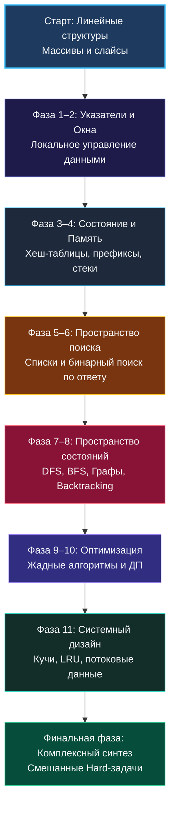

> *«Прежде чем бросаться решать задачу, поймите её глубинную суть; прежде чем писать код, составьте ясный план; прежде чем гордиться результатом, сделайте его простым и понятным».*  
> — Брайан Керниган

---

### Философия системы: карта инженерного мышления

Перед вами не механический список задач для «зубрёжки» и не каталог разрозненных шпаргалок. Это **навигационная карта качественного фазового перехода**: путь от хаотичной попытки угадать решение («где-то я это видел...») к системному **алгоритмическому зрению Senior-инженера**.

Когда опытный разработчик смотрит на условие незнакомой задачи, он видит не слова, а фундаментальные свойства данных:
- Обладает ли функция монотонностью?
- Требуется ли запоминать промежуточные состояния?
- Заданы ли данные в виде графа переходов или одномерного потока?
- Каковы физические ограничения памяти и процессорных тактов?

Все задачи в нашем руководстве разбиты не по формальной сложности («Easy / Medium / Hard»), а по **типу мышления и структурам памяти**, которые они тренируют.

---

### Как работать с этой системой: 5 правил осознанной практики

1. **Не решайте задачи хаотично:** Двигайтесь строго по фазам. Мозг строит нейронные связи поэтапно: невозможно понять двумерное динамическое программирование, не освоив инвариант одномерного префиксного массива.
2. **Сначала поймите паттерн:** Начните с теоретической лекции кластера (`1. Теория...`). Разберите устройство структур данных в рантайме Go, кэш-линии CPU и вычислительную сложность.
3. **Решите базовые задачи руками:** Реализуйте эталонные задачи кластера без подсказок и готовых сниппетов.
4. **Ведите трассировку без компилятора:** Перед запуском тестов обязательно выполните ручной прогон на бумаге или доске ([[20. Debugging алгоритмов]], [[23. Белая доска и live coding]]).
5. **Проговаривайте решение вслух:** Тренируйте навык Thinking Out Loud ([[27. Как думать вслух и тянуть время на интервью]]) — именно он превращает знание алгоритмов в оффер.

---

### Фазовый маршрут подготовки

#### Фаза 1. Базовое линейное мышление (Массивы, строки, слайсы)
- **Цель:** Искоренить наивный квадратичный брутфорс $O(N^2)$, научиться мыслить линейной асимптотикой $O(N)$ и контролировать емкость срезов (`cap`).
- **Теория:** [[1. Теория. Массивы и строки]], [[1. Теория. Строковые задачи]].
- **Ключевые задачи:** [[3. Two Sum]], [[4. Contains Duplicate]], [[12. Valid Anagram]], [[10. Move Zeroes]], [[5. Best Time to Buy and Sell Stock]], [[6. Maximum Subarray]], [[7. Product of Array Except Self]], [[11. Longest Common Prefix]].

#### Фаза 2. Два указателя и скользящее окно (Управление интервалом)
- **Цель:** Освоить динамическое сужение и расширение окна данных без повторных аллокаций памяти.
- **Теория:** [[1. Теория. Два указателя]], [[1. Теория. Скользящее окно]], [[1. Теория. Интервальные задачи]].
- **Ключевые задачи:** [[3. Valid Palindrome]], [[4. Two Sum II Sorted Array]], [[5. Remove Duplicates from Sorted Array]], [[6. 3Sum]], [[7. Container With Most Water]], [[4. Longest Substring Without Repeating Characters]], [[5. Minimum Window Substring]], [[6. Longest Repeating Character Replacement]], [[3. Merge Intervals]].

#### Фаза 3. Хеш-таблицы и префиксные суммы (Переиспользование вычислений)
- **Цель:** Научиться обменивать память на время ($O(1)$ lookup), хранить кумулятивное состояние и работать с коллизиями.
- **Теория:** [[1. Теория. Префиксные суммы]], [[1. Теория. Хеш таблицы]].
- **Ключевые задачи:** [[4. Subarray Sum Equals K]], [[3. Range Sum Query Immutable]], [[5. Continuous Subarray Sum]], [[4. Top K Frequent Elements]], [[8. Longest Consecutive Sequence]], [[3. Group Anagrams]].

#### Фаза 4. Стеки и очереди (Монотонность и потоки данных)
- **Цель:** Освоить структуры LIFO и FIFO, научиться строить монотонные последовательности для поиска ближайших больших/меньших элементов за $O(N)$.
- **Теория:** [[1. Теория. Стек]], [[1. Теория. Очередь]].
- **Ключевые задачи:** [[3. Valid Parentheses]], [[4. Min Stack]], [[5. Daily Temperatures]], [[6. Next Greater Element I]], [[7. Largest Rectangle in Histogram]], [[5. Sliding Window Maximum]], [[3. Implement Queue using Stacks]].

#### Фаза 5. Связные списки (Манипуляция указателями)
- **Цель:** Научиться безопасно перестраивать топологию связных структур без потери указателей и утечек памяти, освоить алгоритм Флойда («черепаха и заяц»).
- **Теория:** [[1. Теория. Связные списки]].
- **Ключевые задачи:** [[3. Reverse Linked List]], [[4. Merge Two Sorted Lists]], [[5. Linked List Cycle]], [[6. Remove Nth Node From End of List]], [[7. Reorder List]], [[8. Copy List with Random Pointer]].

#### Фаза 6. Бинарный поиск и поиск по пространству ответов
- **Цель:** Научиться искать не только в отсортированном массиве, но и в пространстве монотонных предикатов (Binary Search on Answer).
- **Теория:** [[1. Теория. Бинарный поиск]].
- **Ключевые задачи:** [[3. Binary Search]], [[4. Search in Rotated Sorted Array]], [[5. Find Minimum in Rotated Sorted Array]], [[6. Koko Eating Bananas]], [[7. Capacity To Ship Packages Within D Days]].

#### Фаза 7. Поиск в глубину (DFS), ширину (BFS) и деревья
- **Цель:** Научиться исследовать рекурсивные деревья решений и пространственные сетки (grid-задачи).
- **Теория:** [[1. Теория. DFS]], [[1. Теория. BFS]], [[1. Теория. Деревья]], [[1. Теория. Grid задачи]].
- **Ключевые задачи:** [[3. Number of Islands]], [[3. Binary Tree Level Order Traversal]], [[3. Maximum Depth of Binary Tree]], [[4. Lowest Common Ancestor of a Binary Tree]], [[4. Rotting Oranges]], [[5. Word Ladder]], [[3. Set Matrix Zeroes]].

#### Фаза 8. Графы и системы непересекающихся множеств (Disjoint Set / Union-Find)
- **Цель:** Моделирование сетей зависимостей, топологическая сортировка и выявление компонент связности.
- **Теория:** [[1. Теория. Графы]], [[1. Теория. Union Find]].
- **Ключевые задачи:** [[3. Course Schedule]], [[4. Course Schedule II]], [[3. Number of Connected Components in an Undirected Graph]], [[4. Redundant Connection]], [[5. Pacific Atlantic Water Flow]], [[4. Clone Graph]].

#### Фаза 9. Backtracking (Исчерпывающий поиск с отсечением)
- **Цель:** Генерация комбинаторных объектов, обход дерева ветвлений с ранним отсечением неперспективных ветвей (pruning).
- **Теория:** [[1. Теория. Backtracking]].
- **Ключевые задачи:** [[3. Subsets]], [[4. Permutations]], [[5. Combination Sum]], [[10. Generate Parentheses]], [[7. N-Queens]], [[8. Word Search]].

#### Фаза 10. Жадные алгоритмы (Локальный оптимум)
- **Цель:** Доказательство свойства жадного выбора и решение интервальных задач без полного перебора.
- **Теория:** [[1. Теория. Жадные алгоритмы]].
- **Ключевые задачи:** [[3. Jump Game]], [[4. Jump Game II]], [[5. Gas Station]], [[6. Non-overlapping Intervals]], [[7. Minimum Number of Arrows to Burst Balloons]].

#### Фаза 11. Динамическое программирование (1D, 2D, Strings, Trees)
- **Цель:** Оптимальная подструктура и перекрывающиеся подзадачи. Переход от экспоненциального перебора к полиномиальному заполнению мемоизационных таблиц.
- **Теория:** [[1. Теория. Динамическое программирование 1D]], [[1. Теория. Динамическое программирование 2D]], [[1. Теория. DP на строках]], [[1. Теория. DP на деревьях]].
- **Ключевые задачи:** [[3. Climbing Stairs]], [[4. House Robber]], [[5. Coin Change]], [[3. Unique Paths]], [[4. Minimum Path Sum]], [[5. Edit Distance]], [[3. Longest Common Subsequence]], [[3. House Robber III]].

#### Фаза 12. Системные структуры: Design, Кучи, Потоки, Битовые операции
- **Цель:** Построение композитных структур данных промышленного уровня (O(1) кэши, рандомизация, потоковые квантили, битмаски).
- **Теория:** [[1. Теория. Кучи]], [[1. Теория. Design задачи]], [[1. Теория. Битовые операции]], [[1. Теория. Рандомизированные алгоритмы]], [[1. Теория. Потоковые алгоритмы]].
- **Ключевые задачи:** [[3. LRU Cache]], [[4. LFU Cache]], [[3. Kth Largest Element in Array]], [[5. Find Median from Data Stream]], [[3. Single Number]], [[3. Random Pick with Weight]], [[3. Top K Frequent Elements stream]].

#### Финальная фаза: Комплексный синтез (Сложные задачи)
- **Цель:** Решение нестандартных составных задач уровня Hard, комбинирующих 2–3 различных алгоритмических паттерна.
- **Теория:** [[1. Теория. Подход к сложным задачам]].
- **Ключевые задачи:** [[3. Trapping Rain Water]], [[4. Merge k Sorted Lists]], [[5. Serialize and Deserialize Binary Tree]], [[6. Median of Two Sorted Arrays]].

---

### Полный атлас 29 алгоритмических кластеров

В таблице ниже приведён исчерпывающий перечень всех кластеров практического раздела с прямыми ссылками на их теоретические манифесты:

| № | Алгоритмический кластер | Теоретический фундамент | Основной фокус в рантайме Go |
|---|---|---|---|
| 01 | **Массивы и строки** | [[1. Теория. Массивы и строки]] | Срезы, непрерывная память, capacity, byte vs rune |
| 02 | **Два указателя** | [[1. Теория. Два указателя]] | In-place мутации, экономия памяти до $O(1)$ |
| 03 | **Скользящее окно** | [[1. Теория. Скользящее окно]] | Непрерывные подмассивы, частотные массивы `[26]int` |
| 04 | **Префиксные суммы** | [[1. Теория. Префиксные суммы]] | Суммы на отрезках за $O(1)$, разностные массивы |
| 05 | **Хеш-таблицы** | [[1. Теория. Хеш таблицы]] | Структура `hmap`, бакеты, avoidance of heap allocations |
| 06 | **Стек** | [[1. Теория. Стек]] | Монотонный стек, проверка парности скобок |
| 07 | **Очередь** | [[1. Теория. Очередь]] | Монотонная дека, кольцевые буферы на слайсах |
| 08 | **Связные списки** | [[1. Теория. Связные списки]] | Fast/Slow pointers, разворот ссылок, фиктивные узлы |
| 09 | **Бинарный поиск** | [[1. Теория. Бинарный поиск]] | Поиск по ответу, предотвращение переполнения `mid` |
| 10 | **Backtracking** | [[1. Теория. Backtracking]] | Рекурсивное дерево, откат состояния, pruning |
| 11 | **Поиск в глубину DFS** | [[1. Теория. DFS]] | Глубина стека горутины, раскраска вершин |
| 12 | **Поиск в ширину BFS** | [[1. Теория. BFS]] | Кратчайший путь во взвешенных графах, поуровневый обход |
| 13 | **Деревья** | [[1. Теория. Деревья]] | Бинарные деревья поиска, префиксные деревья (Trie) |
| 14 | **Графы** | [[1. Теория. Графы]] | Списки смежности, алгоритм Кана, топологический порядок |
| 15 | **Union-Find** | [[1. Теория. Union Find]] | Эвристика объединения по рангу, сжатие путей |
| 16 | **Кучи и Top K** | [[1. Теория. Кучи]] | Пакет `container/heap`, реализация `heap.Interface` |
| 17 | **Жадные алгоритмы** | [[1. Теория. Жадные алгоритмы]] | Сортировка интервалов, доказательство моноидности |
| 18 | **Динамическое программирование 1D** | [[1. Теория. Динамическое программирование 1D]] | Восходящее ДП (Bottom-up), оптимизация памяти до $O(1)$ |
| 19 | **Динамическое программирование 2D** | [[1. Теория. Динамическое программирование 2D]] | Матрицы путей, рюкзак, скользящие строки памяти |
| 20 | **ДП на строках** | [[1. Теория. DP на строках]] | LCS, расстояние Левенштейна, табличные инварианты |
| 21 | **ДП на деревьях** | [[1. Теория. DP на деревьях]] | Пост-ордер обходы, агрегация поддеревьев |
| 22 | **Битовые операции** | [[1. Теория. Битовые операции]] | Битовые маски, XOR-свойства, битхаки процессора |
| 23 | **Интервалы** | [[1. Теория. Интервальные задачи]] | Слияние отрезков, поиск пересечений |
| 24 | **Матрицы и grid задачи** | [[1. Теория. Grid задачи]] | Навигация по 2D-координатам, границы матриц |
| 25 | **Строки** | [[1. Теория. Строковые задачи]] | Преобразование кодировок, палиндромы, Z-функции |
| 26 | **Design задачи** | [[1. Теория. Design задачи]] | Композиция двусвязных списков и хеш-карт (LRU/LFU) |
| 27 | **Рандомизированные алгоритмы** | [[1. Теория. Рандомизированные алгоритмы]] | Резервуарная выборка (Reservoir Sampling), `math/rand/v2` |
| 28 | **Потоковые алгоритмы** | [[1. Теория. Потоковые алгоритмы]] | Heavy Hitters, алгоритм Мисры-Гриеса, скользящие квантили |
| 29 | **Сложные задачи** | [[1. Теория. Подход к сложным задачам]] | Многоуровневая декомпозиция, нестандартные инварианты |

---

### Финальная планка: Критерии готовности к собеседованиям

После последовательного прохождения этой дорожной карты вы гарантированно достигаете следующих профессиональных стандартов:

1. **Мгновенная классификация (30–60 секунд):** Вы безошибочно определяете семейство паттернов, просто взглянув на ограничения $N$ и сигнатуру входа.
2. **Абсолютная предсказуемость кода:** Вы пишете идиоматичный, чистый Go-код без паник на `nil`, с предварительно выделенной емкостью и строгой обработкой краевых условий.
3. **Независимость от подсказок IDE:** Вы свободно ориентируетесь в сигнатурах стандартной библиотеки (`slices`, `sort`, `strings`, `container/heap`) и держите структуру программы в уме.
4. **Партнёрский стиль общения:** Вы непринужденно транслируете ход мысли, с благодарностью воспринимаете фидбек и аргументированно защищаете архитектурные решения.

Начинайте свой путь с фундаментальных структур данных: [[1. Теория. Массивы и строки]]. Желаем глубокого погружения и красивых инженерных решений!