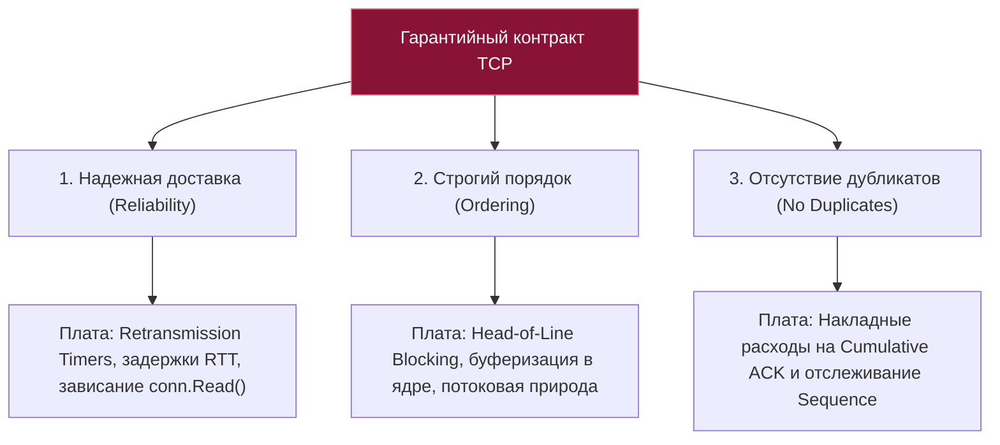
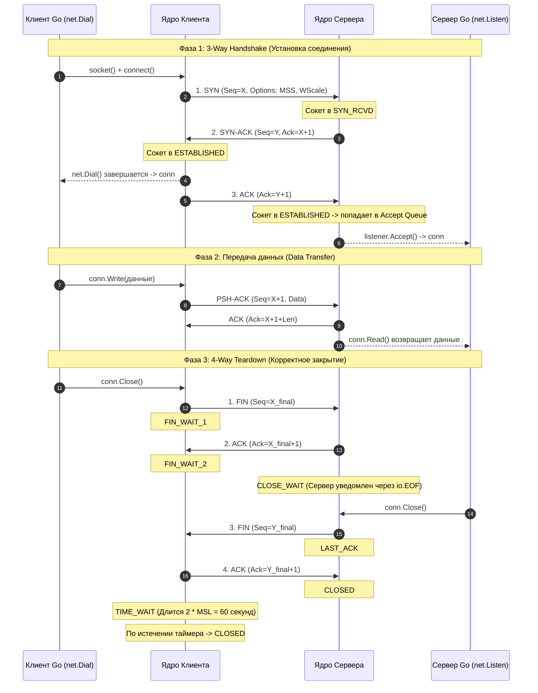
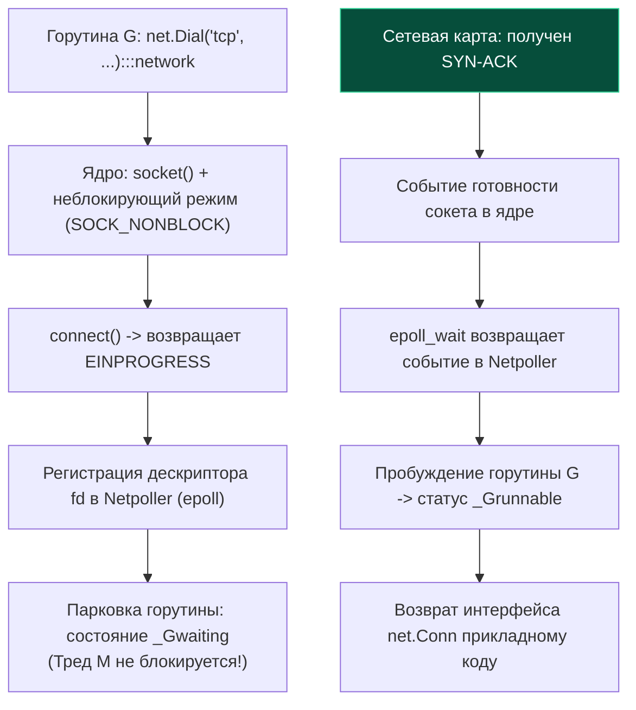

# TCP: Устройство, гарантии и жизненный цикл соединения

> *«Серьезные проблемы, с которыми мы сталкиваемся, невозможно решить на том же уровне мышления, на котором мы их создали».*    
> — Альберт Эйнштейн

Представьте, что вы хотите отправить другу многотомное собрание сочинений, но в вашем распоряжении есть только почтовые открытки. Каждая открытка может потеряться в пути, задержаться на таможне на неделю или прийти раньше тех, что были отправлены за несколько дней до нее. Это суровая реальность сетевого уровня IP: доставка отдельных пакетов без каких-либо гарантий целостности, порядка и сохранности (Best-Effort Delivery).

Как поверх этого ненадежного хаоса построить иллюзию идеальной, непрерывной телефонной трубы — виртуального двунаправленного потока, куда вы отправляете байты на одной стороне, а на другой стороне они появляются в строго идентичном порядке, без пропусков, искажений и дубликатов?

Этим триумфом инженерной мысли является **TCP (Transmission Control Protocol)** — протокол, разработанный Винтоном Серфом и Робертом Каном в далеком 1974 году. 

В повседневной разработке на Go протокол TCP прячется за элегантным интерфейсом `net.Conn`. Инженер пишет `conn.Write(data)` и `conn.Read(buf)`, словно работает с обычным файлом на диске. Но с точки зрения концепции **Mechanical Sympathy** за этим лаконичным фасадом скрывается огромный айсберг: сложнейший конечный автомат ядра Linux, структуры данных `tcp_sock`, кольцевые буферы сокетов, синхронизация кэш-линий процессора по протоколу MESI и асинхронный сетевой поллер Go (`netpoller`). 

В этой лекции мы заглянем под капот TCP, разберем анатомию его заголовка, изучим гарантийный контракт и проследим жизненный цикл соединения от первого флага `SYN` до финального `TIME_WAIT`.

---

## Введение: Что такое TCP на самом деле?

TCP — это не просто абстрактный «надежный протокол». Для операционной системы TCP — это высоконагруженный **конечный автомат с состоянием (Stateful Finite State Machine)**, работающий целиком в пространстве ядра.

В отличие от протокола UDP, где сетевой стек просто «выстреливает» датаграмму в провод и мгновенно забывает о ней, TCP требует от обеих сторон постоянного поддержания и синхронизации контекста соединения:
* **Аллокация памяти в ядре:** Для каждого активного TCP-сокета операционная система выделяет внутреннюю структуру ядра **`struct tcp_sock`**, дескриптор **`struct file`**, а также буферы отправки (**`sndbuf`**) и приема (**`rcvbuf`**).
* **Синхронизация многоядерных процессоров:** При отправке и приеме каждого сетевого сегмента ядро обновляет переменные последовательностей и окон. При конкурентном доступе сетевых прерываний и системных потоков это приводит к атомарным операциям **`cmpxchg`** и инвалидации процессорных кэш-линий (эффект *Cache Line Ping-Pong* по протоколу когерентности MESI).
* **Контроль перегрузок и очередей:** Ядро динамически вычисляет задержку прохождения пакетов (RTT) и адаптирует скорость передачи данных под физическое состояние линии.

```mermaid
flowchart TD
    classDef process  fill:#1e293b,stroke:#38bdf8,stroke-width:1px,color:#f8fafc
    classDef success  fill:#064e3b,stroke:#34d399,stroke-width:1px,color:#f8fafc
    classDef error    fill:#7f1d1d,stroke:#f87171,stroke-width:1px,color:#f8fafc
    classDef warning  fill:#78350f,stroke:#fbbf24,stroke-width:1px,color:#f8fafc
    classDef entry    fill:#1e3a5f,stroke:#38bdf8,stroke-width:2px,color:#f8fafc
    classDef aux      fill:#334155,stroke:#64748b,stroke-width:1px,color:#f8fafc
    classDef system   fill:#312e81,stroke:#a78bfa,stroke-width:1px,color:#f8fafc
    classDef data     fill:#132d29,stroke:#2dd4bf,stroke-width:1px,color:#f8fafc
    classDef network  fill:#881337,stroke:#fb7185,stroke-width:1px,color:#f8fafc
    classDef accent   fill:#1e1b4b,stroke:#818cf8,stroke-width:1px,color:#f8fafc
    subgraph Userspace ["Пространство пользователя (Go Runtime)"]
        GoApp["Go-приложение (горутины)"]
        NetFD["Интерфейс net.Conn (netFD)"]
        GoApp <-->|conn.Read() / conn.Write()| NetFD
    end

    subgraph KernelSpace ["Пространство ядра Linux (TCP/IP Stack)"]
        SockStruct["struct tcp_sock (Состояние сокета)"]
        SndBuf["Очередь отправки: sndbuf (sk_buff)"]
        RcvBuf["Очередь приема: rcvbuf (sk_buff)"]
        FSM["Конечный автомат TCP (ESTABLISHED, etc.)"]
        
        NetFD <-->|Системные вызовы / Netpoller epoll| SockStruct
        SockStruct --> SndBuf
        SockStruct --> RcvBuf
        SockStruct --> FSM
    end

    subgraph Hardware ["Аппаратный уровень"]
        NIC["Сетевой адаптер (NIC DMA / Ring Buffers)"]
        SndBuf --> NIC
        NIC --> RcvBuf
    end
```

---

## Устройство TCP-сегмента (Under the Hood)

Поскольку протокол сетевого уровня IP не предоставляет никаких гарантий, протокол TCP вынужден нести в собственном заголовке всю исчерпывающую информацию, необходимую для сборки разрозненных фрагментов в упорядоченный байтовый поток.

Минимальный размер заголовка TCP без дополнительных опций составляет **20 байт**. При использовании расширений поле опций (**`Options`**) может увеличивать заголовок до 60 байт.

```text
 0                   1                   2                   3
 0 1 2 3 4 5 6 7 8 9 0 1 2 3 4 5 6 7 8 9 0 1 2 3 4 5 6 7 8 9 0 1
+-+-+-+-+-+-+-+-+-+-+-+-+-+-+-+-+-+-+-+-+-+-+-+-+-+-+-+-+-+-+-+-+
|          Source Port          |       Destination Port        |
+-+-+-+-+-+-+-+-+-+-+-+-+-+-+-+-+-+-+-+-+-+-+-+-+-+-+-+-+-+-+-+-+
|                        Sequence Number                        |
+-+-+-+-+-+-+-+-+-+-+-+-+-+-+-+-+-+-+-+-+-+-+-+-+-+-+-+-+-+-+-+-+
|                    Acknowledgment Number                      |
+-+-+-+-+-+-+-+-+-+-+-+-+-+-+-+-+-+-+-+-+-+-+-+-+-+-+-+-+-+-+-+-+
|  Data Offset |   Reserved   |C|E|U|A|P|R|S|F|    Window Size  |
+-+-+-+-+-+-+-+-+-+-+-+-+-+-+-+-+-+-+-+-+-+-+-+-+-+-+-+-+-+-+-+-+
|           Checksum            |         Urgent Pointer        |
+-+-+-+-+-+-+-+-+-+-+-+-+-+-+-+-+-+-+-+-+-+-+-+-+-+-+-+-+-+-+-+-+
|                    Options (variable length)                  |
+-+-+-+-+-+-+-+-+-+-+-+-+-+-+-+-+-+-+-+-+-+-+-+-+-+-+-+-+-+-+-+-+
|                             Data                              |
+-+-+-+-+-+-+-+-+-+-+-+-+-+-+-+-+-+-+-+-+-+-+-+-+-+-+-+-+-+-+-+-+
```

### Ключевые поля TCP-заголовка для бэкенд-инженера:

* **Source Port & Destination Port (по 16 бит):** Идентифицируют сокеты отправляющего и принимающего процессов. Вместе с IP-адресами источника и назначения они образуют так называемый **5-tuple** (Src IP, Dst IP, Src Port, Dst Port, Protocol), однозначно идентифицирующий TCP-сессию.
* **`Sequence Number` (32 бита):** Порядковый номер первого байта данных в данном сегменте. В отличие от наивных представлений, отсчет начинается не с нуля, а со случайного стартового числа (Initial Sequence Number, ISN) для защиты от атак подмены пакетов.
* **`Acknowledgment Number` (32 бита):** Номер подтверждения. Указывает порядковый номер байта, который отправитель ожидает получить следующим. TCP использует принцип **кумулятивного подтверждения (Cumulative ACK)**: подтверждение номера `N` означает, что абсолютно все байты в диапазоне от начала сессии до `N-1` успешно получены и собраны без ошибок.
* **Data Offset (4 бита):** Длина заголовка TCP в 32-битных словах. Указывает, где заканчиваются опции и начинаются полезные данные приложения.
* **Флаги управления (Control Flags, 9 бит):**
  - **`SYN` (Synchronize):** Инициирует установку TCP-соединения и синхронизирует стартовые номера ISN;
  - **`ACK` (Acknowledgment):** Подтверждает получение данных;
  - **`FIN` (Finish):** Инициирует корректное полузакрытие соединения со стороны отправителя;
  - **`RST` (Reset):** Мгновенный сброс и разрыв соединения при фатальной ошибке или отказе в подключении;
  - **PSH (Push):** Просьба немедленно передать накопленные в буфере приема байты приложению без ожидания заполнения пакета;
  - **URG (Urgent):** Признак срочных данных (устарело, на практике почти не используется);
  - **ECE & CWR:** Флаги явного уведомления о перегрузке маршрутизаторов в сети (Explicit Congestion Notification, ECN).
* **`Window Size` (16 бит):** Размер окна приема (Flow Control). Указывает, сколько байт данных приемник готов принять в свой приемный буфер `rcvbuf` прямо сейчас без подтверждения.
* **Checksum (16 бит):** Контрольная сумма, вычисляемая по заголовку TCP, псевдозаголовку IP и полезной нагрузке.
* **`Options` (переменная длина):** Критически важный блок согласования параметров при рукопожатии:
  - **MSS (Maximum Segment Size):** Максимальный размер полезной нагрузки сегмента (обычно 1460 байт для Ethernet);
  - **Window Scaling:** Масштабирование окна (сдвиг до 14 бит), позволяющее увеличить размер окна приема с 64 КБ до 1 ГБ для высокоскоростных гигабитных каналов;
  - **SACK (Selective Acknowledgment):** Выборочные подтверждения, позволяющие повторно отправлять только потерянные сегменты, а не всю цепочку;
  - **Timestamps:** Метки времени для ювелирного измерения времени круговой задержки RTT и защиты от зацикливания номеров (PAWS).

> [!info] Под капотом: Структура `tcp_sock` в ядре Linux
> В исходных кодах ядра Linux (заголовочный файл **`include/net/tcp.h`**) состояние соединения инкапсулировано в монументальной структуре **`struct tcp_sock`**.  
> Переменные последовательностей непрерывно мутируют:
> * `snd_una` (send unacknowledged) — первый неподтвержденный байт отправки;
> * `snd_nxt` (send next) — следующий байт, готовый к отправке в сеть;
> * `rcv_wup` (receive window update) — номер последовательности последнего обновления окна;
> * `rcv_wnd` (receive window) — текущий доступный размер приемного окна.  
> Любое изменение этих полей ядром требует атомарных инструкций процессора (`LOCK CMPXCHG`), что объясняет повышенные микросекундные задержки при обработке сотен тысяч мелких сетевых пакетов на многопроцессорных NUMA-узлах.

---

## Гарантийный контракт TCP

Протокол TCP предлагает прикладному коду три строгие гарантии надежности, за каждую из которых разработчик платит системными ресурсами и сетевыми задержками:



1. **Гарантия доставки (Reliability):**  
   Если сетевой пакет теряется на промежуточном маршрутизаторе, ядро обнаруживает потерю по таймеру повторной передачи (Retransmission Timeout, RTO) или через тройной дублирующий ACK и отправляет дубликат.  
   *Важнейший вывод для Go:* Вызов **`conn.Write()`** возвращает управление со статусом успеха (**`nil, nil`**) вовсе не тогда, когда данные дошли до удаленного сервера! Он возвращает успех в тот момент, когда байты успешно скопированы из пространства пользователя Go в буфер отправки ядра `sndbuf`. Если через секунду провод оборвется, данные пропадут, а приложение на Go узнает об этом только при следующей попытке записи. С другой стороны, вызов `conn.Read()` может заблокироваться навсегда, если удаленный клиент молча отключил питание (требуется явная настройка дедлайнов через `SetReadDeadline` или Heartbeat).
2. **Гарантия порядка (Ordering):**  
   Благодаря полю `Sequence Number` ядро Linux сортирует и пересобирает перемешанные в сети IP-пакеты перед тем, как отдать их в сокет. Для программиста на Go это означает работу с непрерывным **потоком байт (Stream)**, а не с отдельными сообщениями. В TCP принципиально отсутствуют границы сообщений!
3. **Отсутствие дубликатов (No Duplicates):**  
   Благодаря кумулятивным подтверждениям Cumulative ACK подтвержденный байт **`N`** гарантирует, что байты в диапазоне **`1..N-1`** не будут доставлены прикладному коду повторно. Любые запоздавшие дубликаты сегментов ядро фильтрует и отбрасывает на аппаратном и системном уровне.

> [!warning] Ловушка / Gotcha: Поток байт против сообщений (Streaming vs Framing)
> Фундаментальная ошибка начинающих сетевых инженеров: убежденность в том, что один вызов `conn.Write()` соответствует одному вызову `conn.Read()`.  
> TCP — это непрерывный поток байт, подобный реке.  
> Если ваш сервис на Go отправляет структуру данных размером ровно 1000 байт:
> ```go
> conn.Write(payload) // 1000 байт
> ```
> Принимающая сторона может считать эти данные за один вызов `conn.Read(buf)` (1000 байт), за два вызова (400 байт, затем 600 байт) или даже за тысячу вызовов по 1 байту в условиях сетевых задержек!  
> В протоколах прикладного уровня (HTTP/1.1, gRPC, кастомные бинарные протоколы) разработчик **обязан** самостоятельно реализовывать механизм фрейминга: либо передавать явную длину сообщения (заголовок **`Content-Length`**), либо использовать уникальный разделитель (например, `\r\n\r\n` или нуль-терминатор). Если этого не сделать, следующий прикладной запрос «съест» остаток предыдущего сообщения.

---

## Жизненный цикл соединения: От SYN до FIN

Протокол TCP полностью управляется конечным автоматом состояний. Жизненный цикл классического соединения проходит через три обязательные фазы: установка (Handshake), передача данных и разрыв (Teardown).



### Подробный разбор стадий жизненного цикла:

1. **3-Way Handshake (Тройное рукопожатие):**
   - Клиент отправляет пакет **`SYN`** со своим начальным номером `Seq=X` и набором поддерживаемых опций (MSS, SACK, Window Scale).
   - Сервер отвечает пакетом **`SYN-ACK`** со своим собственным номером `Seq=Y` и подтверждением `Ack=X+1`.
   - Клиент завершает рукопожатие отправкой пакета **`ACK`** (`Ack=Y+1`). В Go блокирующий вызов `net.Dial()` возвращает управление горутине ровно в этот момент.
2. **Фаза передачи данных (ESTABLISHED):**  
   Данные непрерывно курсируют в обоих направлениях. Стороны используют скользящее окно (Sliding Window), отправляя группы пакетов без ожидания ответа на каждый отдельный байт.
3. **Корректное закрытие (Tear Down):**  
   TCP является дуплексным протоколом: каждая сторона закрывает свой исходящий канал независимо.
   - Инициатор закрытия (вызов `conn.Close()`) отправляет флаг **`FIN`** и переходит в состояние `FIN_WAIT_1`.
   - Вторая сторона отвечает пакетом **`ACK`** и переходит в состояние **`CLOSE_WAIT`**. Прикладной код на сервере получает ошибку `io.EOF` при чтении из сокета.
   - Сервер досылает остатки данных, вызывает свой `conn.Close()` и отправляет собственный флаг **`FIN`** (или комбинированный пакет **`FIN-ACK`**), переходя в `LAST_ACK`.
   - Клиент отправляет финальный **`ACK`** и переводит сокет в специальное состояние **`TIME_WAIT`**.
4. **Состояние TIME_WAIT:**  
   Сторона, которая первой инициировала закрытие сокета, обязана удерживать его в состоянии `TIME_WAIT` в течение фиксированного времени:
   $$\mathbf{2 \times MSL \ (Maximum \ Segment \ Lifetime)}$$
   В ядре Linux значение MSL жестко зашито и равно 30 секундам, поэтому `TIME_WAIT` продолжается ровно **60 секунд**.  
   *Зачем это нужно?*
   - Гарантировать доставку финального ACK: если он потеряется, сервер повторно пришлет FIN, и клиент в состоянии `TIME_WAIT` сможет переотправить ACK;
   - Предотвратить смешивание данных: гарантировать, что все задержавшиеся в сетевых буферах блуждающие пакеты старого соединения окончательно погибнут в сети (истечет их IP TTL) и не будут ошибочно восприняты новым сокетом, созданным на тех же самых портах.

> [!tip] Собеседование: Борьба с накоплением сокетов в TIME_WAIT
> **Вопрос:** Почему при высокой нагрузке на микросервис вызовы `net.Dial()` начинают падать с ошибкой нехватки портов из-за состояния `TIME_WAIT`? Как правильно решить проблему в Go?  
> **Ответ:**  
> Состояние `TIME_WAIT` блокирует повторное использование кортежа адресов (Src IP, Src Port, Dst IP, Dst Port) на 60 секунд. Если клиент на Go непрерывно открывает и закрывает тысячи коротких соединений (Short-Lived Connections), диапазон эфемерных портов ядра (**`ip_local_port_range`**) мгновенно исчерпывается.  
> **Решения:**
> 1. **Архитектурное (золотой стандарт Go):** Использование постоянных пулов соединений (**Connection Pooling**). В `http.Client` необходимо настроить структуру `http.Transport` с адекватными параметрами `MaxIdleConns` и `MaxIdleConnsPerHost`, сохраняя сокеты в состоянии Keep-Alive и исключая постоянный цикл закрытия.
> 2. **На уровне сокета:** Использование сокетных флагов **`SO_REUSEADDR`** и **`SO_REUSEPORT`** (в Go настраивается через коллбэк `net.ListenConfig.Control`), позволяющих ядру мгновенно привязываться к сокету в состоянии `TIME_WAIT`.
> 3. **Тюнинг ядра Linux:** Включение параметра `net.ipv4.tcp_tw_reuse = 1`, позволяющего безопасно переиспользовать сокеты `TIME_WAIT` для исходящих соединений с помощью проверки временных меток TCP Timestamps.

---

## Под капотом: Как Go общается с TCP стеком ОС

Среда исполнения языка Go не содержит собственной изолированной реализации протокола TCP. Рантайм Go всецело делегирует сетевую логику ядру Linux через стандартные системные вызовы сокетов.

Однако гениальность архитектуры Go заключается в том, как язык связывает синхронный код горутин с асинхронным ядром операционной системы:

```go
// Стандартный вызов подключения в Go выглядит синхронным и блокирующим:
conn, err := net.Dial("tcp", "192.168.1.1:8080")
if err != nil {
    log.Fatalf("Ошибка подключения: %v", err)
}
defer conn.Close()
```

### Пошаговый путь системных вызовов внутри `net.Dial`:

1. **Создание сокета:** Рантайм обращается к ядру через системный вызов `sys_socket`:  
   `socket(AF_INET, SOCK_STREAM, 0)`.
2. **Перевод в неблокирующий режим:** Сокет создается или переводится в неблокирующий режим флагом `SOCK_NONBLOCK` либо системным вызовом `fcntl(fd, F_SETFL, O_NONBLOCK)`. В Go все сетевые сокеты **всегда неблокирующие**!
3. **Инициация подключения:** Вызывается системный вызов `sys_connect`:  
   `connect()`. Поскольку сокет неблокирующий, ядро инициирует отправку SYN-пакета и мгновенно возвращает специальный код ошибки **`EINPROGRESS`** («Операция выполняется в фоне»).
4. **Сетевой поллер (Netpoller):**  
   Вместо того чтобы блокировать тяжелый системный поток операционной системы (тред M), планировщик Go передает дескриптор сокета во внутреннюю подсистему **`netpoller`**.  
   Netpoller регистрирует файловый дескриптор в системном мультиплексоре `epoll` с помощью вызова `epoll_ctl(EPOLL_CTL_ADD, fd, EPOLLIN|EPOLLOUT)`.
5. **Парковка горутины:** Текущая горутина (G) переводится в состояние сна (`_Gwaiting`), освобождая системный тред M для исполнения других полезных горутин.
6. **Пробуждение по прерыванию:**  
   Когда удаленный сервер возвращает SYN-ACK, сетевая карта генерирует аппаратное прерывание. Фоновый тред сетевого поллера Go в системном вызове **`epoll_wait`** получает уведомление о готовности дескриптора на запись, находит заснувшую горутину G, возвращает ее в очередь планировщика и передает приложению готовый интерфейс **`net.Conn`**.



> [!info] Под капотом: Эффективность памяти Netpoller
> Благодаря архитектуре Netpoller сервер на Go может одновременно удерживать **сотни тысяч открытых TCP-соединений** без существенных затрат оперативной памяти в пользовательском пространстве.  
> Заснувшая **`goroutine`** потребляет всего около 2–4 КБ памяти на стек.  
> Основное потребление памяти смещается в ядро Linux: на каждый активный сокет ядро выделяет дескриптор **`struct file`**, структуру **`struct tcp_sock`** и буферные очереди `sk_buff` (около 2–4 КБ ядерной памяти подсистемы `kmem:tcp` при пустых буферах).

---

## Ловушки и инженерные компромиссы (Gotchas)

В реальных высоконагруженных распределенных системах идеальный фасад TCP сталкивается с жесткими физическими ограничениями:

### 1. Блокировка начала очереди (Head-of-Line / HOL Blocking на L4)
Поскольку TCP гарантирует строгий порядок байт, потеря хотя бы одного пакета в сети приводит к тому, что ядро Linux обязано удерживать в буфере все последующие успешно доставленные пакеты. Пока потерянный сегмент не будет переотправлен и подтвержден, ядро не отдаст приложению на Go ни одного байта!  
В протоколах HTTP/1.1 и HTTP/2 стандартного пакета `net/http` потеря пакета для одного стрима замораживает все остальные параллельные потоки на этом соединении, приводя к деградации производительности HTTP-серверов.  
*Решение:* Переход на протокол HTTP/3 поверх **QUIC (UDP)**, где каждый поток данных независим на транспортном уровне.

### 2. Конфликт алгоритма Нейгла и задержки (Nagle vs TCP_NODELAY)
По умолчанию ядро Linux объединяет мелкие порции исходящих данных в один большой пакет, ожидая подтверждения ACK на предыдущий пакет (алгоритм Нейгла). В сочетании с механизмом отложенных подтверждений (Delayed ACK) на стороне приемника это приводит к искусственным «зависаниям» сетевых RPC-запросов на **40 миллисекунд**!  
В высокопроизводительных микросервисах на Go (gRPC, Kafka, базы данных) всегда принудительно отключают алгоритм Нейгла с помощью флага **`TCP_NODELAY`**:

```go
if tcpConn, ok := conn.(*net.TCPConn); ok {
    // Отключение буферизации Нейгла: немедленная отправка пакетов
    _ = tcpConn.SetNoDelay(true)
}
```

### 3. Исчерпание портов (Port Exhaustion)
При создании сотен тысяч кратковременных исходящих TCP-подключений ядро перебирает доступные порты из диапазона **`ip_local_port_range`** (обычно 32768–60999). Из-за задержки `TIME_WAIT` (60 сек) порты не успевают освобождаться, и `net.Dial` начинает падать с ошибкой `dial tcp: cannot assign requested address`. Решение — строгое использование пулов соединений.

### 4. Поведение дедлайнов в Go (Deadlines vs Network Drops)
Методы **`SetReadDeadline`** и **`SetWriteDeadline`** интерфейса `net.Conn` не вызывают системных таймаутов ядра. Они устанавливают таймеры внутри рантайма Go. Если таймер истекает, сокет переводится в состояние ошибки, а вызовы возвращают системную ошибку **`i/o timeout`**. Не путайте ошибку дедлайна с физическим разрывом сетевого кабеля!

> [!warning] Ловушка / Gotcha: Катастрофа утечки сокетов в состоянии CLOSE_WAIT
> Если на графиках мониторинга вашего Go-сервиса стремительно растет количество сокетов в состоянии **`CLOSE_WAIT`**, это говорит о **грубейшей ошибке в вашем коде на Go**!  
> 
> Состояние `CLOSE_WAIT` означает: удаленный клиент корректно закрыл свою половину соединения (прислал пакет FIN), ядро подтвердило его (отправило ACK) и передало ошибку `io.EOF` в метод `conn.Read()`.  
> Но ваш Go-код проигнорировал `io.EOF` и забыл вызвать метод **`conn.Close()`**!  
> В результате сокет навсегда зависает в ядре, расходуя файловые дескрипторы (`struct file`), пока операционная система не исчерпает лимит открытых файлов (`Too many open files`).  
> 
> *Запомните мнемоническое правило:*
> * Много **`TIME_WAIT`** — естественное следствие закрытия соединений вашим сервисом;
> * Много **`CLOSE_WAIT`** — баг утечки дескрипторов в вашем Go-коде (забытый `defer conn.Close()`).

---

## Итог

Протокол TCP — это надежнейший фундамент современного бэкенда, превращающий непредсказуемый хаос IP-пакетов в строгий и упорядоченный поток байт:

1. **Сущность TCP:** Это сложный конечный автомат ядра Linux, оперирующий структурами `tcp_sock`, буферами `sndbuf`/`rcvbuf` и требующий бережного отношения к кэш-линиям процессора.
2. **Гарантийный контракт:** TCP гарантирует строгую доставку, упорядоченность и отсутствие дубликатов, но оперирует непрерывным потоком байт. Разделение сообщений (фрейминг) полностью лежит на прикладном коде.
3. **Жизненный цикл:** Соединение проходит через 3-Way Handshake, передачу данных и 4-Way Teardown. Состояние `TIME_WAIT` (длительностью $2 \times \text{MSL} = 60$ секунд) защищает сеть от блуждающих пакетов-призраков.
4. **Сетевой поллер Go:** Стандартный пакет `net` использует асинхронный механизм `netpoller` поверх системного вызова `epoll_wait`, позволяя одной машине удерживать сотни тысяч соединений без блокировки системных тредов.
5. **Инженерные компромиссы:** Блокировка начала очереди (HOL Blocking), задержки алгоритма Нейгла (`TCP_NODELAY`), риск исчерпания портов и опасность утечек дескрипторов в состоянии `CLOSE_WAIT`.

Мы разобрали фундаментальное устройство и жизненный цикл TCP-соединения. Но как в деталях устроены флаги TCP-заголовка, как происходит трехстороннее рукопожатие на уровне системных очередей `SYN Queue` и `Accept Queue`, и что делать при SYN-флуд атаках?

В следующей лекции мы детально изучим низкоуровневую механику установки и разрыва сессий в [[11. TCP Handshake, Teardown и флаги (SYN, ACK, FIN, RST).md]].