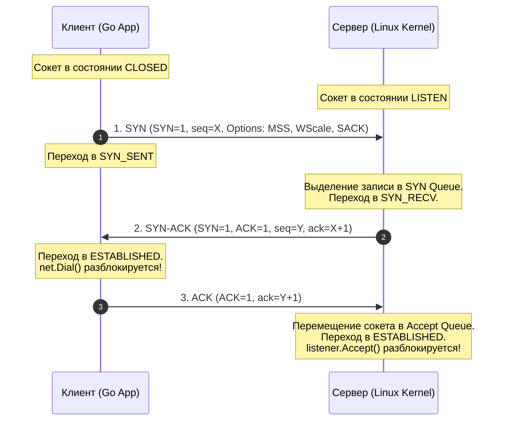
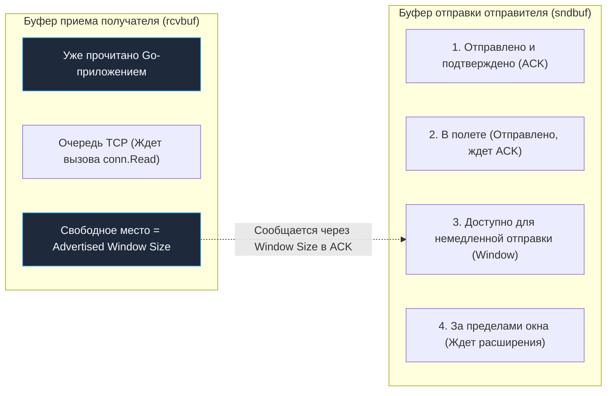
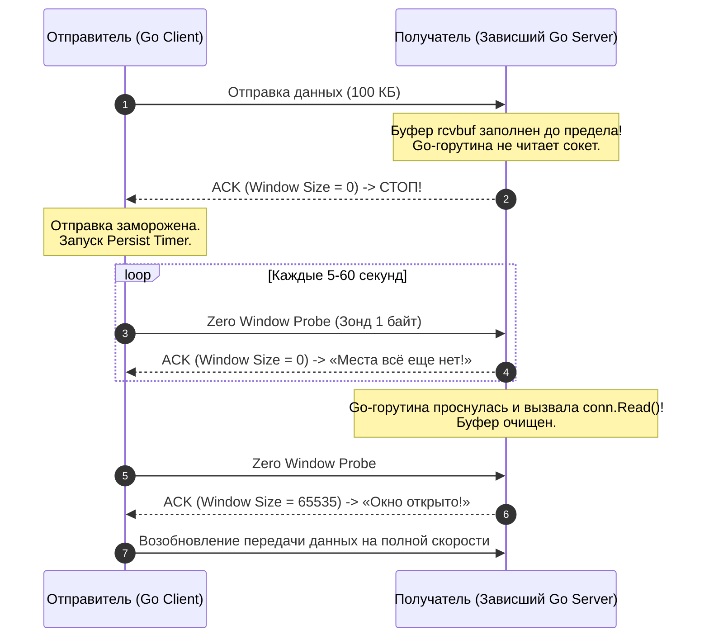
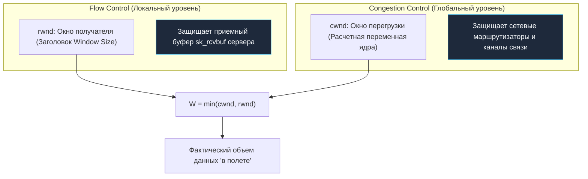
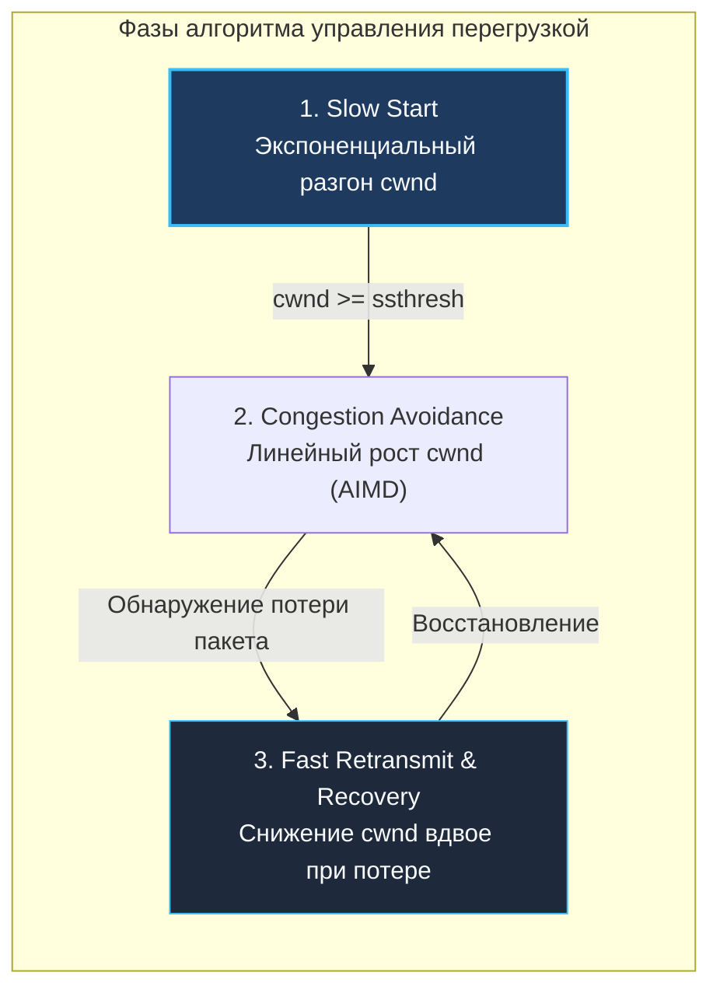

# TCP Handshake, Flow Control и Congestion Control

> *«Искусство программирования — это искусство обуздания сложности: умение подчинить себе разнородное множество и надежно избежать порождаемого им хаоса».*    
> — Эдсгер Дейкстра

Представьте себе мощный пожарный брандспойт, подключенный к городской водонапорной станции. На одном конце оператор открывает вентиль гидранта на полную мощность, а на другом конце шланга стоит человек с маленькой фарфоровой чайной чашкой. Если поток воды хлынет со всей силой, чашка мгновенно переполнится, разобьется, а человека снесет водяным валом. Чтобы этого не случилось, принимающий человек обязан непрерывно подавать сигналы оператору гидранта: *«Притормози, у меня осталось свободного места ровно на два глотка!»*. Это — **Flow Control (контроль потока между получателем и отправителем)**.

А теперь представьте, что к той же магистральной городской трубе одновременно подключились еще сто пожарных расчетов. Если все они разом откроют краны на максимум, давление в трубах мгновенно упадет до нуля, вода закипит от кавитации, а насосы перегорят от перегрузки. Сеть водоснабжения города сколлапсирует. Чтобы спасти общую инфраструктуру, все насосы обязаны непрерывно слушать общий гидроудар магистрали и синхронно снижать подачу воды при малейших признаках затора в трубах. Это — **Congestion Control (контроль сетевой перегрузки)**.

А чтобы вообще начать подачу воды, инженеры обеих сторон должны созвониться, сверить начальные показания счетчиков и подтвердить исправность вентилей. В мире компьютерных сетей эта процедура называется трехсторонним рукопожатием — **TCP 3-Way Handshake**.

Для Go-разработчика, создающего высоконагруженные API, микросервисы и распределенные хранилища данных, эти механизмы перестают быть академической теорией. Понимание того, как скользящие окна взаимодействуют с аллокациями буферов, почему `net.Dial` зависает при SYN-флуде и как Go Netpoller ждет готовности сокетов в `epoll`, позволяет проектировать сервисы с предсказуемой задержкой (latency) и нулевым риском утечек памяти ядра.

---

## Введение: Почему TCP — это не просто «труба»

В коде на Go сетевое соединение выглядит как тривиальный поток байт: вы вызываете `net.Dial`, получаете интерфейс `net.Conn` и работаете с ним через стандартные `io.Reader` и `io.Writer`. Кажется, будто перед вами простая прозрачная труба: втолкнул байты с одной стороны — они беспрепятственно вылетели с другой.

Однако в реальных продакшен-системах под нагрузкой TCP становится главным узким местом инфраструктуры. За иллюзией надежности скрывается жесткое физическое противостояние трех сил:
1. **Скорость работы Go-кода:** Сколько мегабайт в секунду ваши горутины способны генерировать или парсить.
2. **Емкость приемного буфера операционной системы:** Сколько памяти ядро Linux готово выделить под временное хранение входящих пакетов конкретного сокета.
3. **Пропускная способность и задержка сети (Bandwidth-Delay Product, BDP):** Сколько пакетов физически может одновременно находиться «в полете» по оптоволоконному кабелю между серверами.

Если баланс нарушается, начинаются необъяснимые на первый взгляд проблемы: скачки задержек до сотен миллисекунд (Latency Spikes), внезапные ошибки `connection reset by peer`, зависания горутин и деградация серверов. Чтобы управлять этим процессом, мы должны досконально понимать все три регулятора TCP: рукопожатие, контроль потока и контроль перегрузки.

---

## TCP Handshake: Три этапа установления соединения

Любое TCP-соединение начинается со строгого ритуала — **3-Way Handshake (трехстороннее рукопожатие)**. Это фундаментальный протокол согласования контекста между двумя независимыми узлами, стандартизированный в RFC 793.

Рукопожатие решает три важнейшие инженерные задачи:
* Убедиться в двусторонней физической доступности: клиент слышит сервер, а сервер слышит клиента;
* Согласовать начальные порядковые номера последовательностей (**ISN — Initial Sequence Number**), от которых начнется отсчет байт потока;
* Договориться о поддерживаемых аппаратных расширениях в блоке опций (размер MSS, масштабирование окна Window Scale, выборочные подтверждения SACK).



### Пошаговая механика рукопожатия:

1. **Шаг 1: `SYN` (Клиент $\to$ Сервер):**  
   Клиент генерирует псевдослучайный начальный номер последовательности `seq = X`, устанавливает управляющий флаг **`SYN=1`** и отправляет сегмент на IP и порт сервера. В этот момент клиентский сокет переходит в системное состояние **`SYN_SENT`**.
2. **Шаг 2: `SYN-ACK` (Сервер $\to$ Клиент):**  
   Сервер принимает сегмент. Ядро генерирует собственный начальный номер `seq = Y`, выставляет флаги **`SYN=1`** и **`ACK=1`**, а в поле подтверждения записывает номер следующего ожидаемого от клиента байта: `ack = seq_client + 1` ($X + 1$).  
   Сервер помещает информацию о полуоткрытом соединении во внутреннюю очередь ядра (`SYN Queue`) и переводит сокет в состояние **`SYN_RECV`**.
3. **Шаг 3: `ACK` (Клиент $\to$ Сервер):**  
   Клиент принимает ответ сервера, фиксирует его параметры и подтверждает получение: `ack = seq_server + 1` ($Y + 1$).  
   Клиент переводит свой сокет в состояние **`ESTABLISHED`** — в этот момент блокирующий вызов **`net.Dial`** в Go успешно завершается!  
   Когда сервер получает финальный `ACK`, он перемещает сокет из `SYN Queue` в очередь полностью готовых соединений (`Accept Queue`), переводит его в **`ESTABLISHED`**, и метод Go `listener.Accept()` возвращает готовый сокет горутине.

---

## Почему именно 3 этапа?

Почему сетевые архитекторы не ограничились двумя шагами (клиент послал запрос, сервер ответил согласием)? 

В ненадежной распределенной сети пакеты могут задерживаться на маршрутизаторах на десятки секунд. Представьте, что старый блуждающий пакет `SYN` от давно разорванной сессии внезапно доходит до сервера. 
* Если бы рукопожатие состояло из **двух шагов**, сервер, получив этот запоздалый дубликат, немедленно создал бы у себя полноценное активное соединение, выделил бы память ядра `tcp_sock` и начал ждать данных. Но клиент об этом даже не знает: его приложение давно закрылось! Возникает фантомное соединение-зомби и утечка ресурсов.
* При **трех шагах** сервер отвечает `SYN-ACK`, но удивленный клиент, не ожидавший этого ответа, видит невалидный номер подтверждения и немедленно отправляет флаг **`RST` (Reset)**, принудительно уничтожая ошибочную сессию в ядре сервера. 

Третий шаг гарантирует, что *обе* стороны окончательно подтвердили взаимную готовность.

> [!warning] Ловушка / Gotcha: Атаки SYN-Flood и полуоткрытые соединения (Half-Open Connections)
> Если злоумышленник отправляет на сервер миллионы пакетов `SYN` с поддельных IP-адресов, ядро сервера послушно отвечает пакетами `SYN-ACK` и переводит каждую сессию в состояние **`SYN_RECV`**.  
> Поскольку ответные пакеты уходят в пустоту, финальный `ACK` никогда не вернется. Соединения висят в памяти до истечения системного таймера ядра **`tcp_synack_timer`**.  
> Очередь `SYN Queue` мгновенно переполняется, после чего ядро Linux начинает беспощадно отбрасывать запросы легитимных пользователей:
> ```text
> TCP: possible SYN flooding on port 8080. Dropping request.
> ```
> 
> **Защита в современном Linux (SYN Cookies):**  
> При переполнении очереди ядро включает механизм **SYN Cookies** (`net.ipv4.tcp_syncookies = 1`). Ядро вообще перестает аллоцировать память под структуру сокета при получении `SYN`! Вместо этого начальный номер `seq = Y` генерируется как криптографический хэш от IP-адресов, портов и секретного ключа ядра. Когда легитимный клиент возвращает финальный `ACK`, ядро проверяет хэш в номере подтверждения и только в этот момент создает сокет.

### Путь вызова `net.Dial` в среде Go

В прикладном Go-коде подключение выглядит предельно лаконично:

```go
conn, err := net.DialTimeout("tcp", "127.0.0.1:8080", 5*time.Second)
if err != nil {
    return fmt.Errorf("dial failed: %w", err)
}
defer conn.Close()
```

Что происходит под капотом?
1. Вызывается системный вызов `connect()`. Сокет переведен в неблокирующий режим (`SOCK_NONBLOCK` / `O_NONBLOCK`).
2. Системный вызов немедленно возвращает ошибку `EINPROGRESS`.
3. Рантайм Go не использует устаревший и медленный `select` с таймером в ядре. Вместо этого дескриптор регистрируется в подсистеме **`netpoller`** через системный механизм **`epoll`** ([[38. Как Go работает с сетью. net, net_http, netpoller, epoll.md]]).
4. Горутина засыпает без блокировки системного треда ОС. Как только приходит `SYN-ACK`, `epoll` пробуждает горутину, ядро завершает рукопожатие, и управление возвращается приложению.

---

## Flow Control: Скользящее окно и буферы получателя

**Flow Control (Управление потоком)** решает сугубо локальную задачу согласования скорости между двумя конкретными узлами: **он защищает приемный буфер получателя от переполнения быстрым отправителем**.

В заголовке каждого TCP-сегмента присутствует поле **`Window Size` (16 бит)**. Оно сообщает отправителю: сколько байт данных получатель готов принять в свой системный приемный буфер прямо сейчас. С помощью расширения **`Window Scale`** (согласуемого при Handshake) значение сдвигается влево до 14 бит, позволяя окну масштабироваться от классических 64 КБ до **1 ГБ**.



### Как это работает под капотом ядра Linux:

1. При создании сокета ядро выделяет кольцевой буфер приема **`sk_rcvbuf`**. Его размер по умолчанию и границы настраиваются через параметры ядра Linux:  
   `net.core.rmem_default` и `net.core.rmem_max`.
2. Сетевая карта складывает входящие Ethernet-кадры в ядерные структуры `sk_buff`.
3. Данные копируются в буфер сокета. Когда ваше Go-приложение вызывает метод **`conn.Read()`** (системные вызовы `read` или `recv`), байты копируются из буфера ядра в пользовательский буфер Go-среза.
4. При каждом исходящем пакете `ACK` ядро вычисляет актуальный остаток свободного места: `Window = Buffer_Size - Used_Space` и записывает полученное число в заголовок пакета.

> [!info] Под капотом: Поля окна в структуре `tcp_sock`
> В файле исходного кода ядра **`include/net/tcp.h`** структура **`struct tcp_sock`** отслеживает скользящее окно с помощью набора указателей:
> * `rcv_wup` (Receive Window Update) — правая граница окна при последнем анонсе;
> * `rcv_wnd` (Receive Window) — текущий размер окна приема в байтах;
> * `copied_seq` — номер последовательности, до которого прикладной код уже вычитал данные в user-space через системные вызовы `read`/`recv`.  
> Если горутина на стороне получателя зависла в тяжелых вычислениях или заблокировалась на мьютексе, буфер заполняется до отказа. Когда `rcv_wnd == 0`, ядро отправляет отправителю критический сигнал — **Zero Window**.

---

## Zero Window и Zero Window Probes

Когда получатель сообщает **`Window Size = 0` (Zero Window)**, отправитель обязан **немедленно прекратить отправку любых новых данных**. Соединение не разрывается, но замирает.

Однако здесь возникает классическая проблема потери управляющего сигнала:  
Представьте, что Go-сервер наконец освободил память, вычитал данные из сокета, и ядро отправило клиенту пакет с обновлением: *«Window Size = 64 КБ, передачу можно возобновить!»*. Но этот пакет теряется в сети.  
Клиент продолжает покорно ждать открытия окна, а сервер ждет данных от клиента. Возникает взаимная тупиковая блокировка (Deadlock).

Для предотвращения этого тупика отправитель запускает таймер устойчивости (Persist Timer) и начинает периодически отправлять **Zero Window Probes (ZWP)**:
* Отправитель посылает крошечный зондирующий пакет размером всего в 1 байт данных;
* Получатель обязан немедленно вернуть пакет с флагом `ACK`, подтвердив свой текущий размер окна;
* Как только в ответе приходит ненулевой размер окна, отправка данных возобновляется на полной скорости.



**Важнейший вывод для архитектуры Go:**  
Если ваш клиент пишет в сокет (**`conn.Write()`**) быстрее, чем сервер успевает читать, никакое увеличение буферов сокета (`SetWriteBuffer`) вас не спасет. Данные начнут лавинообразно скапливаться в очереди ядра **`SO_SNDBUF`**. Метод `conn.Write()` сначала начнет расти по задержке, затем заблокирует горутину, а при исчерпании таймеров соединение аварийно завершится сбросом **`ECONNRESET`**.

---

## Congestion Control: Управление нагрузкой в сети

Если Flow Control защищает сокет конкретного получателя, то **Congestion Control (Управление перегрузкой)** защищает **сетевые маршрутизаторы и магистральные каналы** от глобального коллапса.

Промежуточные сетевые коммутаторы и маршрутизаторы имеют собственные ограниченные буферы пакетов на сетевых интерфейсах. Если тысячи серверов одновременно начнут передавать трафик на полной скорости линии, буферы коммутаторов переполнятся, пакеты начнут массово отбрасываться, сеть захлебнется в повторных передачах, а эффективная пропускная способность упадет до нуля.

Для управления скоростью ядро Linux вводит внутреннюю расчетную переменную — **окно перегрузки (`cwnd` — Congestion Window)**.  
Фактический объем данных, который TCP-стек имеет право держать «в полете» в сети без подтверждения, вычисляется как минимум из двух окон:

$$\mathbf{W_{effective} = \min(cwnd, \ rwnd)}$$

где `cwnd` диктуется состоянием сети, а `rwnd` (Receiver Window) — размером буфера получателя.



> [!tip] Собеседование: Фундаментальная разница между Flow Control и Congestion Control
> **Вопрос:** В чем принципиальная архитектурная разница между Flow Control и Congestion Control в сетевом стеке?  
> **Ответ:**  
> 1. **Flow Control:** Защищает конечный узел (endpoint) от переполнения его памяти. Это *реактивный* механизм, регулируемый получателем через явное поле `Window Size` в TCP-заголовке.  
> 2. **Congestion Control:** Защищает транзитную сетевую инфраструктуру (маршрутизаторы, коммутаторы) от заторов и потери пакетов. Это *адаптивный* алгоритм ядра отправителя, динамически вычисляющий размер окна `cwnd` на основе сетевых метрик (потери пакетов или роста RTT).

---

## Основные алгоритмы (AIMD)

Классическая теория управления перегрузкой строится вокруг принципа **AIMD (Additive Increase, Multiplicative Decrease — аддитивное увеличение, мультипликативное уменьшение)**. 

Жизненный цикл регулирования скорости передачи состоит из трех фаз:



1. **Slow Start (Медленный старт):**  
   Новое соединение не знает физической пропускной способности канала. Оно начинает с безопасного стартового значения `cwnd = 10 MSS` (около 14 КБ). При получении подтверждения на каждый сегмент окно удваивается каждый раунд RTT ($10 \to 20 \to 40 \to 80 \dots$). Рост идет **экспоненциально**, пока не достигнет порога медленного старта — **`ssthresh` (Slow Start Threshold)**.
2. **Congestion Avoidance (Предотвращение перегрузки):**  
   Когда `cwnd` достигает порога `ssthresh`, экспоненциальный разгон прекращается. Алгоритм переходит в режим осторожного прощупывания сети: за каждый раунд RTT окно увеличивается всего на **+1 MSS** (Additive Increase).
3. **Fast Retransmit & Fast Recovery (Быстрая повторная передача и восстановление):**  
   Если в потоке теряется один пакет, получатель шлет дубликаты ACK на предыдущий пакет. При получении **3 дублирующихся ACK** ядро понимает: пакет потерян, но сеть жива!  
   Вместо долгого ожидания таймаута ядро немедленно переотправляет потерянный сегмент, снижает `cwnd` в 2 раза (Multiplicative Decrease), устанавливает новый порог `ssthresh = cwnd / 2` и продолжает линейный рост.

В современных дистрибутивах Linux по умолчанию включен высокоэффективный алгоритм **CUBIC** (подробнее разобранный в лекции `[[13. Congestion Algorithms. Reno, Cubic, BBR.md]]`), использующий кубическую функцию для быстрого возврата к максимальной скорости на гигабитных оптоволоконных каналах.

---

## Под капотом: Linux TCP Stack и Go netpoller

Когда высоконагруженный микросервис на Go обрабатывает десятки тысяч одновременных сетевых соединений, рантайм Go и сетевой стек ядра Linux работают как единый слаженный оркестр:

1. **Цепочки `sk_buff`:** Входящие и исходящие пакеты хранятся в ядре в виде связанных списков структур `sk_buff`. При высокой нагрузке эти очереди разрастаются, вызывая промахи по кэшу L1/L2 процессора (Mechanical Sympathy).
2. **Блокировка `sk_lock`:** Внутри ядра доступ к структуре сокета `tcp_sock` защищен спинлоком `sk_lock`. Если несколько системных потоков ядра пытаются одновременно модифицировать сокет, возникают микрозадержки на спинлоках.
3. **Асинхронный сетевой поллер Go (`netpoller`):**  
   Когда ваше приложение на Go выполняет вызов `conn.Write(data)`, а ядро не может принять данные из-за переполнения буфера `sndbuf`, нулевого окна Zero Window или ограничений `cwnd`, ядро Linux **не переводит системный тред OS в блокировку**.  
   Сетевой мультиплексор `epoll` просто не генерирует системное событие **`EPOLLOUT`** («готовность сокета к записи»).  
   Среда исполнения Go переводит текущую горутину в состояние ожидания **`waiting`** в подсистеме `netpoll`. Тред процессора немедленно переключается на выполнение другой полезной работы! Как только сеть освобождается и ядро генерирует `EPOLLOUT`, сетевой поллер Go мгновенно возвращает горутину в очередь планировщика.

### Механическое сочувствие к оборудованию (Mechanical Sympathy):
* **Инвалидация кэш-линий CPU:** Каждое сетевое прерывание сетевой карты (NIC IRQ) обрабатывается конкретным ядром процессора. Если прерывания обрабатываются на одном ядре, а горутина на Go исполняется на другом, происходит непрерывное перетягивание сокетных структур `tcp_sock` между кэшами L1/L2 разных ядер (Cache Line Bouncing). В Linux для привязки очередей сетевой карты к ядрам процессора настраивают механизмы **RPS (Receive Packet Steering)** и **RFS (Receive Flow Steering)**.
* **Тюнинг очередей сокетов:** Для предотвращения сброса входящих SYN-пакетов при пиковых всплесках нагрузки системный инженер обязан увеличивать размер очереди слушающего сокета через параметры ядра:
  ```ini
  net.core.somaxconn = 65535
  net.ipv4.tcp_max_syn_backlog = 65535
  ```
  а также использовать сокетную опцию **`SO_REUSEPORT`** для запуска нескольких независимых слушателей сокета на разных ядрах CPU.

---

## Код: Тонкая настройка TCP в Go

В промышленных системах с жесткими требованиями к SLA стандартных настроек пакета `net` часто бывает недостаточно. Следующий законченный пример демонстрирует идиоматичные практики низкоуровневой настройки TCP-сокетов в Go:

```go
package main

import (
	"context"
	"fmt"
	"log"
	"net"
	"time"
)

// Тонкая настройка сокетных параметров соединения TCP
func setupTCPConn(conn net.Conn) error {
	// 1. Увеличение системных буферов сокета в ядре Linux (sk_rcvbuf / sk_sndbuf)
	// Позволяет расширить скользящее окно Flow Control для высокоскоростных каналов.
	// Внимание: Go удваивает переданное значение на уровне ядра!
	if err := conn.(*net.TCPConn).SetReadBuffer(1024 * 1024); err != nil {
		return fmt.Errorf("ошибка настройки SetReadBuffer: %w", err)
	}
	if err := conn.(*net.TCPConn).SetWriteBuffer(1024 * 1024); err != nil {
		return fmt.Errorf("ошибка настройки SetWriteBuffer: %w", err)
	}

	// 2. Включение проверок пульса TCP Keep-Alive
	// Позволяет вовремя обнаружить «молчаливую» смерть клиента или сброс таблицы NAT
	if err := conn.(*net.TCPConn).SetKeepAlive(true); err != nil {
		return fmt.Errorf("ошибка настройки SetKeepAlive: %w", err)
	}
	// Устанавливаем интервал контрольных зондов Keep-Alive
	if err := conn.(*net.TCPConn).SetKeepAlivePeriod(30 * time.Second); err != nil {
		return fmt.Errorf("ошибка настройки SetKeepAlivePeriod: %w", err)
	}

	// 3. Отключение алгоритма Нейгла (TCP_NODELAY)
	// Критично для low-latency RPC (gRPC, Kafka), исключает задержки в 40 мс при отправке мелких пакетов
	if tcpConn, ok := conn.(*net.TCPConn); ok {
		if err := tcpConn.SetNoDelay(true); err != nil {
			return fmt.Errorf("ошибка настройки SetNoDelay: %w", err)
		}
	}

	return nil
}

func main() {
	// Запуск сетевого слушателя
	ln, err := net.Listen("tcp", ":8080")
	if err != nil {
		log.Fatalf("Ошибка запуска Listen: %v", err)
	}
	defer ln.Close()

	fmt.Println("=== Сервер TCP успешно запущен на порту :8080 ===")

	for {
		// Извлечение готового соединения из Accept Queue ядра
		conn, err := ln.Accept()
		if err != nil {
			log.Printf("Ошибка Accept: %v", err)
			continue
		}

		// Применение низкоуровневых оптимизаций
		if err := setupTCPConn(conn); err != nil {
			log.Printf("Ошибка конфигурации сокета: %v", err)
			conn.Close()
			continue
		}

		// Запуск легковесной горутины на каждое соединение
		go handleConn(context.Background(), conn)
	}
}

func handleConn(ctx context.Context, conn net.Conn) {
	defer conn.Close()

	// Установка дедлайна на чтение для защиты от зависших клиентов
	_ = conn.SetReadDeadline(time.Now().Add(10 * time.Second))

	buf := make([]byte, 4096)
	n, err := conn.Read(buf)
	if err != nil {
		log.Printf("Ошибка чтения: %v", err)
		return
	}

	fmt.Printf("Получено %d байт данных от клиента %s\n", n, conn.RemoteAddr())

	// Эхо-ответ клиенту
	_, _ = conn.Write([]byte("HTTP/1.1 200 OK\r\nContent-Length: 2\r\n\r\nOK"))
}
```

> [!warning] Ловушка / Gotcha: Удвоение размера буфера в системных вызовах Go
> При вызове функций **`SetReadBuffer`** и **`SetWriteBuffer`** в среде Go операционная система Linux автоматически **удваивает** переданное вами значение!  
> Это историческое платформенное наследие сокетного API BSD: ядро резервирует половину выделенной памяти под служебные структуры данных ядра (`struct sk_buff`, заголовки и метаданные пакетов).  
> Если вы передадите в вызов ровно 1 МБ памяти (`1024 * 1024`), ядро выделит **2 МБ** оперативной памяти под сокет. Если вы хотите выделить ровно 1 МБ памяти под буфер, передавайте в метод половину требуемого объема: **`512 * 1024`**!

---

## Итоги

Механизмы рукопожатия, управления потоком и контроля перегрузок превращают ненадежную среду пакетной передачи данных в устойчивую кровеносную систему современного интернета:

1. **TCP Handshake:** Трехстороннее рукопожатие `SYN` $\to$ `SYN-ACK` $\to$ `ACK` гарантирует взаимную синхронизацию начальных номеров `ISN` и защищает сервер от фантомных дубликатов. Защита от SYN-флуда строится на использовании SYN Cookies.
2. **Flow Control:** Механизм скользящего окна (`Window Size`), защищающий буфер получателя `sk_rcvbuf`. Сигнал Zero Window принудительно замораживает передачу данных отправителем, а зонды Zero Window Probes исключают взаимные тупиковые блокировки.
3. **Congestion Control:** Защищает глобальную сеть от перегрузки за счет адаптивного расчета окна `cwnd` по принципам AIMD (Slow Start, Congestion Avoidance, Fast Recovery).
4. **Связь с рантаймом Go:** Подсистема `netpoller` превращает синхронный код горутин в неблокирующие системные вызовы через `epoll`, исключая дорогостоящие переключения контекста тредов ОС при заполнении окон или ожидании готовности сети.
5. **Инженерный тюнинг:** Тонкая настройка буферов (`SetReadBuffer` с учетом удвоения ядра), включение `SetKeepAlive` и отключение алгоритма Нейгла (`SetNoDelay`) — обязательный арсенал разработчика высокопроизводительных сетевых систем.

Мы подробно изучили динамику управления потоками в TCP. Но как работают механизмы повторной передачи при физической потере пакетов, почему алгоритм Нейгла может вызвать необъяснимую задержку в 40 миллисекунд в вашем HTTP-сервере, и как Delayed ACK взаимодействует со скользящим окном?

В следующей лекции мы детально изучим надежность на микроуровне: разберем RTO, Fast Retransmit, Keep-Alive и подводные камни буферизации в [[12. TCP Retransmission, Keep Alive, Nagle и Delayed ACK.md]].