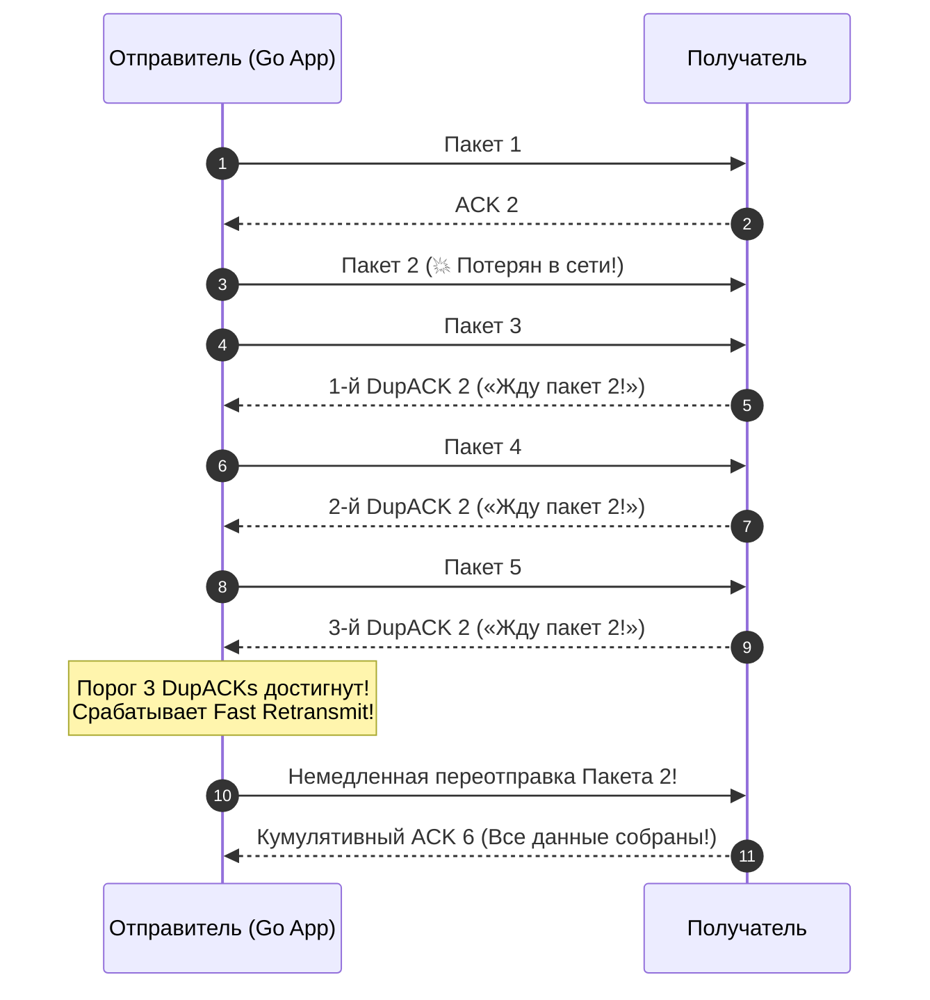
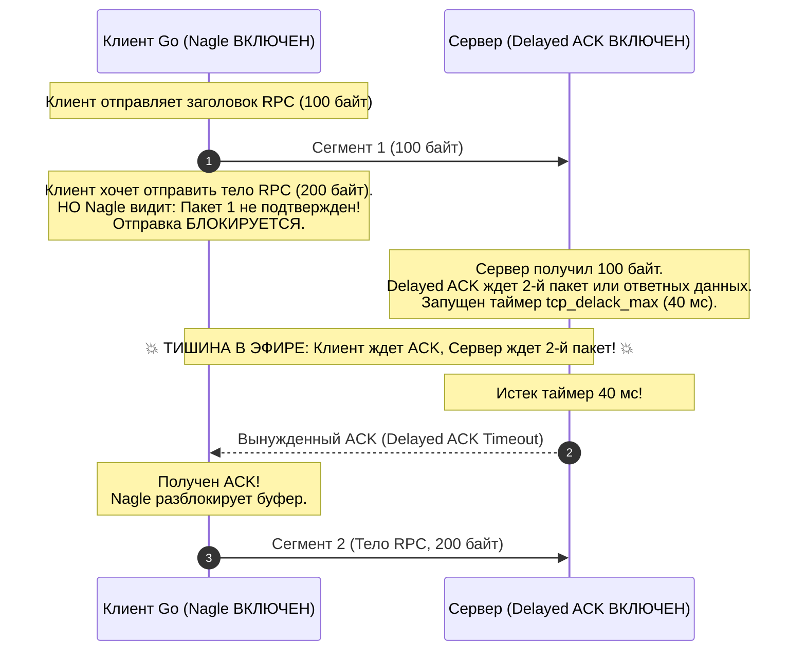
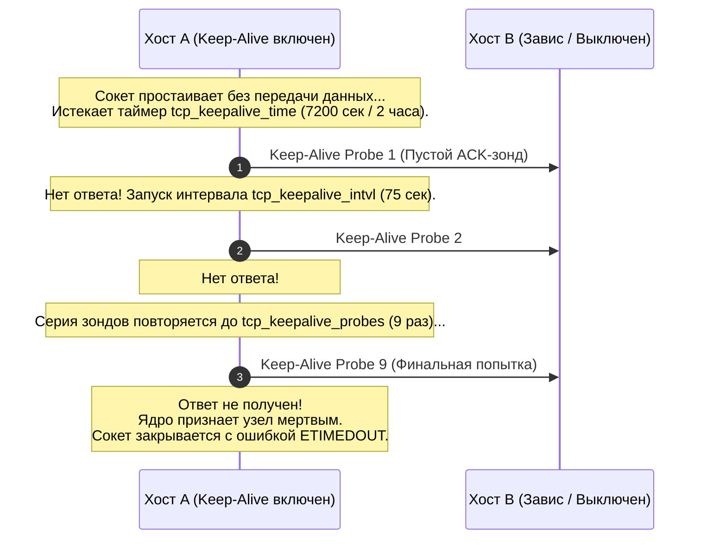

# TCP Retransmission, Keep Alive, Nagle и Delayed ACK

> *«Преждевременная оптимизация — корень всех зол; и все же мы не вправе игнорировать физические законы сетевого кабеля».*    
> — Перефразируя Дональда Кнута

Представьте разговор двух полярных исследователей сквозь свирепый вой арктической метели. Один радист диктует шифрограмму по рации: *«Семь... четыре... девять...»*. Если напарник не крикнул в ответ *«Принял!»*, первый повторяет цифру снова, но уже громче и четче. Если радиоэфир забит помехами, опытный радист не орет в микрофон непрерывно: он выжидает секунду, затем две, четыре, восемь секунд — это экспоненциальное отступление (Exponential Backoff), сохраняющее заряд батареи и не засоряющее эфир.

А теперь представьте, что радист решил сэкономить чернила в блокноте: он не передает цифру сразу, а ждет, пока наберется пять цифр, чтобы продиктовать их одним словом — это **алгоритм Нейгла (Nagle's Algorithm)**. Принимающий радист одновременно решает сэкономить силы голосовых связок и не кричать *«Принял!»* на каждую отдельную цифру, а ждать две цифры подряд — это **отложенное подтверждение (Delayed ACK)**. 

В итоге оба радиста замолкают и напряженно смотрят на рацию: один ждет подтверждения, второй ждет следующей порции данных. Наступает сорокамиллисекундная тишина — классический микро-дедлок, ежедневно замедляющий тысячи непродуманных сетевых сервисов.

В предыдущих лекциях мы изучили основы [[11. TCP Handshake, Flow Control и Congestion Control.md]] и управление скользящими окнами. Но протокол TCP вынужден жить в реальном физическом мире: пакеты теряются на перегруженных коммутаторах, оптоволоконные кабели рвутся, а NAT-роутеры молча стирают таблицы соединений. 

В этой лекции мы детально разберем четыре фундаментальных механизма, определяющих задержки (Latency) и надежность современного бэкенда на Go: **Retransmission**, **алгоритм Нагла**, **Delayed ACK** и **TCP Keep-Alive**.

---

## Введение: Когда TCP начинает «думать»

Для большинства прикладных программистов сетевой стек кажется прозрачным автоматом: байты вошли — байты вышли. Но когда вы проектируете сверхнизколатентные системы (High-Frequency Trading, финансовый клиринг, гейминг в реальном времени, межсервисный gRPC-обмен), TCP перестает быть невидимым. Он начинает «думать» за вас:
* Когда повторно отправить потерянный сегмент, не дожидаясь медленного таймера?
* Стоит ли отправить крошечный пакет из 5 байт прямо сейчас или придержать его в буфере ядра ради экономии сетевых заголовков?
* Жив ли удаленный клиент, который не присылал запросов последние два часа?

Ошибочные допущения в этих вопросах приводят к тому, что ваш сервис на Go внезапно начинает отвечать на простейшие RPC-вызовы не за 1 мс, а за 40–200 мс, либо горутины тысячами зависают в ожидании давно оборванных клиентских сокетов.

---

## TCP Retransmission: Механизмы восстановления

Поскольку протокол IP работает по принципу Best-Effort Delivery, пакеты неизбежно теряются из-за переполнения очередей маршрутизаторов или помех на физической линии. Для обеспечения 100% надежности TCP непрерывно отслеживает подтверждения ACK от получателя.

Если на отправленный сегмент подтверждение не поступает в течение расчетного интервала времени — **RTO (Retransmission Timeout)**, — ядро Linux признает пакет утерянным и выполняет повторную отправку (**Retransmission**). 

Однако ожидание таймера RTO — слишком дорогое удовольствие для современных высокоскоростных сетей. Поэтому стек TCP оперирует двумя взаимодополняющими механизмами восстановления:

```mermaid
flowchart TD
    classDef process  fill:#1e293b,stroke:#38bdf8,stroke-width:1px,color:#f8fafc
    classDef success  fill:#064e3b,stroke:#34d399,stroke-width:1px,color:#f8fafc
    classDef error    fill:#7f1d1d,stroke:#f87171,stroke-width:1px,color:#f8fafc
    classDef warning  fill:#78350f,stroke:#fbbf24,stroke-width:1px,color:#f8fafc
    classDef entry    fill:#1e3a5f,stroke:#38bdf8,stroke-width:2px,color:#f8fafc
    classDef aux      fill:#334155,stroke:#64748b,stroke-width:1px,color:#f8fafc
    classDef system   fill:#312e81,stroke:#a78bfa,stroke-width:1px,color:#f8fafc
    classDef data     fill:#132d29,stroke:#2dd4bf,stroke-width:1px,color:#f8fafc
    classDef network  fill:#881337,stroke:#fb7185,stroke-width:1px,color:#f8fafc
    classDef accent   fill:#1e1b4b,stroke:#818cf8,stroke-width:1px,color:#f8fafc
    Loss["Потеря сегмента в сети"]:::warning --> Detection{"Как обнаружена потеря?"}
    
    Detection -->|Получено 3 дубликата ACK (DupACKs)| FastPath["Fast Retransmit & Fast Recovery<br/>(Мгновенная переотправка за ~1 RTT)"]
    Detection -->|Истек таймер RTO (Таймаут)| SlowPath["RTO Timeout & Exponential Backoff<br/>(Сброс cwnd в 1 MSS, тяжелая деградация)"]
    
    FastPath --> CWND_Half["cwnd = cwnd / 2 (Плавное снижение скорости)"]
    SlowPath --> CWND_Drop["cwnd = 1 MSS, RTO *= 2 (Экспоненциальное замедление)"]
```

---

### 1. Fast Retransmit и Fast Recovery

Что происходит, когда в цепочке из пяти отправленных пакетов (1, 2, 3, 4, 5) теряется пакет №2?  
Пакеты 3, 4 и 5 благополучно долетают до получателя. Но получатель не может подтвердить их получение, так как TCP использует кумулятивный ACK!

Вместо этого получатель на каждый пришедший «не по порядку» пакет (3, 4, 5) формирует повторный пакет подтверждения с номером последнего непрерывного байта — **дублирующий ACK (Duplicate ACK / DupACK)**:  
*«Я получил пакет 3, но мне всё еще нужен пакет 2!»*  
*«Я получил пакет 4, но мне всё еще нужен пакет 2!»*  
*«Я получил пакет 5, но мне всё еще нужен пакет 2!»*



Как только отправитель получает ровно **3 дубликата ACK (3 DupACKs)**, срабатывает механизм **Fast Retransmit (RFC 5681)**:
1. **Почему именно три?** В пакетных сетях пакеты могут приходить с легкой перестановкой мест (Out-of-Order Delivery) из-за многопутевой маршрутизации ECMP. Один или два дубликата могут быть следствием обычной перестановки. Но три дубликата подряд с вероятностью более 99.9% свидетельствуют о реальной потере пакета.
2. **Мгновенная реакция:** Ядро немедленно переотправляет потерянный сегмент №2, не дожидаясь истечения таймера RTO.
3. **Fast Recovery:** Окно перегрузки **`cwnd`** не сбрасывается в пол, а уменьшается пропорционально (в 2 раза), после чего соединение продолжает работу в режиме предотвращения перегрузки. Пропускная способность канала не проседает.

> [!info] Под капотом: Математика RTO и алгоритм Jacobson/Karels
> Расчет времени таймаута повторной передачи **RTO** в ядре Linux базируется на классическом алгоритме Якобсона/Карелса (RFC 6298).  
> Ядро непрерывно измеряет время круговой задержки пакета RTT (Round Trip Time) и сглаживает его:
> $$SRTT = (1 - \alpha) \times SRTT + \alpha \times RTT_{sample}$$
> Одновременно вычисляется дисперсия задержки (RTTVAR):
> $$RTTVAR = (1 - \beta) \times RTTVAR + \beta \times |SRTT - RTT_{sample}|$$
> Итоговое значение таймаута вычисляется по формуле:
> $$RTO = SRTT + \max(\mathbf{K}, \text{DELAYED\_ACK\_TIME}) \times 4$$
> где константа $\mathbf{K} = 4 \times RTTVAR$.  
> Если сеть работает стабильно, RTO держится близко к RTT. Если в сети начинаются скачки задержки (джиттер), RTO адаптивно увеличивается, предотвращая ложные повторные отправки.

---

### 2. Exponential Backoff

Что произойдет, если сеть деградировала настолько, что Fast Retransmit не помог, либо оборвался магистральный провод и потеряна вся пачка сегментов целиком?

Тогда вступает в действие классический таймер RTO. При первом истечении таймера:
1. Окно перегрузки `cwnd` жестко схлопывается до **`1 MSS`** (фактически соединение откатывается к начальной фазе Slow Start);
2. Порог `ssthresh` устанавливается в половину текущего окна;
3. Включается алгоритм **экспоненциального отступления (Exponential Backoff)**:  
   При каждой последующей неудачной попытке значение таймаута удваивается:  
   $$\mathbf{RTO *= 2}$$
   $200 \text{ мс} \to 400 \text{ мс} \to 800 \text{ мс} \to 1600 \text{ мс} \dots$ вплоть до системного максимума **`TCP_RTO_MAX`** (в Linux по умолчанию равен **120 секундам**).
4. Лимит попыток: Количество повторных попыток регламентируется системным параметром ядра **`tcp_retries2`** (по умолчанию 15 попыток). Если за 15 итераций ни один пакет не был подтвержден, ядро принудительно разрывает сокет с ошибкой таймаута (в реальном времени это занимает от 13 до 30 минут!).

---

### 3. Go и настройка Retransmission

Среда исполнения Go не реализует собственный стек повторных передач. Вызовы **`Read()`** и **`Write()`** в Go прозрачно блокируют горутину в неблокирующем сокете через `netpoller`, пока ядро Linux берет на себя всю черновую работу по переотправке пакетов.

Однако системный инженер может управлять этими параметрами на уровне ядра через утилиту `sysctl`:

```bash
# Минимальное значение RTO задается per-route (константа TCP_RTO_MIN в ядре равна 200 мс)
$ ip route change default via 192.168.1.1 dev eth0 rto_min 200ms

# Максимальное количество повторных попыток перед разрывом сокета
$ sysctl -w net.ipv4.tcp_retries2=15
```

В коде на Go при возникновении сетевых сбоев методы возвращают сетевую ошибку типа **`*net.OpError`**. Проверяя встроенные методы `net.Error`, вы можете программно отличить временный сбой от фатального разрыва:

```go
if netErr, ok := err.(net.Error); ok {
    if netErr.Timeout() {
        // Таймаут сетевой операции (сработал дедлайн Go или таймаут ядра)
    }
    // Внимание: метод netErr.Temporary() официально признан deprecated начиная с Go 1.18.
    // Для надежной retry-логики проверяйте netErr.Timeout() или errors.Is(err, context.Canceled).
}
```

---

## Nagle и Delayed ACK: Классический конфликт

В начале 1980-х годов стремительное развитие терминальных сетей Telnet вызвало феномен, получивший название «эпидемия крошечных пакетов» (Small-Packet Problem / Tinygrams). 

Когда пользователь нажимал одну клавишу в терминале, сетевой стек отправлял 1 байт данных, оборачивая его в 20 байт заголовка TCP и 20 байт заголовка IP. В итоге 40 байт накладных расходов несли всего 1 байт полезной нагрузки! Сети захлебывались в служебном мусоре.

Для решения этой проблемы Джон Нейгл в 1984 году разработал элегантный алгоритм, но спустя годы он вступил в жесткое противоречие с другим сетевым механизмом — отложенными подтверждениями.

---

### Алгоритм Нагла (Nagle's Algorithm)

Идея **алгоритма Нагла (RFC 896)** проста: запретить отправку новых мелких сегментов, если в сети уже есть отправленные, но еще не подтвержденные данные. Мелкие данные должны буферизоваться в ядре и объединяться в один большой пакет размером с MSS.

**Строгое правило алгоритма Нагла:**  
Пакет разрешено отправить в сеть **только** при выполнении хотя бы одного из четырех условий:
1. Размер накопленных в буфере отправки данных достиг максимального размера сегмента (**`MSS`**, обычно 1460 байт);
2. Все ранее отправленные пакеты в этом соединении уже **подтверждены квитанцией ACK** (в сети нет данных «в полете»);
3. Буфер отправки полностью свободен;
4. На сокете явно установлен флаг **`TCP_NODELAY`** (принудительное отключение алгоритма).

---

### Delayed ACK

С другой стороны сетевого провода инженеры решили оптимизировать работу принимающей стороны. Зачем отправлять отдельный пустой пакет `ACK` на каждый входящий сегмент, тратя ресурсы процессора и полосу пропускания?

Механизм **`Delayed ACK` (RFC 1122)** предписывает приемнику придержать отправку подтверждения:
1. Либо до прихода **второго полноразмерного пакета данных** (тогда один кумулятивный ACK подтвердит сразу оба сегмента);
2. Либо до момента, когда приложению понадобится отправить ответные данные (тогда флаг ACK будет бесплатно «подсажен» в исходящий пакет данных — техника Piggybacking);
3. Либо до истечения защитного системного таймера (в ядре Linux константа `TCP_DELACK_MAX` составляет около **40 мс**, хотя исторически в BSD достигала 200–500 мс).

---

### Сценарий зависания (Nagle + Delayed ACK)

Что происходит, когда клиент с включенным алгоритмом Нагла отправляет RPC-запрос серверу с включенным Delayed ACK?



1. Клиент выполняет два последовательных вызова записи: сначала отправляет заголовок RPC-запроса (100 байт), затем тело сообщения (200 байт).
2. Заголовок (100 байт) уходит в сеть первым пакетом.
3. Тело (200 байт) попадает в буфер ядра клиента. Алгоритм Нагла видит: размер меньше MSS (200 < 1460), а предыдущий пакет №1 еще не подтвержден! Алгоритм Нагла **замораживает отправку**.
4. Сервер принимает 100 байт. Механизм Delayed ACK ждет второго пакета, чтобы подтвердить оба сразу. Но второй пакет не придет, потому что клиент ждет ACK!
5. **Взаимная блокировка длится ровно 40 миллисекунд**, пока на сервере не сработает аварийный таймаут `tcp_delack_max`. Сервер наконец отправляет пустой ACK, клиент разблокируется и отсылает оставшиеся 200 байт.

> [!warning] Ловушка / Gotcha: 40-миллисекундный ад в микросервисах
> В распределенных системах на базе **gRPC**, HTTP/2 и кастомных протоколах поверх TCP конфликт Nagle и Delayed ACK способен обрушить SLA сервиса.  
> Вместо ожидаемых 0.5–1 мс на запрос внутри одного дата-центра латентность подпрыгивает до **40+ мс** на ровном месте. Под нагрузкой очереди запросов переполняются, пулы соединений исчерпываются, и система входит в штопор.

---

### Решение

Фундаментальное решение этой проблемы — полное отключение алгоритма Нагла на стороне отправителя с помощью установки сокетного флага **`TCP_NODELAY`** (**`TCP_NODELAY=1`**).

В стандартной библиотеке Go авторы языка проявили заботу о разработчиках:  
**В Go флаг `TCP_NODELAY` включен по умолчанию (`true`) для абсолютно всех TCP-соединений**, создаваемых через функции `net.Dial` и `net.Listen`!

Если по какой-то экзотической причине вам требуется явно управлять этим параметром, в Go используется метод `SetNoDelay`:

```go
conn, err := net.Dial("tcp", "api.internal:8080")
if err != nil {
    return err
}
defer conn.Close()

// Явное подтверждение отключения алгоритма Нагла для минимизации задержек
if tcpConn, ok := conn.(*net.TCPConn); ok {
    if err := tcpConn.SetNoDelay(true); err != nil {
        return fmt.Errorf("ошибка установки SetNoDelay: %w", err)
    }
}
```

---

## TCP Keep-Alive: Детекция разрывов

Протокол TCP по своей природе молчалив. Если соединение установлено, но стороны не передают данные, по проводам не передается **ни одного байта**. Если в этот момент экскаватор перережет сетевой кабель или на сервере выдернут шнур питания, операционная система клиента будет абсолютно уверена, что соединение по-прежнему живо и находится в статусе `ESTABLISHED`!

Для автоматического обнаружения таких «мертвых» узлов на уровне ядра существует механизм **TCP Keep-Alive (RFC 1122)**.

---

### Как работает

Когда сокет находится в состоянии простоя (Idle), ядро Linux запускает цепочку контрольных зондов:



Параметры механизма в ядре Linux по умолчанию:
1. **`tcp_keepalive_time` (по умолчанию 7200 сек / 2 часа):** Время простоя соединения, после которого ядро отправляет первый контрольный зонд (ACK-сегмент с номером последовательности на 1 меньше ожидаемого).
2. **`tcp_keepalive_intvl` (по умолчанию 75 сек):** Интервал между повторными зондами, если ответ не был получен.
3. **`tcp_keepalive_probes` (по умолчанию 9 раз):** Количество безответных зондов перед тем, как ядро принудительно разорвет сокет с системной ошибкой **`ETIMEDOUT`**.

> [!warning] Ловушка / Gotcha: Бесполезность дефолтного Keep-Alive за NAT
> Настройки по умолчанию (`tcp_keepalive_time = 7200 секунд`) были придуманы в эпоху университетских сетей 1980-х годов.  
> В современном мире между вашим Go-сервером и клиентом всегда стоят промежуточные узлы: маршрутизаторы с NAT, облачные балансировщики (AWS ALB, Cloud NAT) и межсетевые экраны.  
> Большинство NAT-устройств стирают неактивные записи из своих таблиц трансляции уже через **5–15 минут** неактивности!  
> Если сокет простаивает 2 часа, NAT-шлюз уже давно разорвал сессию. Контрольный зонд ядра через 7200 секунд просто наткнется на сброс `RST` от маршрутизатора. Дефолтный TCP Keep-Alive в современном интернете абсолютно бесполезен без переопределения таймингов!

---

### Настройка в Go

Начиная с релиза Go 1.16, разработчики получили удобный стандартный метод управления периодом Keep-Alive прямо из структуры `net.TCPConn`:

```go
if tcpConn, ok := conn.(*net.TCPConn); ok {
    // Включение механизма проверки активности
    if err := tcpConn.SetKeepAlive(true); err != nil {
        return fmt.Errorf("ошибка SetKeepAlive: %w", err)
    }
    
    // Агрессивный интервал: проверка каждые 30 секунд вместо 2 часов!
    if err := tcpConn.SetKeepAlivePeriod(30 * time.Second); err != nil {
        return fmt.Errorf("ошибка SetKeepAlivePeriod: %w", err)
    }
}
```

---

### TCP Keep-Alive vs Application Heartbeat

В реальных распределенных архитектурах системные инженеры четко разделяют сетевые зонды ядра и прикладные проверки пульса:

| Критерий сравнения | Системный TCP Keep-Alive | Прикладной пульс (Application Heartbeat) |
|---|---|---|
| **Уровень абстракции** | Уровень ядра L4 (Сетевой стек ОС) | Прикладной уровень L7 (Go Runtime) |
| **Что проверяет** | Жив ли сетевой стек и ядро удаленной ОС | Жив ли процесс приложения и его event-loop |
| **Работа через NAT/Прокси** | Может блокироваться и сбрасываться middlebox | Проходит через любые L7-прокси, Ingress и WAF |
| **Реакция на зависание сервиса** | Ответит `ACK`, даже если приложение мертво в дедлоке | Не ответит, если рантайм приложения завис |
| **Реализация в индустрии** | Опции сокета Linux `SO_KEEPALIVE` | gRPC **`KeepaliveParams`**, HTTP/2 PING-фреймы, Redis **`PING/PONG`** |

> [!tip] Собеседование: TCP Keep-Alive против Application Heartbeat
> **Вопрос:** Почему в микросервисной архитектуре на Go нельзя полагаться только на системный `TCP Keep-Alive` и обязательно настраивают прикладной `Heartbeat` (например, в gRPC)?  
> **Ответ:**  
> Системный TCP Keep-Alive обрабатывается ядром операционной системы автономно. Если Go-процесс удаленного сервера намертво завис в бесконечном цикле, исчерпал память или заблокировался во взаимной блокировке (Deadlock), сетевой стек ядра Linux **всё равно продолжит автоматически отвечать ACK на Keep-Alive зонды**!  
> Для клиента соединение будет казаться абсолютно здоровым, хотя сервис физически не способен обработать ни одного запроса.  
> Прикладной Heartbeat (gRPC `KeepaliveParams`, WebSocket Ping/Pong) обрабатывается самим приложением на уровне горутин: если сервис завис, он не вернет PONG, и клиент своевременно разорвет мертвый сокет и переключится на здоровый инстанс.

---

## Go-интеграция и тюнинг в production

В Go работа с сетевыми параметрами распределяется по двум ключевым уровням:
1. **Socket Options (`net.Conn`):** Управление на уровне прикладного сокета через методы `SetNoDelay`, `SetKeepAlive`, `SetKeepAlivePeriod`, `SetReadBuffer`, `SetWriteBuffer`.
2. **Параметры ядра Linux (`sysctl`):** Глобальные настройки сетевого стека — `tcp_rto_min`, `tcp_delack_max`, `tcp_keepalive_*`, `tcp_slow_start_after_idle`.

### Практические рекомендации для бэкенда
- **Для Low-Latency RPC и микросервисов:** Всегда оставляйте включенным **`SetNoDelay(true)`** (по умолчанию в Go).
- **Для Bulk-Transfer (файлы, большие payload):** Использование **`SetNoDelay(false)`** может повысить пропускную способность за счет объединения пакетов и уменьшения накладных расходов на заголовки.
- **Тюнинг задержек ACK:** Для интерактивных сервисов с высокой частотой запросов настройки ядра `sysctl -w net.ipv4.tcp_delack_min=1` и `tcp_delack_max=1` снижают задержки подтверждений до минимума.
- **Пулы соединений в `net/http.Transport` и `gRPC`:** Пул соединений переиспользует сокеты. Настройки, примененные к `conn`, действуют с момента первого вызова `Dial`. Для многоинтерфейсных серверов и высоконагруженных контейнеров в Kubernetes используйте системные сокетные опции **`SO_REUSEPORT`** и **`SO_BINDTODEVICE`**.

---

## Итоги и вопросы на собеседовании

Механизмы повторной передачи, буферизации и контроля активности определяют физическую надежность TCP-соединений в продакшене:

1. **Fast Retransmit & Recovery:** При получении 3 дубликатов ACK ядро мгновенно переотправляет потерянный сегмент и снижает окно `cwnd` в 2 раза, не дожидаясь долгого таймаута RTO.
2. **Exponential Backoff:** При серии тяжелых потерь таймер RTO удваивается при каждой попытке (`RTO *= 2`), защищая сеть от шторма повторных пакетов.
3. **Конфликт Nagle + Delayed ACK:** Буферизация мелких пакетов отправителем в сочетании с 40-миллисекундным ожиданием подтверждения приемником порождает искусственные микрозависания. В Go проблема решена включением `TCP_NODELAY` по умолчанию.
4. **Ограничения TCP Keep-Alive:** Дефолтный таймаут в 2 часа бесполезен в современных облаках из-за агрессивных таймаутов NAT. Требуется явное уменьшение периода через `SetKeepAlivePeriod` и обязательное внедрение прикладных проверок пульса (Application Heartbeat).
5. **Роль Go Netpoller:** Среда исполнения Go не дублирует логику TCP, а делегирует ее ядру Linux, переводя горутины в состояние ожидания событий в `epoll`, обеспечивая масштабирование на сотни тысяч сокетов.

> [!tip] Собеседование: Каверзные вопросы по TCP Retransmission и сокетам
> **Вопрос:** Как Go обрабатывает ретрансмиссии TCP и можно ли программно изменить алгоритм управления перегрузкой для отдельного сокета?  
> **Ответ:** Go не реализует собственный TCP-стек на прикладном уровне. Все ретрансмиссии, RTO-таймеры и Fast Retransmit прозрачно выполняет ядро Linux. Приложение на Go блокируется в `Read()` или `Write()` до тех пор, пока `netpoller` не получит системное событие `epoll`. Настройку параметров TCP можно производить глобально через `sysctl`, либо для конкретного сокета через вызов **`syscall.Setsockopt`** (в Go через `Control` сокета) с флагами **`TCP_CONGESTION`** (для смены алгоритма на BBR или CUBIC) и **`TCP_RTO_MIN`**.

Мы изучили механизмы восстановления и тонкие настройки отдельных TCP-соединений. Но как операционная система управляет глобальным окном перегрузки `cwnd` на уровне целых магистральных каналов? Какие алгоритмы — классический Reno, кубический CUBIC или революционный BBR от Google — правят современным интернетом?

В следующей лекции мы детально погрузимся в математику и практику алгоритмов контроля перегрузки в [[13. Congestion Algorithms. Reno, Cubic, BBR.md]].