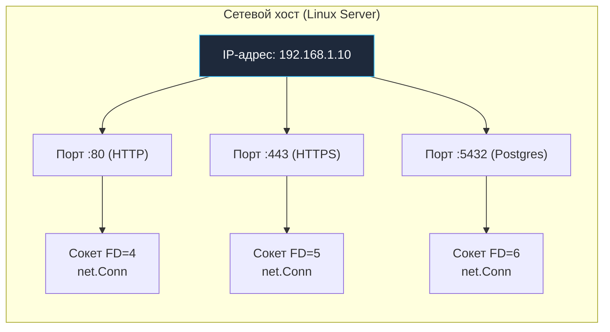
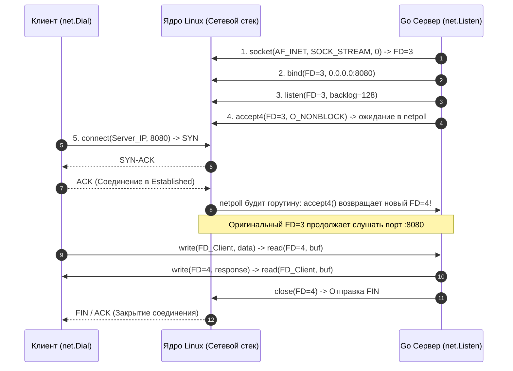
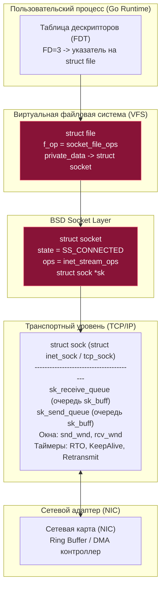
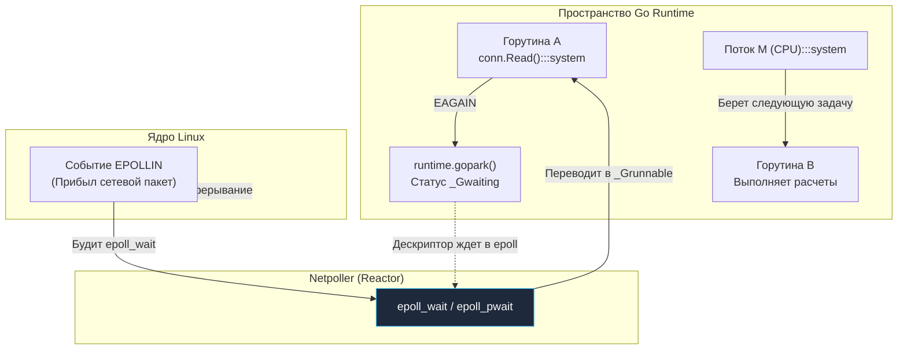

## Порты и сокеты: Логические и физические точки контакта

> *"В Unix всё является файлом; если что-то не является файлом — это процесс."*  
> — Фундаментальный принцип архитектуры Unix

Когда мы пишем на Go лаконичный сервер `http.ListenAndServe(":8080", handler)`, язык бережно скрывает под капотом целую вселенную системных концепций, изобретенных в начале 1980-х годов в университете Беркли (BSD). 

Для бэкенд-разработчика понимание портов и сокетов — это мост между абстрактным HTTP-сервером и реальным сетевым стеком операционной системы. В Go мы редко пишем сырые `socket()` вызовы вручную, но производительность, стабильность и масштабируемость вашего сервиса напрямую зависят от того, как вы понимаете их внутреннее устройство.

---

### Что такое порт?

Сетевой кабель или Wi-Fi антенна доставляют пакеты на конкретную физическую сетевую карту с определенным MAC- и IP-адресом. Но на компьютере одновременно работают десятки программ: браузер, база данных PostgreSQL, демон SSH, мессенджер и ваш собственный Go-сервис. Как ядро операционной системы понимает, какому именно процессу предназначен входящий пакет?

**Порт** — это 16-битное логическое число (от `0` до `65535`), которое идентифицирует конкретное приложение или службу внутри одного IP-узла. Порт не существует в физической сети; он является исключительно механизмом мультиплексирования на уровне хоста.

Все 65 536 портов разделены IANA на три стандартизированные категории:
*   **Well-known ports (0–1023):** Системные порты. Исторически требуют привилегий суперпользователя `root` (или Linux-capability `CAP_NET_BIND_SERVICE`) для биндинга. Это защищает систему от перехвата привилегированных служб обычными непривилегированными процессами: HTTP (`80`), HTTPS (`443`), SSH (`22`), DNS (`53`).
*   **Registered ports (1024–49151):** Зарегистрированные порты. Назначаются IANA для конкретных общеизвестных протоколов и баз данных: PostgreSQL (`5432`), Redis (`6379`), MySQL (`3306`), gRPC/HTTP-серверы (`8080`, `8443`). Не требуют прав root.
*   **Ephemeral ports (49152–65535):** Эфемерные (динамические) порты. Выделяются ядром ОС автоматически для исходящих клиентских соединений, когда ваша программа делает исходящий вызов `net.Dial` к внешнему API или базе данных.

В Go порт указывается строкой в вызове `net.Listen(":8080")` (или `net.Listen("tcp", ":8080")`). Язык автоматически обрабатывает как IPv4, так и IPv6 (**`dual-stack`**), создавая сокет с поддержкой обоих протоколов (через флаг ядра `IPV6_V6ONLY=0`), если ядро это поддерживает.

---

### Что такое сокет?

Если IP-адрес — это адрес жилого дома, а порт — номер квартиры, то **сокет** — это открытая дверь этой квартиры, через которую идет непрерывный разговор.

**Сокет** — это конечная точка взаимодействия (endpoint) в сетевом стеке, абстрагированная через классический **BSD Socket API**. С точки зрения транспортного протокола уникальность любого сетевого соединения определяется кортежем:

$$\mathbf{IP + Port + Protocol} \quad \text{или полный 5-tuple: } \{\text{Proto, SrcIP, SrcPort, DstIP, DstPort}\}$$

В классическом языке C сокет — это просто дескриптор файла (**`FD`**, *File Descriptor*, целое число `int`). В Go стандартная библиотека предоставляет абстракцию **`net.Conn`** — интерфейс, инкапсулирующий сырой сокет, буферы, дедлайны таймаутов и состояние соединения.



---

## Socket API: Жизненный цикл и системные вызовы

Независимо от языка программирования, базовый жизненный цикл TCP-сервиса опирается на классические системные вызовы BSD: `socket`, `bind`, `listen`, `accept`, `connect`. В Go они бережно упакованы в элегантный сетевой пакет **`net`**, но понимание их работы критично для отладки высоконагруженных систем.

```go
// Идиоматичный Go-код, скрывающий под капотом каскад системных вызовов ядра
package main

import (
	"log"
	"net"
)

func main() {
	// 1. Создает сокет, связывает с адресом и переводит в режим прослушивания
	// Вызовы: socket() -> bind() -> listen()
	ln, err := net.Listen("tcp", ":8080")
	if err != nil {
		log.Fatalf("listen failed: %v", err)
	}
	defer ln.Close() // Вызовет close() syscall и освободит FD

	for {
		// 2. Ожидает входящего клиента и извлекает готовое соединение из очереди ядра
		// Вызов: accept4()
		conn, err := ln.Accept()
		if err != nil {
			log.Printf("accept failed: %v", err)
			continue
		}

		// 3. Запускает легковесную горутину для обслуживания клиента
		// Каждая goroutine управляет своим собственным сетевым соединением и FD
		go handleConn(conn)
	}
}

func handleConn(c net.Conn) {
	defer c.Close()
	buf := make([]byte, 1024)
	for {
		// Вызовы read() / write() в неблокирующем режиме под управлением netpoller
		n, err := c.Read(buf)
		if err != nil {
			return
		}
		if _, err := c.Write(buf[:n]); err != nil {
			return
		}
	}
}
```

Разберем каждый системный вызов ядра Linux в отдельности:



---

### 1. `socket()` → `socket()` syscall

Создает новую конечную точку взаимодействия и выделяет структуру сокета в ядре.
```c
int socket(int domain, int type, int protocol);
```
- Возвращает **File Descriptor (FD)** — неотрицательное целое число, служащее индексом в таблице открытых дескрипторов процесса.
- В Go создаваемый FD немедленно переводится в неблокирующий режим (**`O_NONBLOCK`**) с помощью флага `SOCK_NONBLOCK` или вызова `fcntl(fd, F_SETFL, O_NONBLOCK)`. Это принципиально для архитектуры Go: среда выполнения никогда не позволяет системным потокам ОС зависать на блокирующих сокетах!

---

### 2. `bind()` → `bind()` syscall

Связывает созданный безымянный сокет с локальным сетевым адресом и портом (`sockaddr_in` или `sockaddr_in6`). 
```c
int bind(int sockfd, const struct sockaddr *addr, socklen_t addrlen);
```
Если порт уже используется другим процессом или удерживается ядром в состоянии `TIME_WAIT`, системный вызов завершается с ошибкой **`EADDRINUSE`** (*Address already in use*).

> [!tip] Собеседование
> **Вопрос:** Как перезапустить сервер без мучительного ожидания `TIME_WAIT` (которое по умолчанию может длиться 60 секунд)?  
> **Ответ:** Использовать опцию сокета **`SO_REUSEADDR`**.  
> По умолчанию ядро запрещает вызов `bind()` на порт, если хотя бы одно закрытое соединение с этим портом находится в состоянии `TIME_WAIT`. Включение `SO_REUSEADDR` явно разрешает повторный биндинг к порту, освобождая вас от ожидания.  
> 
> В Go это настраивается через **`syscall.ListenConfig`** с использованием функции **`Control`**:
> ```go
> lc := net.ListenConfig{
>     Control: func(network, address string, c syscall.RawConn) error {
>         return c.Control(func(fd uintptr) {
>             syscall.SetsockoptInt(int(fd), syscall.SOL_SOCKET, syscall.SO_REUSEADDR, 1)
>         })
>     },
> }
> ln, err := lc.Listen(context.Background(), "tcp", ":8080")
> ```

---

### 3. `listen()` → `listen()` syscall (только TCP)

Переводит сокет из пассивного закрытого состояния в активное состояние **`LISTEN`**, объявляя ядру готовность принимать входящие клиентские подключения:
```c
int listen(int sockfd, int backlog);
```
Параметр **`backlog`** задает максимальную длину очереди входящих соединений, ожидающих подтверждения или обработки.

> [!warning] Ловушка / Gotcha: Реальность backlog и somaxconn
> В современных версиях ядра Linux параметр `backlog` в функции `listen(sockfd, backlog)` определяет максимальный размер очереди полностью установленных соединений (*Accept Queue*), прошедших трехстороннее рукопожатие, но еще не извлеченных приложением через `accept()`.
> 
> Однако значение `backlog`, переданное процессом, **никогда не может превысить системный лимит ядра `somaxconn`**! Если `listen(5)` вызвать с backlog=5, ядро все равно пропустит до `somaxconn` соединений, если `somaxconn` больше (по умолчанию 128, часто меняется на 65535 в прод-системах). Если приложение вызывает `listen(fd, 1024)`, но системный параметр ядра равен 128:
> ```bash
> sysctl net.core.somaxconn
> # Вывод: net.core.somaxconn = 128
> ```
> То реальная длина очереди будет урезана ядром ровно до 128. Если очередь переполнится в момент пиковой нагрузки, ядро начнет игнорировать входящие ACK от клиентов, заставляя их повторять рукопожатия и взвинчивая P99 задержки!  
> 
> **Решение для production:** Увеличивайте системный лимит в Linux через `sysctl net.core.somaxconn`:
> ```bash
> sudo sysctl -w net.core.somaxconn=65535
> ```

---

### 4. `accept()` → `accept4()` syscall

Берет готовое соединение из очереди, созданной клиентским `connect()`. Извлекает первое полностью установленное соединение из очереди *Accept Queue* сокета-слушателя:
```c
int accept4(int sockfd, struct sockaddr *addr, socklen_t *addrlen, int flags);
```
- Системный вызов создает и возвращает **совершенно новый FD** для установленного соединения (например, `FD=4`).
- Оригинальный сокет-слушатель (`FD=3`) остается в неизменном состоянии `LISTEN`, продолжая принимать новых клиентов на порту 8080!
- В Go используется оптимизированный вызов Linux **`accept4`** с флагами `SOCK_CLOEXEC | SOCK_NONBLOCK`. Это позволяет атомарно за один системный вызов создать дескриптор, уже переведенный в неблокирующий режим и защищенный от утечки в дочерние процессы при `fork`/`exec`.
- Вызов **`ln.Accept()`** в Go является неблокирующим для системного потока ОС. Если очередь соединений пуста, горутина регистрируется в **`netpoll`** и засыпает до прихода аппаратного прерывания и события **`EPOLLIN`**.

---

### 5. `read()` / `write()` / `close()`

Передача данных осуществляется через системные вызовы `read(2)` и `write(2)` (или `recv`/`send`):
- Запись (`write`) помещает байты в системный кольцевой буфер отправки ядра сокета.
- Чтение (`read`) извлекает байты из буфера приема ядра.

Системный вызов **`close()`** на сокете инициирует корректное завершение соединения (Four-Way Handshake) с отправкой пакета `FIN`. 
Однако `close()` закрывает сокет в обоих направлениях. Если вам нужно закрыть отправку данных, но продолжить чтение ответа от сервера (Half-Close), в Unix используется системный вызов **`shutdown(sockfd, SHUT_WR)`**. В Go для этого используется метод `conn.(*net.TCPConn).CloseWrite()`.

---

## Под капотом: Сокеты в Linux

Какую физическую структуру представляет собой сетевой сокет внутри операционной системы?

В архитектуре ядра Linux сетевой сокет является многоуровневым гибридным объектом ядра, связывающим виртуальную файловую систему (VFS) с сетевым стеком и драйвером физического устройства:



1. **`struct file`**: Поскольку сокет проецируется на файловый дескриптор, ядро создает объект файла VFS. Его поле `private_data` содержит указатель на сетевой сокет.
2. **`struct socket`**: Абстракция интерфейса BSD Socket. Содержит указатель **`struct file *file`** и указатель на транспортный сокет **`struct sock *sk`**.
3. **`struct sock`**: Фундаментальное ядро сетевого стека Linux. Именно здесь живут:
   - **`sk_receive_queue`** и **`sk_send_queue`**: Двусвязные очереди сетевых пакетов **`sk_buff`** в памяти ядра.
   - Окна передачи и приема: окно отправки **`snd_wnd`** и окно приема **`rcv_wnd`**.
   - Сетевые таймеры: повторной передачи (**`RTO`**), проверки доступности (*keepalive*) и ожидания закрытия.
4. **Копирование данных в памяти:**  
   При вызове `read()` или `write()` ядро осуществляет копирование памяти между адресным пространством ядра и пользовательским буфером процесса с помощью функций **`copy_to_user`** и **`copy_from_user`**. Это требует переключения контекста процессора из User Space (Ring 3) в Kernel Space (Ring 0) и обратно.

---

## Go и Socket API: Абстракция и Netpoller

Традиционные серверы на C или Java (до эры Project Loom) выделяли один системный поток ОС (*pthread*) на каждое входящее соединение. При 10 000 соединений это приводило к коллапсу: 10 000 потоков съедали гигабайты памяти на свои стеки (по 1–8 МБ каждый), а планировщик ядра захлебывался в непрерывных переключениях контекста потоков.

В Go сетевая архитектура спроектирована абсолютно иначе. Go использует **Netpoller** — неблокирующий реактор событий ввода-вывода, интегрированный непосредственно в планировщик рантайма Go (M:N Scheduler). В зависимости от операционной системы Netpoller опирается на:
- **`epoll`** в Linux;
- **`kqueue`** в BSD и macOS;
- **`IOCP`** (*I/O Completion Ports*) в Windows.

---

### Как Go обрабатывает тысячи соединений?

Механика работы Netpoller в Go выглядит следующим образом:

1. При создании сокета через `net.Listen()` или `net.Dial()` рантайм Go немедленно переводит файловый дескриптор в режим **`O_NONBLOCK`**.
2. Дескриптор сокета регистрируется в дескрипторе `epoll` с помощью системного вызова **`epoll_ctl`** (через вызов `epoll_ctl(epoll_ctl, fd, EPOLL_CTL_ADD)`).
3. Когда горутина вызывает `conn.Read()` или `conn.Write()`, а системный буфер пуст/полон, системный вызов ядра мгновенно возвращает ошибку `EAGAIN` или `EWOULDBLOCK`.
4. Рантайм Go перехватывает `EAGAIN`. Функция **`runtime.gopark`** паркует текущую горутину, переводя её структуру `g` в состояние ожидания (`_Gwaiting`). Системный поток ОС (`M`) **не блокируется**! Он немедленно берет из локальной очереди `P` другую готовую горутину и продолжает выполнять полезную работу.
5. Сетевая карта получает пакет от клиента, генерирует аппаратное прерывание, и ядро помещает данные в буфер сокета `sk_receive_queue`.
6. Фоновый поток рантайма Go, выполняющий **`epoll_wait`** (или **`epoll_pwait`**), получает уведомление о готовности дескриптора (**`EPOLLIN`** или **`EPOLLOUT`**).
7. Netpoller находит горутину, привязанную к этому дескриптору, переводит её в состояние готовности (`_Grunnable`) и возвращает в очередь планировщика. Горутина просыпается ровно в месте прерванного вызова `conn.Read()` с готовыми данными в буфере!

Благодаря этой схеме один Go-сервер может легко удерживать **сотни тысяч** одновременных соединений:
- Начальный размер стека горутины составляет всего **~2 КБ** (против мегабайт у потоков ОС).
- Отсутствуют дорогостоящие системные переключения контекста потоков ОС.
- Для программиста код выглядит абсолютно синхронным, последовательным и читаемым!



> [!info] Под капотом
> Сетевой полинг Netpoller в Linux использует `epoll` в режиме граничного срабатывания (Edge-Triggered, флаг **`EPOLLET`** вместе с `EPOLLIN | EPOLLOUT | EPOLLRDHUP`). Дескриптор регистрируется в ядре один раз, и событие генерируется только при изменении состояния готовности сокета. Это минимизирует количество системных вызовов к ядру и позволяет планировщику Go эффективно мультиплексировать сотни тысяч сетевых соединений без накладных расходов на постоянную перерегистрацию.

---

### Сравнение с другими языками

| Язык / Технология | Модель сетевого ввода-вывода | Достоинства | Недостатки |
|---|---|---|---|
| **Go** | Асинхронный Netpoller + M:N горутины | Синхронный элегантный код, минимальное потребление RAM (2 КБ на сокет), масштабирование до сотен тысяч соединений | Минимальный оверхед рантайма на интеграцию с планировщиком |
| **C / C++** | Ручное управление `epoll` / `io_uring` | Предельная производительность на такт процессора, нулевой оверхед | Высокая сложность ручной диспетчеризации событий. Ошибка в `select()`/`poll()` или пропущенное `close()` ведет к утечке FD и ошибке **`EMFILE`** (*Too many open files*) |
| **Java** | `ServerSocketChannel` + `Selector` (NIO) / Виртуальные потоки (Loom) | Мощная экосистема, высокая производительность ввода-вывода | Необходимость ручного управления позицией/лимитом в **`ByteBuffer`**, паузы Garbage Collector при аллокации сокетных объектов |
| **PHP** | Исторически блокирующий **`fsockopen`**; современные Swoole / RoadRunner | Простота развертывания, изоляция запросов | В классическом PHP процесс блокируется целиком; во фреймворках (Swoole, RoadRunner) используется надстройка асинхронного цикла над C-библиотеками |

---

> [!tip] Собеседование
> **Вопрос:** «Что происходит при вызове `close()` на TCP-сокете, находящемся в активном состоянии `ESTABLISHED`? Как форсировать мгновенный сброс соединения без прохождения фазы TIME_WAIT?»  
> **Ответ:**  
> «При обычном вызове `close()` ядро запускает процедуру Four-Way Handshake:
> 1. Отправитель посылает пакет `FIN` и переходит в состояние `FIN_WAIT_1`, а затем в `FIN_WAIT_2`.
> 2. Приемник отправляет `ACK`, переходит в `CLOSE_WAIT`, а после завершения локальных операций шлет свой `FIN`.
> 3. Инициатор закрытия отвечает `ACK` и зависает в состоянии **`TIME_WAIT`** на время $2\text{MSL}$ (обычно 60 секунд), чтобы гарантировать доставку запоздавших пакетов и защитить следующие соединения с этим же 5-tuple.
> 
> Однако, если мы хотим сбросить соединение мгновенно (например, при аварийной перезагрузке или атаке Slowloris), используется опция сокета **`SO_LINGER`** со структурой, где время ожидания равно нулю:
> ```go
> // Экстренный сброс: l_onoff=1, l_linger=0
> linger := syscall.Linger{
>     Onoff:  1,
>     Linger: 0,
> }
> syscall.SetsockoptLinger(int(fd), syscall.SOL_SOCKET, syscall.SO_LINGER, &linger)
> ```
> В Go это делается через `syscall.SetsockoptLinger()`. При закрытии сокета с параметрами `l_onoff=1, l_linger=0` ядро немедленно отправляет клиенту пакет **`RST`** (*Reset*), отбрасывает любые буферизованные данные и мгновенно уничтожает дескриптор сокета, минуя фазу `TIME_WAIT`!»

---

## Итог

1. **Порт** — логический 16-битный мультиплексор внутри сетевого хоста (0–65535). **Сокет** — конечная точка соединения, представляющая собой 5-tuple: протокол, локальный IP/порт и удаленный IP/порт.
2. **Socket API** опирается на классический стек системных вызовов: `socket` (создать), `bind` (связать с портом), `listen` (слушать входящие), `accept` (извлечь готовое) и `connect` (инициировать связь).
3. **Под капотом** сокет — это объект ядра (`struct socket` -> `struct sock`) с кольцевыми буферами. Каждый `read/write` стоит переключения контекста и копирования данных через `copy_to_user` / `copy_from_user`.
4. **Магия Go Netpoller:** Перевод дескрипторов в `O_NONBLOCK` и тесная интеграция с **`epoll`** / **`kqueue`** позволяют горутинам спать во время ожидания сетевых пакетов, освобождая потоки процессора и экономя ресурсы машины.
5. **Оптимизация:** Опция `SO_REUSEADDR` для мгновенного перезапуска, увеличение системного параметра ядра `sysctl net.core.somaxconn` для предотвращения переполнения очередей backlog, контроль размера очереди `accept()`, и понимание разницы между `close()` и `shutdown()` критичны для стабильных сервисов.

Мы разобрали, как операционная система и среда выполнения Go связывают байты сокетов с кодом нашего приложения. Но как клиент узнает, по какому именно IP-адресу искать нужный сервер, если у него есть лишь строка `api.example.com`? В следующей статье мы исследуем всемирную распределенную систему разрешения имен: [[16. DNS. Как работает преобразование имени в IP.md]].