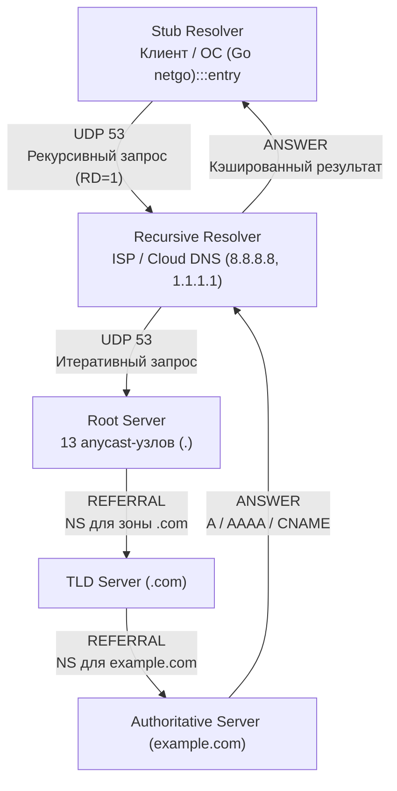
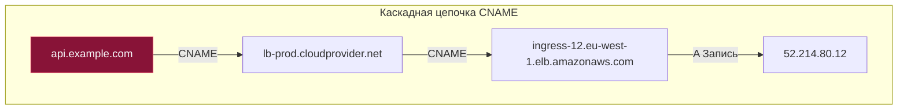
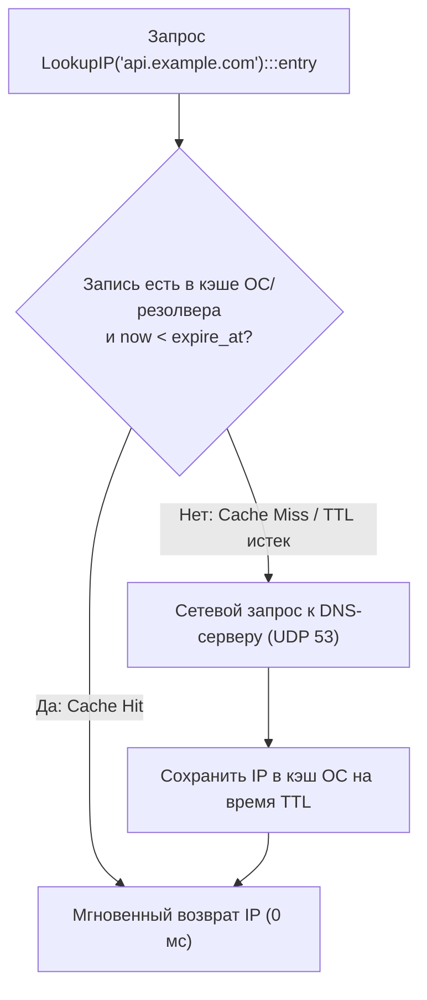

## Двоичный формат DNS-пакета и UDP-транспорт

> *"Сложные протоколы рушатся под собственной тяжестью; простые протоколы переживают эпохи."*  
> — Принцип архитектуры Unix

В предыдущей статье мы познакомились с общими контурами службы доменных имен. Теперь снимем защитный кожух и заглянем непосредственно в сетевой провод. Что представляет собой DNS-запрос на уровне байтов?

Исторически DNS построен поверх транспортного протокола **UDP**, использующего порт **`53`**. Выбор UDP в 1983 году был гениальным инженерным расчетом: отсутствие фазы установления соединения (Handshake) означает нулевую задержку (**0 RTT**) перед передачей данных. Клиент формирует один компактный пакет, отправляет его на резолвер и мгновенно получает один пакет с ответом. Для глобальной системы, обрабатывающей триллионы запросов в сутки, это единственный способ не утонуть в накладных расходах.

Любой DNS-пакет (как запрос, так и ответ) упаковывается в строгую бинарную структуру, состоящую из фиксированного заголовка и четырех переменных секций:

```
 0                   1                   2                   3
 0 1 2 3 4 5 6 7 8 9 0 1 2 3 4 5 6 7 8 9 0 1 2 3 4 5 6 7 8 9 0 1
+-+-+-+-+-+-+-+-+-+-+-+-+-+-+-+-+-+-+-+-+-+-+-+-+-+-+-+-+-+-+-+-+
|          ID (16 бит)          |QR| Opcode |AA|TC|RD|RA| Z |RCODE|
+-+-+-+-+-+-+-+-+-+-+-+-+-+-+-+-+-+-+-+-+-+-+-+-+-+-+-+-+-+-+-+-+
|       QDCOUNT (Вопросы)       |       ANCOUNT (Ответы)        |
+-+-+-+-+-+-+-+-+-+-+-+-+-+-+-+-+-+-+-+-+-+-+-+-+-+-+-+-+-+-+-+-+
|      NSCOUNT (Авторитеты)     |     ARCOUNT (Дополнительно)   |
+-+-+-+-+-+-+-+-+-+-+-+-+-+-+-+-+-+-+-+-+-+-+-+-+-+-+-+-+-+-+-+-+
|                    Question Section (Вопрос)                  |
+-+-+-+-+-+-+-+-+-+-+-+-+-+-+-+-+-+-+-+-+-+-+-+-+-+-+-+-+-+-+-+-+
|                     Answer Section (Ответы)                   |
+-+-+-+-+-+-+-+-+-+-+-+-+-+-+-+-+-+-+-+-+-+-+-+-+-+-+-+-+-+-+-+-+
|                  Authority Section (Авторитеты)               |
+-+-+-+-+-+-+-+-+-+-+-+-+-+-+-+-+-+-+-+-+-+-+-+-+-+-+-+-+-+-+-+-+
|                 Additional Section (Дополнительно)            |
+-+-+-+-+-+-+-+-+-+-+-+-+-+-+-+-+-+-+-+-+-+-+-+-+-+-+-+-+-+-+-+-+
```

### Анатомия заголовка: **`Header (12 байт)`**

Заголовок всегда занимает ровно 12 байт:
1. **`ID` (16 бит):** Случайный идентификатор транзакции. Поскольку UDP не имеет состояния, клиент использует это число, чтобы сопоставить входящий асинхронный ответ со своим ранее отправленным запросом.
2. **Битовые флаги (16 бит):**
   - **`QR` (1 бит):** `0` — запрос (Query), `1` — ответ (Response).
   - **`Opcode` (4 бита):** Тип операции (`0` — стандартный запрос QUERY, `4` — NOTIFY, `5` — UPDATE).
   - **`AA` (Authoritative Answer, 1 бит):** Взводится сервером, если он является авторитетным владельцем запрашиваемой зоны.
   - **`TC` (Truncated, 1 бит):** Сигнал обрезки пакета из-за превышения допустимого размера буфера.
   - **`RD` (Recursion Desired, 1 бит):** Клиент просит резолвер выполнить рекурсивный поиск.
   - **`RA` (Recursion Available, 1 бит):** Сервер сообщает, что поддерживает рекурсивные запросы.
   - **`RCODE` (Response Code, 4 бита):** Статус ответа: `0` — `NOERROR`, `2` — `SERVFAIL` (сбой сервера), `3` — `NXDOMAIN` (домен не существует).
3. **Счетчики записей (по 16 бит каждый):**
   - `QDCOUNT` — количество записей в секции `Question`.
   - `ANCOUNT` — количество записей в секции `Answer`.
   - `NSCOUNT` — количество записей в секции `Authority`.
   - `ARCOUNT` — количество записей в секции `Additional`.

После заголовка следуют секции данных:
- **`Question`:** Запрашиваемое доменное имя (закодированное как последовательность меток с префиксами длины), класс сети (`IN` — Internet) и тип записи (`A`, `AAAA`, `MX` и т.д.).
- **`Answer, Authority, Additional`:** Массивы ресурсных записей (**Resource Records, RR**). Каждая запись содержит: имя узла, тип, класс, **`TTL`** (32 бита), длину поля данных `RDLENGTH` (16 бит) и сами сырые байты данных `RDATA` (например, 4 байта для IPv4 или 16 байт для IPv6).

```mermaid
flowchart TD
    classDef process  fill:#1e293b,stroke:#38bdf8,stroke-width:1px,color:#f8fafc
    classDef success  fill:#064e3b,stroke:#34d399,stroke-width:1px,color:#f8fafc
    classDef error    fill:#7f1d1d,stroke:#f87171,stroke-width:1px,color:#f8fafc
    classDef warning  fill:#78350f,stroke:#fbbf24,stroke-width:1px,color:#f8fafc
    classDef entry    fill:#1e3a5f,stroke:#38bdf8,stroke-width:2px,color:#f8fafc
    classDef aux      fill:#334155,stroke:#64748b,stroke-width:1px,color:#f8fafc
    classDef system   fill:#312e81,stroke:#a78bfa,stroke-width:1px,color:#f8fafc
    classDef data     fill:#132d29,stroke:#2dd4bf,stroke-width:1px,color:#f8fafc
    classDef network  fill:#881337,stroke:#fb7185,stroke-width:1px,color:#f8fafc
    classDef accent   fill:#1e1b4b,stroke:#818cf8,stroke-width:1px,color:#f8fafc
    subgraph PKT["Структура DNS-пакета (RFC 1035)"]
        H["Header (12 байт): ID, QR, Opcode, AA, TC, RD, RA, RCODE, Счетчики"]
        Q["Question: Имя (QNAME) + Тип (QTYPE) + Класс (QCLASS)"]
        A["Answer: Найденные ресурсные записи (A, AAAA, CNAME) + TTL"]
        NS["Authority: Серверы имен (NS-записи), управляющие зоной"]
        AR["Additional: Дополнительные A-записи для NS, параметры EDNS0"]:::process
        H --> Q --> A --> NS --> AR
    end
```



> [!info] Под капотом
> Ранние реализации DNS ограничивали UDP-пакет **512 байтами**. Если ответ был больше, сервер ставил флаг **`TC`** (Truncated) в заголовке. Клиент должен был переоткрыть соединение по TCP на тот же порт и отправить запрос заново. 
> 
> С появлением **EDNS0** (Extension Mechanisms for DNS, RFC 6891) в секцию `Additional` внедряется псевдозапись `OPT`. С её помощью клиент сообщает серверу параметр **`udp-max`** (максимальный поддерживаемый размер UDP-буфера, обычно **4096 байт** — фактически сколько влезет в **`MTU`** сети с учётом IP/UDP заголовков). Флаг `TC` в EDNS0 игнорируется, если ответ укладывается в объявленный `udp-max`.

Для бэкенд-разработчика важно понимать: DNS-запрос — это **не атомарная операция**. Это сетевой round-trip. Если UDP-пакет теряется (помехи, перегрузка роутеров, строгие правила NAT), клиент должен реализовать собственную логику ретраев и таймаутов. В Go эту логику инкапсулирует рантайм, но вы должны явно управлять контекстом запроса.

---

## Иерархия резолверов: от Stub до Authoritative

DNS — распределённая иерархическая база данных. Запрос никогда не идёт напрямую к владельцу домена.



Разрешение имени опирается на четкое разделение ролей:
1. **`Stub Resolver`:** Локальная библиотека в адресном пространстве вашей программы или ОС. В Go это встроенный резолвер **`net.Resolver`**. Он не занимается обходом интернета, а просто формирует запрос с флагом `RD=1` (Recursion Desired) и пересылает его апстрим-серверу.
2. **`Recursive Resolver`:** Высокопроизводительный кэширующий DNS-сервер (публичные **`8.8.8.8`**, **`1.1.1.1`** или внутренний CoreDNS в Kubernetes). Получив рекурсивный запрос, он берет на себя выполнение серии *итеративных* запросов:
   - Получает ответ **`REFERRAL`** от Root-сервера со ссылкой на TLD.
   - Получает **`REFERRAL`** от TLD-сервера со ссылкой на авторитетный сервер домена.
   - Получает финальный ответ **`ANSWER`** с IP-адресами, кэширует его и возвращает клиенту.
3. **`Authoritative Server`:** Сервер, хранящий оригинальную мастер-зону домена. Отвечает только за свои домены и выставляет флаг `AA=1`.

> [!tip] Собеседование
> **Вопрос:** Почему резолвер не делает запрос напрямую к Authoritative серверу?  
> **Ответ:**  
> 1. **Снижение нагрузки:** Ни один корневой или авторитетный сервер не выдержал бы прямой бомбардировки миллиардами клиентских запросов со всех смартфонов и серверов мира. Иерархический подход позволяет кэшировать `NS`-записи промежуточных уровней, ускоряя последующие запросы.
> 2. **Кэширование и агрегация:** Рекурсивный резолвер обслуживает тысячи клиентов одновременно. Если один пользователь запросил `google.com`, следующие 10 000 пользователей получат ответ из кэша резолвера за 1 мс без единого внешнего сетевого вызова.
> 3. **Безопасность и политики:** Рекурсивный резолвер скрывает топологию внутренней сети клиента, может фильтровать фишинговые домены и валидировать криптографические подписи DNSSEC.

---

## Типы записей (Record Types), на которые стоит обратить внимание

Каждая запись в зоне DNS имеет определенный тип, определяющий формат поля данных `RDATA`:

| Тип записи | Полное имя | Назначение и структура данных |
|---|---|---|
| **`A`** | IPv4 Address | Сопоставляет доменное имя с 32-битным IPv4-адресом (например, `93.184.216.34`). |
| **`AAAA`** | IPv6 Address | Сопоставляет доменное имя со 128-битным IPv6-адресом (`2606:2800:220:1:248:1893:25c8:1946`). |
| **`CNAME`** | Canonical Name | Канонический алиас. Указывает, что запрашиваемое имя является синонимом другого домена. |
| **`MX`** | Mail Exchange | Почтовый шлюз домена. Содержит поле приоритета (**Preference**) и имя почтового сервера. Резолвер сортирует по приоритету (меньше число = выше приоритет). |
| **`TXT`** | Text | Произвольная текстовая строка. Используется для SPF, DKIM, верификации доменов, а в микросервисах — для передачи конфигурации (Service Discovery через DNS). |
| **`SRV`** | Service Locator | Стандартизированная запись (RFC 2782) для поиска сервисов: `priority`, `weight`, `port`, `target`. Критичен для LDAP, Consul и Kubernetes (**CoreDNS**). |
| **`NS`** | Name Server | Указывает авторитетные DNS-серверы для зоны или делегированного поддомена. |
| **`PTR`** | Pointer | Обратная запись: сопоставляет IP-адрес с доменным именем (зоны `in-addr.arpa` и `ip6.arpa`). |



> [!warning] Ловушка / Gotcha: Ограничение CNAME и задержки цепочек
> 1. **Конфликт на вершине зоны (RFC 1034):**  
>    Спецификация строго запрещает существование записи `CNAME` на одном узле с любыми другими записями. Если у вас есть домен второго уровня `example.com`, на нем обязаны присутствовать записи `NS` и `SOA`. Следовательно, привязать вершину зоны (Zone Apex / Root Domain) через `CNAME` к CDN или облачному балансировщику по стандарту **нельзя**!  
>    Современные DNS-провайдеры (Cloudflare, AWS Route 53) обходят это через псевдозаписи `ALIAS` / `ANAME`, резолвя их в `A`-записи на лету.
> 2. **Цепочки CNAME убивают latency:**  
>    Если `api.example.com` указывает на `lb.cloudprovider.net`, резолвер должен выполнить **цепочку рекурсивных запросов**. Каждая стрелка в цепочке — это новый сетевой round-trip. Длинные цепочки убивают latency вашего бэкенда!

---

## TTL и кэширование: почему DNS не мгновенный

**TTL (Time To Live)** — это 32-битное целое число в секундах, определяющее время жизни ресурсной записи. Значение задается администратором на авторитетном сервере. Клиент **не может** кэшировать запись дольше указанного TTL, даже если сетевое соединение с хостом остается активным.

### Механика кэширования:
1. Клиент делает запрос к `api.example.com`, получает ответ со значением **`TTL: 300`** (5 минут).
2. Записывает в локальный кэш (OS resolver cache или кэширующий DNS-прокси) время получения и TTL.
3. При повторном запросе того же имени в течение 5 минут проверяет условие `now < received_time + TTL`:
   $$\text{now} < \text{received\_time} + \text{TTL}$$
4. Если время не истекло — IP-адрес берется из памяти за наносекунды (**Cache Hit**).
5. Если TTL истёк — кэш инвалидируется, и резолвер снова отправляет пакет в сеть (**Cache Miss**).



> [!info] Под капотом
> В операционных системах Linux системный кэш DNS часто реализуется через локальные службы **`systemd-resolved`**, `dnsmasq` или демон **`nscd`**. 
> В стандартной библиотеке Go резолвер `net.Resolver` (в режиме **`netgo`**) **не имеет встроенного долгоживущего кэша DNS-записей**! Для предотвращения шторма одновременных одинаковых запросов Go использует лишь внутренний механизм дедупликации `internal/singleflight`. Это означает, что последовательные вызовы `net.LookupIP` повторно обращаются к DNS-серверу, если кэширование не настроено на уровне ОС или самого приложения.

### Инженерное управление TTL при релизах
TTL напрямую влияет на деплои и миграции. Если у вашего домена выставлен `TTL = 3600` (1 час), вы **не сможете** мгновенно переключить трафик на новый IP при аварии или миграции датацентра. Мировые провайдеры будут отдавать старый IP еще целый час!  
**Золотое правило:** Перед проведением масштабных технических работ или миграций за 24–48 часов снижайте TTL до **60–300 секунд**. После успешного завершения переключения возвращайте TTL к стандартным 3600–86400 с для снижения нагрузки на DNS-инфраструктуру.

---

## Как Go резолвит имена под капотом (netgo vs glibc)

В Go процесс разрешения имен управляется пакетом **`net`**. Ключевые компоненты:
- **`net.LookupIP(host)`** — простая глобальная функция, использующая дефолтный `net.Resolver`.
- **`net.Resolver`** — кастомизируемый резолвер, позволяющий настраивать собственные DNS-серверы, поисковые домены и таймауты.
- **`net.DialContext`** — при подключении к строковому адресу хоста прозрачно вызывает резолвинг внутри себя.

По умолчанию Go компилируется с встроенным чистым резолвером **`netgo`**. Он парсит конфигурационный файл `/etc/resolv.conf` вручную и поддерживает следующие директивы:
- **`nameserver`** — список IP-адресов рекурсивных резолверов.
- **`search`** — домены поиска для разрешения неполных (коротких) имен.
- **`ndots`** — порог количества точек в имени, определяющий приоритет поиска.
- **`timeout`** и **`attempts`** — время ожидания ответа и число повторных попыток перед возвратом ошибки.
- **`options`**:
  - **`rotate`** — балансировка запросов Round-Robin между указанными серверами `nameserver`.
  - **`single-request-reopen`** — открывать новый UDP-сокет для каждого A и AAAA запроса (обходит баг некоторых домашних NAT-роутеров, теряющих второй ответ).
  - **`use-vc`** — принудительно использовать виртуальный канал (TCP) вместо UDP для всех запросов.
  - **`edns0`** — включение расширения EDNS0.

Если программа скомпилирована с использованием `cgo`, Go делегирует резолвинг системной библиотеке **`glibc`** (`getaddrinfo`). Поведение программы становится зависимым от окружения хоста, что делает скомпилированные бинарники непереносимыми между разными дистрибутивами Linux (например, между Alpine на musl и Ubuntu на glibc) без жесткой фиксации **`CGO_ENABLED=0`**.

> [!tip] Собеседование
> **Вопрос:** Почему историческая функция `net.LookupIP` может заблокировать горутину и как это правильно исправить?  
> **Ответ:**  
> Сигнатура классической функции `net.LookupIP(host)` не принимает параметр `context.Context`. При сетевом сбое или мертвом DNS-сервере вызывающая горутина зависает на сетевых таймаутах (до десятков секунд!).  
> Идиоматичное решение в современном Go:
> 1. Использовать метод **`net.DefaultResolver.LookupIP(ctx, "ip4", host)`**, передавая контекст с жестким таймаутом (`context.WithTimeout`).
> 2. Или создать собственный изолированный экземпляр **`net.Resolver`** с кастомным сетевым дилером, как показано в функции **`lookupWithTimeout`** ниже.

---

## Практика: управление DNS в Go-приложениях

В высоконагруженных бэкенд-сервисах DNS-запросы нередко становятся скрытым узким местом системы. 

Основные архитектурные паттерны:
1. **Кэширование на уровне приложения:** Использование потокобезопасного кэша на базе **`sync.Map`** или библиотек вроде **`ttlcache`** для исключения повторных сетевых вызовов.
2. **Кастомный резолвер с явным сервером:** Прямая отправка запросов на CoreDNS или VPC DNS-эндпоинт в обход медленного системного резолвера.
3. **Асинхронный резолвинг с контролем контекста:** Предотвращение зависания HTTP-хендлеров при деградации внешних резолверов.

```go
package main

import (
	"context"
	"fmt"
	"net"
	"time"
)

// lookupWithTimeout предотвращает блокировку горутины при зависшем DNS
func lookupWithTimeout(ctx context.Context, host string) ([]net.IP, error) {
	type result struct {
		ips []net.IP
		err error
	}
	ch := make(chan result, 1)

	go func() {
		// netgo парсит /etc/resolv.conf или использует переданные nameservers
		ips, err := net.LookupIP(host)
		ch <- result{ips, err}
	}()

	select {
	case res := <-ch:
		return res.ips, res.err
	case <-ctx.Done():
		return nil, fmt.Errorf("dns lookup timeout for %s: %w", host, ctx.Err())
	}
}

func main() {
	// Создаем изолированный резолвер с явным транспортом и таймаутами
	resolver := &net.Resolver{
		PreferGo: true, // Принудительно использовать netgo вместо cgo
		Dial: func(ctx context.Context, network, address string) (net.Conn, error) {
			d := net.Dialer{
				Timeout: 2 * time.Second,
			}
			// Подключаемся к конкретному DNS-серверу (например, локальный CoreDNS)
			return d.DialContext(ctx, "udp", "10.0.0.53:53")
		},
	}

	ctx, cancel := context.WithTimeout(context.Background(), 3*time.Second)
	defer cancel()

	ips, err := resolver.LookupIP(ctx, "ip4", "api.internal.service")
	if err != nil {
		fmt.Printf("DNS failed: %v\n", err)
		return
	}

	for _, ip := range ips {
		fmt.Printf("Resolved: %s\n", ip)
	}
}
```

> [!warning] Ловушка / Gotcha: Alpine Linux, CGO и ndots: 5 в Kubernetes
> 1. **`PreferGo: true` vs `cgo`:** В минималистичных контейнерах (Alpine на базе `musl libc`, Distroless) стандартной библиотеки glibc попросту нет. Сборка с активным `cgo` либо завершится аварией при запуске, либо приведет к непредсказуемым утечкам памяти при резолвинге. Всегда собирайте production-образы с флагом **`CGO_ENABLED=0`** и явно задавайте **`PreferGo: true`** в `net.Resolver`.
> 2. **`ndots: 5` в Kubernetes:** По умолчанию Kubernetes выставляет в подах директиву `options ndots:5`. Короткое имя сервиса `api` резолвер пытается разрешить через 5 последовательных запросов:
>    - `api.default.svc.cluster.local`
>    - `api.svc.cluster.local`
>    - `api.cluster.local`
>    - `api.local`
>    - и только затем чистый `api` (внешний)
>    Это порождает колоссальную паразитическую нагрузку на кластерный CoreDNS! Всегда используйте полные абсолютные имена (**`FQDN`**) с точкой на конце (`api.stripe.com.`) или снижайте параметр `ndots` в PodSpec.

---

## Итог

1. **DNS-пакет:** Компактная бинарная структура с 12-байтным заголовком (**`Header (12 байт)`**), полями `ID`, `QR`, `Opcode`, `AA`, `TC`, `RD`, `RA`, `RCODE` и счетчиками секций `Question`, `Answer`, `Authority`, `Additional`.
2. **Транспорт:** Быстрый UDP 53 по умолчанию. При превышении лимита сервер выставляет флаг **`TC`**, и клиент повторяет запрос по надежному TCP 53. Расширение **`EDNS0`** снимает старый лимит 512 байт, расширяя буфер до 4096 байт через опцию **`udp-max`**.
3. **Иерархия:** Иерархия `Stub -> Recursive -> Root -> TLD -> Auth` обеспечивает масштабируемость, но добавляет сетевые задержки. Запрос идет от клиентского `Stub Resolver` через кэширующий `Recursive Resolver` (8.8.8.8, 1.1.1.1) к корневым серверам (`Root`), зонам TLD и авторитетным серверам (`Authoritative`).
4. **Типы записей:** Фундаментальные `A` (IPv4) и `AAAA` (IPv6), канонические алиасы `CNAME`, почтовые `MX`, текстовые `TXT` (SPF/DKIM) и конфигурационные `SRV` (Service Discovery).
5. **TTL и кэширование:** Определяет актуальность записей и скорость переключения трафика при деплоях. Важно помнить, что стандартный `net.Resolver` в Go не кэширует DNS-ответы между последовательными запросами, полагаясь на системный кэш ОС или постоянные TCP-пулы `http.Transport`.
6. **Go-резолвер:** Чистый **`netgo`** парсит `/etc/resolv.conf`, поддерживает опции `rotate`, `single-request-reopen`, `use-vc`, не блокирует треды ОС и должен использоваться с **`PreferGo: true`** и контекстными таймаутами.

Мы досконально изучили, как приложения находят IP-адрес нужного сервера. Но передача данных в открытом виде через кабель опасна: любой промежуточный маршрутизатор может подслушать или подменить пакеты. В следующей статье мы перейдем к фундаментальным механизмам безопасности и шифрования: [[18. TLS и HTTPS. Шифрование поверх TCP.md]].