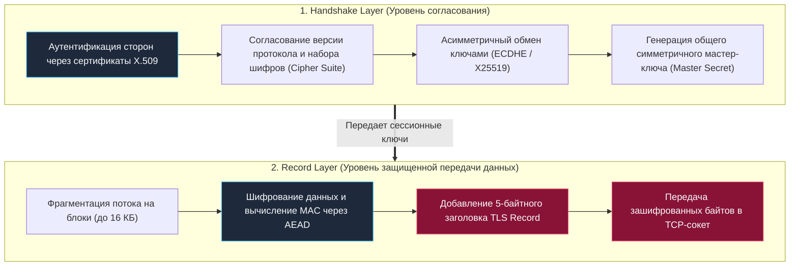
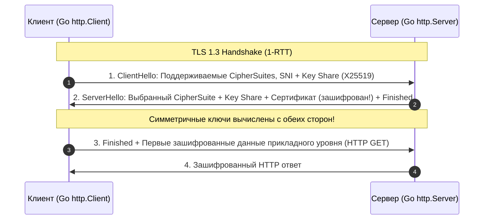
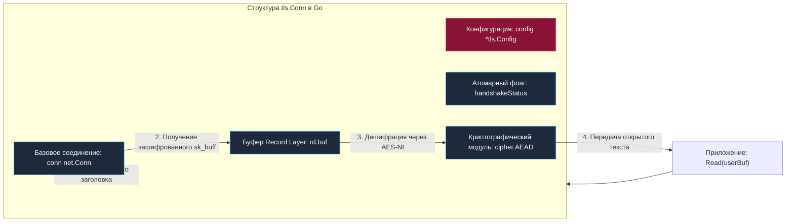

## Введение: HTTPS и место TLS в сетевом стеке

> *"Передавать незашифрованные данные через интернет — всё равно что отправлять открытку с номером банковской карты, надеясь на честность всех почтальонов мира."*  
> — Принцип сетевой безопасности

Протокол TCP, который мы подробно исследовали в предыдущих главах, обеспечивает надежную доставку потока байтов. Но у TCP есть фундаментальный изъян: он абсолютно слеп к содержимому передаваемых данных. Для TCP нет разницы между случайным набором чисел, открытым паролем администратора или конфиденциальным банковским переводом. Любой промежуточный узел — маршрутизатор провайдера, открытая Wi-Fi точка в аэропорту или транзитный шлюз — может легко прочитать весь ваш трафик (Eavesdropping), подменить ответ (Tampering) или выдать себя за целевой сервер (Spoofing).

Здесь на сцену выходит **TLS** (*Transport Layer Security*, современный преемник устаревшего протокола SSL). TLS располагается в сетевом стеке аккуратно между транспортным уровнем (TCP) и прикладным уровнем (HTTP, gRPC, WebSocket). 

Стек **HTTPS** — это не самостоятельный протокол, а классический HTTP, работающий поверх защищенного криптографического туннеля TLS:

```
+-------------------------------------------------------+
|             Прикладной уровень: HTTP / gRPC           |
+-------------------------------------------------------+
|        Криптографический уровень: TLS 1.2 / TLS 1.3   |
+-------------------------------------------------------+
|             Транспортный уровень: TCP                 |
+-------------------------------------------------------+
|               Сетевой уровень: IP                     |
+-------------------------------------------------------+
```

В Go стандартом де-факто является пакет **`crypto/tls`** (рассматриваемый в главе [[18. TLS и HTTPS. Шифрование поверх TCP.md]]), который бесшовно интегрирован в стандартную библиотеку `net/http`. Когда вы вызываете `http.Client` или запускаете `http.Server` со схемой `https`, рантайм Go автоматически оборачивает базовое сетевое соединение **`net.Conn`** в криптографическую обертку **`tls.Conn`**, загружает корневые сертификаты из системного хранилища и прозрачно управляет жизненным циклом сессии.

### Почему чистый Go побеждает C-биндинги?

В других языках программирования работа с криптографией устроена иначе:
- В **PHP** или раннем Python работа с криптографией традиционно делегируется внешнему C-расширению **`openssl`**. Каждое обращение к функции вроде **`openssl_crypt`** требует переключения контекста Cgo (или FFI), выделения структур в памяти **`Zval`** и жестко привязывает сервис к версии OpenSSL, установленной в дистрибутиве Linux. Уязвимости вроде Heartbleed требовали экстренного патчинга динамических библиотек всей ОС.
- В **Java** аналогичная модель (**`SSLSocket`** / **`SSLContext`**) сильно перегружена сложной объектной иерархией, создавая высокое давление на Garbage Collector из-за обилия объектов `SSLSession` и `Cipher`.

Разработчики Go пошли по смелому пути: пакет `crypto/tls` реализован **на чистом Go** (*Pure Go*). Это избавляет от зависимости от сторонних `.so` библиотек, гарантирует безупречную кросс-компиляцию и позволяет рантайму филигранно оптимизировать аллокации памяти под управление сборщика мусора (`GOGC` и `GOMEMLIMIT`).

---

## Архитектура протокола: Handshake и Record Layer

Протокол TLS состоит из двух четко разграниченных функциональных уровней:



1. **Handshake Layer (Уровень рукопожатия):**  
   Работает при установлении соединения. Стороны представляются друг другу, согласуют поддерживаемые криптографические алгоритмы (**CipherSuites**), проверяют цифровые подписи сертификатов (**`CA`**), обмениваются публичными ключами Диффи — Хеллмана и вырабатывают общий секрет (**`Master Secret`**), из которого выводятся симметричные сессионные ключи.
2. **Record Layer (Уровень записей):**  
   Работает непрерывно во время передачи данных приложения. Берет байты от `http.Server` или `http.Client`, нарезает их на блоки (TLS Records), шифрует с помощью симметричного шифра, добавляет имитовставку (**AEAD** nonce/tag) для гарантии целостности и упаковывает в кадры для отправки через TCP.

### Эволюция: TLS 1.2 против TLS 1.3

В стандарте **TLS 1.2** (RFC 5246) на установление защищенного соединения требовалось два полных кругосветных сетевых оборота (**`2-RTT`**) поверх уже выполненного TCP Handshake (суммарно 3 RTT до первого HTTP-байта!).

В современном стандарте **TLS 1.3** (RFC 8446) архитектура была радикально переработана:
- **Рукопожатие сокращено до `1-RTT`:** Клиент уже в первом пакете `ClientHello` отправляет спекулятивные доли ключей для самых распространенных эллиптических кривых (X25519). Сервер сразу отвечает своими долями ключа, и шифрованный канал готов!
- **Поддержка режима 0-RTT:** Для повторных соединений внедрен механизм сессионных билетов и предварительных ключей (**`PSK`** — *Pre-Shared Keys*), позволяющий отправлять полезные зашифрованные данные первого запроса в первом же пакете (**`0-RTT`**), хотя и с рисками Replay-атак.
- **Бескомпромиссная безопасность:** Полностью удалены небезопасные алгоритмы прошлого века: статический обмен ключами **`RSA`** (не дававший свойства Forward Secrecy), блочные режимы с дополнением **`CBC`** (уязвимые к атакам Padding Oracle), а также хеши **`SHA1`** и **`MD5`**.
- **Обязательное использование AEAD:** Разрешены только современные аутентифицированные шифры: **`AES-GCM`** и **`ChaCha20-Poly1305`**.



> [!tip] Собеседование
> **Вопрос:** Чем TLS 1.3 принципиально отличается от 1.2 в контексте производительности и безопасности?  
> **Ответ:**  
> 1. **Скорость (1-RTT вместо 2-RTT):** TLS 1.3 совмещает согласование параметров и обмен ключами Диффи — Хеллмана в первом же пакете `ClientHello` за счет отправки долей ключей (*Key Shares*). Это экономит целый оборот сети (RTT), что в межконтинентальных соединениях снижает задержку на 100–200 мс.
> 2. **Безопасность и Forward Secrecy:** Убран статический RSA key exchange. Теперь компрометация приватного ключа сервера в будущем не позволит злоумышленнику расшифровать записанный ранее трафик.
> 3. **Отказ от уязвимого легаси:** Исключены шифры CBC, RC4, хеши SHA1/MD5. Стандартизированы только AEAD-шифры (AES-GCM, ChaCha20-Poly1305).
> 4. **Шифрование рукопожатия:** Сертификат сервера и расширения передаются уже в зашифрованном виде, защищая метаданные от прослушивания. В Go 1.21+ TLS 1.3 включен по умолчанию.

---

## Под капотом: `crypto/tls` и взаимодействие с рантаймом

В среде Go тип **`tls.Conn`** реализует стандартные интерфейсы `net.Conn` и `io.ReadWriter`. 

Ключевая особенность: при создании сокета через `tls.Client(conn, cfg)` или `tls.Server(conn, cfg)` сетевой обмен **не начинается немедленно**. Рукопожатие инициируется лениво — при первом вызове `Read()` или `Write()`, либо явно через метод **`Handshake()`**. Если рукопожатие еще не завершено, горутина блокируется до завершения криптографической аутентификации.

### Внутреннее устройство `tls.Conn`

Если мы заглянем в исходный код пакета `crypto/tls` (`conn.go`), структура **`tls.Conn`** содержит:
- **`conn net.Conn`** — ссылка на физическое TCP-соединение.
- **`config *tls.Config`** — конфигурация (сертификаты, поддерживаемые версии, таймауты).
- **`handshakeStatus int32`** — атомарный флаг состояния рукопожатия (0 — не выполнено, 1 — в процессе, 2 — завершено).
- **`connState tls.ConnectionState`** — кэш метаданных активной сессии (выбранный шифр, версия, сертификаты пира).
- Внутренние буферы: `reader`/`writer` — буферы Record Layer (включая кольцевой буфер чтения **`rd.buf`** типа `[]byte` и буфер записи `rawInput`).



При выполнении системного чтения **`tls.Conn.Read()`**:
1. Проверяется атомарный статус рукопожатия. Если рукопожатие не завершено, вызывается метод `Handshake()`.
2. Из сокета считывается фиксированный заголовок кадра TLS Record (ровно 5 байт: тип контента, версия протокола и 16-битная длина полезной нагрузки).
3. Тело записи считывается во внутренний слайс **`rd.buf`**.
4. Вызывается криптографический интерфейс дешифрации **`crypto/cipher.gcmCipher`** (или ChaCha20). Алгоритм сверяет аутентификационный тег (AEAD Tag), гарантируя, что ни один бит не был искажен.
5. Расшифрованные данные копируются в буфер вызывающей программы.

> [!info] Под капотом
> В современных версиях Go внутренняя архитектура `crypto/tls` была глубоко модернизирована:
> 1. Начиная с Go 1.24 добавлена интеграция с подсистемой **`crypto/internal/fips140`** для сертификации криптографических примитивов по стандарту FIPS 140-3 без необходимости компиляции со сторонним C-модулем BoringCrypto.
> 2. Жесткая оптимизация под лимит памяти **`GOMEMLIMIT`**. В старых версиях Go каждое рукопожатие создавало десятки короткоживущих объектов в куче: временную структуру `HandshakeState`, блоки `cipher.Block`, буферы для генерации солей и nonce. В пиковые моменты наплыва клиентов это вызывало мощный всплеск аллокаций и внеплановые паузы GC.
> 3. В современных версиях Go активно используется пул переиспользования памяти **`sync.Pool`** для кэширования буферов Record Layer и инстансов `cipher.AEAD`, что снизило нагрузку на сборщик мусора на **30–50%** под высоким RPS!

---

## Производительность и механика (Mechanical Sympathy)

Шифрование — это сугубо вычислительная операция (**CPU-bound**), а не ограничение пропускной способности ввода-вывода (**I/O-bound**). На высокоскоростных 10/40/100-гигабитных интерфейсах именно процессор становится главным «бутылочным горлышком» шифрования.

### 1. Кэш-линии и инструкции процессора

Современные процессоры x86-64 поддерживают аппаратный набор инструкций **`AES-NI`** (Advanced Encryption Standard New Instructions), а процессоры ARM64 (Apple Silicon, AWS Graviton) — инструкции ARMv8 Cryptography Extensions.
- При наличии `AES-NI` раунды шифрования выполняются аппаратно внутри конвейера процессора с использованием 128/256-битных векторных регистров XMM/YMM за считанные такты.
- Данные обрабатываются напрямую через регистры, не загрязняя кэши L1/L2 промежуточными таблицами подстановок (S-boxes).
- Если шифрование выполняется в цикле, избегайте постоянных переаллокаций буферов в куче (`make([]byte, N)` внутри цикла): это вызовет ложные промахи мимо кэша (false cache misses) и заставит GC собирать мусор, пока процессор простаивает в ожидании инструкций шифрования.

### 2. Escape Analysis и GC давление

Каждое новое TLS-соединение требует инициализации криптографического состояния: парсинг сертификатов **`tls.Certificate`**, создание ключей, аллокации буферов. При создании сотен тысяч коротких соединений стандартный порог сборки мусора **`GOGC=100`** может вызывать постоянные тормоза сервиса:

```go
// АНТИПАТТЕРН: катастрофические аллокации на каждый входящий запрос!
func handleBad(w http.ResponseWriter, r *http.Request) {
    // Вызов X509KeyPair парсит PEM-байты, выделяет память в куче на КАЖДЫЙ запрос!
    cert, _ := tls.X509KeyPair(certPEM, keyPEM) 
    cfg := &tls.Config{Certificates: []tls.Certificate{cert}}
    conn, _ := tls.Dial("tcp", "upstream:443", cfg)
    _ = conn
}
```

В высоконагруженных сервисах конфигурация `tls.Config` и сертификаты обязаны парситься **один раз при старте сервиса** или переиспользоваться через пулы:

```go
// ИДИОМАТИЧНЫЙ ПОДХОД: статическая конфигурация и переиспользование
var secureConfig *tls.Config

func init() {
    cert, err := tls.X509KeyPair(certPEM, keyPEM)
    if err != nil {
        panic(err)
    }
    secureConfig = &tls.Config{
        Certificates: []tls.Certificate{cert},
        MinVersion:   tls.VersionTLS13,
    }
}
```

### 3. Взаимодействие с netpoller и планировщиком G-M-P

Когда горутина вызывает `tlsConn.Read()`, а сетевой пакет еще летит по проводу, рантайм Go переводит горутину `G` в состояние ожидания **`Gwaiting`**. Планировщик Go отвязывает её от системного потока **`M`**, отправляя поток выполнять другие горутины из очереди **`runq`**.

Когда прерывание сетевой карты доставляет пакет, сетевой полинг **`netpoller`** (через epoll/kqueue) будит горутину `G` и возвращает её в `runq`. 
Но обратите внимание: **как только зашифрованные данные получены, фаза дешифрации выполняется синхронно на потоке `M`**! Если сотни потоков одновременно нагружены расшифровкой криптографии, потоки `M` будут загружены на 100% CPU. Чтобы сетевой реактор не голодал, критически важно выставлять **`GOMAXPROCS`** в соответствии с числом физических ядер контейнера и использовать мультиплексирование HTTP/2 или HTTP/3 поверх одного TLS-соединения.

> [!warning] Ловушка / Gotcha: ChaCha20-Poly1305 против AES-GCM
> Алгоритм `AES-GCM` молниеносен только при наличии аппаратных инструкций `AES-NI`. На дешевых ARM-серверах, старых процессорах или в виртуальных машинах без проброса процессорных флагов шифрование AES выполняется программно, работая в 2–3 раза медленнее и открывая уязвимости к атакам по времени через кэш процессора (*Cache Timing Attacks*).  
> 
> Шифр **`ChaCha20-Poly1305`** разработан Дэниелом Бернштейном специально для программного исполнения на обычных регистрах общего назначения. Пакет `crypto/tls` в Go автоматически проверяет наличие инструкций `AES-NI` при установлении соединения: если аппаратного ускорения нет, Go отдает приоритет ChaCha20-Poly1305!  
> **Не переопределяйте поле `tls.Config.CipherSuites` вручную без веской необходимости**, иначе вы лишите рантайм возможности автоматически спасать ваш CPU.

---

## Идиоматичная работа с TLS в Go

Напишем надежный, готовый к production клиент с валидацией цепочки доверия, поддержкой взаимной аутентификации (**`mTLS`**) и строгой проверкой доменного имени:

```go
package main

import (
	"crypto/tls"
	"crypto/x509"
	"fmt"
	"log"
	"net"
)

// establishSecureConn создает надежное TLS-соединение с защитой от MITM
func establishSecureConn(target string) (*tls.Conn, error) {
	// 1. Загрузка доверенного системного пула корневых сертификатов
	pool, err := x509.SystemCertPool()
	if err != nil {
		return nil, fmt.Errorf("ошибка загрузки системного пула CA: %w", err)
	}

	// 2. Настройка строгой конфигурации безопасности
	cfg := &tls.Config{
		RootCAs:            pool,
		MinVersion:         tls.VersionTLS12, // Минимальная допустимая версия (Go 1.21+ по умолчанию использует TLS 1.3)
		PreferServerCipherSuites: true,
		// Серверное имя для расширения SNI (Server Name Indication)
		ServerName:         "example.com",
		GetClientCertificate: func(info *tls.CertificateRequestInfo) (*tls.Certificate, error) {
			// Механизм mTLS: динамическая отдача клиентского сертификата при запросе сервера
			cert, err := tls.LoadX509KeyPair("client.crt", "client.key")
			if err != nil {
				return nil, err
			}
			return &cert, nil
		},
	}

	// 3. Установка чистого TCP-соединения
	conn, err := net.Dial("tcp", target)
	if err != nil {
		return nil, fmt.Errorf("ошибка TCP dial: %w", err)
	}

	// 4. Оборачивание в TLS и явный запуск Handshake
	tlsConn := tls.Client(conn, cfg)
	if err := tlsConn.Handshake(); err != nil {
		conn.Close()
		return nil, fmt.Errorf("ошибка TLS handshake: %w", err)
	}

	// 5. Критически важная проверка: валидация имени хоста (Hostname Verification)
	if err := tlsConn.VerifyHostname("example.com"); err != nil {
		tlsConn.Close()
		return nil, fmt.Errorf("несовпадение доменного имени в сертификате: %w", err)
	}

	return tlsConn, nil
}

func main() {
	conn, err := establishSecureConn("example.com:443")
	if err != nil {
		log.Fatalf("Сбой безопасного соединения: %v", err)
	}
	defer conn.Close()

	fmt.Println("Безопасное соединение TLS успешно установлено и верифицировано!")
}
```

> [!tip] Собеседование
> **Вопрос:** «Зачем вызывать `tls.Conn.VerifyHostname()` вручную после `Handshake()`, если handshake завершился успешно?»  
> **Ответ:**  
> Системный вызов `Handshake()` проверяет только криптографическую валидность: что сертификат подписан доверенным центром сертификации (`CA`), срок его действия не истек, а закрытый ключ совпадает с открытым.  
> Но `Handshake()` на низком уровне `tls.Client` **не проверяет**, для какого именно домена выдан этот сертификат! Злоумышленник в ходе атаки Man-in-the-Middle (**`MITM`**) может подсунуть совершенно легитимный, валидный сертификат от доверенного Let's Encrypt, но выданный для домена `attacker.com`. Без вызова **`VerifyHostname`** клиент примет чужой сертификат и раскроет данные хакеру. Высокоуровневый `http.Client` выполняет эту проверку автоматически, но при работе с `crypto/tls` напрямую разработчик обязан проверять имя хоста сам.

---

## Ловушки и типичные вопросы на собеседованиях

1. **Смертоносный флаг `InsecureSkipVerify: true`:**  
   Этот флаг отключает проверку всей цепочки доверия CA и проверку имени хоста. Его часто включают разработчики для локального тестирования самоподписанных сертификатов. Попадая в production, этот флаг превращает ваш сервис в легкую добычу для любой MITM-атаки в локальной сети или облаке. Правильное решение — добавить корпоративный самоподписанный CA в конфигурационное поле **`RootCAs`**.
2. **Утечка памяти дескрипторов TLS:**  
   В отличие от некоторых высокоуровневых объектов других сред разработки, структура `tls.Conn` в Go не полагается на сборщик мусора для закрытия сокетов. Если горутина завершилась без вызова **`Close()`**, буферы Record Layer и дескрипторы сокетов зависнут в памяти. Всегда используйте `defer conn.Close()`.
3. **Контроль памяти через `GOMEMLIMIT`:**  
   В высоконагруженных микросервисах с десятками тысяч одновременных TLS-сессий память, выделенная под буферы сокетов, способна превысить лимит, установленный через функцию **`debug.SetMemoryLimit()`**. Для предотвращения OOM-паники настраивайте параметры пула соединений в **`net/http.Transport`**: ограничивайте **`MaxIdleConns`** и выставляйте агрессивный таймаут простоя **`IdleConnTimeout`**.
4. **Сравнение сетевого шифрования в разных средах:**
   - **PHP:** Жесткая привязка к системному OpenSSL. Вызовы через C-биндинги создают накладные расходы на маршалинг данных в структуры `Zval`.
   - **Java:** Использование абстракций `SSLSocket`, требующих выделения тяжелых объектов сессий в памяти JVM.
   - **Go:** Чистая и лаконичная реализация на Go, использующая композицию и интерфейсы `net.Conn`, векторные инструкции процессора `AES-NI` и переиспользование буферов через `sync.Pool`.

---

## Итог

1. **HTTPS** — это не отдельный протокол, а HTTP, инкапсулированный в защищенный криптографический туннель TLS.
2. **Два уровня TLS:** Уровень рукопожатия (**Handshake Layer**) отвечает за аутентификацию и согласование мастер-ключа (**Master Secret**); уровень записей (**Record Layer**) шифрует и фрагментирует данные через шифры **AEAD**.
3. **Преимущества TLS 1.3:** Сокращение фазы подключения до **`1-RTT`**, поддержка нулевого оборота **`0-RTT`** через **`PSK`**, исключение уязвимых алгоритмов (RSA, CBC, SHA1, MD5) и обязательное свойство Perfect Forward Secrecy.
4. **Архитектура Go:** Пакет **`crypto/tls`** написан на чистом Go, оптимизирован под `GOMEMLIMIT` с использованием `sync.Pool` и аппаратно ускоряется векторными инструкциями процессора **`AES-NI`**. При отсутствии аппаратного AES рантайм автоматически переключается на **`ChaCha20-Poly1305`**.
5. **Безопасность:** Никогда не используйте `InsecureSkipVerify` в production и всегда проводите валидацию доменных имен через `VerifyHostname`.

Мы разобрались с механикой шифрования и процессом передачи данных. Но как устроена всемирная инфраструктура цифровых сертификатов (PKI)? Как браузеры и Go-сервисы проверяют подлинность открытых ключей и как настроить защищенное мессервисное взаимодействие с помощью mTLS? В следующей статье мы исследуем: [[19. Сертификаты, PKI, mTLS и процесс TLS Handshake.md]].