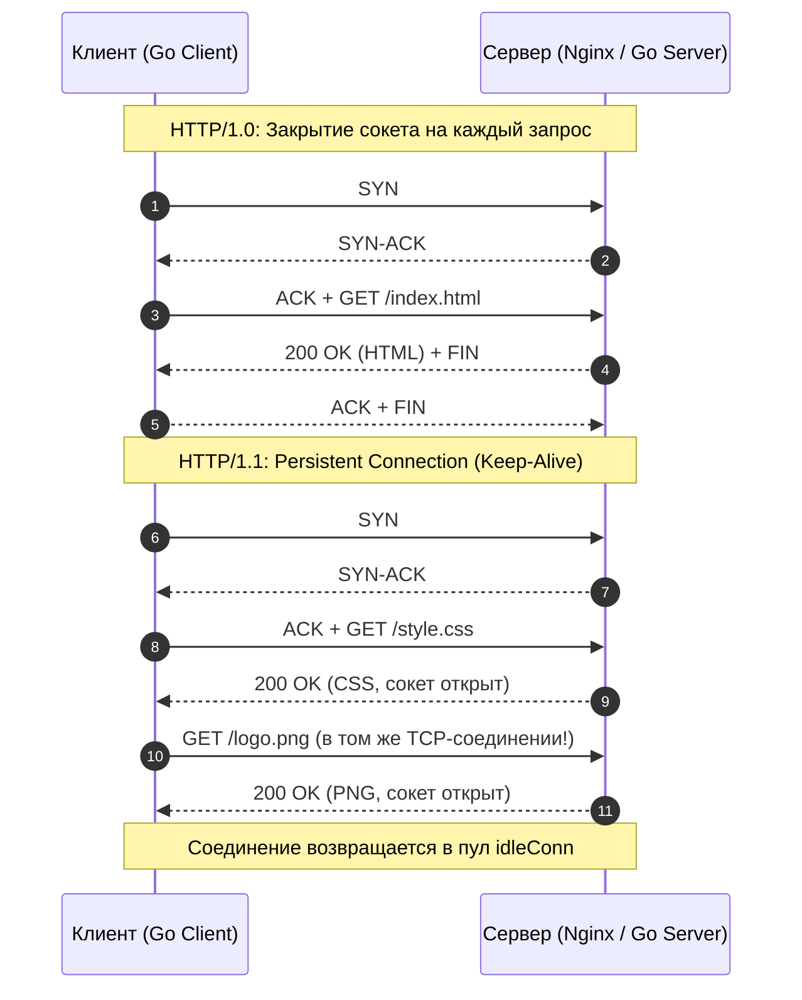
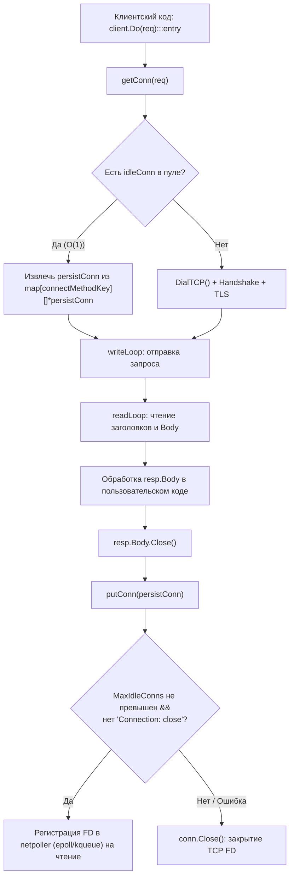
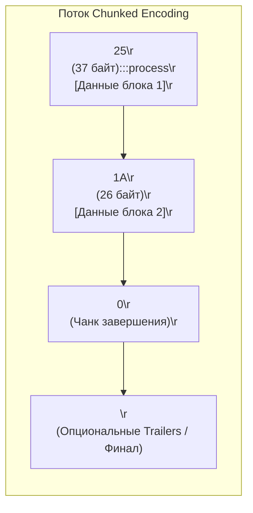
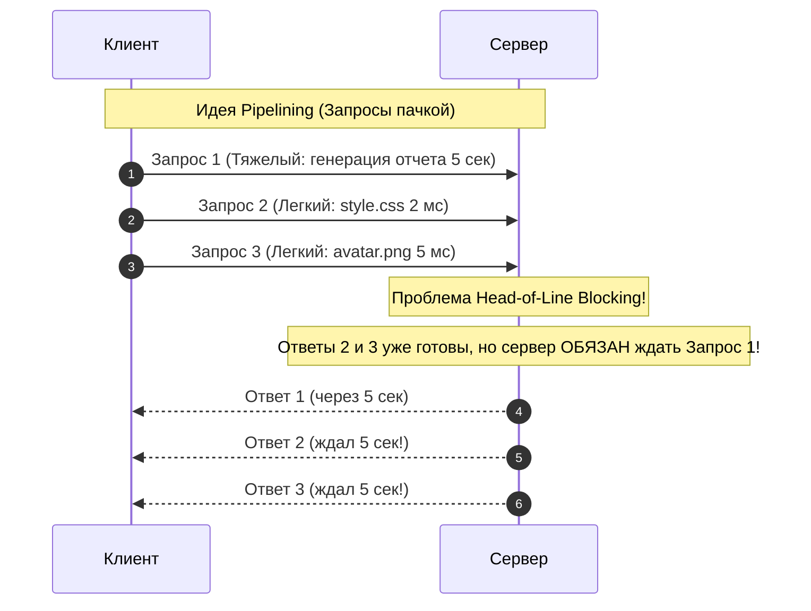
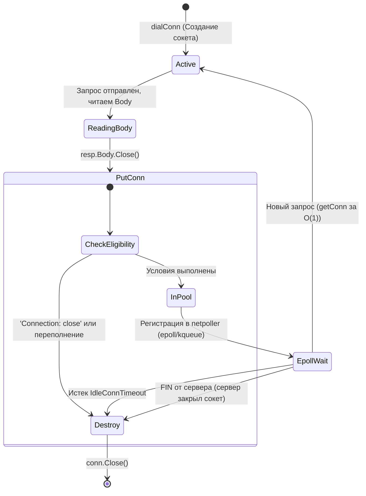

## Введение: Почему HTTP/1.1 до сих пор важен

В компьютерных сетях есть удивительный парадокс: протоколы, созданные более четверти века назад в спешке и на коленке, продолжают нести на своих плечах львиную долю мирового трафика. Спецификация **HTTP/1.1** (RFC 2616, а позже модульное семейство RFC 7230–7235 и современный RFC 9112) была стандартизирована в далёком 1997–1999 годах. Несмотря на триумфальное шествие [[22. HTTP 2. Multiplexing, Frames, HPACK|HTTP/2]] и [[23. HTTP 3 и QUIC. Почему будущее уходит от TCP|HTTP/3]], понимание внутренней механики HTTP/1.1 критически важно для Senior/Lead Go-инженера.

Почему?
Во-первых, большинство внутренних сервисов в Kubernetes-кластерах, межсервисных вызовов за пределами gRPC, интеграций с базами данных (Elasticsearch, CouchDB), очередей сообщений и периметровых балансировщиков (Nginx, Envoy, AWS ALB) на последней миле всё ещё общаются по классическому HTTP/1.1.
Во-вторых, стандартная библиотека Go — пакет `net/http` — была спроектирована гениями Bell Labs и сетевой инженерии именно так, чтобы выжать максимум производительности из ограничений HTTP/1.1. Разбирая `Keep-Alive`, `Chunked` и `Pipelining`, мы понимаем, почему современный стек отказался от однопоточного мультиплексирования и перешёл к кросспротокольным оптимизациям.

Если HTTP/1.0 напоминал телефонный разговор, где после каждого сказанного слова абонент бросал трубку и заново набирал номер, то HTTP/1.1 попытался научить собеседников оставаться на линии. Давайте заглянем под капот этой эволюции.



---

## Keep-Alive (Persistent Connections)

В HTTP/1.0 каждое взаимодействие было одноразовым: клиент создавал TCP-сокет, выполнял тройное рукопожатие `TCP Handshake` (подробно разобранное в статье [[10. TCP. Устройство, гарантии и жизненный цикл соединения]]), отправлял запрос, сервер передавал ответ и немедленно инициировал закрытие сокета флагом `FIN`. 

Если веб-страница содержала 50 картинок и скриптов, браузер совершал 50 последовательных TCP-рукопожатий и 50 раз проходил через алгоритм медленного старта TCP Slow Start, тратя сотни миллисекунд впустую. А с появлением шифрования к этому добавился тяжелый процесс `TLS Negotiation` (2 RTT в TLS 1.2), превращая открытие страницы в мучительное ожидание.

В HTTP/1.1 постоянное соединение (**Persistent Connection**) стало стандартом по умолчанию. Клиент и сервер не закрывают TCP-сокет после отправки ответа, а возвращают его в пул для повторного использования. Это устраняет накладные расходы на `TCP Handshake` (статья [[10. TCP. Устройство, гарантии и жизненный цикл соединения]]) и `TLS Negotiation` для каждого запроса.

### Механизм и заголовки

Управление жизненным циклом соединения осуществляется через семейство hop-by-hop заголовков (действующих только между двумя соседними сетевыми узлами):

- `Connection: keep-alive` — исторический заголовок, указывающий на намерение сохранить соединение. В спецификации HTTP/1.1 он подразумевается неявно: любое соединение считается постоянным, пока явно не указано обратное.
- `Connection: close` — принудительное завершение. Сообщает противоположной стороне, что после завершения передачи текущего ответа/запроса сокет будет закрыт. Используется при graceful shutdown, ошибках или достижении лимита `Max-Forwards`.
- `Keep-Alive: timeout=5, max=100` — устаревший заголовок (HTTP/1.0), сообщавший клиенту: «я подожду 5 секунд до закрытия сокета и готов принять не более 100 запросов». В HTTP/1.1 таймаут обычно контролируется через настройки веб-сервера (`net/http` или балансировщик) и системные таймауты операционной системы.

### Под капотом Go: `http.Transport` и пул соединений

Go не полагается на угадывание поведения сети. Он явно управляет жизненным циклом TCP-сокетов через `http.Transport`. Внутренне это структура, хранящая активные и idle-соединения:

```go
type Transport struct {
    MaxIdleConns        int           // Максимум idle-соединений в целом (в DefaultTransport: 100)
    MaxIdleConnsPerHost int           // На один host. По умолчанию DefaultMaxIdleConnsPerHost = 2!
    IdleConnTimeout     time.Duration // Таймаут ожидания в пуле (по умолчанию 90s)
    // ... другие поля, включая dialer и TLS config
}
```

Как устроен пул сокетов в `net/http`?
Каждое открытое TCP-соединение оборачивается во внутреннюю структуру `persistConn`. На каждое такое соединение рантайм Go запускает две фоновые горутины:
1. `readLoop()` — читает входящие данные из сокета через буферизованный `bufio.Reader`.
2. `writeLoop()` — сериализует исходящие запросы в сокет через `bufio.Writer`.



Когда `Response.Body` закрывается, Go не вызывает `Close()` на сокете. Он проверяет:
1. Есть ли доступные `idleConn` для этого хоста?
2. Не истёк ли `IdleConnTimeout`?
3. Не помечен ли запрос как `Connection: close`?

Если условия выполнены, сокет переводится в состояние ожидания следующего запроса и регистрируется в `netpoller` как читатель. При поступлении нового запроса сокет извлекается из пула за O(1) благодаря конкурентной мапе (`sync.Mutex` + `map[connectMethodKey][]*persistConn`).

> [!info] Под капотом
> **Escape Analysis & GC Pressure:** Каждое подключение в пуле хранит буферы (`bufio.Reader`, `bufio.Writer`). Если вы создаете `http.Client` внутри цикла или часто меняете `Transport`, вы рискуете создать сотни аллокаций, которые могут escape на heap. Идиоматично: инициализировать `http.Client` и `http.Transport` один раз в `main` или `init()` и переиспользовать их.

---

## Chunked Transfer Encoding

В классическом HTTP/1.0 сервер обязан был передать клиенту заголовок `Content-Length`, указывающий точный размер тела в байтах. Только зная точный размер, клиент понимал, где заканчивается текущее тело ответа и начинается следующее сообщение.

Но представьте себе выгрузку отчёта из базы данных на 10 гигабайт или потоковую передачу данных датчиков. Сервер не знает итоговый размер, пока не прочитает все строки из базы. Буферизовать 10 ГБ в оперативной памяти сервера только для того, чтобы посчитать `Content-Length`, — верный путь к Out Of Memory (OOM).

Для решения этой проблемы в HTTP/1.1 был внедрён механизм **Chunked Transfer Encoding**.
Используется, когда размер тела ответа неизвестен заранее (динамическая генерация, стриминг, веб-сокет-прокси). Вместо `Content-Length` используется `Transfer-Encoding: chunked`.

### Структура пакета

При передаче чанками сервер разбивает тело ответа на цепочку самодостаточных блоков. Каждый блок предваряется шестнадцатеричным числом, обозначающим длину блока в байтах, за которым следует перевод строки `\r\n` (CRLF), затем сами байты данных и ещё один `\r\n`.

```
25\r\n
{ exactly 37 bytes of data }\r\n
1A\r\n
{ exactly 26 bytes of data }\r\n
0\r\n
\r\n
```

Каждый чанк содержит: `размер_в_шестнадцатеричном_формате \r\n` + `данные \r\n`. Завершает поток чанк нулевой длины (`0\r\n\r\n`), за которым опционально могут следовать трейлеры (**HTTP Trailers**) — заголовки, значение которых вычисляется во время передачи (например, контрольная сумма `Trailer: Content-MD5` или цифровые подписи).



### Взаимодействие с TCP и Nagle

Маленькие чанки могут столкнуться с алгоритмом Нагла (`Nagle's Algorithm`), который буферизует мелкие пакеты для отправки вместе. Это добавляет задержки (до 200-400мс). 

Когда вы отправляете чанк в 20 байт, ядро операционной системы не отправляет его сразу, а ждет подтверждения (ACK) на предыдущий сегмент или заполнения полного пакета MSS (Maximum Segment Size). С другой стороны, на принимающем конце включен алгоритм **Delayed ACK**, который задерживает отправку подтверждения в ожидании обратного трафика. Возникает эффект смертельного тупика (**Deadlock задержек**), увеличивающий пинг на сотни миллисекунд.

**Решение:** Go по умолчанию устанавливает `TCP_NODELAY` на keep-alive соединениях. Это отключает буферизацию Нагла, заставляя сокет отправлять байты немедленно. Для стриминга это критично.

### Идиоматичная реализация в Go

В Go рантайм `net/http` автоматически включает `chunked transfer encoding`, если обработчик начинает писать данные в `http.ResponseWriter`, не установив предварительно заголовок `Content-Length`. Однако вы можете указать этот режим и явно:

```go
func streamChunked(w http.ResponseWriter, data <-chan []byte) {
    w.Header().Set("Transfer-Encoding", "chunked")
    w.Header().Set("Content-Type", "application/octet-stream")
    
    // w.Write() автоматически форматирует чанки при наличии заголовка
    for chunk := range data {
        _, err := w.Write(chunk)
        if err != nil {
            // В продакшене здесь нужен логгер и корректная обработка ошибок
            log.Printf("chunk write failed: %v", err)
            return
        }
    }
}
```

> [!warning] Ловушка / Gotcha
> Если вы используете `bufio` для записи в `http.ResponseWriter`, убедитесь, что вы вызываете `Flush()` после каждого логического блока или используете `http.Flusher`. Без `Flush()` данные могут зависнуть в буфере `bufio.Writer` до его заполнения, ломая real-time стриминг.
> 
> Начиная с Go 1.20, идиоматичным способом сброса буфера и управления таймаутами является использование `http.ResponseController`:
> ```go
> rc := http.NewResponseController(w)
> _ = rc.Flush()
> ```

---

## HTTP Pipelining: Теория и смерть

В конце 1990-х создатели протокола понимали, что даже с `Keep-Alive` сеть простаивает: клиент отправляет запрос, ждет RTT, ждет обработки на сервере, получает ответ, и только потом отправляет следующий запрос.

Возникла заманчивая идея: **HTTP Pipelining (Конвейеризация)**.
Идея: клиент отправляет несколько HTTP-запросов подряд по одному TCP-соединению, не ожидая ответов. Сервер отвечает в том же порядке.



### Почему это не работает на практике

Теория выглядела элегантно, но на практике конвейеризация оказалась архитектурным тупиком по трем фундаментальным причинам:

1. **Head-of-Line Blocking (HOL) на уровне TCP:** Если один пакет теряется, весь TCP-поток останавливается до retransmission. Все последующие запросы в пайплайне ждут.
2. **HOL на уровне приложения:** Ответы должны приходить строго в порядке отправки. Если сервер обрабатывает запрос B медленнее, чем A, клиент не получит A, пока B не завершится. Если первый запрос в конвейере — это медленный SQL-запрос на 10 секунд, все последующие микросекундные статические файлы зависают за ним в очереди.
3. **Проблемы прокси:** Любая промежуточная точка (load balancer, nginx) не может маршрутизировать или кешировать pipelined-запросы корректно без сложного state-tracking. Кроме того, сетевые посредники и дешевые роутеры (middleboxes) падали при виде нескольких запросов в одном TCP-пакете.

В результате `Pipelining` был официально de facto deprecated. Браузеры отключили его в 2010-х, а Go (`net/http`) никогда не поддерживал его полноценно. Вместо этого Go использует **Connection Multiplexing на уровне хоста**: по умолчанию `MaxIdleConnsPerHost = 100`. Это означает, что клиент держит до 100 параллельных TCP-соединений к одному хосту, что полностью устраняет блокировки и проще в реализации, чем пайплайн.

---

## Под капотом: Go и управление соединениями

Когда вы настраиваете `http.Transport`, вы фактически управляете поведением `netpoller` и планировщика горутин.

### Жизненный цикл idle-соединения

Что происходит с сокетом, когда ваш HTTP-запрос завершился и вы вызвали `resp.Body.Close()`?

1. Соединение возвращается в пул (`putConn`).
2. Запускается таймер `IdleConnTimeout`.
3. Файловый дескриптор (FD) регистрируется в `epoll` (Linux) или `kqueue` (BSD/macOS) через `netpoll` как читаемый.
4. Если за время таймаута не пришло новых данных, `netpoller` пробуждает горутину-управляющую, которая вызывает `conn.Close()`.
5. Если данные пришли (`HTTP/1.1 200 OK`), сокет извлекается, контекст сохраняется, и горутина-клиент продолжает чтение.



> [!tip] Собеседование
> **Вопрос:** Почему Go по умолчанию открывает до 100 соединений на один хост, а не одно?
> **Ответ:** Чтобы избежать HTTP/1.1 Head-of-Line Blocking и конкуренции за один сокет. В высоконагруженных системах один сокет становится узким местом (lock contention на `sync.Mutex` внутри `persistConn`, очередь горутин, блокировка из-за медленного ответа). Множество соединений позволяет Go использовать всю доступную пропускную способность и балансировать нагрузку на сетевом стеке.
> 
> **Вопрос:** Чем `TCP Keep-Alive` отличается от `HTTP Keep-Alive`?
> **Ответ:** `TCP Keep-Alive` — это механизм ядра ОС, который отправляет probe-пакеты через большие интервалы (обычно 2 часа по умолчанию) для обнаружения разрыва канала. `HTTP Keep-Alive` — логика приложения: клиент и сервер договариваются не закрывать сокет после ответа, чтобы переиспользовать его для следующих HTTP-запросов до истечения таймаута или лимита.

---

## Итог

1. **Keep-Alive** экономит RTT и CPU-циклы на handshakes, но требует тщательного управления пулом (`http.Transport`) и таймаутами, чтобы избежать утечки FD и memory leaks.
2. **Chunked Encoding** позволяет стримить данные без предварительного знания размера. Взаимодействует с `TCP_NODELAY` для минимизации задержек.
3. **Pipelining** был отвергнут индустрией из-за HOL blocking. Go решает эту проблему через множественные соединения на хост и переход на HTTP/2.
4. Понимание этих механизмов позволяет правильно настраивать `http.Transport`, избегать `context deadline exceeded` из-за зависших соединений и проектировать надежные клиенты для высоконагруженных систем.

Мы разобрали, как HTTP/1.1 пытается преодолеть ограничения TCP. Но однопоточная природа соединения всё равно становится бутылочным горлышком. В следующей статье мы посмотрим, как HTTP/2 решает эту проблему через бинарный фрейминг и мультиплексирование: [[22. HTTP 2. Multiplexing, Frames, HPACK]].