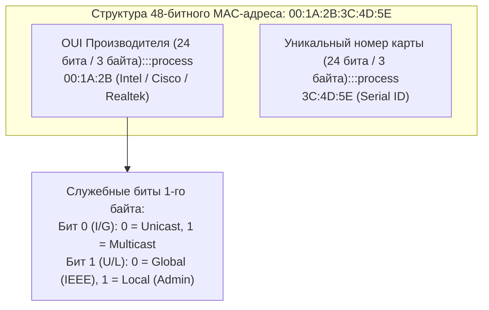
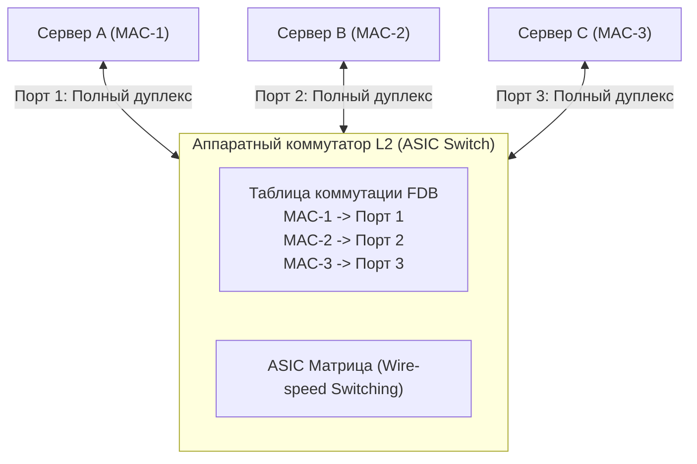
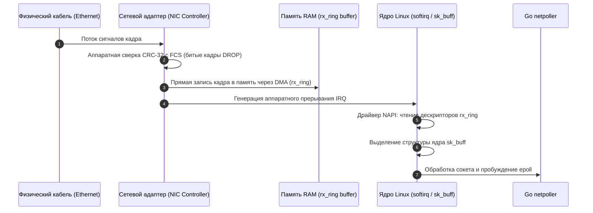

## Введение: Слой L2 в контексте Go-разработки

Мы опускаемся на канальный уровень (L2, Data Link Layer) сетевого стека. Если на прикладном уровне мы рассуждаем об HTTP-запросах, JSON-структурах и gRPC-вызовах, то здесь абстракции рассеиваются, и перед нами предстает жесткая физическая реальность: электрические потенциалы, кремниевые трансиверы, контрольные суммы кадров и шестнадцатеричные идентификаторы сетевых адаптеров.

Для бэкенд-инженера на Go, стремящегося к уровням Senior, Lead или Staff, глубокое понимание канального уровня L2 и протокола Ethernet критически важно как минимум в четырех фундаментальных сценариях:

1.  **Bare-Metal архитектура и предельный Highload:**  
    Когда стандартный сетевой стек ядра Linux становится узким местом при обработке десятков миллионов пакетов в секунду, инженеры переходят на технологии kernel-bypass: `AF_XDP` (eXpress Data Path), `DPDK`, `io_uring` и сырые сетевые сокеты (`AF_PACKET`). Для работы с ними вы обязаны понимать структуру кадра Ethernet с точностью до отдельного байта.
2.  **Облачные платформы, Kubernetes и Container Networking:**  
    В современных кластерах контейнеры изолируются в собственных пространствах имен (Network Namespaces). Сетевые плагины CNI (Cilium, Calico, Flannel) связывают эти контейнеры виртуальными кабелями — виртуальными парами интерфейсов `veth` — и объединяют их через программные мосты Linux Bridge или оверлейные сети (VXLAN), инкапсулируя Ethernet-кадры поверх обычных IP-пакетов.
3.  **Низкоуровневая диагностика и наблюдаемость:**  
    Когда утилита `curl` падает с необъяснимыми ошибками `ECONNREFUSED` или `ETIMEDOUT`, а метрики сервера показывают нормальную нагрузку, корень проблемы нередко скрывается именно на уровне L2: переполнение таблицы коммутации коммутатора (FDB exhaustion), шторм широковещательного трафика или аппаратные ошибки FCS (Frame Check Sequence) на портах сервера.
4.  **Разработка сетевого инструментария и инфраструктурных демонов:**  
    Агенты мониторинга, балансировщики трафика, утилиты типа `tcpdump` и системы обнаружения вторжений (IDS) в экосистеме Go регулярно взаимодействуют с интерфейсами через системный пакет `net` и структуру `net.Interface`.

```mermaid
flowchart TD
    classDef process  fill:#1e293b,stroke:#38bdf8,stroke-width:1px,color:#f8fafc
    classDef success  fill:#064e3b,stroke:#34d399,stroke-width:1px,color:#f8fafc
    classDef error    fill:#7f1d1d,stroke:#f87171,stroke-width:1px,color:#f8fafc
    classDef warning  fill:#78350f,stroke:#fbbf24,stroke-width:1px,color:#f8fafc
    classDef entry    fill:#1e3a5f,stroke:#38bdf8,stroke-width:2px,color:#f8fafc
    classDef aux      fill:#334155,stroke:#64748b,stroke-width:1px,color:#f8fafc
    classDef system   fill:#312e81,stroke:#a78bfa,stroke-width:1px,color:#f8fafc
    classDef data     fill:#132d29,stroke:#2dd4bf,stroke-width:1px,color:#f8fafc
    classDef network  fill:#881337,stroke:#fb7185,stroke-width:1px,color:#f8fafc
    classDef accent   fill:#1e1b4b,stroke:#818cf8,stroke-width:1px,color:#f8fafc
    subgraph ContainerSpace ["Сетевой Namespace Контейнера (Go-сервис)"]
        GoApp["Go-приложение (net.Listen / http.Server)"]
        Eth0["Интерфейс eth0 (IP: 10.244.1.5, veth MAC)"]
    end

    subgraph HostKernel ["Пространство ядра Хоста (Linux Host L2)"]
        VethHost["Ответная часть: vethxxxx"]:::process
        Bridge["Программный мост: cbr0 / docker0"]:::process
        PhysicalNIC["Физическая сетевая карта: eth0 (NIC)"]
    end

    subgraph PhysicalNetwork ["Физическая сеть L2 (Data Center)"]
        TopOfRack["Коммутатор ToR (Top-of-Rack Switch)"]
        FDB["Таблица коммутации FDB (MAC -> Port)"]
    end

    GoApp --> Eth0
    Eth0 <==>|Виртуальный провод veth| VethHost
    VethHost --> Bridge
    Bridge --> PhysicalNIC
    PhysicalNIC <==>|Витая пара / Оптика (Ethernet)| TopOfRack
    TopOfRack <--> FDB
```

## Устройство Ethernet-кадра

Протокол **Ethernet**, созданный Робертом Меткалфом в исследовательском центре Xerox PARC в 1973 году, задумывался как способ объединения компьютеров в общую физическую среду (коаксиальный кабель). За полвека Ethernet эволюционировал из примитивной шины со скоростью 3 Мбит/с в сверхмощные оптические каналы 100G, 400G и 800G, однако фундаментальный принцип **фрейминга (framing)** остался неизменным.

Ethernet — это не протокол маршрутизации. Это механизм упаковки данных в дискретные блоки — **кадры (фреймы)**, позволяющий сетевым адаптерам распознавать границы сообщений, адресовать получателя в пределах одного локального сегмента и проверять целостность переданных бит.

Стандартный кадр **Ethernet-II** (де-факто стандарт для всего трафика IP) обладает строго фиксированной структурой:

```mermaid
flowchart LR
    classDef process  fill:#1e293b,stroke:#38bdf8,stroke-width:1px,color:#f8fafc
    classDef success  fill:#064e3b,stroke:#34d399,stroke-width:1px,color:#f8fafc
    classDef error    fill:#7f1d1d,stroke:#f87171,stroke-width:1px,color:#f8fafc
    classDef warning  fill:#78350f,stroke:#fbbf24,stroke-width:1px,color:#f8fafc
    classDef entry    fill:#1e3a5f,stroke:#38bdf8,stroke-width:2px,color:#f8fafc
    classDef aux      fill:#334155,stroke:#64748b,stroke-width:1px,color:#f8fafc
    classDef system   fill:#312e81,stroke:#a78bfa,stroke-width:1px,color:#f8fafc
    classDef data     fill:#132d29,stroke:#2dd4bf,stroke-width:1px,color:#f8fafc
    classDef network  fill:#881337,stroke:#fb7185,stroke-width:1px,color:#f8fafc
    classDef accent   fill:#1e1b4b,stroke:#818cf8,stroke-width:1px,color:#f8fafc
    A["Преамбула<br>7 байт"]:::process -->|"Синхронизация"| B["Начало кадра<br>1 байт"]
    B -->|"Начало кадра"| C["MAC получателя<br>6 байт"]
    C -->|"Куда отправить"| D["MAC отправителя<br>6 байт"]
    D -->|"Кто отправил"| E["Тип кадра<br>2 байта"]
    E -->|"Тип IPv4"| F["Данные<br>46-1500 байт"]
    F -->|"L3/L4 данные"| G["Контрольная сумма<br>4 байта"]
    G -->|"Завершение"| H["Пауза между кадрами<br>12 байт"]
```



Разбор анатомии полей кадра:

1.  **Преамбула (Preamble, 7 байт):** Чередующаяся последовательность единиц и нулей (`10101010...`), служащая для аппаратной синхронизации тактовых генераторов приемника и передатчика.
2.  **Ограничитель начала кадра (SFD — Start Frame Delimiter, 1 байт):** Байт `10101011`, сигнализирующий физическому уровню, что со следующего бита начинается заголовок кадра.
3.  **MAC-адрес получателя (Dest MAC, 6 байт):** Аппаратный 48-битный адрес целевого интерфейса, которому предназначен кадр.
4.  **MAC-адрес отправителя (Src MAC, 6 байт):** Аппаратный адрес источника кадра.
5.  **Тип полезной нагрузки (EtherType, 2 байта):** Указывает ядру, какому протоколу уровня L3 передать данные:
    *   `0x0800` — протокол IPv4 (наиболее частый случай в веб-серверах).
    *   `0x86DD` — протокол IPv6.
    *   `0x8100` — тегированный VLAN-кадр (стандарт IEEE 802.1Q).
    *   `0x0806` — протокол разрешения адресов ARP.
6.  **Полезная нагрузка (Payload, 46–1500 байт):** Сам сетевой пакет (IP-пакет).  
    *   *Минимальный размер:* **46 байт**. Если IP-пакет меньше 46 байт (например, пустой TCP ACK-пакет без полезной нагрузки), сетевой стек обязан дополнить поле пустыми байтами выравнивания — **`padding`**.  
    *   *Максимальный размер:* традиционный предел **1500 байт** (стандартный размер `MTU` — Maximum Transmission Unit).
    *   *Jumbo Frames:* в изолированных сетях дата-центров и SAN-хранилищах MTU поднимают до **9000 байт**, что позволяет существенно снизить нагрузку на CPU серверов при передаче терабайтных потоков данных.
7.  **Контрольная сумма (FCS — Frame Check Sequence, 4 байта):** Аппаратная 32-битная контрольная сумма (CRC-32), вычисляемая сетевой картой передатчика по всем полям кадра (от Dest MAC до конца Payload).
8.  **Межкадровый интервал (IFG — Interframe Gap, 12 байт):** Физическая пауза тишины на линии передачи между кадрами для восстановления логики трансивера.

> [!warning] Ловушка / Gotcha
> **Ethernet никогда не гарантирует доставку!**  
> Протокол Ethernet гарантирует только **целостность** принятого кадра. Когда кадр поступает на сетевой адаптер, контроллер аппаратно пересчитывает CRC-32. Если контрольная сумма не совпадает с полем FCS (например, из-за электромагнитной помехи на кабеле), сетевая карта **молча и безжалостно отбрасывает кадр**!  
> На уровне L2 нет никаких квитанций подтверждения (ACK), таймеров повтора или уведомлений отправителя. Вся ответственность за повторную передачу потерянных пакетов полностью перекладывается на протокол TCP транспортного уровня или прикладную логику вашего сервиса.

## MAC-адреса: Идентификация на уровне L2

**MAC-адрес (Media Access Control)** — это фундаментальный 48-битный (6 байт) числовой идентификатор физического или виртуального сетевого интерфейса.

Традиционно MAC-адрес записывается в виде шести пар шестнадцатеричных цифр, разделенных двоеточиями: `00:1A:2B:3C:4D:5E`.

Структура 48-битного адреса делится на две логические части:
*   **Первые 3 байта (24 бита) — OUI (Organizationally Unique Identifier):** уникальный идентификатор производителя сетевого оборудования, выдаваемый институтом IEEE (например, Intel, Cisco, Apple, Realtek).
*   **Младшие 3 байта (24 бита):** уникальный серийный номер сетевого интерфейса, присваиваемый производителем на заводе (или генерируемый гипервизором).



### Типы MAC-адресации

1.  **Unicast (Индивидуальный):** Предназначен ровно одному конкретному интерфейсу. Бит 0 первого байта равен `0`.
2.  **Multicast (Групповой):** Предназначен группе подписанных интерфейсов. Бит 0 первого байта равен `1` (например, диапазон `01:00:5E:...` зарезервирован для многоадресной рассылки IPv4 Multicast).
3.  **Broadcast (Широковещательный):** Специальный адрес, состоящий целиком из единиц: **`FF:FF:FF:FF:FF:FF`**. Кадр с таким адресом назначения коммутатор обязан разослать во все активные порты своей локальной сети.

> [!info] Под капотом
> В ядре Linux MAC-адрес сетевого интерфейса хранится в системной структуре ядра `struct net_device.dev_addr`.  
> Когда Docker или Kubernetes создают виртуальный сетевой интерфейс (`veth`-пару или мост `docker0`), ядро генерирует локально администрируемый MAC-адрес из диапазона `02:xx:xx:xx:xx:xx`. Значение второго бита первого байта, равное `02` (бит U/L — Universal/Local), сигнализирует операционной системе: данный MAC-адрес сконфигурирован локальным программным стеком и не зарегистрирован в глобальном реестре IEEE.

## Локальные сети: Коммутаторы, домены коллизий и широковещание

На заре развития вычислительной техники компьютеры подключались через примитивные **концентраторы (Hubs)**. Концентратор был тупым повторителем сигналов L1: любой электрический сигнал, поступивший на один порт, слепо транслировался во все остальные порты. Это создавало единый общий **домен коллизий (Collision Domain)**. Если два узла начинали передачу одновременно, их сигналы сталкивались, искажая данные, и сетевым картам приходилось реализовывать сложнейший протокол случайной паузы CSMA/CD.

Современные сети строятся исключительно на интеллектуальных **коммутаторах (Switches)**:



Три фундаментальных закона современных локальных сетей:

1.  **Каждый порт коммутатора — это отдельный домен коллизий.** Благодаря работе в полнодуплексном режиме (Full Duplex) сервер может одновременно передавать и принимать трафик на полной скорости линии (10G/100G) без риска возникновения каких-либо коллизий. Механизм CSMA/CD в современных коммутируемых сетях фактически мертв.
2.  **Единый широковещательный домен (Broadcast Domain):** Коммутаторы изолируют коллизии, но **не изолируют широковещательный трафик**. Если сервер отправляет широковещательный кадр на адрес `FF:FF:FF:FF:FF:FF` (например, ARP-запрос), коммутатор рассылает его абсолютно всем устройствам в сегменте. Для разделения широковещательных доменов используются виртуальные локальные сети (VLAN) или L3-маршрутизаторы.
3.  **Обучение коммутатора (MAC Learning) и таблица FDB:**  
    Коммутатор ведет в быстрой оперативной памяти таблицу продвижения данных — **FDB (Forwarding Database)**:
    *   Когда кадр поступает на порт, коммутатор считывает адрес отправителя `Src MAC` и записывает соответствие: `MAC-адрес X живет на порту N`.
    *   Когда требуется переслать кадр получателю `Dest MAC`, коммутатор ищет этот адрес в своей таблице FDB и отправляет кадр строго в один нужный физический порт.
    *   Если адрес получателя неизвестен (нет в таблице FDB), коммутатор выполняет процедуру **`unknown unicast flooding`** — рассылает кадр во все порты (кроме порта-источника), пока целевой узел не ответит.

**Mechanical Sympathy коммутации:**  
В серверных коммутаторах обработка и продвижение кадров выполняются специализированными аппаратными чипами (**ASIC** — Application-Specific Integrated Circuit) прямо на физической скорости кремния (wire-speed). Задержка пересылки кадра коммутатором составляет всего **200–500 наносекунд**, что делает L2-коммутацию на порядки быстрее программной L3-маршрутизации через ядро операционной системы.

## Как Go работает с сетевым интерфейсом и MAC

Язык Go предоставляет доступ к сетевым адаптерам операционной системы через абстракцию `net.Interface` в стандартном пакете `net`.

Под капотом Go считывает эту информацию из системных псевдофайлов Linux в каталоге `/sys/class/net/` (или через системные интерфейсы Netlink), а на платформе Windows вызывает системную функцию `GetAdaptersInfo`.

Рассмотрим практическую программу на Go для аудита сетевых интерфейсов, аппаратных адресов и размера MTU:

```go
package main

import (
	"fmt"
	"log"
	"net"
)

func main() {
	// Получаем список всех сетевых интерфейсов операционной системы
	ifaces, err := net.Interfaces()
	if err != nil {
		log.Fatalf("failed to enumerate interfaces: %v", err)
	}

	for _, iface := range ifaces {
		// Фильтруем только включенные и активные интерфейсы
		if iface.Flags&net.FlagUp == 0 || iface.Flags&net.FlagRunning == 0 {
			continue
		}

		// Получаем IP-адреса, привязанные к данному интерфейсу
		addrs, err := iface.Addrs()
		if err != nil {
			// На интерфейсе может не быть назначенных IP-адресов
			continue
		}

		// HardwareAddr в Go представляет собой байтовый срез []byte
		mac := iface.HardwareAddr
		if mac != nil && len(mac) > 0 {
			fmt.Printf("Interface: %s\n", iface.Name)
			fmt.Printf("MTU: %d байт\n", iface.MTU)
			fmt.Printf("MAC: %s\n", mac.String())
			fmt.Printf("IPv4/IPv6 Addrs: %v\n", addrs)
			fmt.Println("----------------------------------------")
		}
	}
}
```

> [!tip] Собеседование
> **Вопрос:** Почему поле `iface.HardwareAddr` в структуре `net.Interface` может быть равно `nil`?  
> **Ответ:** Поле `HardwareAddr` равно `nil` на интерфейсах, у которых отсутствует аппаратный канальный адрес L2. Классические примеры:
> 1. Локальный псевдоинтерфейс обратной петли **loopback (`lo`)** — ядро Linux замыкает трафик в памяти без формирования Ethernet-кадров.
> 2. Сетевые виртуальные туннели третьего уровня **`tun/tap`** (например, VPN WireGuard или OpenVPN в режиме TUN), оперирующие чистыми IP-пакетами без L2-кадрирования.
> 3. Точечные соединения Point-to-Point (PPP) или GRE-туннели.

### Привязка к конкретному интерфейсу (Socket Options)

В системах с несколькими сетевыми картами (Multi-homed хосты) или в кластерах с разделением сетей управления и трафика данных высоконагруженному Go-сервису требуется принудительно слушать конкретный физический порт.

В Linux это достигается установкой низкоуровневой опции сокета **`SO_BINDTODEVICE`** через системные вызовы пакета `syscall` или с помощью расширенной библиотеки `golang.org/x/net/ipv4`:

```go
// Привязка сокета к физическому интерфейсу eth0 через SO_BINDTODEVICE
// Требует привилегии CAP_NET_RAW в ядре Linux
```

## Под капотом: NIC, DMA и кольцевые буферы

Когда физический Ethernet-кадр поступает из кабеля на контакты сетевой карты сервера, начинает работать отточенный конвейер аппаратного ускорения:



1.  **Аппаратная проверка целостности:** Сетевой адаптер (NIC) принимает поток сигналов, декодирует преамбулу и аппаратно вычисляет CRC-32. Если контрольная сумма не сходится с FCS, кадр уничтожается прямо в чипе сетевой карты.
2.  **Аппаратный DMA (Direct Memory Access):** Сетевая карта не тревожит процессор пересылкой отдельных байт. Контроллер DMA самостоятельно записывает принятый кадр напрямую в оперативную память сервера (RAM).
3.  **Кольцевой буфер приема (`rx_ring`):** Ядро Linux и сетевой адаптер общаются через циклический массив дескрипторов — кольцевой буфер `rx_ring`. Сетевая карта заполняет свободные слоты памяти, сдвигает аппаратный указатель и генерирует прерывание процессора (или переходит в режим NAPI polling).
4.  **Создание `sk_buff`:** Драйвер ядра забирает кадр из `rx_ring` и упаковывает его в главную системную структуру сетевого стека Linux — **`sk_buff`** (Socket Buffer), передавая пакет по цепочке сетевых протоколов вверх.

### Mechanical Sympathy для бэкенд-инженера

*   **Когерентность кэшей и топология NUMA:**  
    Сетевая карта выполняет DMA-записи непосредственно в физические планки оперативной памяти. Если сетевой адаптер подключен к линиям PCIe первого процессорного сокета (NUMA node 0), а Go-приложение исполняется на ядрах второго сокета (NUMA node 1), каждая выборка сетевых пакетов будет пересекать межпроцессорную шину UPI/QPI, увеличивая задержку в 3–4 раза. В высокочастотном трейдинге и Highload-системах сетевую карту и рабочие потоки Go жестко привязывают к одному NUMA-узлу.
*   **Аппаратная разгрузка контрольных сумм (Checksum Offloading / `GRO/GSO`):**  
    Современные сетевые адаптеры берут на себя расчет контрольных сумм TCP/IP, разгружая ядра процессора. Технологии GRO (Generic Receive Offload) и GSO (Generic Segmentation Offload) объединяют мелкие Ethernet-кадры в крупные 64-килобайтные суперпакеты прямо в драйвере ядра, снижая накладные расходы на прохождение сетевого стека.
*   **Kernel Bypass (`AF_XDP`, `DPDK`):**  
    В системах экстремальной производительности (обработка 10–40 миллионов пакетов в секунду на 100G-интерфейсах) создание структуры `sk_buff` в ядре становится главным тормозом системы. Для обхода ядра Go-инженеры подключают библиотеки на базе `AF_XDP`, считывая кадры Ethernet напрямую из кольцевого буфера сетевой карты через память `mmap` в обход всего сетевого стека Linux.

> [!info] Под капотом
> Хотя Go Runtime обычно не работает с DMA напрямую, операционная система Linux позволяет открывать сырые сетевые сокеты семейства **`AF_PACKET`** с кольцевым буфером **`PACKET_RX_RING`**. Это отображает память сетевых кадров прямо в User Space, позволяя создавать на Go сверхпроизводительные снифферы сетевого трафика, анализаторы пакетов и сетевые фаззеры.

## Ловушки, собеседования и практические выводы

### Типичные вопросы на собеседованиях

1.  **Что произойдет в локальной сети, если коммутатор не сможет найти MAC-адрес получателя в своей таблице FDB?**  
    *Ответ:* Коммутатор выполнит процедуру **`unknown unicast flooding`** — разошлет данный кадр во все свои физические порты, кроме того, с которого кадр был получен. Как только целевое устройство получит кадр и отправит ответный трафик, коммутатор зафиксирует его `Src MAC` и обновит таблицу FDB, прекратив рассылку.
2.  **Можно ли программно изменить аппаратный MAC-адрес сетевой карты?**  
    *Ответ:* Да. MAC-адрес жестко прошит в EEPROM карты лишь как значение по умолчанию. При загрузке драйвера операционная система считывает его в оперативную память ядра. С помощью системных вызовов или команды `ip link set dev eth0 address ...` администратор может перезаписать текущий MAC-адрес (техника MAC-spoofing). В облачных средах (AWS, GCP, OpenStack) MAC-адреса виртуальных машин регулярно генерируются динамически.
3.  **В чем принципиальная разница между MAC-адресом и IP-адресом для прикладного Go-разработчика?**  
    *Ответ:* IP-адрес (L3) отвечает за **сквозную глобальную адресацию** от клиента до сервера через десятки промежуточных маршрутизаторов планеты. MAC-адрес (L2) отвечает за **локальную доставку кадра до следующего физического узла (hop-by-hop)** в пределах одного кабеля или коммутатора. В прикладном Go-коде (`http.Client`, `net.Dial`) мы оперируем IP-адресами; MAC-адреса становятся важны при работе со структурой `net.Interface`, отладке ARP-протокола или настройке CNI-плагинов в Kubernetes.
4.  **Зачем в Ethernet-кадре установлен минимальный размер полезной нагрузки в 46 байт?**  
    *Ответ:* Это историческое аппаратное требование механизма разрешения коллизий CSMA/CD в полудуплексном Ethernet. Минимальный размер кадра (64 байта вместе с заголовками) гарантировал, что передатчик успеет обнаружить столкновение сигналов на самом дальнем конце коаксиального кабеля максимальной длины до завершения отправки кадра. В современных полнодуплексных сетях коллизий нет, но правило минимального размера и добавление `padding` сохраняются для безупречной обратной совместимости.

### Практические выводы для бэкенда

*   **MAC-адрес не является надежным идентификатором сервера:** В контейнерах Docker и подах Kubernetes MAC-адрес генерируется динамически при каждом перезапуске контейнера. Никогда не используйте `iface.HardwareAddr` для лицензирования софта или идентификации нод кластера.
*   **Следите за MTU в распределенных средах:** Стандартный MTU равен 1500 байтам. Однако в оверлейных сетях Kubernetes (VXLAN, Geneve) сетевой плагин добавляет собственный 50-байтный заголовок поверх пакета. Если MTU контейнера не скорректирован до 1450 байт, возникает фрагментация пакетов ядра, приводящая к падению сетевой пропускной способности сервиса на 30–50%.
*   **Динамические имена сетевых интерфейсов:** Используйте функцию `net.InterfaceByName` с осторожностью: имена интерфейсов вроде `eth0` могут меняться при миграции виртуальных машин или рестарте CNI. Для надежной привязки сервисов используйте IP-адреса или DNS-имена интерфейсов.

## Итог

1.  **Канальный фундамент:** Протокол Ethernet обеспечивает фрейминг, структурируя полезную нагрузку в кадры с полями MAC-адресов, EtherType и контрольной суммы FCS (CRC-32).
2.  **Целостность без гарантий доставки:** Ethernet отбрасывает битые кадры аппаратно, делегируя надежность доставки и повторные передачи протоколу TCP.
3.  **Коммутаторы и FDB:** Современные L2-сети работают на аппаратных ASIC-коммутаторах в полнодуплексном режиме, исключая коллизии и направляя кадры по таблице соответствия MAC-адресов и портов.
4.  **Go на уровне L2:** Стандартная библиотека абстрагирует адаптеры в структуре `net.Interface`. На интерфейсах loopback (`lo`) и туннелях `tun/tap` аппаратный адрес `iface.HardwareAddr` равен `nil`.
5.  **Mechanical Sympathy:** В высокоскоростных сетях критичны аппаратная разгрузка чексумм (`GRO/GSO`), привязка сетевой карты к локальному NUMA-узлу процессора и технологии kernel-bypass (`AF_XDP`).

Мы детально исследовали канальный уровень L2 и передачу кадров внутри локального сегмента. Однако Ethernet не способен пересылать данные между различными сетями и дата-центрами планеты. Для глобальной адресации и маршрутизации необходим сетевой протокол третьего уровня. 

В следующей лекции мы разберем архитектуру сетевого уровня: детально изучим заголовки IPv4 и IPv6, фрагментацию пакетов и пространство IP-адресации в [[4. IP. IPv4, IPv6 и устройство сетевого пакета.md]].
