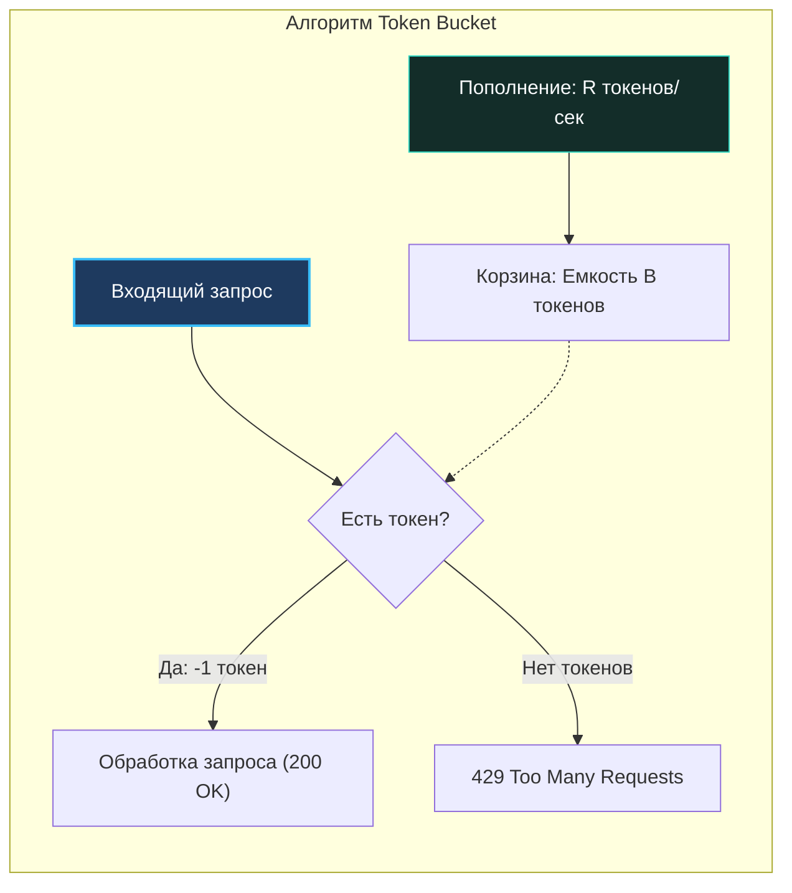
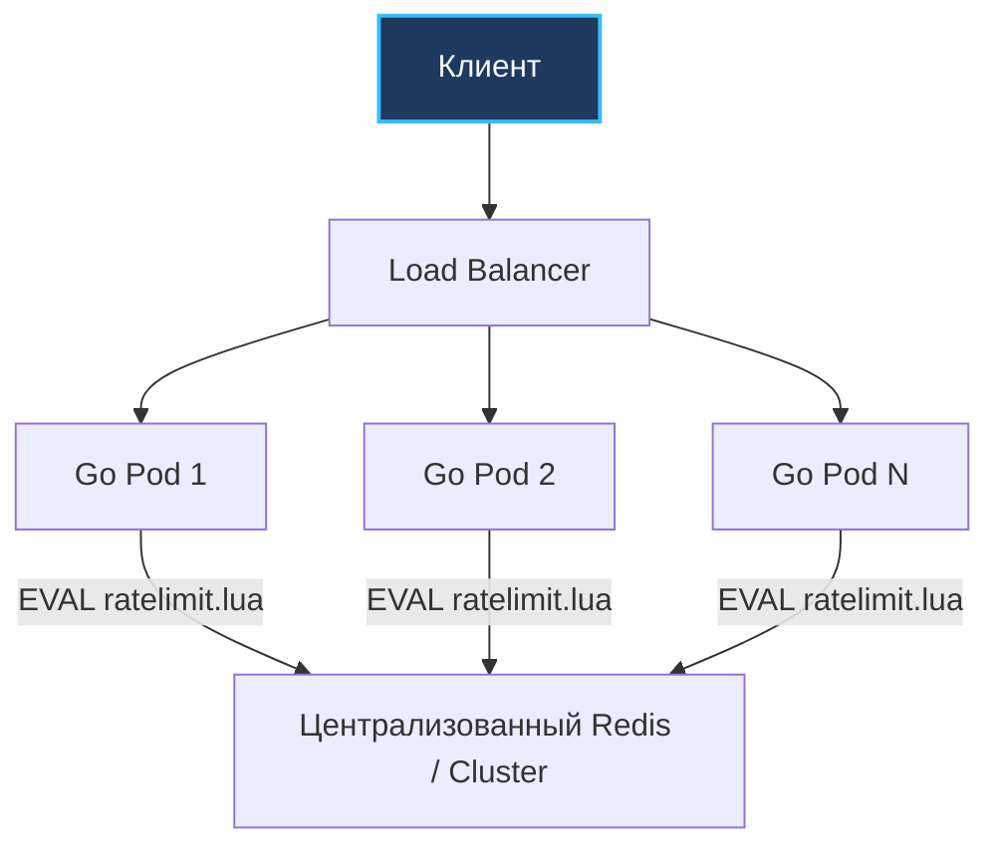

## Введение

В компьютерной безопасности существует фундаментальный закон асимметричной войны: лучшая линия обороны — это та, которая заставляет атакующего тратить в десятки раз больше ресурсов, чем защитника.

Сетевой сервис в Go, несмотря на высокую производительность и эффективную модель конкурентности, не застрахован от атак на доступность. Скорость рантайма Go часто делает его более привлекательной мишенью для злоумышленников: атака может исчерпать ресурсы приложения быстрее, чем в медленных интерпретируемых языках. Если Go-сервер способен мгновенно порождать десятки тысяч горутин, атакующий может использовать эту силу против самого сервиса. Защита бэкенда строится не на одном инструменте, а на многослойном подходе, где каждый уровень компенсирует недостатки предыдущего.

```mermaid
flowchart TD
    classDef process  fill:#1e293b,stroke:#38bdf8,stroke-width:1px,color:#f8fafc
    classDef success  fill:#064e3b,stroke:#34d399,stroke-width:1px,color:#f8fafc
    classDef error    fill:#7f1d1d,stroke:#f87171,stroke-width:1px,color:#f8fafc
    classDef warning  fill:#78350f,stroke:#fbbf24,stroke-width:1px,color:#f8fafc
    classDef entry    fill:#1e3a5f,stroke:#38bdf8,stroke-width:2px,color:#f8fafc
    classDef aux      fill:#334155,stroke:#64748b,stroke-width:1px,color:#f8fafc
    classDef system   fill:#312e81,stroke:#a78bfa,stroke-width:1px,color:#f8fafc
    classDef data     fill:#132d29,stroke:#2dd4bf,stroke-width:1px,color:#f8fafc
    classDef network  fill:#881337,stroke:#fb7185,stroke-width:1px,color:#f8fafc
    classDef accent   fill:#1e1b4b,stroke:#818cf8,stroke-width:1px,color:#f8fafc
    subgraph MultiLayerDefense ["Многослойная эшелонированная оборона"]
        L3L4["L3/L4 Защита: Anycast, Cloudflare, SYN Cookies, iptables/nftables"]:::process
        L7Edge["L7 Прокси / WAF: Envoy, Nginx, фильтрация заголовков, TLS"]:::network
        DistLimit["Распределенный Rate Limiter: Redis + Lua Scripts"]:::data
        GoRuntime["Go Runtime: http.Server таймауты, MaxBytesReader, worker pools"]:::network
        AppLogic["Бизнес-логика: капчи, circuit breakers, деградация"]:::process
        
        L3L4 --> L7Edge --> DistLimit --> GoRuntime --> AppLogic
    end
```



---

## Уровни DDoS-атак и векторы поражения

Атаки на отказ в обслуживании (DDoS) классифицируются по уровню сетевой модели, на котором они наносят максимальный ущерб.

### L3-L4 (Сетевой и Транспортный уровни)
Включают volumetric-атаки (завал трафика) и protocol-атаки (SYN flood, UDP amplification). На этом уровне нагрузка ложится на сетевую карту ОС и стек TCP/IP. В Linux для защиты от SYN-флуда используются **SYN cookies** и настройка `net.ipv4.tcp_syncookies`. 

В классическом режиме ядро выделяет память под запись полуоткрытого соединения в структуре `request_sock`. При SYN-флуде очередь `syn_backlog` переполняется за миллисекунды. При включенных SYN cookies ядро вообще не выделяет память в момент прихода SYN: оно кодирует состояние соединения в начальный порядковый номер (Initial Sequence Number, ISN) с помощью криптографического хэша от 4-tuple и секрета ядра. Если клиент легитимен, он вернет этот номер в `ACK`, и только тогда ядро создаст сокет. Если очередь `syn_backlog` переполняется, ядро начинает отбрасывать новые соединения без выделения ресурсов под полные TCP-структуры.

### L7 (Прикладной уровень)
Наиболее опасны для Go-сервисов. Злоумышленники имитируют легитимный трафик: отправляют тяжелые JSON-пейлоады, запускают долгие запросы (Slowloris), или генерируют тысячи уникальных запросов, которые вынуждают сервис обращаться к БД или кэшу. В отличие от PHP, где каждый запрос изолирован в отдельном процессе и умирает после завершения, Go держит горутины и объекты в памяти до явного завершения. При атаке L7 это приводит к быстрому исчерпанию памяти (OOM) или файлового дескриптора.

При атаке **Slowloris** атакующий медленно отправляет HTTP-заголовки (по 1 байту каждые 10 секунд). Сервер не закрывает соединение, так как клиент формально передает данные. В результате тысячи сокетов висят открытыми, блокируя дескрипторы и пулы соединений.

> [!warning] Ловушка / Gotcha
> `http.Server` по умолчанию в Go не ограничивает количество одновременных подключений. Если атакующий откроет 10 000 медленных соединений, планировщик Go создаст 10 000 горутин. Это не сломает CPU, но гарантированно уберёт процесс из памяти из-за аллокаций стека (по умолчанию 2 КБ на горутину, динамически растет) и дескрипторов.

---

## Rate Limiting: Алгоритмы и реализация под капотом

Rate Limiting (ограничение скорости) — механизм контроля частоты выполнения операций. В Go его реализация требует понимания компромисса между точностью, производительностью и распределённостью.

### Алгоритмы

1. **Token Bucket (Корзина токенов):** Позволяет делать burst (всплески) запросов. Токены добавляются в корзину с фиксированной скоростью до максимальной емкости. Приходящий запрос забирает токен. Если очередь пуста — запрос отклоняется. Идеален для HTTP API, так как прощает естественные кратковременные всплески активности пользователей.
2. **Sliding Window Counter:** Делит время на интервалы и считает запросы. Проще в реализации, но даёт ложные срабатывания на границах окон.
3. **Sliding Window Log:** Хранит timestamp каждого запроса. Максимально точен, но требует `O(N)` памяти и медленнее работает при высоких нагрузках.



### Идиоматичная реализация в Go

Для production-систем рекомендуется использовать пакет `golang.org/x/time/rate` или кастомные реализации на `atomic` для снижения давления на `sync.Mutex`. Ниже пример высокопроизводительного лимитера с поддержкой burst:

```go
package ratelimit

import (
	"sync"
	"time"

	"golang.org/x/time/rate"
)

// Limiter оборачивает rate.Limiter для потокобезопасного использования.
type Limiter struct {
	global     *rate.Limiter
	perIPLimit rate.Limit
	perIPBurst int
	mu         sync.RWMutex
	limiters   map[string]*rate.Limiter
}

// NewLimiter создает глобальный и per-IP лимитеры.
func NewLimiter(globalLimit rate.Limit, globalBurst int, perIPLimit rate.Limit, perIPBurst int) *Limiter {
	return &Limiter{
		global:     rate.NewLimiter(globalLimit, globalBurst),
		perIPLimit: perIPLimit,
		perIPBurst: perIPBurst,
		limiters:   make(map[string]*rate.Limiter),
	}
}

// Allow проверяет доступность токенов. Возвращает false, если лимит исчерпан.
func (rl *Limiter) Allow(ip string) bool {
	// Потокобезопасная проверка глобального лимита (rate.Limiter внутренне защищен мьютексом)
	if !rl.global.Allow() {
		return false
	}

	// Пер-IP лимит требует блокировки только при первом обращении или обновлении
	rl.mu.RLock()
	lim, exists := rl.limiters[ip]
	rl.mu.RUnlock()

	if !exists {
		rl.mu.Lock()
		// Double-check pattern для предотвращения race при создании
		if lim, exists = rl.limiters[ip]; !exists {
			lim = rate.NewLimiter(rl.perIPLimit, rl.perIPBurst)
			rl.limiters[ip] = lim
		}
		rl.mu.Unlock()
	}

	return lim.Allow()
}
```

> [!info] Под капотом
> `sync.Mutex` в Go реализован через `sync.runtime_SemacquireMutex`. При высокой конкуренции (например, при DDoS с одного IP) мьютекс переходит в состояние фаззинга (futex), что вызывает переход в ядро ОС. Это дорого. Для read-heavy сценариев (`RLock`/`RUnlock`) Go использует оптимизированный путь, позволяющий множеству горутин читать состояние одновременно без блокировки. Однако, если атакующий генерирует уникальный IP для каждого запроса, таблица `map[string]*rate.Limiter` будет расти неограниченно, вызывая утечку памяти. В production обязательно добавляйте TTL-очистку или используйте `sync.Map` с ограниченными ключами.

---

## Распределенный Rate Limiting и проблемы синхронизации

В кластере из N инстансов в-memory лимитеры бесполезны. Суммарный лимит будет в N раз больше заданного. Решение — распределённое состояние (Redis, Memcached).



**Ключевые проблемы:**
1. **Сетевая задержка:** Каждый вызов `rateLimit.Check()` добавляет RTT (round-trip time). При 1000 RPS это значит 1000 сетевых вызовов в секунду.
2. **Атомарность:** Чтение-модификация-запись в Redis должно быть атомарным. Используется Lua-скрипты (`EVAL`), которые выполняются в одном потоке Redis, исключая race conditions.
3. **Синхронизация часов:** Если инстансы используют локальное время для window-алгоритмов, границы окон рассинхронизируются. В Redis-решениях обычно используется время сервера или логика "last access + TTL".

> [!tip] Собеседование
> **Вопрос:** Как реализовать распределённый rate limiter без потери точности и с минимальным latency?
> **Ответ:** Использовать Redis с Lua-скриптом для атомарного инкремента ключа с TTL. Ключ формируется как `rate_limit:<namespace>:<identifier>`. TTL равен размеру sliding window. Для снижения нагрузки на Redis применяют локальный кэш-буфер (local cache with drift tolerance) или алгоритм Token Bucket с периодической синхронизацией состояния с Redis.

---

## Базовая защита сетевых сервисов в Go

Помимо rate limiting, необходимо жестко ограничивать ресурсы на уровне `net/http`:

```go
srv := &http.Server{
	Addr:           ":8080",
	Handler:        middleware.Chain(router),
	MaxHeaderBytes: 1 << 20, // 1 MB заголовков. Защита от Slowloris и buffer overflow.
	IdleTimeout:    120 * time.Second,
	ReadTimeout:    10 * time.Second,
	WriteTimeout:   30 * time.Second,
	// В Go 1.21+ появился новый сервер, но параметры остаются актуальными для контроля ресурсов.
}
```

**Критические настройки:**
- `MaxConnsPerHost` и `MaxIdleConns`: Ограничивают количество соединений в пуле `http.Client` (для исходящих запросов).
- `http.MaxBytesReader`: Ограничивает тело запроса. Без этого атакующий может отправить 10 ГБ JSON, убив память сервиса.
- `tls.Config`: Отключение слабых шифров (`TLS_RSA_WITH_RC4_128_SHA`), принуждение к `TLS 1.3`, настройка `MinVersion`.

```go
// Защита обработчика от гигантских пейлоадов
func protectedHandler(w http.ResponseWriter, r *http.Request) {
    // Ограничиваем чтение тела максимум 1 мегабайтом
    r.Body = http.MaxBytesReader(w, r.Body, 1<<20)
    
    var data RequestPayload
    if err := json.NewDecoder(r.Body).Decode(&data); err != nil {
        http.Error(w, "Payload too large or malformed", http.StatusRequestEntityTooLarge)
        return
    }
}
```

---

## Mechanical Sympathy и влияние на рантайм Go

Защита от DDoS напрямую влияет на работу рантайма Go и ОС:

1. **GC Pressure:** Высокая частота запросов генерирует аллокации (новые `context`, `map`, `[]byte`). При атаке GC переходит в режим "stop-the-world" чаще, увеличивая p99 latency. Решение: `sync.Pool` для повторного использования буферов, избежание аллокаций в hot path.
2. **Goroutine Scheduling:** Каждая горутина требует стека. При исчерпании лимита дескрипторов (`ulimit -n` по умолчанию 1024 в Docker) `net.Listen` начнёт падать с `too many open files`. Планировщик Go (G-M-P model) не может создать новые P (processor), если ОС не может выделить файловые дескрипторы для сокетов.
3. **TCP Backlog:** При SYN-флуде `net.Listen(backlog)` упирается в `net.core.somaxconn`. Если очередь заполнена, ядро начинает отбрасывать SYN-пакеты. Go не может это обойти на уровне приложения.
4. **Context Propagation:** В Go контекст передается по ссылке. При атаке с миллионами запросов создание `context.WithTimeout` для каждого соединения создает нагрузку на GC. Используйте `context.Background()` или пул контекстов для health-check endpoints.

> [!warning] Ловушка / Gotcha
> Многие разработчики забывают, что `http.Server.Shutdown()` не убивает активные соединения мгновенно. Он ждет завершения `context.Done()`. Под DDoS это может привести к зависанию graceful shutdown на минуты. Всегда настраивайте `ReadTimeout` и `WriteTimeout` строго меньше, чем таймауты оркестратора (Kubernetes `terminationGracePeriodSeconds`).

---

## Вопросы на собеседовании (Middle+/Senior)

> [!tip] Собеседование
> **Типичные вопросы Middle+/Senior:**
> 1. *Как отличить легитимный spike трафика от DDoS?* Анализ паттернов: DDoS часто имеет равномерную частоту, одинаковые User-Agent, отсутствие cookies/sessions, или атакует один endpoint. Легитимный трафик неравномерен.
> 2. *Почему `sync.Mutex` хуже `atomic` для rate limiter в hot path?* `Mutex` при конкуренции вызывает sleep/wakeup горутин (syscall `futex`). `atomic` работает через кэш-линии CPU (LLSC/LOCK CMPXCHG) и не вызывает переключение контекста, пока нет реальной коллизии.
> 3. *Как Go обрабатывает TIME_WAIT соединения?* См. [[39. TIME_WAIT, Port Exhaustion и другие проблемы TCP-сервисов.md]]. При атаке порт исчерпывается, новые подключения падают с `bind: address already in use`. Решение: `SO_REUSEADDR`, `SO_REUSEPORT`, или балансировка через L4.
> 4. *В чем разница между L4 и L7 балансировкой в контексте защиты?* L4 (iptables/IPVS) отбрасывает пакеты до их обработки Go, экономя CPU. L7 (nginx/envoy) парсит HTTP, проверяет заголовки и тело, но стоит дороже по latency.

---

## Итоги

Защита сетевых сервисов в Go строится на принципах **ограничения ресурсов на каждом уровне**:
- **OS/Network:** SYN cookies, `somaxconn`, лимиты дескрипторов.
- **Proxy/WAF:** Фильтрация L3-L4, DDoS scrubbing, IP reputation.
- **Go Runtime:** `http.Server` таймауты, `MaxHeaderBytes`, `http.MaxBytesReader`, ограничение горутин через worker pools или `semaphore`.
- **Application:** Распределённый rate limiting (Redis + Lua), валидация входных данных, пулинг объектов для снижения GC pressure.

Go не защищает вас от атак автоматически. Его мощь в эффективности требует дисциплины в управлении ресурсами. Без явного ограничения соединений, размеров тел запросов и частоты вызовов, высокопроизводительный сервис станет мишенью №1 для исчерпания ресурсов.

В следующей статье мы разберем инструменты, которые позволят вам видеть то, что скрывает Go: [[34. Наблюдаемость сети. tcpdump, Wireshark, netstat, ss.md]].