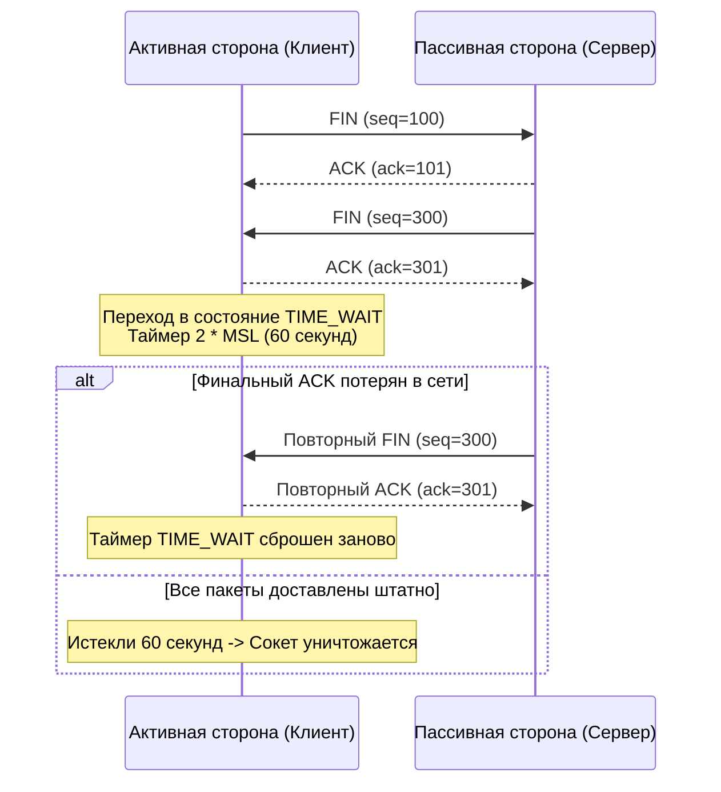

## Введение: Сетевой ресурс как узкое место

> *«Самым эффективным инструментом отладки по-прежнему остается вдумчивое размышление вкупе с грамотно расставленными вызовами печати».*    
> — Брайан Керниган

В мире современных распределенных систем разработчики часто воспринимают сеть как неограниченный эфир: вызвал `http.Get()`, отправил gRPC-запрос, записал событие в Kafka — и все работает само собой. Память у нас защищена сборщиком мусора, горутины масштабируются сотнями тысяч, а процессорные ядра готовы перемалывать гигабайты JSON.

Однако при переходе от умеренных нагрузок к сотням тысяч запросов в секунду (HighLoad) сервис внезапно сталкивается с невидимой бетонной стеной. Серверные метрики CPU показывают скромные 15%, оперативной памяти свободно еще 40 гигабайт, но приложение начинает выбрасывать загадочные ошибки: `dial tcp: bind: address already in use` или `connect: cannot assign requested address`. Запросы начинают таймаутить, а в системном логе ядра `dmesg` появляются тревожные записи `nf_conntrack: table full, dropping packet`.

В этот момент мы сталкиваемся с жесткой реальностью: **сетевые соединения — это физически исчерпаемый ресурс ядра операционной системы**, ограниченный математикой протокола TCP и таблицами состояний Linux. Главным виновником этой драмы чаще всего становится механизм **Port Exhaustion** (исчерпание эфемерных портов), неразрывно связанный с состоянием сокетов **`TIME_WAIT`**.

---

### Бытовая аналогия: Прокатный автопарк и зона дезинфекции

Представьте популярную службу каршеринга в аэропорту:
- В диспетчерской на стене висит ровно 28 000 номерных жетонов и ключей от машин — это диапазон исходящих эфемерных портов хоста (`32768-60999`).
- Каждый раз, когда горутина делает короткий исходящий HTTP-запрос без переиспользования соединения, она берет ключи, садится за руль, проезжает 20 метров до шлагбаума и тут же сдает машину обратно (`FIN`).
- Но по правилам безопасности автопарка (спецификация RFC 793) сданную машину запрещено отдавать новому водителю сразу. Автомобиль отправляется в зону карантина и дезинфекции ровно на 60 секунд — это и есть состояние **`TIME_WAIT`**, равное удвоенному времени жизни пакета (`2 * MSL`). Зачем? Чтобы убедиться, что от предыдущей поездки не долетели запоздалые штрафы и забытый багаж.
- Если ваш сервис генерирует 1 000 коротких запросов в секунду, то через 28 секунд **все 28 000 машин окажутся запертыми на карантинной стоянке `TIME_WAIT`**! На доске ключей не останется ни одного свободного номера. Следующий клиент, пришедший за машиной, получает жесткий отказ: `cannot assign requested address`, хотя стоянка ломится от исправных автомобилей.

---

## TIME_WAIT: Зачем ядру нужно «держать мертвецов»

Состояние `TIME_WAIT` возникает на стороне узла, который **первым инициирует закрытие соединения** (выполняет так называемое Active Close). Чаще всего это клиент, завершающий запрос, но в случае HTTP-сервера с заголовком `Connection: close` инициатором становится сам сервер.

Согласно RFC 793, закрытое соединение обязано оставаться в `TIME_WAIT` в течение интервала $2 \times \text{MSL}$ (Maximum Segment Lifetime — максимальное время жизни сегмента в сети). Исторически MSL принимался равным 1 или 2 минутам. В современном Linux этот параметр зашит константой в исходном коде ядра и составляет **60 секунд** (константа `TCP_TIMEWAIT_LEN = 60 * HZ`; ее часто ошибочно путают с sysctl-параметром `tcp_fin_timeout`, который на самом деле регулирует лишь таймаут сокетов в состоянии `FIN-WAIT-2`).



Ядро удерживает закрытый сокет по двум фундаментальным причинам:
1. **Надежность доставки финального подтверждения (ACK):** Если последний отправленный клиентом `ACK` потеряется по дороге, пассивный сервер решит, что его собственный сегмент `FIN` не дошел, и отправит его повторно. Если бы клиент моментально уничтожил сокет, на пришедший повторный `FIN` ядро ответило бы аварийным пакетом `RST`. Сервер зафиксировал бы ошибку `Connection reset by peer`, хотя на самом деле все полезные данные были успешно переданы! Состояние `TIME_WAIT` удерживает сокет, позволяя корректно ответить повторным `ACK`.
2. **Очистка сети от «заблудившихся» пакетов (Draining Duplicate Segments):** Пакеты в сети могут задерживаться на перегруженных маршрутизаторах. Если локальный порт освободится мгновенно, новое соединение с тем же `SrcIP:SrcPort:DstIP:DstPort` может получить старый «фантомный» пакет от прошлой сессии с тем же `seq` и разрушить целостность данных приложения. Интервал `2 * MSL` гарантирует, что все задержавшиеся в пути дубликаты гарантированно умрут в сети до переиспользования порта.

> [!info] Под капотом
> В Linux ядро не хранит полноценный `struct sock` для `TIME_WAIT`. Вместо этого используется легковесная структура `struct tcp_timewait_sock`. Она помещается в хеш-таблицу `tcp_time_wait_hash`. Это экономит память, но создает нагрузку на `conntrack` (таблицу отслеживания состояний), которая мониторит все активные и недавние соединения для NAT, брандмауэра и QoS.

---

## Port Exhaustion: Механика исчерпания

В протоколе TCP любое сетевое соединение строго идентифицируется четырехэлементным кортежем (4-tuple):
$$\text{Socket} = (\text{SrcIP}, \text{SrcPort}, \text{DstIP}, \text{DstPort})$$

Когда Go-сервис выступает в роли клиента (вызывает сторонний API, микросервис, базу данных PostgreSQL или Redis), он фиксирует:
- $\text{SrcIP}$ — локальный адрес сервера;
- $\text{DstIP}$ — адрес целевого сервера базы или API;
- $\text{DstPort}$ — порт целевого сервиса (например, 5432 или 443).

Единственной переменной в этой формуле остается **$\text{SrcPort}$** — локальный эфемерный порт (ephemeral port), который ядро автоматически выделяет из пула `net.ipv4.ip_local_port_range`. По умолчанию в Linux этот диапазон составляет от `32768` до `60999` — то есть всего около **28 232 портов**.

Если ваш Go-сервис выполняет частые короткоживущие запросы к одному и тому же целевому адресу без повторного использования соединений (например, 10k RPS к внешнему API или базе данных с `pool_size = 1`), пул свободных портов истощается за считанные секунды. Каждое закрытое соединение блокирует свой номер порта в состоянии `TIME_WAIT` на 60 секунд.

### Характерные симптомы катастрофы:
- Ошибка создания сокета: `dial tcp: bind: address already in use`
- Ошибка выделения исходящего порта: `connect: cannot assign requested address`
- Записи в системном кольцевом буфере `dmesg`: `nf_conntrack: table full, dropping packet`
- Рост времени отклика и потеря входящих пакетов из-за перегрузки таблицы conntrack.

> [!warning] Ловушка / Gotcha
> На серверной стороне `TIME_WAIT` накапливается, если вы агрессивно закрываете соединения без пулинга. На клиентской стороне порт исчерпывается быстрее всего, если вы не переиспользуете соединения (`Keep-Alive`). В Go это часто случается при небрежной настройке `net/http.Transport`.
> 
> Еще более опасное состояние — **`CLOSE_WAIT`**. Если `TIME_WAIT` управляется ядром, то `CLOSE_WAIT` наступает на принимающей стороне, когда удаленный клиент уже закрыл соединение, а ваше Go-приложение забыло закрыть сокет (`resp.Body.Close()` или `conn.Close()`). Сокеты в `CLOSE_WAIT` висят вечно, утекают как файловые дескрипторы (`EMFILE`) и являются 100% ошибкой прикладного кода!

---

## Стратегии борьбы: SO_REUSE, тюнинг ядра и пулинг

### 1. SO_REUSEADDR и SO_REUSEPORT

Разница между этими сокетными опциями — любимая тема архитектурных собеседований:
- `SO_REUSEADDR`: Разрешает привязать слушающий сокет (`bind`) к порту, даже если на этом порту в ядре еще «догорают» старые соединения в состояниях `TIME_WAIT` или `CLOSE_WAIT`. **Не создает новых соединений**, а лишь ускоряет перезапуск упавшего сервиса без ожидания 60 секунд.
- `SO_REUSEPORT` (доступен в Linux 3.9+): Позволяет нескольким независимым процессам или горутинам привязаться к абсолютно одному и тому же `IP:port`. Ядро автоматически распределяет входящие `accept` между сокетами воркеров по хэшу 4-tuple, полностью устраняя блокировки (contention) на общем сокете и улучшая локальность кэш-линий CPU.

### 2. Тюнинг ядра Linux

На боевых шлюзах и нагруженных бэкендах сетевой стек необходимо адаптировать через `sysctl`:

```bash
# Разрешить повторное использование TIME_WAIT для исходящих соединений (безопасно в современных ядрах)
net.ipv4.tcp_tw_reuse = 1

# Расширить диапазон эфемерных портов (для клиентов)
net.ipv4.ip_local_port_range = 1024 65535

# Лимит хеш-корзин TIME_WAIT (по умолчанию ~262144)
net.ipv4.tcp_max_tw_buckets = 524288
```

> [!tip] Собеседование
> **Вопрос:** Почему `SO_REUSEADDR` не спасает от `TIME_WAIT` на сервере при перезапуске?
> **Ответ:** `SO_REUSEADDR` лишь разрешает `bind()` к занятому адресу. Он не удаляет активные состояния `TIME_WAIT` из таблицы conntrack. Для мгновенного освобождения нужно ждать завершения таймера или использовать `SO_REUSEPORT` с несколькими воркерами, либо настраивать `tcp_tw_reuse` (только для исходящих соединений).

### 3. Connection Pooling (Пул постоянных соединений)
Самый надежный способ победить `TIME_WAIT` — не закрывать TCP-соединения после каждого запроса, а держать их открытыми через HTTP Keep-Alive. В Go пулинг встроен в `net/http.Transport`. Если `IdleConnTimeout` слишком мал (< 60 сек на Linux), соединения будут закрываться до завершения `TIME_WAIT`, вызывая постоянный цикл `SYN -> FIN`. Это убивает производительность и быстро исчерпывает порты.

---

## Go-специфика: net/http, netpoll и системные вызовы

### Как Go управляет соединениями
- При вызове `net.Listen` рантайм Go последовательно выполняет внутренние системные вызовы: `sysSocket` -> `bind` -> `listen`. При включенном `SO_REUSEPORT` ядро балансирует входящие `accept` между сокетами разных потоков.
- Клиентский пакет `net/http` по умолчанию использует транспорт `http.Transport` с глобальным пулом открытых соединений. Критичные поля пула: `MaxIdleConns`, `MaxIdleConnsPerHost`, `IdleConnTimeout`.
- Планировщик ввода-вывода `netpoll` (epoll/kqueue) непрерывно мониторит файловые дескрипторы. Каждый сокет — это FD. При исчерпании системного лимита файловых дескрипторов (`ulimit -n`) или системных таблиц ядра системный вызов `accept` начинает возвращать ошибки `EMFILE` («Too many open files») или `ENFILE` («Too many open files in system»).

> [!info] Под капотом
> В Go 1.21+ планировщик использует `netpoll` для асинхронного приема соединений. При высокой нагрузке на `TIME_WAIT` сокеты не потребляют CPU, но занимают память в ядре. Когда таблица `conntrack` переполняется, ядро начинает `drop` пакеты, что вызывает silent retransmissions и рост latency.

### Пример правильной настройки для production

Ниже приведен эталонный пример конфигурации клиента и сервера на Go для высоконагруженных промышленных окружений:

```go
package main

import (
	"context"
	"log"
	"net"
	"net/http"
	"syscall"
	"time"

	"golang.org/x/sys/unix"
)

func createProductionClient() *http.Client {
	transport := &http.Transport{
		MaxIdleConns:        100,
		MaxIdleConnsPerHost: 100, // Важно! В DefaultTransport по умолчанию всего 2!
		IdleConnTimeout:     90 * time.Second, // Должен быть > 2 * MSL (60s)
		DisableKeepAlives:   false,
		TLSHandshakeTimeout: 10 * time.Second,
	}

	return &http.Client{
		Transport: transport,
		Timeout:   15 * time.Second,
	}
}

func createOptimizedListener(addr string) (net.Listener, error) {
	// Для высоконагруженных серверов: включаем SO_REUSEPORT и SO_REUSEADDR
	lc := net.ListenConfig{
		Control: func(network, address string, c syscall.RawConn) error {
			var opErr error
			err := c.Control(func(fd uintptr) {
				// unix.SO_REUSEPORT доступен в пакете golang.org/x/sys/unix
				if err := unix.SetsockoptInt(int(fd), unix.SOL_SOCKET, unix.SO_REUSEPORT, 1); err != nil {
					opErr = err
					return
				}
				// Также полезно включить SO_REUSEADDR для быстрого перезапуска
				if err := unix.SetsockoptInt(int(fd), unix.SOL_SOCKET, unix.SO_REUSEADDR, 1); err != nil {
					opErr = err
					return
				}
			})
			if err != nil {
				return err
			}
			return opErr
		},
	}

	return lc.Listen(context.Background(), "tcp", addr)
}

func main() {
	ln, err := createOptimizedListener(":8080")
	if err != nil {
		log.Fatalf("listen failed: %v", err)
	}
	defer ln.Close()

	log.Println("Сервер успешно запущен с поддержкой SO_REUSEPORT")
}
```

---

## Сравнение подходов: Go vs C++/Java/PHP

| Аспект | Go | C++ / Java | PHP |
|--------|----|------------|-----|
| **Пулинг соединений** | Встроен в `net/http.Transport`, настраивается через `IdleConnTimeout` | Требует внешних библиотек (OkHttp, Boost.Asio) или ручной настройки | Отсутствует по умолчанию, FPM убивает процессы, соединения не переиспользуются |
| **Управление FD** | `netpoll` (epoll/kqueue), автоматическое управление дескрипторами | Ручное управление `epoll`/`kqueue` или libevent | Сигнал-Driven или select/poll (устаревшие модели) |
| **TIME_WAIT влияние** | Критично при неверном тюнинге `Transport` | Критично, но разработчики часто пишут свои pooling-слои | Нивелируется перезапуском PHP-FPM, но вызывает утечку памяти/FD |

---

## Итог

1. **Природа `TIME_WAIT`:** Состояние `TIME_WAIT` существует ради надежности сети и защиты от коллизий пакетов. Его длительность (`2 * MSL`, 60 секунд в Linux) жестко зафиксирована в ядре и не является багом приложения.
2. **Анатомия Port Exhaustion:** Исчерпание портов возникает при лавинообразном открытии короткоживущих TCP-соединений. Проблема решается расширением диапазона эфемерных портов (`ip_local_port_range`), включением `tcp_tw_reuse` и правильным пулингом соединений.
3. **Go-специфика:** `net/http.Transport` автоматически организует пулинг соединений, но параметр `IdleConnTimeout` обязан превышать 60 секунд на Linux, а `MaxIdleConnsPerHost` не должен оставаться равным 2. Флаг `SO_REUSEPORT` снимает блокировки на системном вызове `accept` и распределяет сетевой трафик по всем ядрам CPU.
4. **Коварство conntrack:** Сокеты в `TIME_WAIT` не тратят ресурсы CPU, но перегружают таблицу `conntrack` и память ядра. При ее переполнении ядро начинает молча отбрасывать входящие пакеты (`silent drops`), маскируя системную проблему под сбои приложения.

Мы изучили жизненный цикл TCP-соединений, коварство состояний `TIME_WAIT` и способы защиты от нехватки портов на уровне операционной системы. Однако узкие места сетевого стека кроются не только в исчерпании ресурсов хоста, но и в самой природе потоковых протоколов и поведении недобросовестных клиентов. В следующей статье [[40. Head of Line Blocking, Slowloris и деградация под нагрузкой]] мы исследуем, как медленные запросы могут парализовать веб-сервер и как современные протоколы борются с блокировками в начале очереди.