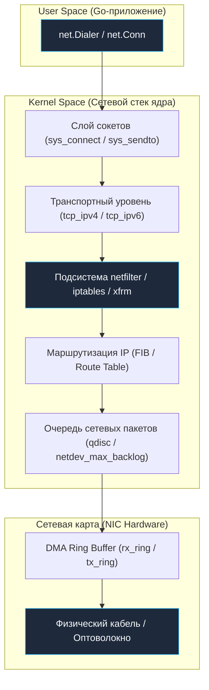
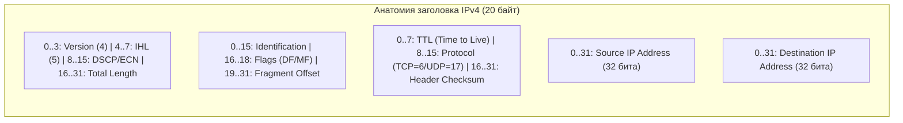
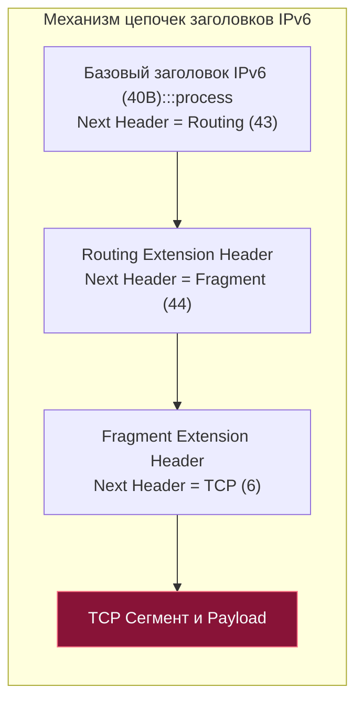
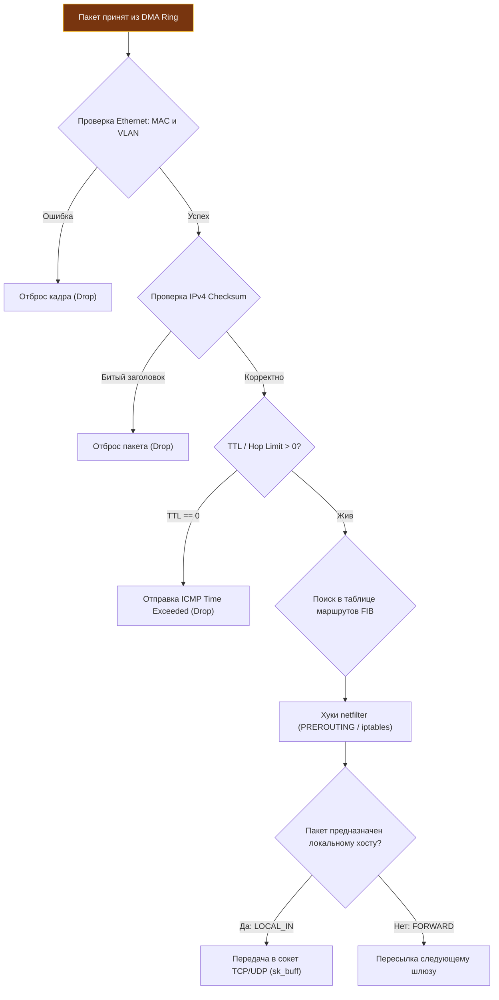
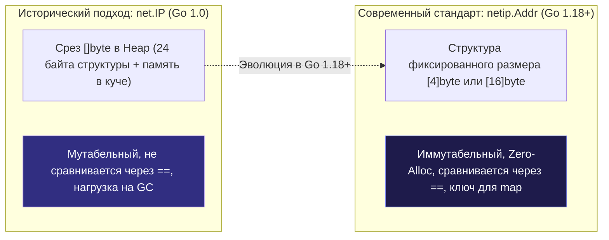

## Роль IP в стеке и зачем это Go-разработчику

Протокол **IP (Internet Protocol)** работает на **третьем (сетевом) уровне модели OSI** и образует фундамент глобального интернета. Если протоколы канального уровня ([[3. Ethernet, MAC-адреса и локальные сети.md]]) обеспечивают доставку кадров лишь в пределах одного кабеля или коммутатора, то протокол IP решает принципиально иную, грандиозную задачу: **логическую сквозную адресацию и маршрутизацию пакетов через миллионы разнородных сетей планеты**.

Создатели архитектуры интернета Винтон Серф и Роберт Кан заложили в IP гениальный принцип минимализма: **IP — это датаграммный протокол без установления соединения с негарантированной доставкой (Best-Effort Delivery)**.  
Протокол IP не обещает, что ваш пакет гарантированно дойдет до адресата. Он не гарантирует сохранение порядка пакетов и не защищает от дубликатов. Он дает одно лаконичное обещание: приложить максимум физических усилий, чтобы переправить пакет на один шаг (hop) ближе к целевому узлу.

Для Go-разработчика понимание устройства протокола IP критично на трех практических уровнях:

1.  **Сетевое программирование и надежность:** Конфигурирование сетевых соединений `net.Conn`, тонкая настройка структуры `net.Dialer`, диагностика ошибок таймаутов `dial`, предотвращение зависаний DNS и понимание границ между размером кадра MTU и максимальным размером сегмента `TCP MSS`.
2.  **Mechanical Sympathy и производительность:** Выравнивание битовых полей в заголовках, аппаратная разгрузка контрольных сумм (Checksum Offloading), влияние размера заголовков на кэш-линии процессора L1/L2 и устранение паразитной фрагментации пакетов.
3.  **Системная архитектура и масштабирование:** Проектирование CIDR-подсетей микросервисов, поддержка IPv6 Dual-Stack, работа с балансировщиками нагрузки ([[29. Балансировка нагрузки. L4, L7, Round Robin, Least Connections.md]]) и обратными прокси-серверами ([[27. Прокси, Reverse Proxy и API Gateway.md]]).

> [!info] Под капотом
> В ядре Linux сетевой стек реализован в виде высокооптимизированных модулей ядра (`netfilter`, `tcp_ipv4`, `tcp_ipv6`, `xfrm`). Когда Go-приложение вызывает метод `net.Dial()`, запрос проходит многослойный путь: User Space (пакет `net`) → слой сокетов VFS → транспортный слой TCP/UDP → сетевой уровень IP → драйвер устройства → сетевая карта NIC. Понимание каждого звена позволяет осознанно управлять параметрами ядра через подсистему `sysctl` (например, повторное использование портов `net.ipv4.tcp_tw_reuse`, размер входной очереди сетевых карт `net.core.netdev_max_backlog`) и устранять скрытые узкие места сетевого стека.



## IPv4: Устройство заголовка и ограничения

Протокол **IPv4** (RFC 791) оперирует **32-битными адресами**, предоставляя теоретическое пространство в $2^{32} pprox 4.29$ миллиарда уникальных адресов.

Минимальный заголовок пакета IPv4 имеет фиксированную длину **20 байт** (при отсутствии дополнительных опций). При наличии опций длина может достигать 60 байт, однако в современном высоконагруженном интернете опции практически всегда отключены ради скорости аппаратной обработки.

| Битовое поле заголовка | Размер | Физическое назначение и влияние на систему |
| :--- | :---: | :--- |
| **Version** | 4 бита | Версия протокола IP. Для IPv4 здесь всегда записано число `4`. |
| **IHL (Internet Header Length)** | 4 бита | Длина заголовка, измеряемая в 32-битных словах. Минимальное значение равно 5 ($5 	imes 4 = 20$ байт). |
| **DSCP / ECN** | 8 бит | Классификация трафика (QoS) и флаги явного уведомления о перегрузке маршрутизатора (Explicit Congestion Notification). |
| **Total Length** | 16 бит | Полная длина всего IP-пакета (заголовок плюс полезная нагрузка). Максимальное значение — 65 535 байт. |
| **Identification** | 16 бит | Уникальный числовой идентификатор пакета, используемый для склеивания фрагментов при фрагментации. |
| **Flags + Fragment Offset** | 3 + 13 бит | Управление фрагментацией: флаг DF (Don't Fragment), флаг MF (More Fragments) и смещение фрагмента в 8-байтных блоках. |
| **TTL (Time to Live)** | 8 бит | Время жизни пакета в хопах (маршрутизаторах). Каждый маршрутизатор уменьшает TTL на единицу. При достижении `0` пакет уничтожается. |
| **Protocol** | 8 бит | Номер протокола следующего уровня: `6` для TCP, `17` для UDP, `1` для ICMP. |
| **Header Checksum** | 16 бит | Контрольная сумма *исключительно* самого заголовка IPv4. |
| **Source / Destination IP** | 32 + 32 бита | 4-байтные адреса отправителя и получателя пакета. |



**Mechanical Sympathy и процессорный кэш:**  
Заголовок IPv4 идеально выровнен по 32-битным (4-байтным) границам. Когда ядро Linux загружает 20 байт стандартного заголовка, он гарантированно помещается в одну 64-байтную кэш-линию процессора L1d вместе с началом TCP-заголовка. Однако если пакет содержит нестандартные опции IP, заголовок приобретает некратную длину. Это вызывает аппаратное расщепление строки кэша (**cache line split**) при последующем чтении TCP-портов, что приводит к дополнительным тактам задержки на уровне кремния CPU.

> [!warning] Ловушка / Gotcha
> **Контрольная сумма в IPv4 вычисляется только по заголовку!**  
> Поле `Header Checksum` в IPv4 защищает от искажения битов *только служебные поля самого IP-заголовка*. Сами передаваемые данные (payload) протоколом IP не проверяются вовсе! Это архитектурное решение было принято для предельной скорости маршрутизации в 1980-х годах, но оно перекладывает всю ответственность за целостность бизнес-данных на протоколы четвертого уровня (TCP, UDP). В приложениях на Go вы не можете полагаться на IP-уровень для отсева битых данных.

## IPv6: Фиксированный заголовок и эволюция

Бурный рост мобильных устройств, облачных микросервисов и интернета вещей привел к исчерпанию глобального пула свободных адресов IPv4 в 2011 году. Архитектурным ответом индустрии стал протокол **IPv6** (RFC 8200).

IPv6 — это не просто расширение разрядности адресов, а глубокое архитектурное переосмысление сетевого уровня:

1.  **Колоссальное 128-битное адресное пространство:**  
    IPv6 предоставляет $2^{128} pprox 3.4 	imes 10^{38}$ адресов (хватит, чтобы присвоить миллионы уникальных публичных IP-адресов каждому атому на поверхности Земли!). Это устраняет необходимость в костылях трансляции адресов NAT и упрощает автоконфигурацию SLAAC (Stateless Address Autoconfiguration).
2.  **Строго фиксированный 40-байтный заголовок:**  
    В отличие от плавающего заголовка IPv4, базовый заголовок IPv6 всегда занимает ровно **40 байт**. В нем нет поля длины заголовка (IHL) и нет встроенных опций. Это позволило производителям сетевых чипов создавать сверхбыстрые кремниевые конвейеры аппаратной коммутации.
3.  **Полный отказ от контрольной суммы (No Header Checksum):**  
    В IPv6 поле контрольной суммы заголовка отсутствует вовсе! Целостность на уровне кадров уже проверяется кодом CRC-32 в Ethernet, а целостность полезной нагрузки проверяется TCP и UDP. Отказ от контрольной суммы спас маршрутизаторы от необходимости пересчитывать математическую сумму на каждом хопе при декременте счетчика жизни пакета.
4.  **Цепочки расширенных заголовков (Extension Headers):**  
    Любые дополнительные параметры (маршрутизация, фрагментация, шифрование IPsec) вынесены в опциональные расширенные заголовки, которые последовательно связываются полем `Next Header`.

| Поле заголовка IPv6 | Размер | Назначение |
| :--- | :---: | :--- |
| **Version** | 4 бита | Версия протокола (всегда число `6`). |
| **Traffic Class** | 8 бит | Класс трафика и приоритет (аналог DSCP/ECN в IPv4). |
| **Flow Label** | 20 бит | Метка сквозного потока для поддержки качества обслуживания (QoS) без заглядывания внутрь TCP. |
| **Payload Length** | 16 бит | Размер полезной нагрузки (данные плюс расширенные заголовки). |
| **Next Header** | 8 бит | Тип следующего заголовка (TCP, UDP, ICMPv6 или расширенный заголовок). |
| **Hop Limit** | 8 бит | Лимит пересылок (точный аналог поля TTL в IPv4). |
| **Source / Destination Address** | 128 + 128 бит | 16-байтные адреса отправителя и получателя. |



> [!tip] Собеседование
> **Вопрос:** Почему создатели протокола IPv6 приняли решение полностью ликвидировать контрольную сумму заголовка IP?  
> **Ответ:** Ради радикального ускорения транзитной маршрутизации пакетов на физических маршрутизаторах интернета. В IPv4 на каждом промежуточном маршрутизаторе ядро обязано уменьшить поле TTL на 1, что требует повторного вычисления контрольной суммы заголовка `Header Checksum`. При миллионах пакетов в секунду это создавало ощутимую вычислительную нагрузку. Поскольку канальный уровень (Ethernet FCS) аппаратно гарантирует отсутствие битовых ошибок в кадре, а транспортные протоколы (TCP, UDP) проверяют целостность данных псевдозаголовком, двойная проверка контрольной суммы в IP была признана избыточной и упразднена.

## Сравнение и переходные механизмы

Современная инфраструктура функционирует в гибридном режиме **Dual-Stack**, где серверы и прокси-балансировщики ([[28. nginx, Envoy и HAProxy. Как работают современные прокси.md]]) одновременно обрабатывают трафик стеков IPv4 и IPv6.

Ключевые технологии сосуществования и трансляции:
*   **Dual-Stack:** Сервер слушает сокеты в режиме двойного стека (в Linux сокет `AF_INET6` при сброшенном флаге `IPV6_V6ONLY` прозрачно принимает как IPv6, так и IPv4-клиентов через IPv4-mapped IPv6 адреса вида `::ffff:192.0.2.1`).
*   **NAT64 / DNS64:** Позволяет клиентам из чистых IPv6-сетей обращаться к устаревшим IPv4-сервисам через специальный синтетический префикс и шлюз трансляции.
*   **Туннелирование (Teredo, 6to4):** Инкапсуляция пакетов IPv6 внутрь стандартных датаграмм IPv4 для преодоления устаревших сегментов сети.
*   **ICMPv6 и протокол NDP:** В IPv6 полностью упразднен устаревший протокол ARP ([[5. ARP, Neighbor Discovery и поиск узла в локальной сети.md]]). Обнаружение соседей в локальной сети выполняется через протокол NDP (Neighbor Discovery Protocol) поверх сообщений ICMPv6.

## Под капотом: Ядро Linux и работа с памятью

Когда физический IP-пакет поступает на сетевой адаптер (NIC) и через DMA сбрасывается в кольцевой буфер оперативной памяти, ядро Linux производит строгую проверку:



1.  **Слой L2:** Ядро сверяет MAC-адрес и VLAN-тег.
2.  **Валидация IP-заголовка:** Проверяется длина пакета и контрольная сумма (для IPv4).
3.  **Контроль зацикливания:** Декрементируется значение TTL / Hop Limit. Если поле равно `0`, ядро отбрасывает пакет и генерирует диагностическое сообщение ICMP Time Exceeded (на этом механизме построена утилита `traceroute`).
4.  **Маршрутизация (Route Lookup):** Поиск адреса назначения в системной таблице FIB ([[6. Маршрутизация. Таблица маршрутов, шлюзы и default route.md]]).
5.  **Фильтрация Netfilter:** Пакет проходит цепочки хуков подсистем `iptables` и `nftables` ([[32. Firewall, iptables, nftables и базовая фильтрация трафика.md]]).
6.  **Доставка в сокет:** Пакет передается модулям `tcp_ipv4` или `tcp_ipv6` и помещается в приемный буфер сокета `sk_buff`.

**Оптимизация в Go:** Современные сетевые адаптеры аппаратно поддерживают вычисление контрольных сумм (**Checksum Offloading**). Сетевая карта сама считает чексуммы TCP и UDP при передаче. В коде на Go при передаче потоков через `net.Conn` и буферизованный ввод-вывод `bufio` вычисление контрольных сумм прозрачно делегируется аппаратуре. А при отправке и приеме датаграмм UDP через системные вызовы `WriteMsgUDP`, `ReadMsgUDP` или `syscall.WriteMsgUDP` с флагом `MSG_MORE` ядро взаимодействует с сетевым адаптером напрямую, обрабатывая служебные управляющие структуры `CMsg` без лишних переаллокаций.

> [!warning] Ловушка / Gotcha
> **Катастрофические последствия фрагментации IP-пакетов:**  
> Если размер IP-пакета превышает максимальный размер кадра физической линии (MTU = 1500 байт), маршрутизаторы или ядро вынуждены делить пакет на фрагменты.  
> В высоконагруженных системах фрагментация недопустима:
> 1. Потеря хотя бы одного мелкого фрагмента приводит к отбрасыванию всего огромного пакета целиком, заставляя TCP перезапрашивать весь сегмент.
> 2. Фрагменты не содержат TCP-портов (порт есть только в первом фрагменте!), что ломает работу сетевых фильтров и балансировщиков L4.
> 3. Исторические атаки вроде `Smurf attack` или `Teardrop` эксплуатировали баги ядра при сборке фрагментов.  
> В современных Go-сервисах фрагментацию предотвращают установкой флага DF (Don't Fragment), согласованием размера сегмента `TCP MSS` ([[21. HTTP 1.1 под капотом. Keep Alive, Chunked Encoding, Pipelining.md]], [[22. HTTP 2. Multiplexing, Frames, HPACK.md]]) и применением техники **`MSS clamping`** на пограничных маршрутизаторах.

## Реализация в Go: от `net.IP` к `net/netip`

На протяжении первого десятилетия существования языка Go (начиная с релиза Go 1.0) работа с IP-адресами строилась вокруг типа `net.IP`. Исторически тип `net.IP` был определен как срез байт:

```go
type IP []byte
```

Это раннее архитектурное решение несло в себе тяжелые скрытые проблемы:
*   Срез — это ссылочный тип, аллоцируемый в управляемой куче (Heap allocation при каждом парсинге адреса).
*   Срезы в Go мутабельны: любой сторонний метод мог непреднамеренно изменить байты внутри адреса.
*   Тип `net.IP` нельзя было сравнивать через стандартный оператор равенства `==`, и его нельзя было использовать в качестве ключа хэш-таблицы `map[net.IP]T`!
*   Парсинг миллионов IP-адресов создавал колоссальное давление на сборщик мусора GC.

В версии **Go 1.18** выдающийся инженер Брэд Фицпатрик разработал революционный пакет **`net/netip`**, ставший эталоном **Zero-Allocation** архитектуры.

```go
package main

import (
	"fmt"
	"net/netip"
)

func main() {
	// 1. Быстрый парсинг IPv4 и IPv6 без единой аллокации в куче!
	ipv4, err := netip.ParseAddr("192.168.1.1")
	if err != nil {
		panic(err)
	}

	ipv6, err := netip.ParseAddr("2001:db8::1")
	if err != nil {
		panic(err)
	}

	// 2. Мгновенная проверка типа адреса
	fmt.Println("Is IPv4:", ipv4.Is4(), "Is IPv6:", ipv6.Is6()) // true, true
	
	// 3. Высокопроизводительная работа с бесклассовыми префиксами подсетей (CIDR)
	prefix4, err := netip.ParsePrefix("192.168.1.0/24")
	if err != nil {
		panic(err)
	}
	
	fmt.Printf("Подсеть: %s, Маска: %d бит\n", prefix4.Addr(), prefix4.Bits())
	
	// 4. Проверка принадлежности IP-адреса диапазону подсети за O(1)
	if prefix4.Contains(ipv4) {
		fmt.Println("Адрес 192.168.1.1 входит в доверенную локальную подсеть")
	}
}
```



**Почему пакет `net/netip` кардинально превосходит старый подход:**
1.  **Чистый тип-значение (Value Type):** Структура `netip.Addr` хранит адрес во внутреннем фиксированном массиве `[4]byte` или `[16]byte`. Адрес передается по значению через регистры процессора, исключая аллокации в куче, лишние указатели и интерфейсные обёртки `interface{}`.
2.  **Потокобезопасность и иммутабельность:** Адрес невозможно случайно мутировать из другой горутины.
3.  **Совместимость с `map`:** Структуры `netip.Addr` и `netip.Prefix` поддерживают прямое сравнение через оператор `==`, позволяя использовать их в качестве сверхбыстрых ключей хэш-таблиц для черных/белых списков IP и маршрутизаторов.
4.  **Мгновенные преобразования:** Методы `IPv4()`, `IPv6()` и `Unmap()` выполняются за $O(1)$ без копирования байт, идеально интегрируясь с сетевым поллером ([[38. Как Go работает с сетью. net, net_http, netpoller, epoll.md]]).

> [!tip] Собеседование
> **Вопрос:** В чем фундаментальная разница между типами `net.IP`, `net.IPNet` и современной структурой `netip.Addr`?  
> **Ответ:** Тип `net.IP` — это обычный срез байт `[]byte`, влекущий аллокации в куче, небезопасный для конкурентной модификации и требующий вызова медленной функции `bytes.Equal()` для сравнения. Структура `net.IPNet` хранит IP и маску как два независимых среза в куче. Структура `netip.Addr` из пакета `net/netip` — это компактный, неизменяемый тип-значение фиксированного размера, гарантирующий нулевые аллокации памяти, поддержку оператора `==` и прямое использование в структурах `map`. В современном продакшен-коде на Go 1.18+ всегда следует использовать `net/netip`.

## Ловушки и вопросы с собеседований

1.  **Терминологическая ловушка: TTL против Hop Limit:**  
    В заголовке IPv4 поле называется **TTL (Time to Live)**, а в IPv6 — **Hop Limit**. Несмотря на название «Time to Live», в IPv4 это поле никогда не измерялось в секундах: это счетчик промежуточных узлов маршрутизации. Не путайте сетевой TTL с таймаутами HTTP-запросов или временем жизни DNS-записей!
2.  **Ошибки фрагментации и MTU:**  
    Если UDP-пакет превышает размер MTU, а флаг DF запрещает фрагментацию, ядро возвращает приложению ошибку операционной системы **`Message too long`**. В протоколе TCP подобное рассогласование приводит к зависанию сессий ([[39. TIME_WAIT, Port Exhaustion и другие проблемы TCP-сервисов.md]]) и «черным дырам» PMTUD.
3.  **Управление низкоуровневыми сокетами в Go:**  
    Стандартный метод `net.Dial()` скрывает нюансы сетевого уровня. Если сервису требуется тонкая настройка параметров IP-уровня (установка битов DSCP для приоритезации трафика или привязка к конкретному интерфейсу), используют структуру `net.ListenConfig{Control: ...}` или кастомный метод `DialContext`.
4.  **Нюансы Dual-Stack и тайминги подключения:**  
    По умолчанию `net.Dialer` использует алгоритм Happy Eyeballs (RFC 8305): он параллельно инициирует попытки подключения по IPv6 и IPv4 с небольшой задержкой (обычно 300 мс). Если IPv6-маршрут на сервере настроен некорректно, клиент не зависает на минуту, а быстро переключается на рабочий канал IPv4.

## Итог

1.  **Сетевой уровень L3:** Протокол IP обеспечивает логическую сквозную адресацию и маршрутизацию пакетов между гетерогенными сетями планеты по принципу Best-Effort Delivery.
2.  **IPv4 против IPv6:** IPv4 использует 32-битные адреса и заголовок переменной длины (20–60 байт) с контрольной суммой. IPv6 предлагает 128-битные адреса, строго фиксированный 40-байтный заголовок без контрольной суммы и цепочки расширенных заголовков.
3.  **Ядро Linux:** Обрабатывает IP-пакеты через подсистемы `netfilter`, таблицы маршрутизации FIB и сетевые очереди сокетов `sk_buff`.
4.  **Современный стандарт Go:** Начиная с Go 1.18, всю работу с IP-адресами необходимо вести через безаллокационный пакет **`net/netip`** (`netip.Addr`, `netip.Prefix`), полностью отказавшись от устаревшего среза `net.IP`.
5.  **Борьба с фрагментацией:** Фрагментация IP-пакетов убивает сетевую производительность. Всегда контролируйте согласованность `MTU` и размера сегментов `TCP MSS`.

Мы разобрали, как устроены сетевые IP-пакеты и адресация третьего уровня. Но как компьютер, зная только IP-адрес соседа по локальной сети, находит его физический MAC-адрес канального уровня? 

В следующей лекции мы изучим протоколы связывания L2 и L3: разберем работу протокола ARP в IPv4 и протокола Neighbor Discovery в IPv6 в [[5. ARP, Neighbor Discovery и поиск узла в локальной сети.md]].
