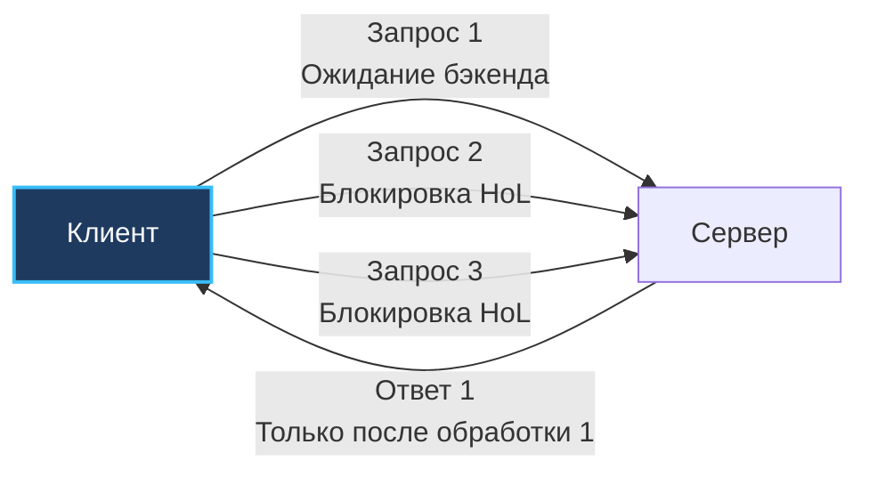
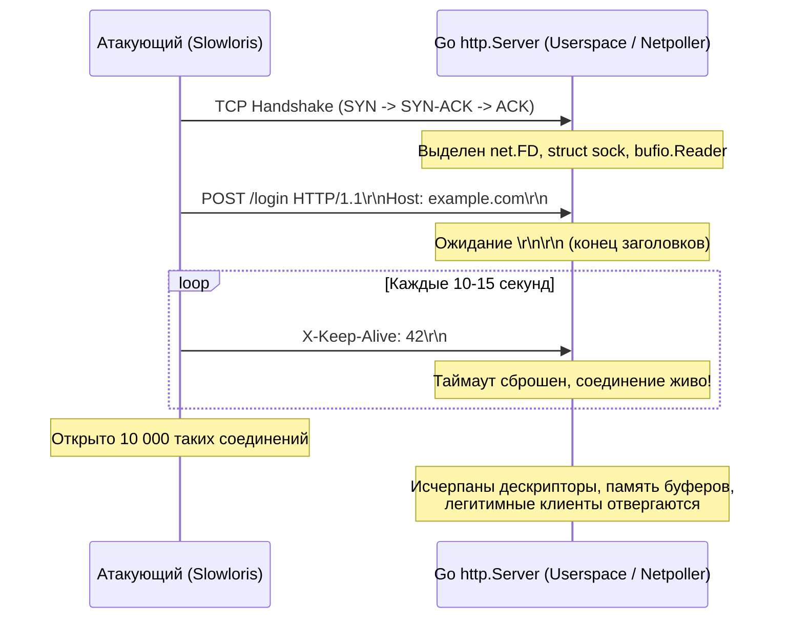

## Введение

> *«Управление сложностью — вот суть программирования».*    
> — Брайан Керниган

Когда мы проектируем высоконагруженный бэкенд, производительность системы измеряется не только числом операций с плавающей точкой или скоростью сериализации JSON. В реальном сетевом мире главными врагами масштабируемости становятся сетевые задержки, неравномерность очередей и непредсказуемое поведение клиентов.

Две классические проблемы, которые часто становятся причиной внезапной деградации или катастрофического отказа сервиса — **Head of Line Blocking** (блокировка начала очереди) и атака **Slowloris** («медленный лори»). Обе эти проблемы коварны тем, что они практически не нагружают процессор сервера: загрузка CPU может составлять скромные 2–5%, в то время как сервис полностью перестает отвечать живым пользователям.

В этой статье мы разберем, как эти явления возникают на разных уровнях сетевого стека, как они влияют на планировщик Go и выделение памяти, и какие production-паттерны необходимо внедрять в `http.Server` для надежной защиты от деградации.

---

### Бытовые модели: Узкий Drive-Through и медлительные посетители

Чтобы наглядно представить суть этих проблем, обратимся к простым физическим аналогиям:

1. **Head of Line Blocking (Автокафе с одной полосой):**  
   Представьте узкое окошко автокафе (drive-through), куда ведет единственная автомобильная полоса (одно TCP-соединение или очередь HTTP/1.1). Первый водитель в очереди заказывает эксклюзивный многоярусный свадебный торт со сложной выпечкой на 40 минут. За ним в очереди выстроились тридцать автомобилей, водителям которых нужна всего лишь чашка готового эспрессо. Кофе уже налит и остывает на стойке, но тридцать машин стоят намертво: узкий проезд физически заблокирован первой машиной.
2. **Slowloris (Занятые столики в кафе):**  
   Представьте уютное кафе на 50 посадочных мест. В зал заходят 50 злоумышленников, каждый садится за отдельный столик, заказывает стакан воды за 10 рублей и делает один микроскопический глоток через соломинку ровно раз в 4 минуты и 59 секунд. Никто не шумит, не бьет посуду и не ломает мебель (никакого шторма трафика или нагрузки на кухню). Но все 50 столиков заблокированы на много часов, и реальные платежеспособные гости у дверей разворачиваются и уходят.

---

## Head of Line Blocking: Ловушка последовательного исполнения

**Head of Line (HoL) Blocking** — это фундаментальное архитектурное явление в сетях передачи данных, при котором потеря или задержка одного-единственного элемента данных в начале очереди полностью блокирует доставку и обработку всех последующих элементов, даже если они уже физически доставлены на принимающую сторону.

### 1. Уровень TCP (Транспортный уровень)
Протокол TCP гарантирует строгий порядок доставки байт (In-Order Delivery). Каждому отправляемому байту присваивается порядковый номер `Sequence Number`. 

Если в потоке из десяти сетевых пакетов теряется всего один (например, пакет №3):
- Механизм `Retransmission` инициирует повторную отправку потерянного пакета.
- Пакеты с №4 по №10, которые благополучно долетели до сервера, складываются в буфер сокета (Out-of-Order Queue) ядра Linux.
- Ядро категорически отказывается отдавать пакеты №4–10 приложению через сокетный API, пока не получит повторный пакет №3 и не подтвердит его через `ACK`. Вышележащие протоколы (например, HTTP) не могут прочитать готовые данные.

```
Отправлено:    [1] [2] [3 - ПОТЕРЯН] [4] [5] [6] [7]
Получено NIC:  [1] [2] [--- ДЫРА ---] [4] [5] [6] [7]
Сокет ядра:    Выдано приложению: [1, 2]
               Заблокировано в очереди: [4, 5, 6, 7] (ждут retransmit 3)
```

> [!info] Под капотом
> Для процессора это выглядит как простой конвейера (pipeline stall). Кэш-линии L1/L2 инвалидируются, когда CPU пытается прочитать данные из буфера, который заблокирован ожиданием network interrupt. Утилизация CPU падает, а latency растет экспоненциально.

### 2. Уровень HTTP/1.1 (Прикладной уровень)
Проблема многократно усугубляется на прикладном уровне. В HTTP/1.1 для выполнения нескольких запросов к одному хосту используется `Keep-Alive`, но запросы обрабатываются **строго последовательно** (FIFO):



Если первый запрос ждет ответа от бэкенда (например, долгий SQL-запрос или блокирующий вызов внешней API), второй, третий и N-й запросы физически не могут быть отправлены по этому соединению, даже если сеть свободна. Попытка решить это через конвейеризацию (HTTP Pipelining) провалилась на практике из-за проблем с прокси-серверами.

### 3. Как решается в современных протоколах
* **HTTP/2:** Вводит **Multiplexing** (мультиплексирование). Несколько запросов и ответов упаковываются в отдельные легковесные кадры (`Frames`) с идентификаторами потоков (`Stream ID`) внутри одного TCP-соединения. Потеря пакета в одном кадре задерживает только этот поток, не блокируя остальные на уровне логики HTTP. Однако на уровне TCP проблема осталась: потеря одного TCP-сегмента парализует передачу всех параллельных потоков HTTP/2 внутри этого соединения! Подробнее в [[22. HTTP 2. Multiplexing, Frames, HPACK]].
* **HTTP/3 + QUIC:** Полностью устраняет HoL на уровне транспортного стека. QUIC работает поверх UDP и реализует собственную независимую логику `Loss Recovery` и мультиплексирования на уровне независимых стримов. Если пакет одного стрима теряется, QUIC выполняет `retransmit` только для него, ни на миллисекунду не останавливая передачу данных в других стримах. Подробнее в [[23. HTTP 3 и QUIC. Почему будущее уходит от TCP]] и [[24. Deep Dive в QUIC. Пакеты, Stream, Loss Recovery]].

---

## Slowloris: Атака медленной смерти

**Slowloris** — это классическая атака типа DoS (Denial of Service), направленная не на перегрузку пропускной способности канала (как в случае с UDP-флудом), а на исчерпание пула ресурсов сервера через удержание сокетов открытыми.



### Механизм атаки
1. Атакующий открывает тысячи параллельных TCP-соединений к веб-серверу.
2. Отправляет валидные, но **частичные HTTP-запросы** (например, `GET / HTTP/1.1\r\nHost: ...` без `Connection: close` и `Content-Length`).
3. Периодически отправляет крошечные фрагменты заголовков (например, `X-Magic: 1\r\n` каждые 15 секунд), чтобы сервер не сработал по таймауту и не закрыл соединение.
4. Никогда не отправляет пустую завершающую строку `\r\n\r\n`, означающую конец HTTP-заголовков.

Сервер, ожидая завершения запроса или отключения клиента, держит соединение открытым. В Go это означает:
* Выделенный файловый дескриптор `net.FD`.
* Буфер `bufio.Reader` (по умолчанию 4 КБ на соединение).
* Горутина, ожидающая чтения из сокета (стек 2-4 КБ, блокировка в `netpoller`).
* При достижении лимита `http.Server.MaxConns` (или системного предела `ulimit -n`) новые подключения отклоняются или попадают в очередь ожидания.

> [!warning] Ловушка / Gotcha
> Если вы используете `http.Server` с дефолтными настройками (`http.ListenAndServe(":8080", nil)`), таймауты чтения и записи в нем полностью отсутствуют. Сервер будет ждать заголовков бесконечно, пока клиент не отвалится по таймауту ОС (обычно 2+ часа). Ресурсы хоста истощаются мгновенно, а CPU при этом почти не грузится.

---

## Деградация под нагрузкой: Системный взгляд

Когда HoL-блокировки и атаки типа Slowloris (или просто медленные мобильные клиенты с нестабильным 3G/LTE) накапливаются, система проходит четыре стадии деградации:

1. **Истощение пула соединений (`http.Transport`):** Клиентские коннекты не освобождаются. Новые запросы начинают ждать в очереди.
2. **Рост tail-latency:** Из-за HoL запросы, которые должны обрабатываться параллельно, выстраиваются в очередь. P99 latency резко растет при стабильном P50 (характерный маркер проблем с сетевыми очередями в APM-метриках).
3. **Утечка горутин и памяти:** Если асинхронная обработка не завершается из-за заблокированных соединений, горутины не собираются GC. Лимит памяти `GOMEMLIMIT` или рабочий набор RSS растут вплоть до срабатывания Linux OOM Killer.
4. **Контекстные переключения:** Планировщик Go (`runtime.scheduler`) видит заблокированные в `syscall` или `netpoll` горутины, переносит их в очередь `runq` и создает новые треды ОС (`M`). Это вызывает избыточный `Context Switch` и колоссальную нагрузку на ядро Linux.

---

## Go-специфика: Управление соединениями и таймауты

В Go защита от деградации строится на двух уровнях: строгая настройка `http.Server` (серверная сторона) и конфигурация `http.Transport` (клиентская сторона).

### 1. Серверные таймауты (Обязательный минимум)

Никогда не используйте стандартный `http.Server{}` без явного указания таймаутов! Главное оружие против Slowloris — параметр **`ReadHeaderTimeout`** (появившийся в Go 1.8), который жестко ограничивает время чтения исключительно заголовков запроса:

```go
package main

import (
	"context"
	"net"
	"net/http"
	"time"
)

func createSecureServer(handler http.Handler) *http.Server {
	return &http.Server{
		Addr:              ":8080",
		Handler:           handler,
		ReadHeaderTimeout: 5 * time.Second,  // Смертельное оружие против Slowloris!
		ReadTimeout:       15 * time.Second, // Время на чтение заголовков и тела
		WriteTimeout:      30 * time.Second, // Время на отправку ответа
		IdleTimeout:       60 * time.Second, // Сколько держать idle-соединение в пуле
		MaxHeaderBytes:    1 << 20,          // 1 MB лимит на заголовки (защита от переполнения)
		// Базовый контекст для запросов (Go 1.13+)
		BaseContext: func(listener net.Listener) context.Context {
			ctx := context.Background()
			return context.WithValue(ctx, "start_time", time.Now())
		},
	}
}
```

### 2. Клиентский пул соединений (`http.Transport`)

По умолчанию Go использует `http.DefaultTransport`. Для production нужно явно управлять пулом, чтобы избежать HoL на клиенте и истощения file descriptors.

```go
transport := &http.Transport{
    MaxIdleConns:          100,
    MaxIdleConnsPerHost:   10, // Критично! Ограничивает HoL на одном хосте
    IdleConnTimeout:       90 * time.Second,
    TLSHandshakeTimeout:   10 * time.Second,
    ResponseHeaderTimeout: 15 * time.Second,
    ExpectContinueTimeout: 1 * time.Second,
}

client := &http.Client{
    Transport: transport,
    Timeout:   30 * time.Second, // Жесткий таймаут на весь запрос
}
```

> [!tip] Собеседование
> **Вопрос:** Что произойдет, если `MaxIdleConnsPerHost` установлен в 0 или не задан?
> **Ответ:** Go создаст неограниченное количество idle-соединений. При атаке Slowloris или при работе с тысячами downstream-сервисов это приведет к исчерпанию file descriptors (`ulimit -n`) и утечке памяти. Всегда ограничивайте пул через `MaxIdleConnsPerHost` или используйте `http2.Transport` с соответствующими лимитами.

### 3. Взаимодействие с `netpoller`
Когда горутина блокируется на чтении из сокета (из-за Slowloris или HoL), она переходит в состояние `waiting` и перестает потреблять CPU. `netpoller` (epoll/kqueue) регистриует fd и ждет событий. Когда таймаут срабатывает, `http.Server` вызывает `conn.Close()`, что генерирует событие `read` с ошибкой `EOF` или `timeout`. Горутина разблокируется, буферы `bufio` сбрасываются, и ресурсы возвращаются в пул.

---

## Итоги и вопросы для собеседования

1. **Как HTTP/2 решает проблему HoL?** Через мультиплексирование кадров (frames) поверх одного TCP-соединения. Потеря пакета влияет только на конкретный stream, а не на весь поток.
2. **Почему Slowloris опасен для Go-сервера?** Истощает file descriptors, память (буферы `bufio`) и пул горутин, не нагружая CPU. Дефолтный `http.Server` без таймаутов не защитит от него.
3. **Как отличить HoL от реальной медленной бэкенд-логики?** Используйте `http.ServerMetrics` или OpenTelemetry spans. Если `conn_duration` растет, но `cpu_time` низкий — проблема в сети или ожидании внешних зависимостей.
4. **Что делает `MaxConnsPerHost` в `http.Transport`?** Ограничивает количество активных соединений к одному хосту. Превышение лимита заставляет запрос ждать освобождения коннекта в очереди, предотвращая `Too many open files`.

---

## Что дальше

Мы разобрали сетевые аномалии и механизмы деградации на уровне приложения. Следующий шаг — понимание того, как эти проблемы решаются на уровне инфраструктуры и оркестрации. В следующей статье мы перейдем к сетевому стеку Kubernetes: [[41. Kubernetes Networking. CNI, Pod Network, Service, Ingress]].