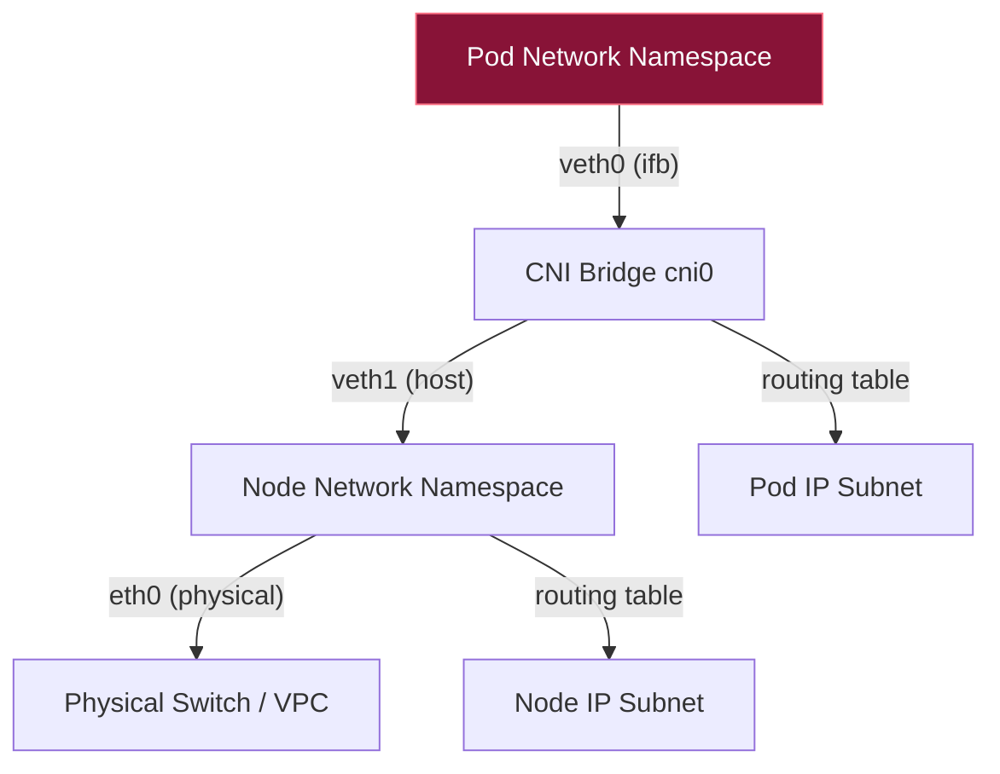
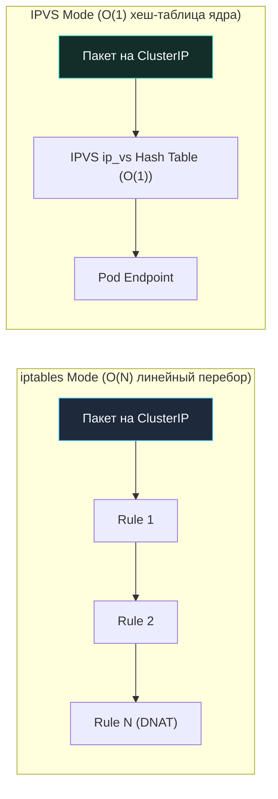

## Сеть в Kubernetes: Фундамент для Go-разработчика

> *«Единственный способ писать хорошие программы — писать их просто, ясно и внимательно».*    
> — Брайан Керниган

Переход приложения из классической bare-metal инфраструктуры или виртуальных машин в кластер Kubernetes кардинально меняет фундаментальные законы сетевого взаимодействия. В традиционной серверной среде вы привыкли к статическим IP-адресам, неизменным сетевым интерфейсам и предсказуемым миллисекундам задержки.

В Kubernetes мир вокруг вашего сервиса становится невероятно динамичным. Поды непрерывно рождаются, погибают при автомасштабировании (HPA), перемещаются между узлами и получают новые динамические IP-адреса. Вся физическая сеть абстрагирована плагинами CNI (Container Network Interface), а балансировка трафика между микросервисами строится на виртуальных правилах ядра Linux. 

Для разработчика на Go это означает, что стандартные сетевые вызовы пакета `net` и клиент `http.Client` начинают функционировать в принципиально иных условиях: с накладными расходами на оверлейную инкапсуляцию, скрытым риском переполнения системных таблиц `conntrack` и неожиданными задержками при DNS-резолвинге.

Понимание того, как байты из вашего `net/http` сервера доходят до физического провода через виртуальные лабиринты K8s, критично для устранения tail-latency, предотвращения утечек соединений и обеспечения железной надежности сервисов под пиковой нагрузкой.

---

### Бытовая аналогия: Офисный кампус с пневмопочтой

Представьте гигантский корпоративный кампус из десятков зданий (ноды кластера Kubernetes):
- **Традиционный сервер:** У каждого отдела есть постоянный кабинет на третьем этаже с табличкой на двери и медным кабельным телефоном со статическим номером (Bare-Metal сервер со статическим IP).
- **Kubernetes и модель Flat Network:** Все сотрудники (контейнеры) работают по принципу гибких рабочих мест (Hot-Desking). Рабочие столы (Поды) разворачиваются и исчезают за секунды. Однако руководство кампуса ввело железное правило: у каждого рабочего стола есть персональный номер внутренней телефонной связи (Pod IP). Любой сотрудник с любого стола может напрямую набрать внутренний номер коллеги в соседнем корпусе без секретарей и переадресации (прямая связь Pod-to-Pod без NAT).
- **Как это работает под полом (CNI):** Под полом кампуса проложена разветвленная сеть гибких пластиковых труб — виртуальных кабелей (`veth`-пары). Если столы находятся в одном здании, письма летят через локальный коммутатор на этаже (`cni0` bridge). Если нужно отправить письмо в соседний корпус, письмо упаковывают в герметичную капсулу пневмопочты (инкапсуляция VXLAN/UDP) и выстреливают по магистральной подземной трубе. А регулировщики на перекрестках (`kube-proxy` и `iptables`/`IPVS`) моментально сверяются со списками и перенаправляют капсулы по нужным ячейкам.

---

## K8s Networking Model и Flat Network

Сетевая модель Kubernetes строится на концепции **Flat Network** (плоской сети). Она формулирует четыре базовых постулата, которые обязан реализовывать любой сетевой плагин кластера:

1. **Каждый Pod получает уникальный IP-адрес:** Этот адрес уникален в масштабах всего кластера, независимо от того, на каком физическом узле (Worker Node) запущен под.
2. **Контейнеры внутри одного Pod делят единый сетевой стек:** Контейнеры пода находятся в общем Network Namespace и взаимодействуют друг с другом на голой скорости памяти через `localhost` (`127.0.0.1`), разделяя общий диапазон сетевых портов.
3. **Любой Pod может взаимодействовать с любым другим Pod без использования NAT:** Отправляя пакет на IP-адрес другого пода, исходящий узел не изменяет IP-адрес источника (Source IP не маскируется).
4. **IP-адрес Pod виден остальным узлам кластера в исходном виде:** То, какой адрес видит сам под на своем интерфейсе `eth0`, в точности совпадает с тем, что видят другие узлы и сервисы.

Это означает, что ваш Go-сервис не должен мапить порты наружу или использовать нестандартные прокси для связи между подами. Вы работаете с обычными TCP/UDP сокетами, как в классическом бэкенде. Однако за этой кристальной простотой скрывается сложный сетевой конвейер ядра Linux.

---

## CNI и Pod Network: Устройство под капотом

Сам Kubernetes не содержит встроенного кода для настройки сетевых интерфейсов. Он делегирует эту задачу плагинам стандарта **CNI (Container Network Interface)**. Индустриальные CNI-плагины (Calico, Cilium, Flannel, Weave) конструируют виртуальные сети непосредственно на уровне ядра Linux.

### Как это работает на уровне ОС и железа

Каждый Pod при старте изолируется через Linux **Network Namespace**. Внутри этого пространства создается пара виртуальных сетевых интерфейсов — **`veth` (virtual Ethernet pairs)**, работающих как два конца одного виртуального сетевого кабеля:
- Один конец пары (`eth0` или `veth0`) помещается внутрь Network Namespace пода.
- Второй конец пары (`vethXXXX`) остается в пространстве хоста (Host Namespace) и подключается к программному сетевому мосту (Bridge `cni0` или интерфейсу оверлея `flannel.1`).



**Mechanical Sympathy и аппаратная цена абстракций:**
- `veth` пары работают как виртуальные перемычки. Пакет, отправленный из Pod, проходит через сетевой стек пода, копируется ядром на хостовый конец `veth`, попадает в bridge, а затем маршрутизируется в физический сетевой адаптер `eth0`. Это добавляет **контекстные переключения** и копирование пакетов между namespace.
- При использовании оверлейных сетей (например, VXLAN в Flannel или Calico VXLAN mode) каждый пакет оборачивается в дополнительную внешнюю UDP-оболочку (Outer IP + Outer UDP + VXLAN Header = 50 байт оверхеда). Это снижает полезный MTU (с 1500 до 1450 байт), вызывает дробление пакетов на CPU и требует включения аппаратных оптимизаций `GSO/GRO` (Generic Segmentation/Receive Offload) на сетевых картах узлов для разгрузки центрального процессора.
- Современный CNI **Cilium** заменяет bridge и iptables технологией **eBPF/XDP**, перемещая маршрутизацию пакетов в пространство ядра (kernel space) на уровне сокетов (`sockops`). Это сокращает задержку (latency) на 30–50% и обеспечивает почти нулевое потребление CPU на сетевом стеке.

> [!info] Под капотом
> В Linux сетевые namespace изолируют только сетевые ресурсы (интерфейсы, маршруты, таблицы правил, сокеты). Это легковесная структура (около 1-2 КБ памяти), создаваемая через syscall `clone(CLONE_NEWNET)`. Когда горутина Go открывает сокет в Pod, она фактически работает с файлом дескриптора `/proc/<pid>/fd/...`, привязанным к этому namespace.

---

## Services и kube-proxy: iptables vs IPVS

Поскольку поды смертны и их IP постоянно меняются, Kubernetes предоставляет абстракцию **Service** — стабильный виртуальный IP-адрес (`ClusterIP`), за которым скрывается динамический пул живых реплик (Endpoints).

Интересный факт: адрес `ClusterIP` **физически не существует ни на одном сетевом интерфейсе ни одного сервера**! Это фиктивный адрес-ловушка. Когда Go-приложение отправляет пакет на `ClusterIP`, перехватом и подменой адреса на лету занимается системный агент **`kube-proxy`**, транслирующий правила в ядро Linux.

Существует два основных режима работы `kube-proxy`:



1. **iptables (legacy)**: `kube-proxy` генерирует огромные простыни правил вида `iptables -A KUBE-SERVICES -d <ClusterIP> -j KUBE-SVC-...`. Каждое входящее соединение последовательно проходит по цепочке правил. При наличии 1 000+ сервисов и 10 000+ подов это создает линейную задержку $O(N)$ на каждый сетевой пакет и чудовищную нагрузку на CPU при частых обновлениях правил.
2. **IPVS (IP Virtual Server)**: Использует специализированные хеш-таблицы ядра Linux (`ip_vs`). Поиск целевого пода выполняется за константное время $O(1)$, аналогично высокопроизводительным балансировщикам уровня `nginx` upstream или `HAProxy`. Поддерживает промышленные алгоритмы балансировки (least-connections, weighted, round-robin).

> [!warning] Ловушка / Gotcha
> **conntrack table exhaustion.** И iptables, и IPVS используют `nf_conntrack` для отслеживания состояний TCP-соединений. В высоконагруженных Go-сервисах (10k+ RPS с короткими коннектами) таблица коннектов быстро переполняется. Ядро начинает дропать пакеты, а Go-клиент получает `connection reset by peer` или `timeout`.  
> Решение: `sysctl -w net.netfilter.nf_conntrack_max=1048576` на всех узлах, а также настройка `nf_conntrack_tcp_timeout_established` и использование `ipvs` вместо `iptables`.

---

## Ingress и внешняя маршрутизация

**Ingress** — это манифест и точка входа для маршрутизации внешнего L7-трафика (HTTP/HTTPS) внутрь кластера. Сам ресурс Ingress — это просто декларативное описание маршрутов. Трафик принимает **Ingress Controller** — специализированный обратный прокси (nginx-ingress, envoy, traefik), запущенный внутри кластера.

Полный маршрут входящего HTTP-запроса от внешнего пользователя до вашей горутины в Go выглядит так:
1. Внешний клиент $\to$ Cloud Load Balancer (AWS NLB / GCP LB на уровне L4).
2. Cloud LB $\to$ NodePort/LoadBalancer Service на узлах K8s.
3. NodePort $\to$ Ingress Controller Pod (где происходит TLS termination, разбор заголовков Host/Path и Rate Limiting).
4. Ingress Controller $\to$ Backend Service $\to$ Endpoints $\to$ Pod целевого сервиса на Go.

Для Go-разработчика критично понимать, что Ingress Controller имеет собственные ограничения на `worker_connections`, `proxy_buffer_size` и жесткие таймауты проксирования (`proxy_read_timeout`). Если ваш Go-сервис отвечает медленнее заданного порога Ingress, клиент получит ошибку `504 Gateway Timeout` задолго до того, как сработает таймаут контекста в Go!

---

## Go-specific: DNS, TCP, netpoller и connection limits

При работе сервиса на Go внутри контейнера Kubernetes вступают в действие три критические особенности среды.

### 1. DNS resolution и CoreDNS: Проблема `ndots:5`
В Kubernetes за разрешение доменных имен отвечает кластерный DNS-сервер **CoreDNS**. По умолчанию файл `/etc/resolv.conf` внутри любого пода содержит директиву `options ndots:5` и список search-доменов:
```
search default.svc.cluster.local svc.cluster.local cluster.local
options ndots:5
```
Если имя хоста содержит менее 5 точек (например, `api.stripe.com` содержит всего 2 точки), встроенный резолвер Go перед отправкой прямого запроса сначала выполняет 4 холостых запроса:
1. `api.stripe.com.default.svc.cluster.local` $\to$ NXDOMAIN
2. `api.stripe.com.svc.cluster.local` $\to$ NXDOMAIN
3. `api.stripe.com.cluster.local` $\to$ NXDOMAIN
4. `api.stripe.com` $\to$ SUCCESS!

Это увеличивает задержку первого сетевого подключения на 500–1000 мс и генерирует шквал паразитных DNS-запросов к CoreDNS.  
**Решение:** Всегда использовать абсолютные FQDN с точкой на конце (`api.stripe.com.` или `my-service.default.svc.cluster.local.`) либо явно настраивать `dnsConfig` пода с параметром `ndots:2` (или в `kube-dns` config).

### 2. TCP Keep-Alive и Cloud NAT
Облачные балансировщики и NAT-шлюзы (AWS NLB, GCP Cloud NAT, Azure LB) молча сбрасывают неактивные TCP-трансляции из таблицы conntrack через 350–1000 секунд без отправки RST-пакета. Чтобы удерживаемые в пуле Go `http.Transport` соединения не умирали «втихую», необходимо настраивать регулярные L4-зонды через `net.Dialer.KeepAlive` и согласовывать `IdleConnTimeout`:

```go
package main

import (
	"net"
	"net/http"
	"time"
)

func createK8sOptimizedClient() *http.Client {
	dialer := &net.Dialer{
		Timeout:   5 * time.Second,
		KeepAlive: 30 * time.Second, // Периодические TCP Keep-Alive зонды для Cloud NAT
	}

	transport := &http.Transport{
		DialContext:         dialer.DialContext,
		MaxIdleConns:        100,
		MaxIdleConnsPerHost: 100,
		IdleConnTimeout:     90 * time.Second,
		TLSHandshakeTimeout: 10 * time.Second,
	}

	return &http.Client{
		Transport: transport,
		Timeout:   10 * time.Second,
	}
}
```

В Kubernetes также стоит явно настроить `net.TCPConn.SetKeepAlive(true)` и `SetKeepAlivePeriod()`, чтобы пробрасывать TCP keep-alive пакеты через облачные прокси и NAT.

### 3. Netpoller и epoll
Go использует `epoll` (Linux) для асинхронного I/O. В K8s это работает нативно, но overlay-сети (VXLAN, Wireguard) могут вызывать:
- **Fragmentation**: Если MTU не настроен, пакеты фрагментируются. Go TCP не умеет эффективно обрабатывать фрагментированные пакеты, что ведет к retransmission.
- **Reordering**: eBPF/Cilium или балансировщики могут переставлять пакеты. Go TCP congestion control (CUBIC) воспринимает это как потерю и снижает window, деградируя throughput.

> [!tip] Собеседование
> **Вопрос:** Почему `curl` внутри пода падает с ` NXDOMAIN`, а `wget` работает? Или почему первый запрос к сервису занимает 500ms?
> **Ответ:** Из-за `ndots:5` в `/etc/resolv.conf`. Go resolver перебирает search domains. `wget` может использовать `getent` или другой механизм. Фикс: добавить точку в конце домена (`service.ns.svc.cluster.local.`) или уменьшить `ndots`.
> 
> **Вопрос:** Как Go netpoller взаимодействует с K8s network namespaces?
> **Ответ:** Netpoller работает на уровне файлового дескриптора сокета. Namespace изолирует сетевой стек, но дескриптор остается валидным. Epoll не знает про namespace, он видит только события ядра. Поэтому производительность не падает, но при пересоздании пода сокет отбрасывается, и Go должен пересоздать listener. Важно использовать `SO_REUSEPORT` для graceful restart.

---

## Итог

1. **Модель Flat Network:** CNI создает плоскую сеть без NAT между подами через Linux network namespaces и пары виртуальных интерфейсов `veth`. Накладные расходы на overlay-сети (VXLAN) минимизируются правильной настройкой MTU и включением аппаратных флагов `GSO/GRO`.
2. **Services и IPVS:** Стабильные виртуальные IP-адреса `ClusterIP` транслируются в реальные поды через `kube-proxy`. В высоконагруженных окружениях режим `IPVS` категорически предпочтительнее `iptables` благодаря константному времени поиска $O(1)$.
3. **conntrack как узкое горлышко:** Таблица `nf_conntrack` — главный источник скрытых сбоев в K8s под нагрузкой. Переполнение таблицы приводит к молчаливому отбрасыванию пакетов ядром.
4. **DNS и сетевой тюнинг в Go:** Использование абсолютных FQDN решает проблему задержек из-за `ndots:5`, а явная настройка `KeepAlive` в `net.Dialer` защищает пул соединений от внезапных разрывов со стороны облачных NAT-шлюзов.
5. **Совместимость с netpoller:** Сетевой планировщик Go нативно и прозрачно исполняется внутри network namespaces, не теряя скорости $O(1)$ мультиплексирования `epoll`.

Мы подробно исследовали, как пакеты путешествуют через виртуальные интерфейсы, оверлейные туннели и фильтры Kubernetes. Но когда микросервисный кластер разрастается до сотен сервисов, базовой маршрутизации K8s становится недостаточно: требуются сквозное mTLS-шифрование, канареечные релизы, распределенный трейсинг и защита от каскадных сбоев. В следующей лекции мы погрузимся в мир [[42. Service Mesh. Istio, Linkerd, sidecar proxy]], где разберем устройство sidecar-прокси и будущее сервис-мешей на eBPF.