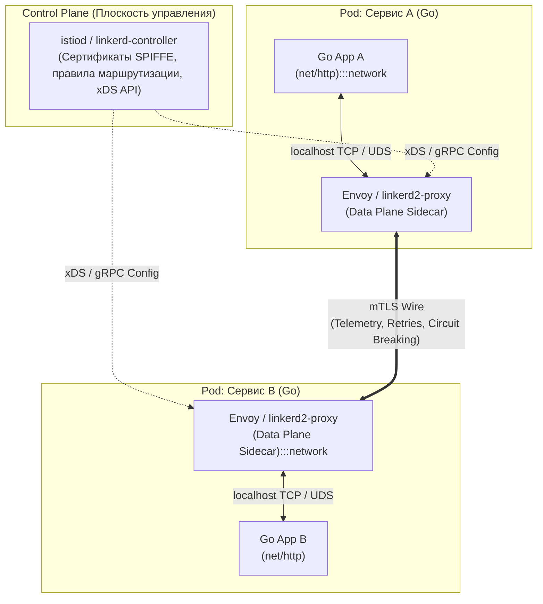
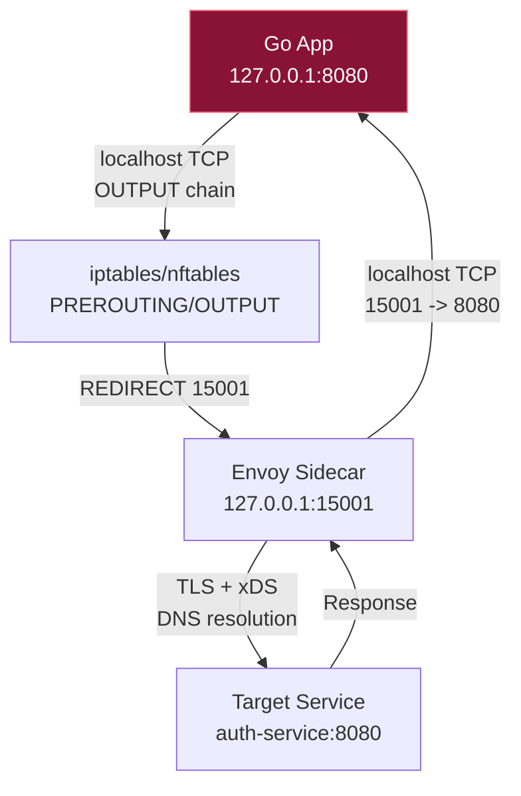

## Service Mesh: Децентрализация сетевой логики

> *«Управление сложностью — вот суть программирования».*    
> — Брайан Керниган

Когда монолитная архитектура разделяется на десятки и сотни независимых микросервисов, сетевое взаимодействие внезапно превращается в самый хрупкий и сложный компонент системы. 

В идеальном мире каждый сервис должен обладать внушительным набором распределенных способностей:
- Находить адреса живых реплик зависимостей (Service Discovery).
- Устанавливать взаимно аутентифицированные шифрованные каналы (mTLS с автоматической ротацией сертификатов).
- Реализовывать паттерны устойчивости: Circuit Breaker, экспоненциальные повторы (Retries), ограничение скорости (Rate Limiting) и адаптивные таймауты.
- Собирать детальную телеметрию: сквозные трейсы (Distributed Tracing), метрики задержек и логи аудита.

Если реализовывать эту сетевую функциональность силами самого приложения, разработчики быстро оказываются в тупике. Вам приходится подключать тяжелые библиотеки (fat SDKs), которые засоряют кодовую базу, требуют постоянной синхронизации версий между командами (особенно в полиглотных средах, где часть сервисов написана на Go, а часть — на Java или Python) и превращают малейшее обновление TLS-сертификата в необходимость пересборки и редеплоя всего флота контейнеров.

**Service Mesh (сервисная сетка)** решает эту проблему радикально, вынося всю сетевую и инфраструктурную логику из пространства приложения в выделенный, полностью прозрачный инфраструктурный слой. Для Go-разработчика это означает смену парадигмы: вы больше не управляете сложными сетевыми механизмами в коде `net/http.Client`, а делегируете их локальному прокси-слою.

---

### Бытовая аналогия: Дипломатический атташе и бронированная диппочта

Представьте работу международного дипломатического корпуса:
- **Без Service Mesh (логика зашита в код):** Каждый дипломат (Go-сервис) обязан лично свободно владеть 20 иностранными языками, носить с собой тяжелый криптографический шифратор, оформлять транзитные визы на границах, лично проверять портфели собеседников на жучки и вести протокольный дневник каждой встречи. Дипломат тратит 80% времени на бюрократию и безопасность вместо решения политических задач (бизнес-логики).
- **С Service Mesh (паттерн Sidecar):** К каждому дипломату приставляется личный атташе безопасности и переводчик (Sidecar-прокси — Envoy или Linkerd). Дипломат просто передает записку на родном языке: «Передай коллеге из Парижа» (`http.Get("http://auth-service:8080")`). Атташе забирает записку, запечатывает в бронированный дипломатический кейс с mTLS-шифрованием, проверяет криптографические сертификаты французского атташе, следит за безопасностью канала и передает ответ дипломату. Дипломат даже не знает, через какие границы и шифры прошел этот запрос.

---

## Архитектура: Control Plane и Data Plane

Любая архитектура Service Mesh строго разделяется на две независимые плоскости:



1. **Data Plane (Плоскость данных):** Высокопроизводительные сетевые прокси, физически перехватывающие и обрабатывающие каждый сетевой пакет в реальном времени. В подавляющем большинстве промышленных инсталляций это [[28. nginx, Envoy и HAProxy. Как работают современные прокси|Envoy]] или специализированный легковесный `linkerd2-proxy`. Data Plane работает в режиме минимальной задержки, без блокировок и без динамических аллокаций памяти.
2. **Control Plane (Управляющая плоскость):** Централизованный мозг системы, который компилирует декларативные правила маршрутизации K8s, генерирует криптографические ключи и сертификаты (mTLS) и непрерывно рассылает обновленные конфигурации всем активным прокси Data Plane. В Istio эту роль выполняет монолитный демон `istiod`, в Linkerd — связка контроллеров `linkerd-controller` + `destination` + `identity`.

> [!info] Под капотом
> Разделение на плоскости позволяет обновлять сетевые политики без перезагрузки рабочих нагрузок. Control Plane работает в режиме централизованного управления, а Data Plane — в режиме stateless-обработки пакетов. Это классический пример паттерна **Controller-Operator**, адаптированного под сетевой стек.

---

## Sidecar Pattern: Магия перенаправления трафика

Ключевой механизм интеграции Service Mesh в Kubernetes — **Sidecar**. Это вспомогательный контейнер с сетевым прокси, запускаемый внутри одного пода с основным Go-приложением. Поскольку оба контейнера делят единый Network Namespace (общие IP-адрес, сетевые интерфейсы и таблицы iptables), весь сетевой трафик можно прозрачно перехватить.

При запуске пода специальный инициализирующий контейнер (например, `istio-init`) настраивает правила фильтрации ядра Linux через `iptables`/`nftables`:



### Как пакет совершает свой путь:
1. **Исходящий трафик:** Go-приложение вызывает `http.Get("http://auth-service:8080")`. Сетевой стек формирует пакет и направляет его в цепочку `OUTPUT` таблицы `nat` ядра Linux.
2. **Перехват iptables:** Правило `REDIRECT` перехватывает все исходящие TCP-пакеты, адресованные внешним сервисам, и заворачивает их на локальный порт сайдкара (обычно порт `15001` в Envoy или `4143` в Linkerd).  
   *Как избежать вечного цикла?* Инициализатор добавляет проверку по UID владельца процесса: пакеты, созданные самим прокси (обычно запускаемым под `UID 1337`), игнорируются правилом перехвата и свободно уходят в физическую сеть!
3. **Обработка в прокси:** Сайдкар выполняет mTLS-рукопожатие с удаленным сайдкаром, инжектирует W3C Trace Context заголовки, проверяет Circuit Breaker и отправляет зашифрованный запрос.
4. **Входящий трафик на удаленной стороне:** На целевом узле входящий трафик перехватывается в цепочке `PREROUTING` и перенаправляется на локальный порт сайдкара `15006`. Сайдкар проверяет сертификат клиента, завершает TLS и отдает чистый HTTP-запрос приложению на `localhost:8080`.

> [!warning] Ловушка / Gotcha
> Go-приложения по умолчанию используют `net.Dialer`, который не знает о sidecar. Если вы явно укажете IP целевого сервиса, трафик может проскочить в обход прокси, если правила iptables настроены только на `localhost` или `127.0.0.0/8`. В Kubernetes это решается через `iptables` на уровне `kube-proxy` или `CNI`-плагина, но локальная разработка требует ручного маппинга `127.0.0.1` к sidecar.

---

## Под капотом: Envoy и асинхронная модель

Envoy написан на C++ и использует событийно-ориентированную (event-driven) многопоточную архитектуру с моделью потоков Thread-per-Core (аналогично Go's `netpoll`, но на уровне C++ `epoll`).

**Внутреннее устройство Envoy:**
- **Single-threaded event loop на ядро:** Каждый рабочий поток Envoy крутит собственный неблокирующий цикл обработки событий `libevent`/`epoll`. Соединения привязываются к потоку намертво. Это полностью устраняет межъядерные блокировки мьютексов, минимизирует Cache Misses процессора и обеспечивает детерминированную задержку под экстремальной нагрузкой.
- **Async I/O:** Использует неблокирующий ввод-вывод `epoll` (Linux) или `kqueue` (BSD). Контекстные переключения сведены к минимуму.
- **Hot reloading:** Конфигурация загружается через `mmap` или `inotify`, а в динамических средах обновляется на лету через потоковый gRPC-протокол xDS без прерывания активных TCP-сессий.
- **Memory management:** Статические пулы объектов (object pools) для HTTP-заголовков и TLS-сессий. В Envoy полностью отсутствует сборщик мусора (Garbage Collector), что исключает непредсказуемые паузы Stop-The-World.

Для Go-разработчика это означает: сайдкар не блокирует горутины. Он исполняется в отдельном изолированном процессе ОС, а связь между Go-приложением и Envoy происходит через локальный loopback-сокет. Однако физику обмануть нельзя: прохождение через сайдкар добавляет **два прохода через сетевой стек ядра** и **два контекстных переключения** на каждый запрос:

$$\text{App} \xrightarrow{\text{TCP}} \text{Envoy (Local)} \xrightarrow{\text{mTLS Network}} \text{Envoy (Remote)} \xrightarrow{\text{TCP}} \text{App (Target)}$$

---

## Istio и Linkerd: Философия реализации

### Istio
Istio — самый функциональный и зрелый Service Mesh в индустрии. В качестве Data Plane он использует Envoy, а конфигурация передается через динамический протокол **xDS**:
- **LDS (Listener Discovery Service)** — конфигурация входящих портов.
- **RDS (Route Discovery Service)** — правила маршрутизации L7 (пути, заголовки).
- **CDS (Cluster Discovery Service)** — кластеры upstream-сервисов.
- **EDS (Endpoint Discovery Service)** — динамические IP-адреса подов.
- **mTLS:** Автоматическая генерация и ротация сертификатов по стандартам SPIFFE/SPIRE через встроенный CA-модуль `istiod`.
- **Traffic Management:** Декларативные манифесты `VirtualService` и `DestinationRule` позволяют организовывать сложнейшие канареечные релизы (Canary), сплиты трафика и симуляцию сбоев (Fault Injection).
- **Overhead:** Исторически страдал от высокого потребления памяти (ранее имел разрозненные контроллеры Pilot, Citadel, Galley, Mixer). Data Plane Envoy требует порядка ~50–100 МБ RAM на каждый под, что при флоте в 2 000 подов выливается в сотни гигабайт оперативной памяти.

### Linkerd
Linkerd создавался как бескомпромиссная альтернатива сложности Istio под девизом «простота и минимализм»:
- Сайдкар-прокси **`linkerd2-proxy`** написан на языке Rust с использованием асинхронного рантайма `tokio`.
- Потребляет всего **~10–20 МБ RAM** на инстанс (в 4–5 раз меньше Envoy).
- Практически мгновенный холодный старт (< 100 мс).
- Упрощенный Control Plane, управляемый нативными CRD Kubernetes без многостраничных конфигураторов.
- Автоматический zero-config mTLS «из коробки».

> [!tip] Собеседование
> **Вопрос:** Почему Envoy потребляет больше памяти, чем linkerd2-proxy?
> **Ответ:** Envoy — C++ приложение с тяжелым runtime: кэширование TLS-сессий, сложные структуры для маршрутизации, статистика per-connection, поддержка множества протоколов (HTTP/1, HTTP/2, gRPC, MQTT, Redis). Linkerd2-proxy написан на Rust, использует `tokio` event loop, минималистичную маршрутизацию и не кэширует TLS-сессии агрессивно. Разница в trade-off: гибкость vs. overhead.

---

## Влияние на Go-приложения и производительность

Когда ваше приложение на Go помещается внутрь сетки Service Mesh, его сетевой профиль меняется:

1. **Connection Pooling:** Вызов `http.Transport` к соседнему сервису превращается в соединение к `127.0.0.1:15001`. Хотя Envoy пулит внешние mTLS-соединения к удаленным узлам, локальный пул между Go и Envoy должен быть достаточного размера, чтобы не создавать TCP-соединения на каждый запрос.
2. **DNS Resolution:** В классическом Go DNS резолвится локально. В сетке Service Mesh Envoy перехватывает DNS-трафик через собственный DNS-прокси, что исключает накладные расходы на CoreDNS.
3. **Контекст распределенной трассировки:** Заголовки `x-request-id`, `x-b3-*` или W3C Trace Context (`traceparent`, `tracestate`) инжектируются прокси. Go должен использовать `otel` SDK, который автоматически считывает заголовки из входящих запросов и пробрасывает их дальше, иначе граф вызовов в Jaeger или Tempo разорвется.
4. **Диагностика и отладка:** Обычный `tcpdump` на сетевом интерфейсе хоста покажет лишь зашифрованный TLS-трафик. Чтобы заглянуть внутрь незашифрованного обмена между приложением и сайдкаром, системные инженеры подключаются напрямую к пространству имен пода:  
   `nsenter -t <pid> -n tcpdump -i lo port 15001`

```go
package main

import (
	"context"
	"net"
	"net/http"
	"time"
)

// Пример конфигурации http.Transport для работы с mesh-прокси
// Важно: mesh может добавлять заголовки, менять таймауты, делать retry.
// Поэтому таймауты должны быть агрессивнее на уровне приложения.
func createMeshOptimizedClient() *http.Client {
	transport := &http.Transport{
		MaxIdleConns:        100,
		MaxIdleConnsPerHost: 50, // Держим открытыми соединения к локальному Envoy
		IdleConnTimeout:     90 * time.Second,
		DialContext: (&net.Dialer{
			Timeout:   3 * time.Second,
			KeepAlive: 30 * time.Second,
		}).DialContext,
	}

	return &http.Client{
		Transport: transport,
		Timeout:   5 * time.Second, // Жесткий верхний предел на весь вызов
	}
}
```

> [!warning] Ловушка / Gotcha
> **Каскадные таймауты (Tail Latency Amplification).** Если сервис A вызывает B, а B вызывает C, и каждый добавляет 5ms задержки из-за mesh, общая latency растет линейно. На 10hop-пайплайне это +50ms. Решение: адаптивные таймауты (`timeouts` в Istio) или отключение mesh для внутренних вызовов (service-to-service).

---

## Сравнение: Sidecar vs. eBPF vs. Library Injection

| Подход | Примеры | Задержка | Безопасность | Сложность внедрения |
|--------|---------|----------|--------------|---------------------|
| **Sidecar (Envoy/Linkerd)** | Istio, Linkerd | 2-10 ms | Высокая (mTLS, политики) | Средняя (K8s init containers) |
| **eBPF / XDP** | Cilium, Tetragon, Kube-OVN | < 1 ms | Средняя (нет прокси, нет mTLS на уровне L7) | Высокая (ядро, eBPF-компиляция) |
| **Library Injection** | OpenTelemetry, go-mesh-lib | 0 ms | Низкая (зависит от кода) | Низкая (go generate / build tags) |

eBPF-подход (например, `cilium-hubble` или `tetra`) обходит сетевой стек ядра и перехватывает пакеты на уровне `sock_ops` или `xdp`. Это убирает overhead sidecar, но усложняет L7-логику (HTTP parsing, JWT validation). Go-разработчику нужно понимать: если вы используете Cilium CNI, ваш трафик уже оптимизирован на уровне ядра, и дополнительный mesh может быть избыточен.

---

## Ловушки, Gotchas и вопросы на собеседованиях

> [!tip] Собеседование
> **Вопрос:** Как service mesh влияет на GC в Go-приложении?
> **Ответ:** Прямое влияние нулевое, так как mesh работает в отдельном процессе. Косвенное: прокси может форсировать повторные запросы (retry) или добавлять заголовки, что увеличивает количество аллокаций строк и байт-слайсов в Go. Также, если mesh блокирует запросы (circuit breaker), горутины могут простаивать в `chan` или `http.Client.Do`, что влияет на `runtime.gopark` и статистику goroutines в pprof.

> [!warning] Ловушка / Gotcha
> **Port Exhaustion на sidecar.** Если Go-приложение открывает много соединений к `127.0.0.1:15001`, локальный ephemeral port pool может исчерпаться. Решение: `sysctl -w net.ipv4.ip_local_port_range="1024 65535"`, настройка `SO_REUSEPORT`, или использование Unix domain sockets вместо TCP для app-proxy связи (в Linkerd по умолчанию).

> [!tip] Собеседование
> **Вопрос:** Как отлаживать `TIME_WAIT` в mesh-среде?
> **Ответ:** `TIME_WAIT` возникает, когда Go-приложение закрывает соединение, а прокси еще не отправил FIN. В sidecar-архитектуре прокси использует `SO_LINGER=0` и `TCP_NODELAY` для быстрого сброса. Если проблема в приложении, нужно использовать `http.Transport.DisableKeepAlives=false` и контролировать `MaxIdleConns`. В Kubernetes также помогает тюнинг `net.ipv4.tcp_tw_reuse = 1` для переиспользования сокетов в `TIME_WAIT` (а `net.ipv4.tcp_fin_timeout` ускоряет освобождение подвисших сокетов в `FIN-WAIT-2`).

---

## Итог

Service Mesh — это архитектурный компромисс между **сетевой прозрачностью** и **инфраструктурным контролем**:
1. **Изоляция:** Паттерн Sidecar выносит mTLS, ротацию ключей, маршрутизацию и сбор телеметрии из бизнес-кода на Go в независимый инфраструктурный уровень.
2. **Асинхронность Data Plane:** Прокси Envoy и Linkerd работают в событийно-ориентированном цикле без блокировок, минимизируя влияние на задержку.
3. **Механическая цена:** Прохождение пакета через сайдкар добавляет оверхед на контекстные переключения ядра и локальный сетевой стек `localhost`.
4. **Эволюция на eBPF:** Появление Ambient Mesh и технологий на базе eBPF (Cilium) постепенно стирает грань между оверлейными прокси и ядром ОС, снижая накладные расходы Data Plane почти до нуля.

## Что дальше?

Мы разобрали инфраструктурный слой, который объединяет сервисы в единую сеть. Теперь, когда у нас есть понимание сетевой инфраструктуры, перейдем к паттернам, которые строятся поверх нее. В следующей статье мы разберем: [[43. Сетевые паттерны распределенных систем]], чтобы понять, как проектировать отказоустойчивые системы, работающие в условиях частичных сбоев сети.