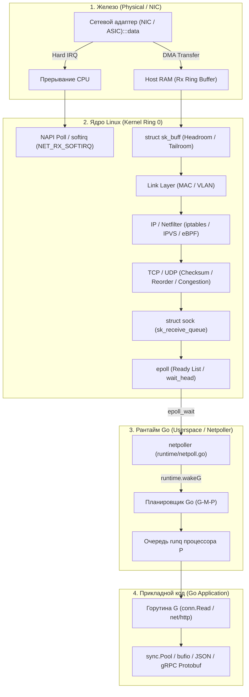
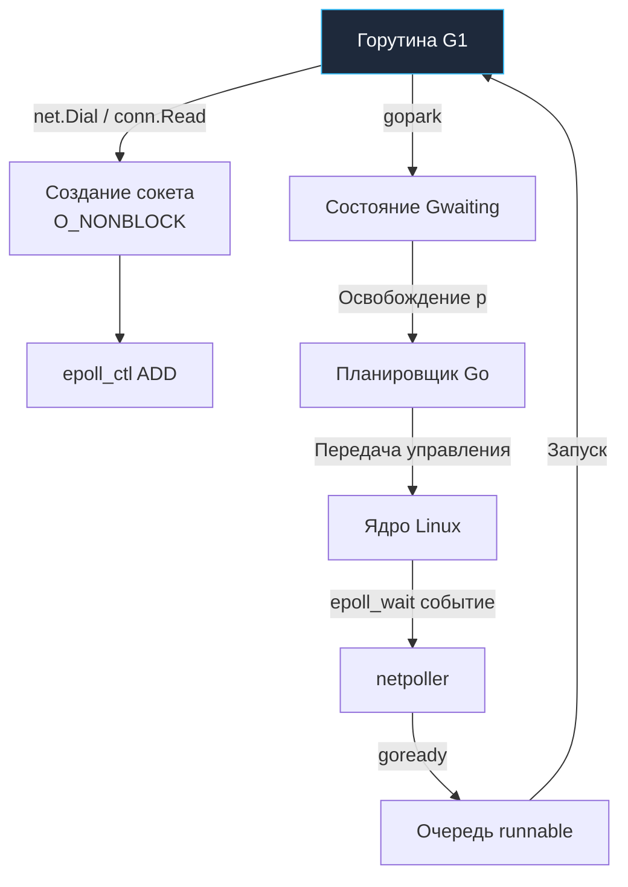

## Финальная синхронизация: Сетевой стек в контексте Go

> *«Единственный способ писать хорошие программы — писать их просто, ясно и внимательно».*    
> — Брайан Керниган

Мы прошли грандиозный инженерный путь длиной в 44 фундаментальные лекции третьего модуля: от кремния сетевой карты, медных проводов и Ethernet MAC-кадров до маршрутизации IP, тонкостей перегрузок TCP, мультиплексирования HTTP/2, революции QUIC/HTTP-3, виртуальных оверлеев Kubernetes CNI и отказоустойчивых паттернов распределенных систем.

Для бэкенд-инженера, претендующего на Senior- или Lead-позицию, сухого академического знания протоколов по спецификациям RFC категорически недостаточно. Ключевая профессиональная компетенция — **видеть всю систему насквозь**:
- Понимать, какую физическую работу выполняет процессор и контроллер сетевой карты при каждом вызове `conn.Read()`.
- Осознавать, как рантайм Go элегантно скрещивает синхронную выразительность горутин с неблокирующим ядром Linux.
- Знать, где в сетевом стеке возникают скрытые накладные расходы (overhead), очереди задержек (tail latency) и утечки системных ресурсов.
- Уметь осознанно настраивать операционную систему и рантайм языка под колоссальные нагрузки в миллионы параллельных соединений.

В этой финальной лекции мы сведем все разрозненные знания в единую, кристалльно ясную инженерную картину.

---

### Большая картина: От медного провода до горутины в Go

---

## Архитектура взаимодействия Go и ОС

Go не реализует собственный стек TCP/IP в пространстве пользователя (как это делает DPDK). Он использует стандартные POSIX-сокеты операционной системы, но кардинально меняет фундаментальный подход к их диспетчеризации. 

В классических языках программирования (C, C++, Java, C#, PHP) разработчик сталкивается с дилеммой:
- Либо блокировать поток ОС на каждом сетевом вызове `read`/`write` (что губит сервер при масштабировании до тысяч клиентов);
- Либо вручную писать сложнейшие асинхронные конечные автоматы на системных вызовах `select`/`poll`/`epoll` с неизбежным кошмаром callback hell.

Go решает эту проблему на уровне архитектуры языка, вынося всю асинхронную диспетчеризацию внутрь рантайма через подсистему `[[38. Как Go работает с сетью. net, net_http, netpoller, epoll]]`.

В основе сетевого рантайма лежит **`netpoller`**. На Linux он использует системный мультиплексор `epoll` (в современных версиях Go 1.22+ оптимизированный edge-triggered режим для снижения оверхеда), на macOS/BSD — `kqueue`, на Windows — `IOCP`.

Когда горутина вызывает `net.Dial()` или `conn.Read()`, рантайм выполняет строгую последовательность шагов:
1. Создает системный сокет и переводит его в неблокирующий режим (`O_NONBLOCK`).
2. Регистрирует сокет в экземпляре ядра `epoll` через системный вызов `epoll_ctl(EPOLL_CTL_ADD)`.
3. Если данных в буфере сокета ядра еще нет, вызывается рантайм-функция `gopark()`. Она переводит текущую горутину в состояние ожидания `Gwaiting`, снимает ее с логического процессора `p` и передает управление планировщику.
4. Планировщик моментально переключает поток ОС (`m`) на выполнение других готовых горутин из очереди `p`. Ни один поток процессора не простаивает!

Когда сетевой пакет физически прибывает в память и ядро Linux сигнализирует о готовности сокета через `epoll_wait()`, подсистема `netpoller` извлекает дескриптор и вызывает функцию `goready()` для связанной с сокетом горутины. Горутина перемещается в очередь `runnable` и будет исполнена ближайшим свободным процессором `p`.

> [!info] Под капотом
> `netpoller` не выделяет отдельные системные треды под каждый сокет. Опрос сетевых событий встроен прямо в планировщик Go: любой рабочий поток M при поиске задач (`findrunnable`) или системный поток мониторинга `sysmon` вызывает `netpoll()`, считывая за один системный вызов пачку до 1024 готовых событий (`epoll_wait`) и переводя ожидающие горутины в состояние `_Grunnable`. Это обеспечивает колоссальную плотность сетевых соединений на единицу ресурсов ОС.

---

## Ключевые паттерны и Mechanical Sympathy

Понимание сетевого стека без глубокого учета кремния и ядра ОС неизбежно приводит к тяжелым архитектурным ошибкам. Вот критические точки, где логика Go встречается с физической реальностью машины.

### 1. Стоимость системных вызовов и буферизация

Каждый сетевой вызов `read` или `write` через сокет — это полноценное переключение контекста процессора из пользовательского режима (Ring 3) в режим ядра (Ring 0). Если отправлять данные в сеть порциями по 10 байт, процессор потратит 99% времени на сброс конвейера и переключение таблиц страниц памяти.

В стандартной библиотеке Go `[[6. Стандартная библиотека Go]]` пакеты `bufio`, `bytes` и клиентский транспорт `http.Transport` активно используют буферизацию. Однако на уровне архитектуры приложения вы обязаны жестко контролировать параметры пула соединений:
- `http.Transport.MaxIdleConns` — суммарный лимит простаивающих соединений в пуле;
- `http.Transport.MaxIdleConnsPerHost` — лимит соединений к одному целевому хосту (по умолчанию равен 2, что вызывает катастрофический шквал новых TCP Handshakes под нагрузкой!);
- `http.Transport.IdleConnTimeout` — время жизни неактивного соединения.

Неиспользуемые соединения, закрываемые клиентом или сервером, не освобождают сетевые порты мгновенно: они застревают в состоянии `TIME_WAIT` на 60 секунд (`2 * MSL`), что при отсутствии пулинга неминуемо ведет к исчерпанию портов хоста `[[39. TIME_WAIT, Port Exhaustion и другие проблемы TCP-сервисов]]`.

> [!warning] Ловушка / Gotcha
> `http.Client` по умолчанию кэширует соединения. Если вы создаете новый `http.Client` в каждом запросе, вы теряете пул и создаете тысячу новых TCP-рукопожатий. Всегда переиспользуйте `http.DefaultClient` или кастомный `http.Transport`.

### 2. Zero-Copy и ядро

Классическая отправка файла через сеть требует четырех операций копирования памяти (Диск $\to$ Page Cache $\to$ Userspace $\to$ Socket Buffer $\to$ NIC). Go не делает лишний `memcpy` между пользовательским буфером и ядром при записи в сокет, если буфер выровнен и соответствует внутренним структурам `syscall.Sendmsg` или `unix.Sendmsg`. 

В высоконагруженных прокси, файловых хранилищах и стриминговых платформах используйте `syscall.Sendmsg` с векторными буферами `iovec`, системный вызов `sendfile` (через `io.Copy` для файлов на диске) или `splice` для передачи данных напрямую из кэша страниц ядра в сетевую карту с нулевым участием CPU.

### 3. DNS и блокировка планировщика

Стандартный вызов `net.LookupIP()` — это синхронная операция, которая блокирует текущую горутину до получения ответа от DNS-сервера. В современных версиях Go добавлен `net.Resolver.LookupContext`, но при определенных конфигурациях CGO он все равно может вызывать блокирующие системные вызовы операционной системы (`getaddrinfo`). 

В микросервисной архитектуре DNS-резолвер обязан быть либо асинхронным, либо агрессивно кэшироваться в памяти приложения. Обратитесь к материалам лекции `[[17. DNS под капотом. Record Types, TTL, Recursive Resolver, кеширование]]`, чтобы досконально понимать, почему `dig` может работать быстрее, чем ваш код, и как избежать задержек CoreDNS из-за `ndots:5` в Kubernetes.

---

## Системный дизайн и распределенные системы

Сеть — это не абстрактное математическое пространство, а физическая среда с конечной пропускной способностью, конечной емкостью буферов и ненулевой задержкой.

### Протокольный выбор: HTTP/2 vs HTTP/3

Развитие веб-протоколов отражает непрерывную борьбу инженеров с задержками:
- Стандарт HTTP/2 `[[22. HTTP 2. Multiplexing, Frames, HPACK]]` устранил проблему Head-of-Line Blocking на уровне прикладных запросов благодаря мультиплексированию фреймов внутри одного TCP-соединения. Но если в сети теряется хотя бы один TCP-пакет, ядро останавливает выдачу байт для всех параллельных потоков HTTP/2 сразу!
- Протокол HTTP/3 и транспорт QUIC `[[23. HTTP 3 и QUIC. Почему будущее уходит от TCP]]`, `[[24. Deep Dive в QUIC. Пакеты, Stream, Loss Recovery]]` полностью ликвидировали блокировку очередей на транспортном уровне, перенеся управление независимыми потоками поверх датаграмм UDP. В современных версиях Go поддержка HTTP/3 осуществляется стабильно через `http3.Transport`. Для чувствительных к потерям пакетов и задержкам сервисов (мобильный трафик, стриминг, финансовые шлюзы) переход на QUIC становится стандартом индустрии.

### Отказоустойчивость и Circuit Breaker

В распределенных системах архитектурные паттерны `[[43. Сетевые паттерны распределенных систем]]` требуют жесткого управления деградацией. Таймауты в системе обязаны быть строго иерархичными:
- `context.WithTimeout` — верхнеуровневый дедлайн всей бизнес-операции;
- `ReadHeaderTimeout` и `WriteTimeout` — защита от атак медленных клиентов;
- `TCPKeepAlive` — зондирование целостности физического канала;
- `IdleTimeout` — своевременное освобождение сокетов прокси-слоя.

Если пренебречь хотя бы одним уровнем таймаутов, атака Slowloris или внезапный всплеск задержек `[[40. Head of Line Blocking, Slowloris и деградация под нагрузкой]]` быстро превратит ваш пул горутин в невосстановимый deadlock.

> [!tip] Собеседование
> **Вопрос:** Как Go обрабатывает потерю пакетов TCP?
> **Ответ:** Сам Go не обрабатывает потерю пакетов напрямую — это делает стек ОС. Go просто получает `-EAGAIN` или `0` байт от `read`/`write`. Если соединение рвется, `net.Conn` возвращает ошибку `use of closed network connection` или `connection reset by peer`. Для восстановления нужно реализовывать Retry-логику на уровне приложения с экспоненциальной backoff, так как TCP уже попытался восстановить соединение через `[[12. TCP Retransmission, Keep Alive, Nagle и Delayed ACK]]`.

---

## Ловушки и вопросы на собеседованиях

1. **`net.Dial` vs `net.Listen`:** Вызов `Dial` блокирует горутину до завершения трехэтапного рукопожатия TCP Handshake или истечения таймаута. В Go нет асинхронных сокетов "из коробки" без участия планировщика `netpoller`. Вызов `Dial` в цикле без передачи `context.Context` гарантированно приведет к утечке горутин при сетевом сбое.
2. **`SO_REUSEPORT`:** Механизм Linux, позволяющий нескольким процессам или потокам привязаться (`bind`) к одному и тому же сетевому порту. Go использует это для балансировки входящих соединений между логическими процессорами `p`, полностью устраняя межъядерную конкуренцию (contention) на мьютексах сетевого стека.
3. **`TCP_NODELAY`:** По умолчанию в сетевом стеке активирован алгоритм Нагла (Nagle Algorithm, подробнее в [[12. TCP Retransmission, Keep Alive, Nagle и Delayed ACK]]), который объединяет мелкие порции данных в один большой пакет. В низколатентных RPC и микросервисах на базе gRPC `[[26. gRPC, Protocol Buffers и сетевые особенности RPC]]` его отключение через `conn.SetNoDelay(true)` обязательно для исключения паразитных задержек в 40–200 мс.
4. **Кэширование DNS в Go:** Встроенный резолвер `net.Resolver` не кэширует DNS-ответы в памяти процесса, а полагается на системные библиотеки ОС (nsswitch). Если вы хотите реализовать надежное кэширование, используйте принципы из лекции `[[17. DNS под капотом. Record Types, TTL, Recursive Resolver, кеширование]]` или подключайте внешние библиотеки.
5. **`context` и сетевые соединения:** Вызов функции отмены `context.CancelFunc` не приводит к мгновенному физическому разрыву TCP-сокета на уровне сетевой карты. Он лишь немедленно возвращает ошибку `context.Canceled` вызывающему коду при попытке чтения или записи. Соединение обязано быть закрыто явно через `conn.Close()`, иначе сокет останется висеть в памяти ядра и перейдет в состояние `TIME_WAIT`.

---

## Итог

Сетевой стек в Go — это не просто библиотека сокетов, а виртуозный инженерный симбиоз между рантайм-планировщиком `netpoller`, ядром Linux, структурами памяти `sk_buff` и физическими возможностями кремния.

Настоящий Senior-инженер:
- Знает, когда включать `SO_REUSEPORT` и отключать алгоритм Нагла;
- Понимает, как настраивать пулинг `http.Transport` под конкретный профиль микросервисной нагрузки;
- Осознает фундаментальные причины перехода от TCP к QUIC и HTTP/3 в условиях потери пакетов;
- Умеет предотвратить исчерпание портов хоста и переполнение таблиц `conntrack` в кластерах Kubernetes.

Мы полностью завершили фундаментальное исследование компьютерных сетей и сетевого стека. Впереди нас ждет погружение в саму душу языка Go — его историю, мировоззрение создателей и уникальную инженерную философию: `[[4. История и философия Go. Предпосылки создания языка, парадигма Composition over inheritance и Errors are values]]`.