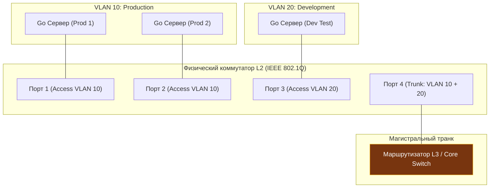
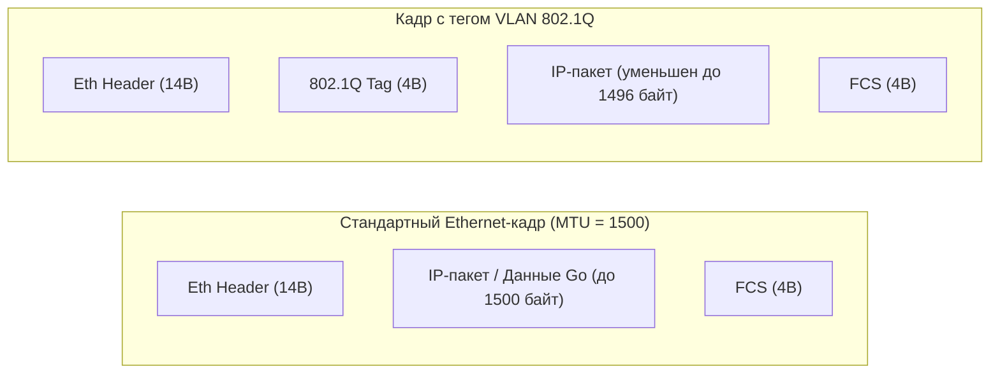
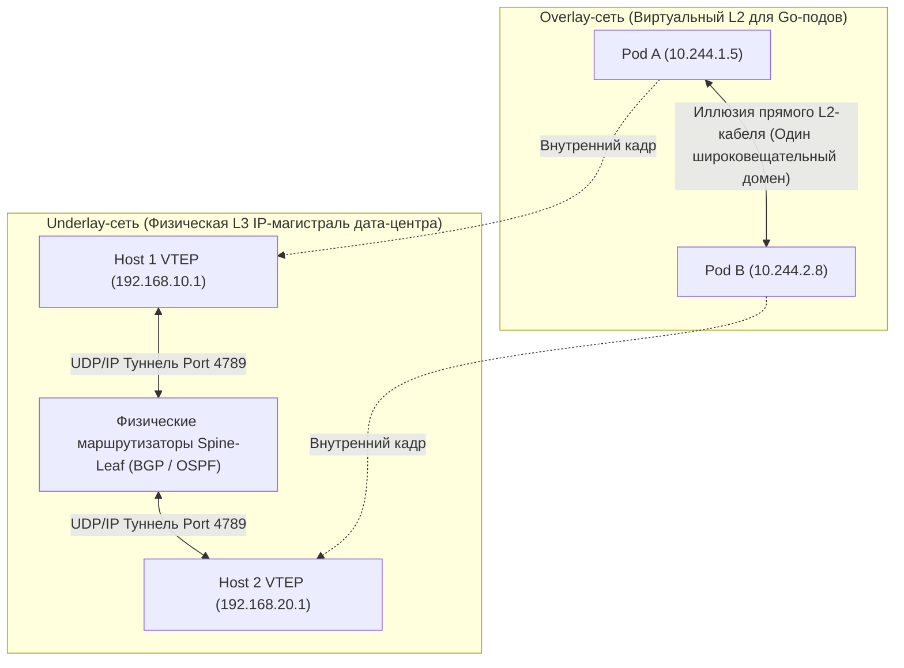
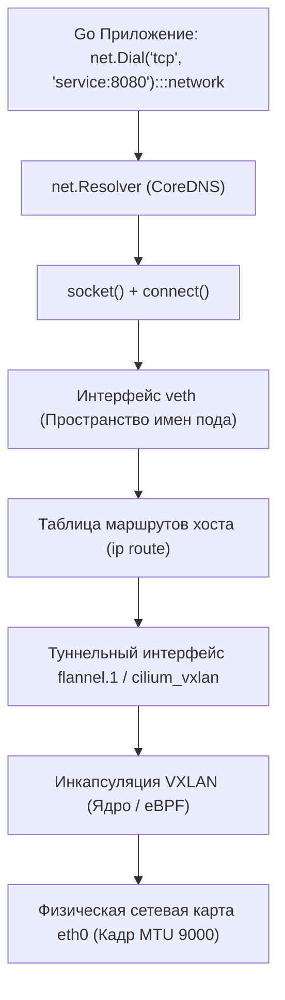

# VLAN, VXLAN и сегментация сети

> *«Сети подобны луковице: они состоят из слоев, и когда начинаешь их препарировать — текут слезы».*    
> — Инженерный фольклор сетевых архитекторов

Представьте современный многоквартирный жилой комплекс. Все жильцы пользуются одними и теми же физическими коммуникациями: едиными стояками водоснабжения, общими шахтами электропроводки и общим подъездом. Но никому не придет в голову объединить все квартиры в одну гигантскую общую комнату: между ними возведены прочные железобетонные стены с надежными замками. Каждый жилец чувствует себя в полной изоляции и безопасности.

В компьютерных сетях эта физическая изоляция исторически строилась на втором уровне (L2) с помощью **VLAN (Virtual Local Area Network)**: сетевые пакеты помечались цифровыми бирками-тегами прямо внутри коммутаторов. 

Но что делать, если ваша компания — это не один дом, а глобальная распределенная корпорация с сотнями дата-центров по всему миру? Что делать, если виртуальная машина или контейнер с бэкендом на Go, запущенный в ЦОД во Франкфурте, должен общаться с контейнером в Токио так, словно они воткнуты в один и тот же локальный коммутатор за соседней стеной? Протянуть сплошной кабель L2 через континенты невозможно: широковещательные штормы и петли коммутации уничтожат сеть за секунды.

На стыке этих требований родилась концепция оверлейных сетей и протокол **VXLAN (Virtual Extensible LAN)**: технология, упаковывающая целые локальные Ethernet-кадры внутрь стандартных UDP-пакетов маршрутизируемого интернета. 

Для Go-разработчика, создающего микросервисы в облаках и Kubernetes, сегментация сети перестает быть абстракцией системных администраторов. Размер полезной нагрузки пакетов (**MTU**), оверхед туннелирования, поведение пулов соединений в `net.Dialer`, загадочные обрывы соединений с ошибками `TIME_WAIT` или `message too long` — всё это прямое следствие работы оверлеев и сегментации. В этой лекции мы разложим по полочкам механику VLAN и VXLAN и разберем, как сетевой стек Go взаимодействует с виртуализированной инфраструктурой.

---

## VLAN (802.1Q): Аппаратная сегментация на L2

Протокол **VLAN (Virtual Local Area Network)**, стандартизированный комитетом IEEE как **802.1Q**, позволяет разделить один физический сетевой коммутатор на несколько независимых логических сегментов — виртуальных широковещательных доменов (Broadcast Domains).



Для бэкенд-инфраструктуры это означает, что на одной физической стойке серверов можно одновременно разместить production-окружение, staging и тестовые контуры dev без физической прокладки отдельных кабелей. Трафик разработчиков физически не может попасть в сеть продакшена на уровне L2, даже если злоумышленник попытается перехватить ARP-запросы или отправить broadcast-пакеты.

Коммутатор различает два основных типа портов:
1. **Access-порты (немаркированные):** Обычные порты, к которым подключаются серверы. Сетевая карта сервера отправляет классический Ethernet-кадр без всяких тегов. Коммутатор при приеме кадра сам навешивает тег нужного VLAN.
2. **Trunk-порты (магистральные / тегированные):** Высокоскоростные порты между коммутаторами или аплинками к серверам виртуализации, по которым передаются кадры сразу многих VLAN с обязательной маркировкой.

---

## Устройство тега

Когда немаркированный Ethernet-кадр попадает в транковый порт, сетевой коммутатор на лету врезает в него дополнительный **4-байтный тег 802.1Q**. Тег вставляется строго между адресом источника (Source MAC) и полем типа протокола `EtherType`:

```
 0                   1                   2                   3
 0 1 2 3 4 5 6 7 8 9 0 1 2 3 4 5 6 7 8 9 0 1 2 3 4 5 6 7 8 9 0 1
+-+-+-+-+-+-+-+-+-+-+-+-+-+-+-+-+-+-+-+-+-+-+-+-+-+-+-+-+-+-+-+-+
|       TPID (0x8100)           |PCP|D|          VID            |
+-+-+-+-+-+-+-+-+-+-+-+-+-+-+-+-+-+-+-+-+-+-+-+-+-+-+-+-+-+-+-+-+
```

Тег состоит из двух ключевых полей по 2 байта:
1. **TPID (Tag Protocol Identifier, 2 байта):** Всегда содержит фиксированное значение **`0x8100`**. Для сетевого адаптера это сигнал: *«Внимание, этот кадр содержит тег 802.1Q, следующие 2 байта — служебная информация»*.
2. **TCI (Tag Control Information, 2 байта):**
   - **Priority Code Point (PCP, 3 бита):** Приоритет качества обслуживания (QoS / CoS по стандарту IEEE 802.1p). Позволяет приоритезировать чувствительный голосовой (VoIP) или финансовый трафик перед фоновой передачей файлов.
   - **Drop Eligible Indicator (DEI / CFI, 1 бит):** Флаг отбрасывания пакета при перегрузке очередей коммутатора.
   - **VID (VLAN Identifier, 12 бит):** Номер виртуальной сети. Поскольку поле занимает 12 бит, максимальное число значений составляет $2^{12} = 4096$.  
     Значения **`0`** (приоритетный трафик без привязки к VLAN) и **`4095`** зарезервированы стандартом. В результате инженерам доступно ровно **`4094`** уникальные виртуальные сети.

> [!info] Под капотом: Аппаратная обработка тегов в TCAM
> Промышленные коммутаторы L2/L3 проверяют VID кадра за доли наносекунды с помощью специализированной сверхбыстрой памяти **TCAM (Ternary Content-Addressable Memory)**.  
> Однако память TCAM крайне дорога в производстве, потребляет много энергии и сильно нагревается. В многоарендных дата-центрах таблицы TCAM быстро переполняются. Когда трафик должен перейти из одного VLAN в другой (Inter-VLAN Routing), коммутатор L3 вынужден передавать кадр в центральный процессор управления (Control Plane), задействуя подсистему маршрутизации ядра (`ip route`), что увеличивает сетевую задержку пакета на несколько микросекунд.

---

## Влияние на Go-приложения

На первый взгляд кажется, что 4 байта тега VLAN — это сугубо аппаратная деталь коммутаторов. Но для сетевого кода на Go это источник коварных скрытых проблем:



### 1. Проблема уменьшения MTU (MTU Reduction)
Стандартный максимальный размер полезной нагрузки Ethernet-кадра составляет **`1500` байт**. Добавление 4-байтного заголовка 802.1Q увеличивает общий размер кадра с 1518 до 1522 байт. 
Если физический сетевой интерфейс сервера или промежуточный коммутатор не настроен на прием слегка увеличенных кадров (Baby Giant Frames), операционная система вынуждена уменьшать эффективный MTU со значения `1500` до **`1496` байт**.

Если высокопроизводительный сервис на Go отправляет UDP-датаграмму размером ровно `1500` байт через сокет `net.UDPConn`, ядро Linux возвратит ошибку операционной системы:  
**`message too long`** при вызове метода **`Write`**.  
В протоколах TCP и HTTP (`net/http`) при передаче больших тел ответов с заголовком **`Content-Length`** несовпадение MTU приводит к «черным дырам» PMTU Discovery: соединение зависает посреди передачи данных, а клиент бесконечно ждет завершения ответа.

### 2. Изоляция широковещательных доменов (Broadcast Domains)
VLAN изолирует широковещательный трафик. Это необходимо для локализации штормов ARP, однако может нарушить работу механизмов обнаружения сервисов (mDNS, SSDP, Gossip-протоколы кластеров), если сервисы случайно разнесены по разным VLAN. 

В микросервисах на Go со стандартным резолвером **`net.Resolver`** рассинхронизация VLAN между нодами приводит к периодическим таймаутам DNS-запросов.

---

## VXLAN: Программная сегментация поверх L3

В начале 2010-х годов с бурным взрывом публичных облаков (AWS, Google Cloud) и технологий контейнеризации ограничения классического VLAN стали непреодолимой стеной:
1. **Жесткий лимит 4094 сетей:** В облаке с десятками тысяч независимых клиентов 4094 идентификаторов катастрофически не хватает.
2. **Ограничение L2-домена:** Классический VLAN не может выйти за пределы одного коммутатора или L2-сегмента. Нельзя прозрачно переместить виртуалку или под Kubernetes из одного дата-центра в другой с сохранением IP.
3. **Проблема Spanning Tree Protocol (STP):** Чтобы избежать петель в L2-сетях, протокол STP принудительно блокирует до 50% физических линий связи, снижая пропускную способность ЦОД.

Инженерным ответом стал протокол **VXLAN (Virtual Extensible LAN, RFC 7348)**. Архитектурный принцип VXLAN гениально прост: **инкапсулировать целый L2 Ethernet-кадр внутрь стандартного L3/L4 UDP-пакета (техника MAC-in-UDP)**!



Сеть разделяется на два независимых слоя:
* **Underlay-сеть (Физическая основа):** Стандартная физическая сеть дата-центра с IP-маршрутизацией (Spine-Leaf архитектура на протоколах BGP или OSPF).
* **Overlay-сеть (Виртуальный слой):** Программно-определяемая виртуальная сеть, в которой живут контейнеры и виртуальные машины.

Узлы, выполняющие упаковку и распаковку пакетов, называются **VTEP (VXLAN Tunnel End Point)**. В Kubernetes роль VTEP обычно выполняет сетевой интерфейс хоста (например, `flannel.1`), управляемый CNI-плагином.

---

## Устройство VXLAN-пакета

Каждый оригинальный Ethernet-кадр, сгенерированный приложением, оборачивается в многослойную «матрешку» внешних заголовков:

```mermaid
flowchart LR
    classDef process  fill:#1e293b,stroke:#38bdf8,stroke-width:1px,color:#f8fafc
    classDef success  fill:#064e3b,stroke:#34d399,stroke-width:1px,color:#f8fafc
    classDef error    fill:#7f1d1d,stroke:#f87171,stroke-width:1px,color:#f8fafc
    classDef warning  fill:#78350f,stroke:#fbbf24,stroke-width:1px,color:#f8fafc
    classDef entry    fill:#1e3a5f,stroke:#38bdf8,stroke-width:2px,color:#f8fafc
    classDef aux      fill:#334155,stroke:#64748b,stroke-width:1px,color:#f8fafc
    classDef system   fill:#312e81,stroke:#a78bfa,stroke-width:1px,color:#f8fafc
    classDef data     fill:#132d29,stroke:#2dd4bf,stroke-width:1px,color:#f8fafc
    classDef network  fill:#881337,stroke:#fb7185,stroke-width:1px,color:#f8fafc
    classDef accent   fill:#1e1b4b,stroke:#818cf8,stroke-width:1px,color:#f8fafc
    OuterEth["Внешний Ethernet (14B):::process"] --> OuterIP["Внешний IP (20B)"]
    OuterIP --> OuterUDP["Внешний UDP: Port 4789 (8B)"]
    OuterUDP --> VXLAN_Hdr["VXLAN Header: VNI (8B)"]
    VXLAN_Hdr --> InnerEth["Внутренний Ethernet-кадр пода (Payload)"]
```



1. **VXLAN Header (8 байт):** Содержит служебные флаги и главное поле — **VNI (VXLAN Network Identifier)** разрядностью **24 бита**!  
   В отличие от жалких 4094 сетей в VLAN, 24 бита VNI дают **$2^{24} = 16\,777\,216$ уникальных виртуальных сетей**! Этого с избытком хватает для изоляции миллионов клиентов любого глобального облака.
2. **Outer UDP Header (8 байт):** Порт назначения по стандарту IANA (RFC 7348) равен **`4789`** (в ранних реализациях ядра Linux и некоторых оверлеях исторически использовался порт по умолчанию `8472`). Исходный порт выбирается как хэш от внутренних заголовков пакета.
3. **Outer IP Header (20 байт для IPv4 / 40 байт для IPv6):** Реальные IP-адреса хостов-отправителей и получателей туннеля (VTEP).
4. **Outer Ethernet Header (14 байт):** Физические MAC-адреса серверов и шлюзов underlay-сети.

Итоговый суммарный оверхед туннелирования:
$$\mathbf{8 + 8 + 20 + 14 = 50 \text{ байт}}$$

> [!warning] Ловушка / Gotcha: Катастрофа MTU в оверлейных сетях
> Дополнительные 50 байт оверхеда VXLAN порождают так называемый **MTU Crisis** в облачных средах.  
> 
> Если физическая underlay-сеть хоста настроена со стандартным MTU **`1500` байт**, то внутри контейнера максимальный доступный размер кадра падает:
> $$1500 - 50 = \mathbf{1450 \text{ байт}}$$
> 
> Если же инфраструктура дополнительно использует тегирование VLAN (еще **`-4`** байта) и внешний IPv6-заголовок (еще **`-20`** байт), полезное пространство для полезной нагрузки сокета Go падает до катастрофических **`1426` байт**!  
> 
> Если ваше Go-приложение или сетевой стек попытается передать стандартный пакет 1500 байт с установленным флагом DF (Don't Fragment), пакет будет молча отброшен туннельным интерфейсом. TCP-сессии зависают на фазе отправки больших данных, а метрики сервиса показывают лавинообразный рост `TIME_WAIT`.  
> 
> **Инженерное решение:**  
> В современных дата-центрах на всех физических портах коммутаторов и VTEP-нод включают поддержку **Jumbo Frames с MTU 9000 байт**. Это гарантирует, что даже с оверхедом туннелей полезная нагрузка контейнеров сохранит полноценный размер без деградации.

---

## Почему UDP, а не TCP или ESP?

Почему создатели VXLAN выбрали в качестве транспорта именно легковесный протокол UDP, а не защищенный IPsec ESP или надежный TCP?

1. **Беспрепятственный проход через NAT (NAT Traversal):** UDP-пакеты прозрачно проходят через любые бытовые и промышленные маршрутизаторы с трансляцией адресов ([[8. NAT, PAT и почему приватные сети работают через один IP.md]]). В отличие от протоколов вроде GRE (IP-протокол 47) или IPsec ESP (протокол 50), требующих сложной настройки conntrack, UDP поддерживается любым сетевым оборудованием мира.
2. **Балансировка нагрузки через ECMP (Middlebox Compatibility):** В современных ЦОД коммутаторы распределяют трафик по параллельным путям с помощью ECMP. Коммутатор хэширует 5 полей заголовка (5-tuple). Генерация псевдослучайного Source Port в UDP-заголовке VXLAN позволяет физическим коммутаторам идеально равномерно балансировать трафик разных виртуальных подов по всем 100-гигабитным линкам фабрики!
3. **Аппаратная акселерация (Hardware Offloading):** Современные сетевые адаптеры Intel, Mellanox и Broadcom аппаратно распознают заголовки VXLAN. Сетевая карта сама распаковывает туннель и вычисляет контрольные суммы (UDP Checksum Offload), снижая накладные расходы процессора хоста до ничтожных **`~0.5%`** на поток данных.

---

## Сегментация в экосистеме Go и контейнеризации

В современных облачных средах Kubernetes сегментация и оверлеи реализуются через плагины стандарта **CNI (Container Network Interface)** — Calico, Cilium, Flannel.



### Как Go видит эту сеть

Когда ваше приложение на Go выполняет сетевой запрос:

```go
conn, err := net.Dial("tcp", "service:8080")
```

1. **Резолвинг адреса:** Рантайм Go через внутренний механизм `net.Resolver` обращается к кластерному DNS-серверу (CoreDNS).
2. **Создание сокета:** Структура `net.Dialer` вызывает системные вызовы ядра `socket(AF_INET, SOCK_STREAM, IPPROTO_TCP)` и `connect()`.
3. **Маршрутизация ядра:** Ядро Linux сверяется с таблицей маршрутизации `ip route` сетевого пространства имен пода. Пакет выходит через виртуальную пару **`veth`** на физический хост.
4. **Туннелирование:** На хосте маршрут указывает на интерфейс **`flannel.1`** или виртуальный адаптер Cilium. Ядро операционной системы (в подсистеме **Softnet** или через программы **eBPF**) перехватывает пакет, навешивает заголовки VXLAN с нужным номером VNI и отправляет UDP-датаграмму через физическую карту **`eth0`**.

### Диагностика MTU и сетевых интерфейсов в Go

Следующий законченный пример демонстрирует, как сервис на Go может программно инспектировать локальные сетевые интерфейсы, выявлять заниженные значения MTU (характерные для туннелей VXLAN) и безопасно обрабатывать сетевые ошибки с таймаутами:

```go
package main

import (
	"context"
	"errors"
	"fmt"
	"log"
	"net"
	"net/http"
	"time"
)

// Проверка значений MTU сетевых адаптеров хоста
func auditInterfaceMTU() {
	// Функция net.Interfaces обращается к ядру Linux через системный протокол netlink
	ifaces, err := net.Interfaces()
	if err != nil {
		log.Printf("Ошибка вызова net.Interfaces: %v", err)
		return
	}

	fmt.Println("=== Аудит сетевых интерфейсов и параметров MTU ===")
	for _, iface := range ifaces {
		status := "Стандартный MTU"
		if iface.MTU < 1500 && iface.MTU > 0 {
			status = "⚠️ Заниженный MTU (Вероятно, оверлей VXLAN или Docker bridge!)"
		} else if iface.MTU >= 9000 {
			status = "🚀 Jumbo Frames (Дата-центр / High-Performance)"
		}

		fmt.Printf("Интерфейс: %-12s | MTU: %-5d | Статус: %s\n",
			iface.Name, iface.MTU, status)
	}
}

// Пример надежного выполнения запроса через клиент net/http.Client в изолированных сетях
func queryInternalService(ctx context.Context, targetURL string) error {
	// Обязательно настраиваем тайм-ауты в net.Dialer для предотвращения утечки горутин
	dialer := &net.Dialer{
		Timeout:   3 * time.Second,
		KeepAlive: 30 * time.Second,
	}

	transport := &http.Transport{
		DialContext:         dialer.DialContext,
		TLSHandshakeTimeout: 3 * time.Second,
		MaxIdleConns:        100,
		IdleConnTimeout:     90 * time.Second,
	}

	client := &http.Client{
		Transport: transport,
		Timeout:   5 * time.Second,
	}

	req, err := http.NewRequestWithContext(ctx, http.MethodGet, targetURL, nil)
	if err != nil {
		return fmt.Errorf("ошибка создания запроса: %w", err)
	}

	resp, err := client.Do(req)
	if err != nil {
		// Анализ типа сетевой ошибки уровня ядра
		var netErr net.Error
		var opErr *net.OpError
		if errors.As(err, &opErr) {
			log.Printf("[СЕТЕВОЙ СБОЙ L4] Ошибка операции %s для адреса %s: %v",
				opErr.Op, opErr.Addr, opErr.Err)
		}
		if errors.As(err, &netErr) && netErr.Timeout() {
			return fmt.Errorf("таймаут обращения к сервису (возможна изоляция NetworkPolicy): %w", err)
		}
		return fmt.Errorf("сетевой сбой доставки пакета: %w", err)
	}
	defer resp.Body.Close()

	if resp.StatusCode >= 500 {
		return fmt.Errorf("сервис вернул ошибку сервера: статус %d", resp.StatusCode)
	}

	fmt.Printf("[УСПЕХ] Запрос к %s выполнен успешно! Код ответа: %d\n", targetURL, resp.StatusCode)
	return nil
}

func main() {
	auditInterfaceMTU()

	ctx, cancel := context.WithTimeout(context.Background(), 6*time.Second)
	defer cancel()

	fmt.Println("\n=== Тестовое обращение к внутреннему эндпоинту ===")
	_ = queryInternalService(ctx, "http://127.0.0.1:8080/healthz")
}
```

> [!tip] Собеседование: VXLAN против GRE и обработка изоляции сегментов
> **Вопрос:** Почему при создании облачных оверлеев инженеры предпочли VXLAN поверх UDP, а не протоколы GRE (IP protocol 47) или IP-in-IP?  
> **Ответ:**  
> 1. GRE не имеет концепции портов L4 и с трудом проходит через бытовые и корпоративные межсетевые экраны с NAT.  
> 2. Инкапсуляция в UDP позволяет генерировать динамический Source Port, что обеспечивает идеальную балансировку трафика между VTEP по параллельным каналам дата-центра с помощью механизма ECMP на коммутаторах.  
> 3. UDP исключает риск взаимных дедлоков в сетевом стеке ядра при маршрутизации инкапсулированных пакетов.
> 
> **Вопрос:** Как Go-бэкенд должен реагировать на сетевую изоляцию сегментов, вызванную политиками Kubernetes NetworkPolicy или сбоями Service Mesh?  
> **Ответ:**  
> При блокировке трафика политиками **`networkpolicy`** или фильтрами sidecar-прокси в **`service-mesh`** ([[42. Service Mesh. Istio, Linkerd, sidecar proxy.md]]) запросы не просто «висят» — они завершаются специфическими ошибками:
> * На уровне L4 ядро или файрвол возвращает отказ в соединении **`ECONNREFUSED`** либо пакеты молча отбрасываются, вызывая ошибку **`network unreachable`** или таймаут **`timeout`**;
> * На уровне L7 сервисный прокси (Envoy) возвращает статус **`503` Service Unavailable**.  
> Приложение на Go обязано оборачивать вызовы в **`context.WithTimeout`**, корректно извлекать тип ошибки **`net.OpError`** и отличать временные таймауты от постоянной недоступности сетевого сегмента, активируя паттерн Circuit Breaker.

---

## Итог

Сегментация сети — это фундамент информационной безопасности, мультитенантности и масштабируемости современных облачных инфраструктур:

1. **VLAN (802.1Q):** Классическая аппаратная изоляция на втором уровне (L2). Добавляет 4-байтный тег с кодом `0x8100`, разделяя свитч максимум на 4094 сети. Уменьшает эффективный MTU до 1496 байт.
2. **VXLAN (RFC 7348):** Современный стандарт облачных оверлеев (MAC-in-UDP). Расширяет пространство изоляции до 16 миллионов сетей за счет 24-битного идентификатора VNI.
3. **Оверхед туннелей:** VXLAN добавляет ровно **50 байт** к каждому пакету (`8 + 8 + 20 + 14 = 50 байт`). В продакшене это требует обязательного включения Jumbo Frames (MTU 9000) для предотвращения фрагментации и ошибок `message too long`.
4. **Транспорт UDP (порт 4789 / 8472):** Гарантирует бесшовный проход через NAT, поддержку аппаратного offload на сетевых картах и балансировку ECMP на физических фабриках ЦОД.
5. **Роль Go-разработчика:** Пакет `net` абстрагирует детали туннелирования, но понимание реального MTU, механики CNI-интерфейсов (`veth`, `flannel.1`) и сокетных опций критично для исключения зависаний при высокой нагрузке.

Мы завершили фундаментальное погружение в основы физических, канальных и сетевых уровней (Блок 1, лекции 1–9). Мы проследили путь байта от кремниевых транзисторов сетевой карты через Ethernet-кадры, ARP/NDP, IP-адреса, таблицы маршрутизации, NAT-трансляторы и виртуальные туннели VXLAN.

Теперь наступает время подняться на транспортный уровень (L4) — уровень, на котором живет надежность, контроль очередей и гарантия целостности данных. В следующей лекции мы откроем **Блок 2** и до винтика разберем самый важный протокол современного интернета: [[10. TCP. Устройство, гарантии и жизненный цикл соединения.md]].