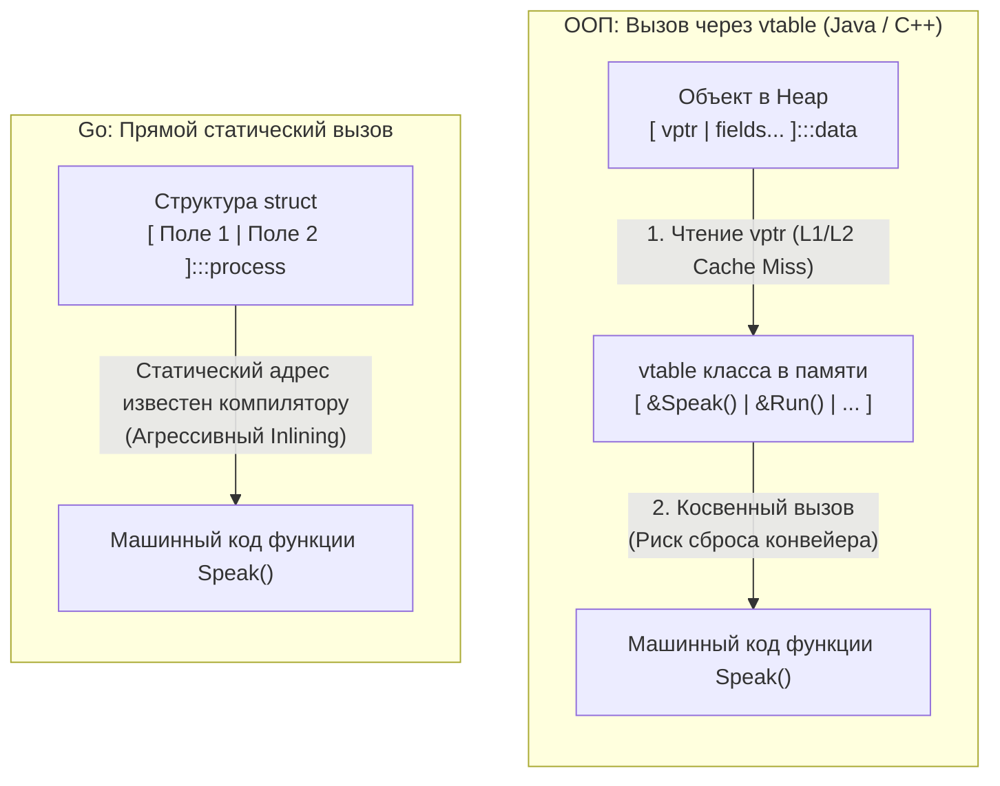

# Composition Over Inheritance. Почему в Go нет наследования

Переход от классического объектно-ориентированного программирования (ООП) к Go вызывает у разработчика сильнейший архитектурный шок именно в момент проектирования первой доменной модели. Годами нас учили мыслить жесткими генеалогическими иерархиями: базовый класс `Vehicle` порождает `Car`, который порождает `ElectricCar`. Рука машинально ищет в Go ключевые слова `class` и `extends`, но натыкается на лаконичную конструкцию `struct`.

Почему Кен Томпсон и Роб Пайк (о контексте решений которых мы говорили в [[2. История создания Go. Google, Rob Pike, Ken Thompson, Robert Griesemer]]) намеренно лишили программистов ключевого механизма ООП?

Ответ кроется в фундаментальном уроке, вынесенном индустрией за последние 30 лет. Еще в 1994 году авторы легендарной книги «Design Patterns» («Банда Четырех», GoF) сформулировали главное правило устойчивой архитектуры: **«Предпочитайте композицию наследованию (Favor object composition over class inheritance)»**. Создатели Go пошли дальше: вместо вежливой рекомендации они закрепили это правило как непреложный закон на уровне самого компилятора.

Давайте разберем, какие архитектурные и аппаратные причины привели к полному отказу от наследования.

---

## Проблема наследования: Хрупкость и Связность

В традиционных языках (Java, C++, C#) наследование реализует отношение **«Is-A» (Является)**: Собака *является* Животным. На первых порах это кажется интуитивным, но по мере роста кодовой базы наследование превращается в самую жесткую и разрушительную форму зацепления (Tight Coupling) в разработке:

1. **Проблема хрупкого базового класса (Fragile Base Class Problem):**  
   Когда вы меняете сигнатуру или логику метода в корневом классе `Animal`, это изменение непредсказуемо и каскадно ломает поведение десятков классов-потомков на всех уровнях вложенности. Разработчик дочернего класса никогда не знает, какие неявные предположения заложены в реализацию предка.
2. **Проблема «Банана и гориллы»:**  
   Один из создателей языка Erlang Джо Армстронг образно описал эту ловушку ООП:  
   > *«Проблема объектно-ориентированных языков в том, что они тянут за собой всю неявную среду. Вы хотели получить банан, но в итоге получили гориллу, которая держит этот банан, и все джунгли в придачу»*.  
   Чтобы переиспользовать один скромный метод базового класса, вы вынуждены тащить в память весь груз его состояния, конструкторов и транзитивных зависимостей.

Go заменяет хрупкое отношение «Is-A» на чистое отношение **«Has-A» (Имеет / Содержит)**. Структуры в Go не выстраиваются в генеалогическое древо. Они собираются из независимых, ортогональных строительных блоков, подобно деталям конструктора Lego.

---

## Mechanical Sympathy: Налог на виртуальность

Помимо архитектурной неповоротливости, у классического наследования есть огромная, непрерывно выплачиваемая цена на уровне физического кремния микропроцессора.

Чтобы обеспечить полиморфное переопределение методов (когда класс `Dog` переопределяет метод `Speak()` базового класса `Animal`), компиляторы C++ и Java вынуждены использовать механизм **динамической диспетчеризации (Dynamic Dispatch)**.

Каждый объект, участвующий в наследовании, несет скрытые накладные расходы:
* **vptr (Virtual Pointer):** Скрытый 8-байтный указатель, автоматически вшиваемый компилятором в заголовок каждого объекта в памяти.
* **vtable (Virtual Table):** Таблица виртуальных методов — массив адресов фактических функций в памяти для каждого конкретного класса.



> [!info] Под капотом: Кэш-промахи и предсказатель ветвлений
> Когда в C++ или Java процессор выполняет вызов `animal.Speak()`, он не может просто перейти по статическому адресу. Процессор вынужден совершить многоступенчатый рейд по памяти:
> 1. Прочитать ячейку объекта из RAM, чтобы извлечь `vptr`.
> 2. Совершить переход по адресу `vptr`, загружая в кэш таблицу `vtable`.
> 3. Найти нужный индекс метода в массиве указателей и прочитать адрес функции `Speak`.
> 4. Выполнить косвенный безусловный переход (Indirect Jump).
> 
> **Для современного CPU это крайне дорого.** Цепочка разыменования указателей `vptr` и `vtable` разбросана по памяти, что приводит к постоянным промахам кэша L1/L2 (Cache Misses). 
> 
> Хуже того: такой косвенный вызов блокирует инлайнинг, а в случае полиморфных вызовов (когда тип объекта в точке вызова часто меняется) аппаратный **Предсказатель ветвлений (Branch Predictor)** совершает ошибки предсказания (`Branch Misprediction`). В результате конвейер инструкций сбрасывается, и процессор теряет 15–20 тактов впустую.

В Go структура (`struct`) — это прозрачный и непрерывный блок памяти. В нем **нет никаких скрытых указателей `vptr`** и нет заголовков объектов. 

Метод структуры в Go — это обычная статическая функция, куда первым аргументом компилятор передает значение или указатель на структуру. Адрес функции точно зафиксирован на этапе компоновки (Linking). Это позволяет компилятору Go производить агрессивное встраивание (**Inlining**) тела функции прямо в точку вызова, превращая вызов в ноль машинных инструкций!

*(Примечание: Динамическая диспетчеризация в Go существует, но она возникает исключительно при явной упаковке структуры в `interface`, оперируя легковесной рантайм-структурой `iface` и таблицей `itab`. Вы платите за полиморфизм только тогда, когда он вам действительно необходим).*

---

## Отказ от иерархий в пользу ортогональности

Вместо монолитных иерархий и абстрактных базовых классов идиоматичный Go предлагает комбинировать независимые компоненты.

Посмотрим на типичный антипаттерн разработчика, пытающегося воссоздать «Базовый контроллер» в Go:

```go
// АНТИПАТТЕРН: Попытка эмулировать иерархию классов
type BaseController struct {
    Logger *log.Logger
    DB     *sql.DB
}

func (b *BaseController) Log(msg string) {
    b.Logger.Println(msg)
}

// Попытка унаследоваться через анонимное поле
type UserController struct {
    BaseController // Встраивание (Embedding), но НЕ наследование!
}
```

> [!warning] Ловушка / Gotcha: Встраивание — это не наследование!
> Многие начинающие программисты считают анонимное встраивание (Embedding) структуры синтаксическим аналогом наследования, ведь метод `BaseController` можно вызвать напрямую: `userCtrl.Log()`.
> 
> Это **опасная иллюзия**. В Go полностью отсутствует полиморфизм подтипов (Subtyping) для структур. 
> 
> Если у вас объявлена функция `func Process(b *BaseController)`, вы **не сможете** передать в нее значение `*UserController`! Компилятор выдаст фатальную ошибку: `cannot use UserController as type BaseController`. 
> 
> Структуры `UserController` и `BaseController` не находятся в родственных отношениях — внешняя структура просто автоматически делегирует вызовы методов встроенному полю.

### Идиоматичный подход (Go-way): Композиция зависимостей

В Go зависимости передаются явно в точку использования:

```go
// Идиоматично: Явная композиция ортогональных компонентов
type UserController struct {
    logger *log.Logger
    db     *sql.DB
}

func NewUserController(logger *log.Logger, db *sql.DB) *UserController {
    return &UserController{
        logger: logger,
        db:     db,
    }
}
```

Такая структура элементарно покрывается изолированными тестами (мы можем передать поддельные реализации в конструктор) и избавляет систему от «гориллы с бананом»: контроллер владеет только тем, что ему требуется для работы.

> [!tip] Собеседование
> **Вопрос:** Почему отсутствие наследования классов в Go делает рефакторинг больших систем кардинально безопаснее?
>
> **Ответ:** 
> В классическом ООП базовые классы обычно раскрывают часть своего мутабельного состояния потомкам через модификатор доступа `protected`. Любое изменение внутренней логики `protected`-метода способно вызвать скрытые сайд-эффекты и состояние гонки (Data Races) в глубоко вложенных классах-наследниках.
> 
> В Go наследование отсутствует в принципе. Все поля инкапсулированы внутри своего пакета. Вы физически не можете сломать внутреннее состояние «родителя», потому что концепции родителя не существует. Все компоненты взаимодействуют исключительно через явные публичные контракты или композицию.

---

## Итог

1. **Отношение «Is-A» (Наследование):** Создает хрупкие иерархии, ведет к сильной связности компонентов и накладывает тяжелый аппаратный налог за счет динамической диспетчеризации через `vtable`.
2. **Отношение «Has-A» (Композиция):** Позволяет собирать архитектуру из компактных, независимых модулей, сохраняя идеальную локальность данных в памяти (Mechanical Sympathy) и доступность агрессивного инлайнинга.
3. **Разделение сущностей:** В Go данные живут в чистых структурах, а полиморфизм — в структурных интерфейсах.

Хотя наследования в языке нет, Go предоставляет мощнейший механизм композиции — **встраивание (Embedding)**, позволяющий элегантно переиспользовать методы и поля без создания жестких иерархий. 

Как именно компилятор разрешает конфликты одинаковых имен при встраивании и как правильно использовать этот инструмент? Подробно разберем в следующей статье: [[13. Embedding vs Inheritance. Как работает встраивание структур]].
