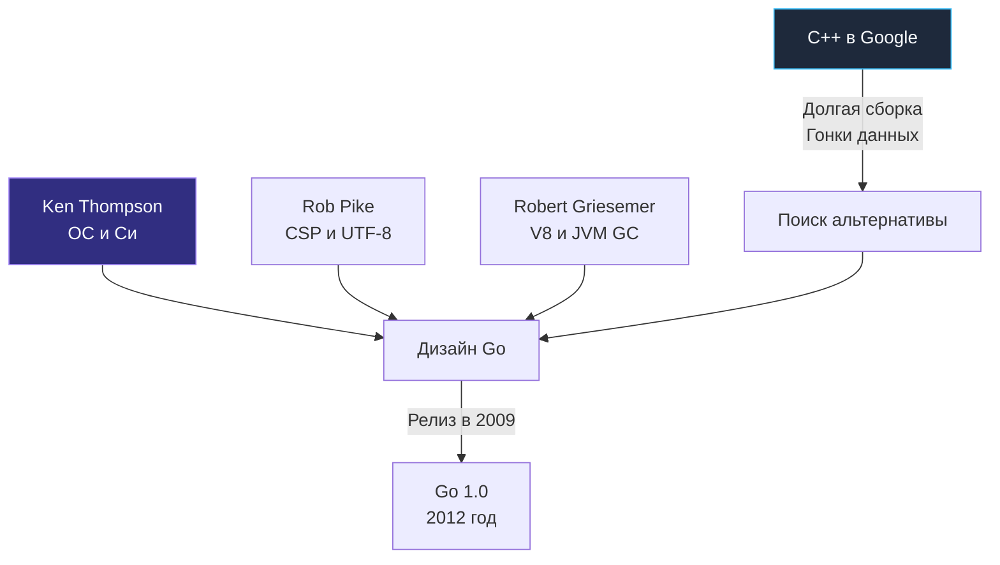

## 45 минут, которые изменили бэкенд-разработку

> *«Управление сложностью — вот суть программирования».*    
> — Брайан Керниган

Существует известная история (которая является чистейшей правдой), что замысел языка Go родился осенним днем 2007 года в калифорнийском офисе Google в Маунтин-Вью. Три выдающихся системных инженера — Роб Пайк (Rob Pike), Роберт Гризмер (Robert Griesemer) и Кен Томпсон (Ken Thompson) — запустили сборку гигантского серверного проекта на C++ и уселись ждать. Билд длился ровно 45 минут.

В то же самое время комитет по стандартизации C++ активно обсуждал черновик стандарта C++0x (будущего C++11). В язык планировалось добавить еще десятки новых, изощренных возможностей: rvalue references, сложные шаблоны с переменным числом аргументов, лямбды и новые правила вывода типов.

Глядя на ползущую строку компиляции, три ветерана задали себе неудобный вопрос: неужели будущее вычислительных систем действительно должно выглядеть так? Язык C++ создавался в 80-х годах для одноядерных компьютеров. С тех пор он непрерывно обрастал новыми фичами, время сборки увеличивалось экспоненциально из-за заголовочных файлов, а сложность управления памятью в многопоточной среде приводила к бесконечным багам. 

Им не нужен был язык с бóльшим количеством возможностей. Им нужен был язык с **меньшим** количеством возможностей, но с феноменально быстрой компиляцией, встроенной поддержкой многоядерности и строгим фокусом на продуктивность реального инженера.

Чтобы понять, почему Go получился именно таким, нужно посмотреть на бэкграунд его создателей. Это не случайные люди, а титаны индустрии, определившие облик современных операционных систем и компиляторов.

---

## Отцы-основатели и их влияние на архитектуру языка

Уникальный характер Go объясняется тем, что за его созданием стояли люди из легендарной исследовательской лаборатории **Bell Labs** (колыбели UNIX, языка C и транзисторов), объединившие усилия с ведущим экспертом по современным виртуальным машинам.

### 1. Кен Томпсон (Ken Thompson)
**Кто он:** Легенда мировой информатики. Соавтор операционной системы UNIX (вместе с Деннисом Ритчи). Создатель языка B (прямого предшественника C). Человек, написавший регулярные выражения для текстового редактора `ed`, шахматную машину Belle и кодировку UTF-8 (вместе с Робом Пайком). Человек, чьи инженерные решения лежат в основе работы с файловыми системами и процессами в любом современном Linux.

**Его влияние на Go:**
*   **Синтаксис и прагматизм:** Go унаследовал свой лаконичный C-подобный синтаксис (фигурные скобки, указатели, структуры) во многом благодаря Томпсону. Он хотел создать "улучшенный C" для XXI века — без рудиментов препроцессора и устаревших соглашений.
*   **Отношение к указателям:** В Go есть указатели для передачи ссылок на память (что критично для производительности), но **категорически отсутствует адресная арифметика** (нельзя сделать `ptr++`). Это решение одним ударом ликвидировало львиную долю уязвимостей, связанных с выходом за границы буфера (buffer overflow) и повреждением стека, терзавших мир C/C++ десятилетиями.
*   **Быстрая компиляция:** Архитектура пакетов и парсинга исходников в Go спроектирована так, чтобы компилятору никогда не приходилось читать один и тот же файл дважды.

### 2. Роб Пайк (Rob Pike)
**Кто он:** Ближайший соратник Кена Томпсона по Bell Labs. Архитектор распределенных операционных систем Plan 9 и Inferno, создатель графических терминалов Blit. Соавтор UTF-8. В 80-х и 90-х годах Пайк вел передовые исследования в области языков для конкурентного программирования (Newsqueak, Squeak, Alef).

**Его влияние на Go:**
*   **Concurrency (Конкурентность):** Именно Пайк принес в Go математическую модель CSP (Communicating Sequential Processes, разработанную Тони Хоаром). Вместо разделения памяти и использования тяжелых мьютексов, Пайк реализовал концепцию горутин (легковесных потоков) и каналов (очередей типизированных сообщений). Подробнее мы разберем это в [[24. Concurrency Is Not Parallelism. Философия конкурентности в Go]].
*   **Форматирование кода:** Пайк ненавидел бесконечные споры о расстановке фигурных скобок и пробелов. Поэтому вместе с языком родился инструмент `gofmt`. Форматирование кода перестало быть вопросом вкуса и стало частью компилятора.
*   **Строки:** Нативная поддержка UTF-8 «из коробки» (где исходный код всегда UTF-8, а строки — это неизменяемые массивы байт) — это прямое следствие того, что создатели языка сами когда-то придумали UTF-8 за столиком кафе в Нью-Джерси.

### 3. Роберт Гризмер (Robert Griesemer)
**Кто он:** Доктор компьютерных наук, ученик создателя Паскаля Никлауса Вирта (ETH Zurich). Ведущий мировой эксперт по компиляторам и виртуальным машинам. Работал над высокопроизводительным движком V8 (JavaScript) для Google Chrome и виртуальной машиной Java HotSpot.

**Его влияние на Go:**
*   **Garbage Collector (GC):** Несмотря на сильные C-корни, создатели поняли, что язык для массового и конкурентного бэкенда **обязан** иметь сборщик мусора. Гризмер принес экспертизу в построении высокопроизводительных рантаймов.
*   **Парсер и AST:** Гризмер написал первую версию парсера Go и помог спроектировать язык таким образом, чтобы он легко анализировался машинами (отсюда отсутствие сложных макросов и предсказуемость грамматики).

> [!info] Под капотом: Почему Go не мог обойтись без сборщика мусора?
> Для программистов на C++ часто кажется кощунством наличие GC в "системном" языке. Но Гризмер и Пайк понимали важную вещь: **ручное управление памятью разрушает абстракцию конкурентности.**
> Если у вас есть объект, который передается через канал (channel) из одной горутины в другую, кто должен вызывать `free()`? Если использовать умные указатели (как `std::shared_ptr` в C++), то счетчики ссылок требуют атомарных операций процессора (Compare-And-Swap). В высоконагруженных многопоточных системах атомарные счетчики вызывают жесточайший **False Sharing** (инвалидацию кэш-линий L1/L2 процессора между ядрами), что убивает производительность.
> Интегрированный в рантайм Concurrent Mark-and-Sweep Garbage Collector в Go решает эту проблему: вы можете дешево выделять память (на стеке горутины или через быстрый локальный кэш логического процессора P — `mcache`), а рантайм сам уберет мусор асинхронно, минимизируя задержки.

---

## Смещение парадигмы: От академичности к инженерии

Go часто критикуют энтузиасты функционального программирования (за отсутствие развитой системы типов вроде монад) и ветераны ООП (за отсутствие наследования). 

Но создатели Go (особенно Роб Пайк) всегда подчеркивали: **Go проектировался не для Computer Science, а для Software Engineering.** 

Программирование — это когда один человек пишет программу. Инженерия (Software Engineering) — это когда код живет годами, разрабатывается сотнями людей, масштабируется на тысячи серверов, а требования бизнеса постоянно меняются. 

> [!tip] Собеседование
> **Вопрос:** Почему в Go так долго не было Generics (Обобщений), и почему создатели сопротивлялись их внедрению до версии 1.18?
> **Ответ:** Кен Томпсон и Роберт Гризмер изначально не включили дженерики в язык, потому что они нарушали базовые компромиссы. Любая реализация дженериков — это выбор из трех зол:
> 1. Медленная компиляция и раздувание бинарника из-за мономорфизации (как шаблоны в C++ или Rust).
> 2. Медленное исполнение из-за упаковки типов (boxing) и виртуальных вызовов (как в Java/C# с Type Erasure).
> 3. Усложнение синтаксиса и компилятора.
> Лишь спустя более 10 лет был найден алгоритм реализации дженериков (на базе GCShape / словарей типов), который устроил команду с точки зрения компромисса между временем компиляции и скоростью работы в рантайме.

Знание истории языка помогает понять, почему в нем нет "магических" макросов или неявных преобразований типов. Томпсон, Пайк и Гризмер строили инструмент для суровых реалий промышленной разработки бэкенда, где понятность кода и предсказуемость производительности важнее синтаксического сахара.

Чтобы лучше понять этот инженерный компромисс, в следующей статье мы детально разберем: [[3. Какие проблемы существующих языков пытался решить Go]].