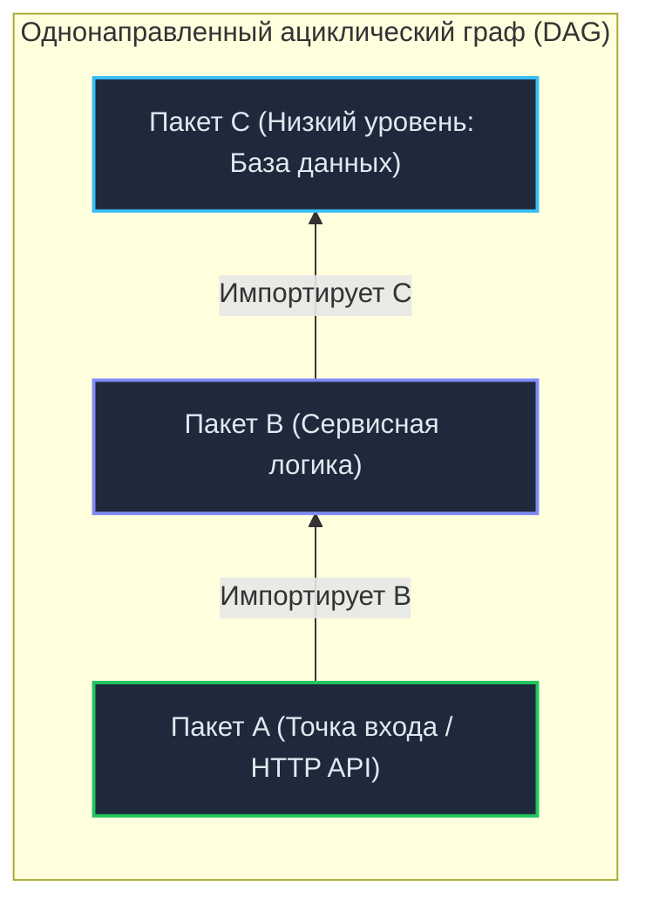
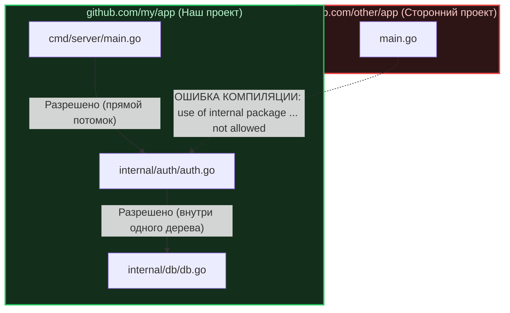

В традиционных объектно-ориентированных экосистемах (C#, Java, PHP) пространства имен (`Namespace` или `package` в терминологии Java) служат скорее синтаксическим сахаром для предотвращения коллизий имен. Вы можете свободно объявить циклическую связь: классы из `com.app.services` используют классы из `com.app.models`, а те в ответ вызывают методы из `com.app.services`. Компилятор или виртуальная машина послушно проглотят такое решение, даже если архитектурно оно превращает систему в монолитный клубок спагетти.

В Go правила игры кардинально иные. Здесь **директория на диске — это и есть пакет (`Package`)**. Пакет в Go является неделимым фундаментальным атомом: это главная единица компиляции, модульности, инкапсуляции и управления зависимостями. 

Попытка перенести шаблоны организации кода из других языков (например, классический трехзвенный MVC) — самая частая причина боли и разочарования новичков в Go. Разработчик раскладывает структуры по привычным папкам и тут же натыкается на жесткий вердикт компилятора: `import cycle not allowed`.

Давайте разберем, как компилятор Go работает с пакетами под капотом, почему циклические зависимости запрещены на физическом уровне и как устроен идиоматичный стандарт раскладки проекта.

---

## Под капотом: Пакет как единица компиляции (DAG)

Чтобы осознать строгость дизайна пакетов, важно вспомнить исторический контекст создания Go (см. [[3. Какие проблемы существующих языков пытался решить Go]]). Инженеры Bell Labs и Google стремились раз и навсегда устранить многочасовые циклы сборки гигантских C++ кодовых баз, где один и тот же заголовочный файл перепарсивался миллионы раз.

В Go компилятор работает не с разрозненными файлами, а со сборками пакетов. Вся структура зависимостей программы обязана представлять собой **Направленный ациклический граф (Directed Acyclic Graph, DAG)**.



> [!info] Под капотом: Экспортные данные и файлы `.a`
> Процесс компиляции в Go строго детерминирован и идет снизу вверх по графу:
> 1. Сначала компилятор собирает независимый базовый пакет `C`. Результат сборки вместе со сжатыми метаданными об экспортируемых типах и сигнатурах функций сохраняется во временный объектный архив `C.a` (файл архива Go).
> 2. Затем компилируется пакет `B`. Компилятор считывает исходные файлы `B` и готовый объектный файл `C.a`. В метаданных `B.a` компилятор фиксирует всё необходимое для вышестоящих слоев.
> 3. Когда очередь доходит до пакета `A`, компилятор читает исходники `A` и **только архив `B.a`**. Ему не требуется повторно обращаться к исходникам `C`, парсить синтаксические деревья или перепроверять типы — вся нужная информация уже запечена в интерфейсных метаданных `B.a`.
> 
> Благодаря этому компиляция проекта в Go имеет строго линейную сложность операций ввода-вывода (I/O).

Именно поэтому в Go **категорически запрещены циклические импорты (Import Cycles)**. Если пакет `A` ссылается на `B`, а пакет `B` прямо или косвенно импортирует `A`, построить DAG и скомпилировать объектные файлы снизу вверх математически невозможно. Компилятор немедленно обрывает процесс с ошибкой: `import cycle not allowed`.

---

## Ловушка: Паттерн MVC и «Пакеты-свалки»

Разработчики, приходящие из сред вроде Ruby on Rails, Django, Laravel или Spring, по инерции организуют проект по техническим слоям (`Layer-based packaging`):
* `models/` — все сущности и структуры данных системы;
* `controllers/` — все обработчики HTTP-запросов;
* `services/` — вся прикладная бизнес-логика.

**В Go такая организация — грубейший архитектурный антипаттерн.**

Представьте классический сценарий:
1. `controllers` импортирует `services`, чтобы запустить операцию регистрации.
2. `services` импортирует `models`, чтобы создать структуру `User`.
3. Внезапно разработчик решает реализовать в `models` метод хука `user.BeforeSave()`, которому для хеширования пароля требуется вызвать функцию из `services`.

В этот момент проект ломается: `services` ссылается на `models`, а `models` ссылается на `services`. Компилятор блокирует сборку. Попытка обойти это через костыли лишь множит хаос.

Вторая беда слоистого подхода — размытие ответственности и появление «мусорных» пакетов.

> [!tip] Собеседование
> **Вопрос:** Почему в Go-сообществе считается признаком плохого тона создание пакетов с именами `utils`, `common`, `helpers` или `models`?
> **Ответ:** Имя пакета в идиоматичном Go обязано отвечать на вопрос **«Что этот пакет предоставляет?»** (*What it provides*), а не «Что в него сложили?» (*What it contains*). Имя `utils` не несет никакой смысловой нагрузки — это классический пакет-свалка. Сегодня туда положат функцию форматирования строк, завтра — парсер JSON, а послезавтра — клиент для Redis. Пакет разрастается, грубо нарушает принцип единственной ответственности (`Single Responsibility Principle`) и неизбежно становится эпицентром циклических импортов. Вместо размытого `utils` создают специализированные узкие пакеты: `stringutil`, `jsonparser`, `redisclient`.

---

## Идиоматичная структура: Domain-Driven Packaging

Вместо механической группировки по технической роли файлов идиоматичный Go-код группируется по **предметным областям (Features / Domains)**:

```text
Плохо (Layer-based):             Идиоматично (Domain-driven):
├── controllers/                 ├── auth/
│   ├── billing_ctrl.go          │   ├── handler.go    # HTTP роуты и валидация
│   └── user_ctrl.go             │   ├── service.go    # Бизнес-логика авторизации
├── models/                      │   └── user.go       # Структура данных User
│   ├── billing.go               └── billing/
│   └── user.go                      ├── gateway.go    # Интеграция с платежным шлюзом
└── services/                        └── invoice.go    # Генерация счетов
    ├── billing_srv.go
    └── user_srv.go
```

В доменной структуре пакет `auth` полностью автономен. Если пакету `billing` необходимо проверить статус пользователя, он делает это не через прямое вторжение в чужие файлы, а через явный, узкий интерфейс (см. [[17. SOLID в мире Go. Что осталось, а что изменилось]]), сохраняя строгий однонаправленный поток зависимостей.

---

## Standard Project Layout: cmd, pkg и internal

Хотя спецификация языка Go не навязывает жестких стандартов расположения папок, в индустрии и крупных проектах (таких как Kubernetes, Docker, Helm) сформировался популярный шаблон — **Standard Go Project Layout** (при этом команда Go во главе с Рассом Коксом подчеркивает, что этот репозиторий не является официальным стандартом языка).

Этот шаблон базируется на трех опорных директориях:

### 1. `cmd/` (Точки входа)
Здесь располагаются файлы `main.go` для исполняемых бинарников. Для каждой утилиты создается изолированная поддиректория:
* `cmd/api-server/main.go` — основной HTTP/gRPC сервер;
* `cmd/cli-tool/main.go` — утилита командной строки для администратора или миграций.

В директории `cmd/` **не должно быть бизнес-логики**. Ее задача предельно утилитарна: прочитать флаги и переменные окружения, инициализировать логгер и пул соединений с базой, собрать граф зависимостей (Dependency Injection) и запустить приложение.

### 2. `pkg/` (Публичные библиотеки — опционально)
Историческая директория для библиотечного кода, предназначенного для внешнего импорта (например, `pkg/client/`). В чистых Go-библиотеках пакеты размещают прямо в корне репозитория без лишней вложенности `pkg/`, а в сервисах часто обходятся плоской структурой доменов.

### 3. `internal/` (Магия инкапсуляции компилятора)
Это единственный каталог, чье поведение защищено и принудительно проверяется самим компилятором Go. В языке отсутствуют модификаторы видимости на уровне модулей вроде `protected package`. Любой пакет в публичном Git-репозитории технически доступен для импорта сторонними разработчиками.

Чтобы дать авторам контроль над публичным контрактом, создатели языка встроили в компилятор строгое правило: **код внутри любой папки с именем `internal/` доступен для импорта только тем пакетам, которые расположены в дереве каталогов выше родительской директории этого `internal/`.**



Если программист из другой команды попытается написать в своем коде:
```go
import "github.com/my/app/internal/auth"
```
Компилятор Go откажется собирать их проект: `use of internal package ... not allowed`.

Именно поэтому более 90% прикладного кода микросервисов размещают в `internal/`. Это дает полную свободу рефакторинга: вы можете изменять типы, удалять функции и переписывать логику, зная, что никто за пределами вашего репозитория не завязан на ваши приватные структуры.

---

## Как избежать циклических импортов на практике?

Если при сборке вы получили `import cycle not allowed`, компилятор сообщает об архитектурной ошибке связности. Для устранения цикла в Go используют три проверенных приема:

1. **Слияние (Merge):** Если пакеты `A` и `B` настолько тесно переплетены, что не могут функционировать порознь, их разделение было искусственным. Объедините их в единый логический пакет `AB`.
2. **Выделение общего фундамента в `C`:** Если пакет `A` и пакет `B` циклически ссылаются друг на друга только из-за общей структуры данных или констант, вынесите эту сущность на нижний уровень — в пакет `C`. Теперь и `A`, и `B` импортируют `C`, а цикл исчезает.
3. **Инверсия зависимостей через интерфейс:** Если модуль бизнес-логики `A` должен вызывать низкоуровневые операции пакета `B`, но пакет `B` обязан отправлять оповещения в `A`, разорвите прямую связь. Объявите в пакете `B` локальный интерфейс:
   ```go
   type Logger interface {
       Log(msg string)
   }
   ```
   Пакет `B` перестает знать о существовании пакета `A`. В момент инициализации в `main.go` конкретная реализация из `A` передается в `B` через конструктор.

---

## Резюме

1. **Пакеты — это физическая граница компиляции.** Зависимости между пакетами обязаны формировать строгий направленный ациклический граф (DAG). Никаких циклических импортов.
2. **Группируйте код по предметным доменам (`auth`, `billing`, `payment`, `order`), а не по техническим слоям (`models`, `controllers`).** Это предотвращает циклические импорты и концентрирует логику фичи в одном месте.
3. **Откажитесь от пакетов-свалок (`utils`, `common`).** Давайте пакетам имена, точно отвечающие на вопрос, какую функциональность они предоставляют (`stringutil`, `redisclient`).
4. **Защищайте доменную логику директорией `internal/`.** Компилятор позаботится о том, чтобы внутренности вашего сервиса не стали чьей-то внешней зависимостью.

Пакеты надежно инкапсулируют логику на макроуровне директорий. Но как регулировать доступ к данным внутри самого пакета? Почему в языке Go нет привычных ключевых слов `public`, `private` и `protected`?

Об изящном, минималистичном решении этой задачи через регистр первой буквы идентификатора читайте в следующей статье: [[23. Public и Private через экспортируемость имен]].
