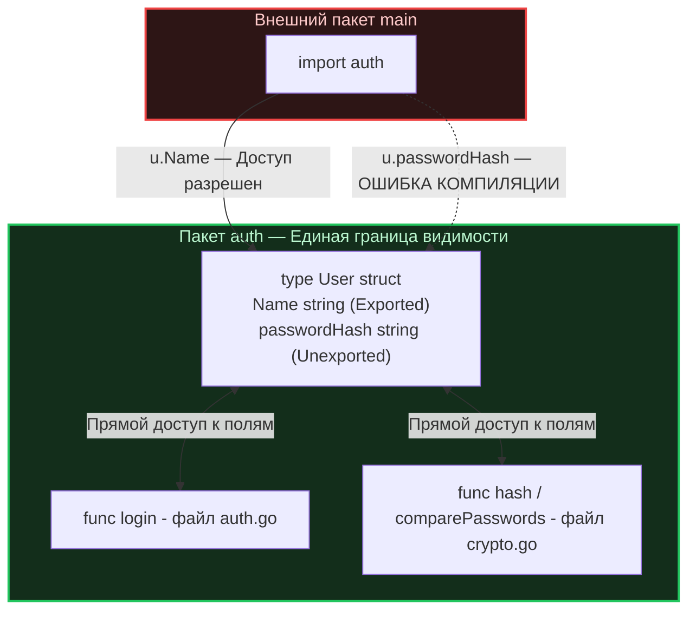

Любой разработчик, приходящий в Go из языков с развитой иерархией доступа (Java, C++, C#, PHP), неизбежно задается вопросом: *«А где же привычные ключевые слова `public`, `private` и `protected`?»*.

В классических объектных языках управление областью видимости — это целая наука. В Java, к примеру, существует четыре градации доступа: видимость для всех (`public`), только для класса (`private`), для класса и его наследников (`protected`), а также режим по умолчанию для текущего пакета (`package-private`). 

Подобная гибкость создает огромную ментальную нагрузку при чтении кода. Читая вызов `user.save()`, вы не можете сказать, откуда доступен этот метод, не открыв определение класса `User`.

Создатели Go решили эту проблему с присущим им радикальным прагматизмом, избавившись от ключевых слов вообще. В Go видимость (инкапсуляция) определяется исключительно **регистром первой буквы идентификатора**.

---

## Правило первой буквы: Экспортируемое и Неэкспортируемое

В Go не принято использовать термины «публичный» или «приватный». В спецификации языка и профессиональном сообществе принята строгая терминология — **Экспортируемое (Exported)** и **Неэкспортируемое (Unexported)** имя:

* **Начинается с заглавной буквы (в спецификации Go — категория Unicode Lu, обычно латинские буквы `A-Z`):** Идентификатор экспортируется. Он открыт и доступен любому внешнему пакету, который импортирует ваш модуль.  
  *(Примеры: `User`, `ServeHTTP`, `DB`, `ErrNotFound`)*
* **Начинается со строчной буквы (категории Unicode Ll/Lm/Lo или `a-z`) либо знака подчеркивания (`_`):** Идентификатор не экспортируется. Он надежно инкапсулирован и виден **только внутри своего пакета**.  
  *(Примеры: `user`, `calculateHash`, `dbConnection`)*

```
  Имя идентификатора:
      User        ──> Заглавная буква 'U' (Unicode Lu) ──> Экспортируемое (Public API)
      password    ──> Строчная буква 'p'               ──> Неэкспортируемое (Private to Package)
```

> [!info] Под капотом: Компилятор и спецификация Unicode Lu
> Отказ от ключевых слов `public/private` — это не только забота о локальности понимания кода человеком, но и оптимизация лексического анализатора (`Lexer/Scanner`) компилятора Go.
> 
> По спецификации Go экспортируемым является идентификатор, начинающийся с заглавной буквы Unicode (категория `Lu`). В компиляторе Go (`cmd/compile/internal/types`) и стандартном пакете `go/token` для подавляющего большинства ASCII-символов применяется молниеносный fast-path:
> ```go
> if r := name[0]; r < utf8.RuneSelf {
>     return 'A' <= r && r <= 'Z'
> }
> ```
> И лишь при обнаружении многобайтового UTF-8 символа вызывается декодер `unicode.IsUpper`. В традиционных языках парсер вынужден поддерживать сложный автомат состояний, отслеживая модификаторы доступа перед ключевыми словами `class`, `fn`, `var` и полями структур. В Go проверка первого символа требует считанных машинных инструкций, внося вклад в скорость компиляции.

---

## Ловушка мышления: Границы видимости

Ключевой ментальный капкан для программистов с опытом в ООП — предположение, что неэкспортируемое поле (начинающееся со строчной буквы) изолировано *внутри структуры* (подобно `private` полям в классах C++ или Java).

**В Go фундаментальной границей инкапсуляции выступает Пакет (Package), а не структура.**

Если внутри пакета `auth` объявлена структура `User` с неэкспортируемым полем `passwordHash`, то абсолютно любая функция в **любом файле** этого же пакета `auth` имеет неограниченный доступ на чтение и изменение этого поля:

```go
package auth // Граница инкапсуляции начинается здесь

type User struct {
    Name         string // Экспортируется: доступно из любого внешнего пакета
    passwordHash string // Не экспортируется: доступно только внутри пакета auth
}

// Функция comparePasswords может лежать в файле crypto.go того же пакета auth.
// Она имеет ПОЛНЫЙ доступ к скрытым полям структуры User без всяких геттеров!
func comparePasswords(u *User, input string) bool {
    return u.passwordHash == hash(input)
}
```



Такое устройство языка позволяет естественным образом разбивать сложную бизнес-логику одной сущности на несколько файлов (например, `user.go`, `user_validation.go`, `user_repository.go`), не создавая искусственных публичных геттеров/сеттеров только ради того, чтобы эти файлы могли общаться друг с другом.

---

## Почему в Go нет protected?

Модификатор `protected` в ООП исторически создавался для того, чтобы класс-потомок мог обращаться к внутреннему состоянию класса-предка в обход остального внешнего мира.

Но, как мы выяснили в лекции [[12. Composition Over Inheritance. Почему в Go нет наследования]], в Go иерархии классов отсутствуют как класс — язык опирается на композицию и встраивание. Соответственно, концепция `protected` здесь полностью лишена физического смысла. Вы либо находитесь внутри пакета (и обладаете полным доступом к деталям реализации), либо смотрите на него снаружи через призму экспортируемого API.

---

## Mechanical Sympathy: Рефлексия и сериализация в JSON

Правило регистра имени глубоко пронизывает рантайм Go, и именно на этом стыке новички чаще всего совершают досадные ошибки при сериализации данных в JSON, XML или при сохранении в базу через ORM.

Библиотеки сериализации (такие как стандартный пакет `encoding/json` или драйверы баз данных) исследуют структуры во время выполнения с помощью механизма рефлексии (`reflect`). Но в рантайме Go действует строгое правило безопасности памяти: **пакет `reflect`, вызванный сторонним кодом, не имеет права читать значения неэкспортируемых полей и изменять их.**

### Классический баг при работе с JSON

```go
package main

import (
    "encoding/json"
    "fmt"
)

type Config struct {
    host string `json:"host"` // ❌ ОШИБКА: имя начинается со строчной буквы!
    Port int    `json:"port"` // ✅ ПРАВИЛЬНО: имя начинается с заглавной буквы
}

func main() {
    c := Config{host: "localhost", Port: 8080}
    bytes, _ := json.Marshal(c)
    fmt.Println(string(bytes)) // Вывод: {"port":8080}
}
```

Поле `host` было тихо проигнорировано упаковщиком JSON! Пакет `encoding/json` лежит за пределами вашего пакета `main`, поэтому он видит поле `host` через рефлексию, но метод `reflect.Value.CanSet()` для него возвращает `false`.

> [!important] Железное правило
> Любое поле структуры, которое должно сериализоваться в JSON/XML, передаваться через gRPC или сохраняться в базе данных через ORM (например, GORM), **обязано начинаться с заглавной буквы**.

---

## Ловушка: Встраивание неэкспортируемого типа (Gotcha)

В лекции [[13. Embedding. Как в Go реализуется композиция]] мы детально разбирали встраивание типов. Что произойдет, если мы встроим неэкспортируемую структуру в экспортируемую?

> [!tip] Собеседование
> **Вопрос:** Если мы встроим неэкспортируемую структуру с экспортируемыми методами в публичную экспортируемую структуру, будут ли эти методы доступны вызывающему коду из внешнего пакета?
> **Ответ:** Да! Это одна из самых элегантных архитектурных особенностей Go.  
> Компилятор Go автоматически продвигает (`promotes`) методы встроенного типа на уровень внешней структуры. При этом компилятор анализирует экспортируемость **самого метода**, а не структуры, в которой он был изначально объявлен.

Проследим это поведение на практическом примере:

```go
package internal

// Неэкспортируемая вспомогательная структура
type logger struct{}

// Экспортируемый метод
func (l *logger) Log(msg string) {
    // логика записи...
}

// Экспортируемая структура, доступная для внешних пакетов
type Server struct {
    logger // Встраиваем неэкспортируемый тип
}

func NewServer() *Server {
    return &Server{logger: logger{}}
}
```

Теперь посмотрим, как ведет себя внешний пакет `main`:

```go
package main

import "myproject/internal"

func main() {
    srv := internal.NewServer()

    // srv.logger.Log("тест") // ❌ Ошибка компиляции: поле logger не экспортируется!
    
    srv.Log("Успешно!")       // ✅ РАБОТАЕТ! Метод Log продвинут и стал публичным API Server
}
```

Этот паттерн часто применяют опытные инженеры для сокрытия внутреннего состояния. Вы прячете поля и инфраструктурную обвязку внутри неэкспортируемой структуры `logger`, но делаете ее полезные методы частью открытого интерфейса `Server`.

---

## Архитектурные следствия: Геттеры и Сеттеры

В корпоративном мире Java/C# создание геттеров и сеттеров для каждого приватного поля структуры возведено в индустриальный стандарт (`getName()`, `setName()`). 

В идиоматичном Go, руководствуясь принципом простоты (см. [[5. Философия Go. Простота, читаемость и прагматизм]]), избегают бессмысленного шаблонного кода. Если поле структуры не содержит сложной логики валидации при записи, его **нужно делать экспортируемым напрямую**.

* **Многословный антипаттерн (Java-стиль в Go):**
  ```go
  type User struct { 
      name string 
  }
  func (u *User) GetName() string { return u.name }
  func (u *User) SetName(n string) { u.name = n }
  ```
* **Идиоматичный Go:**
  ```go
  type User struct { 
      Name string 
  }
  ```

Если же геттер действительно необходим (например, значение вычисляется на лету или защищено от гонок мьютексом), в Go **никогда не используют префикс `Get`**. 

Идиоматичное имя геттера в Go совпадает с именем поля, но пишется с заглавной буквы:

```go
type Counter struct {
    mu    sync.Mutex
    count int // Защищенное неэкспортируемое поле
}

// Идиоматичный геттер: называется просто Count(), а не GetCount()
func (c *Counter) Count() int {
    c.mu.Lock()
    defer c.mu.Unlock()
    return c.count
}
```

---

## Резюме

1. **Локальность рассуждений (Local Reasoning):** Регистр первой буквы — гениальное решение для читаемости. Вам достаточно взглянуть на `variable.CallMethod()`, чтобы понять, является ли `CallMethod` частью публичного API (контракта) чужого пакета, или это внутренняя утилита.
2. **Инкапсуляция на уровне пакета:** В Go файлы внутри одной директории полностью доверяют друг другу и имеют доступ ко всему скрытому состоянию.
3. **Осторожно с сериализацией:** Всегда экспортируйте поля, которые должны обрабатываться стандартными библиотеками вроде `encoding/json` или базами данных.
4. **Лаконичность контрактов:** Откажитесь от пустых геттеров с префиксом `Get`. Открывайте поля напрямую, а если метод доступа необходим — именуйте его чистым существительным (`Count()`).

---

Этим материалом мы завершаем большой архитектурный блок, посвященный пакетам, структурам, интерфейсам и философии простоты. Вы научились мыслить структурами, интерфейсами-уточками и правильно управлять границами пакетов.

Но Go никогда не стал бы главным языком современного облачного бэкенда, если бы не его главная киллер-фича, ради которой его выбирают для бэкенда — встроенная многопоточность. Пришло время переключить мозг с проектирования абстракций на управление ресурсами CPU. Мы начинаем погружение в мир планировщиков и легких потоков со статьи: [[24. Concurrency Is Not Parallelism. Философия конкурентности в Go]].
