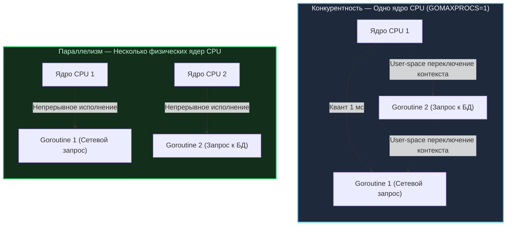
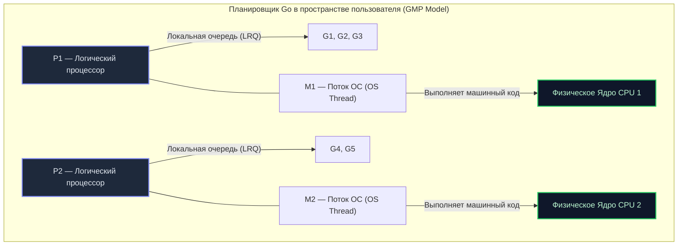

Переход в мир Go из окружения синхронного PHP, классического однопоточного Python или тяжеловесных потоков Java нередко сопровождается фундаментальной путаницей понятий. 

В 2012 году Роб Пайк (соавтор Go) выступил на конференции Heroku со знаменитым докладом, тезис которого навсегда вошел в золотой фонд инженерного фольклора языка (см. [[8. Go Proverbs. Практический смысл известных цитат]]): **«Concurrency is not Parallelism» (Конкурентность — это не параллелизм)**.

Многие разработчики ошибочно используют эти слова как синонимы. Но в проектировании распределенных и высоконагруженных систем это две принципиально разные плоскости. Непонимание грани между ними порождает грубейшие архитектурные просчеты, скрытые утечки памяти и парадоксальные ситуации, когда программа после наивной попытки «распараллелить» начинает работать значительно медленнее, чем ее последовательный аналог.

Давайте разберем эти концепции на трех фундаментальных уровнях: на уровне проектирования кода, на уровне системного планировщика ОС и на уровне кремниевых ядер процессора.

---

## Определение понятий: Суслики и тележки

Роб Пайк сформулировал различие предельно емко и точно:
* **Конкурентность (Concurrency)** — это свойство **дизайна и архитектуры программы**. Это умение программы быть структурированной так, чтобы **справляться** с множеством задач одновременно.
* **Параллелизм (Parallelism)** — это свойство **аппаратного обеспечения (железа)**. Это способность физического процессора **выполнять** несколько инструкций одновременно в один и тот же квант времени.

### Наглядная физическая модель Роба Пайка
Представьте команду сусликов, которым поручено сжечь гору старых справочников по C++ в печи:
1. **Последовательный подход:** Один суслик берет книгу из кучи, кладет в тележку, катит к печи, сжигает, возвращается пешком за следующей.
2. **Конкурентный дизайн:** Мы разбиваем процесс на автономные роли: первый суслик непрерывно набивает тележки, второй катит их по рельсам к печи, третий суслик сжигает книги, четвертый возвращает пустые тележки.  
   *Заметьте:* это конкурентная декомпозиция задачи. Если на стройке работает всего **один суслик**, он будет по очереди переключаться между ролями (загрузить -> прокатить -> сжечь). Программа конкурентна, но параллелизма нет.
3. **Параллелизм:** Мы выделяем под эту конкурентную схему **четырех реальных физических сусликов** (4 ядра CPU). Теперь каждый рабочий непрерывно выполняет свою фазу одновременно с остальными. Производительность возрастает кратно!



Вы можете написать конкурентную программу с тысячами горутин (`go func()`), запустить ее на одноядерном процессоре или принудительно ограничить планировщик переменной окружения `GOMAXPROCS=1` — и она будет работать безупречно. Горутины будут передавать управление по очереди при операциях ввода-вывода. Программа будет образцово конкурентной, но **не параллельной**.

И наоборот: вы можете написать утилиту, которая использует SIMD-инструкции процессора (векторизацию) для одновременного сложения восьми 64-битных чисел за один такт. Исходный код на ассемблере или C выглядит строго последовательным циклом, но физический кремний выполняет операцию аппаратно параллельно.

---

## Под капотом: Как Go делает конкурентность эффективной (Модель G-M-P)

В классических языках (Java, C++, C#) конкурентность долгое время строилась исключительно поверх тяжелых потоков операционной системы (OS Threads). Инструкция создания потока в Java `new Thread()` напрямую транслировалась в системный вызов ядра Linux (например, `clone`).

Как мы подробно обсуждали в лекции [[3. Какие проблемы существующих языков пытался решить Go]], потоки ОС чудовищно дороги:
* Фиксированный стек потока требует от **1 МБ** памяти ядра;
* Переключение контекста требует перехода процессора из кольца пользователя (Ring 3) в кольцо ядра (Ring 0);
* Тратятся тысячи наносекунд на сохранение полного набора аппаратных регистров, инвалидацию конвейера и сброс таблиц страниц.

Go устраняет это бутылочное горлышко, перенося диспетчеризацию задач в **User Space (пространство пользователя)** с помощью собственного рантайм-планировщика и знаменитой модели **`G-M-P`**.



В исходниках рантайма Go ключевую роль играют три фундаментальные структуры:
1. **G (Goroutine)** — внутренняя структура `g`. Содержит дескриптор горутины: динамический стек (начинающийся всего с **2 КБ**), текущий статус (`_Grunnable`, `_Grunning`, `_Gwaiting`) и счетчик команд (`PC` — Instruction Pointer), указывающий на точку паузы.
2. **M (Machine)** — структура `m`. Это абстракция над реальным потоком ОС (OS Thread). Структура `M` не знает ничего о логике приложения — она просто выполняет машинный код на физическом ядре CPU.
3. **P (Processor)** — структура `p`. Логический контекст выполнения («право на вычисления»). Каждый `P` владеет локальной очередью готовых к запуску горутин — **Local Run Queue (LRQ)**. Количество экземпляров `P` строго ограничено значением переменной `GOMAXPROCS` (по умолчанию равно количеству доступных логических ядер процессора).

Чтобы горутина ожила и начала исполняться, поток ОС `M` должен привязать к себе процессор `P` и извлечь готовую задачу `G` из его локальной очереди.

---

## Mechanical Sympathy: Магия переключения (Context Switch)

Представьте реальный боевой сценарий: горутина `G1` отправляет SQL-запрос в PostgreSQL по сетевому сокету. Сеть отвечает с задержкой в 5 миллисекунд.

### Сравнение поведения сред исполнения

```
В классических средах (Java / C++):
Поток ОС (1 МБ) ──> Системный вызов recv() ──> БЛОКИРОВКА ЯДРА!
Переход Ring 0 ──> Сохранение регистров CPU ──> Планировщик ОС ──> Промахи кэша L1/L2 (~1-2 микросекунды)

В среде Go:
Горутина G1 ──> Чтение сокета ──> Netpoller ──> G1 переходит в _Gwaiting
Поток ОС M НЕ блокируется! ──> Забирает G2 из очереди P ──> Исполнение продолжается (~15 наносекунд)
```

В традиционной архитектуре блокировка потока ОС вынуждает ядро операционной системы вмешиваться: сохранять полный контекст регистров, переключать стеки ядра и отдавать управление планировщику ОС для выбора другого тяжелого потока. Это обходится в тысячи наносекунд и вытесняет рабочие данные из процессорных кэшей L1/L2.

В Go сетевой ввод-вывод интегрирован со встроенным сетевым поллером (`netpoller`, использующим `epoll` в Linux). Рантайм перехватывает ожидание:
1. Статус горутины `G1` переводится в `_Gwaiting` (`Gwaiting`).
2. В структуру `g` сохраняются лишь два ключевых регистра — счетчик команд (`PC`) и указатель стека (`SP`).
3. Поток операционной системы `M` **не блокируется и не уходит в сон**. Он мгновенно достает из локальной очереди `P` следующую горутину `G2` и продолжает непрерывное исполнение инструкций.

Все переключение совершается целиком в User Space без единого системного вызова ядра. Аппаратный процессор даже не замечает подмены: он молотит машинные инструкции без сброса кэша инструкций и данных. Переключение горутины в Go обходится всего в **10–15 наносекунд** — это на два порядка дешевле смены контекста потока ОС!

> [!tip] Собеседование
> **Вопрос:** Вы написали программу, которая складывает числа в цикле от 1 до 100 миллиардов. Сделает ли использование 10 000 горутин эту программу быстрее на одноядерном процессоре (`GOMAXPROCS=1`)?
> **Ответ:** Нет, программа станет заметно **медленнее**.  
> Числодробление — это чистая `CPU-bound` задача. На единственном физическом ядре аппаратный параллелизм невозможен в принципе. Если вы разделите непрерывный цикл на 10 000 горутин, процессору придется тратить дополнительные такты на служебное переключение контекста между ними (хоть оно в Go и предельно дешево, но ненулевое).  
> Конкурентность без параллелизма радикально ускоряет только **I/O-bound** задачи (когда программа простаивает в ожидании диска, сети или ответа базы данных). Задачи класса `CPU-bound` ускоряются исключительно **параллелизмом** — то есть физическим увеличением количества процессорных ядер.

---

## Почему Go форсирует конкурентность?

Когда вы пишете лаконичную инструкцию:
```go
go processOrder(order)
```
Вы не приказываете рантайму: *«немедленно создай поток ядра и выполни это параллельно»*.  
Вы декларируете: *«вот изолированная, независимая единица бизнес-логики; я поручаю планировщику выполнить ее асинхронно, наилучшим для текущего оборудования образом»*.

Вы делегируете принятие аппаратно-зависимых решений умному рантайму Go:
* Если бинарник запущен на миниатюрном одноплатнике Raspberry Pi с 1 ядром, планировщик будет жонглировать горутинами через User Space, сохраняя максимальную отзывчивость системы на едином ядре.
* Если тот же самый скомпилированный бинарник развернут на серверном узле с 64 ядрами, рантайм автоматически поднимет 64 структуры `P` и задействует 64 потока `M`, обеспечив мощный 64-поточный физический параллелизм без исправления единой строчки прикладного кода.

---

## Ловушка: Гонки данных (Data Races)

Однако свобода создания сотен тысяч горутин несет в себе фундаментальную опасность. Что произойдет, если две независимые горутины `G1` и `G2`, исполняющиеся параллельно на разных ядрах процессора, попытаются одновременно обновить общую переменную `count`?

На уровне кремния процессорные ядра не имеют прямой непрерывной связи. Каждое ядро затягивает значение переменной `count` в свой локальный L1-кэш, инкрементирует число в регистре и записывает результат обратно в память. Одно ядро неизбежно перезапишет работу другого. Возникает классическая гонка данных (`Data Races`) и потерянные обновления (`Lost Update`).

Поскольку конкурентность — это архитектурное свойство системы, язык программирования обязан дать инженеру надежный, математически выверенный инструмент коммуникации между параллельными ветвями исполнения.

---

## Резюме

1. **Конкурентность** — это структура и дизайн. Разбиение задачи на независимые, асинхронно исполняемые потоки вычислений.
2. **Параллелизм** — это аппаратное свойство. Физическое синхронное исполнение машинных команд на нескольких кремниевых ядрах в один момент времени.
3. **Модель `G-M-P`** позволяет Go миллисекундные задачи I/O оркестровать через микросекундные переключения в пространстве пользователя, не нагружая ядро Linux.
4. **Легковесность горутин (2 КБ стартового стека)** позволяет держать сотни тысяч соединений на типовом сервере, обходясь единицами потоков операционной системы.

Мы разобрались, как планировщик организует независимые горутины. Но как эти горутины должны обмениваться результатами своей работы, не устраивая кровавую бойню за общую память? 

В большинстве языков ответ один — вешать везде мьютексы. Но создатели Go предложили совершенно иную парадигму, опирающуюся на труды Тони Хоара. Об этом — в следующей статье: [[25. Share Memory By Communicating. Почему каналы важнее Mutex]].
