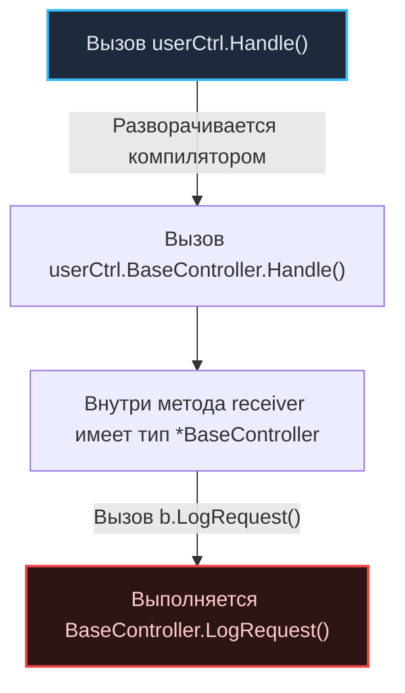

Переход в Go из языков с классической объектно-ориентированной парадигмой (Java, C#, PHP) — это не просто освоение нового синтаксиса и компилятора. Это фундаментальная перестройка инженерного мышления. 

Как однажды иронично заметили ветераны Bell Labs, программист на любом языке сначала пишет на Фортране. Точно так же разработчик с десятилетним опытом в Enterprise по инерции пишет на Java, используя синтаксис Go. 

В результате на свет появляются гигантские многоуровневые иерархии, указатели на каждый примитив и сотни пустых файлов. Программа начинает потреблять неожиданно много памяти, нагружает сборщик мусора и работает медленнее, чем могла бы.

В этой статье мы подробно разберем пять самых распространенных паттернов из классического мира ООП, которые в экосистеме Go превращаются в разрушительные антипаттерны, и посмотрим, как они влияют на рантайм и процессорное железо.

---

## 1. Преждевременные интерфейсы (IUserService и UserServiceImpl)

В классическом корпоративном ООП проектирование принято вести «сверху вниз»: сначала архитектор чертит иерархию интерфейсов, а затем программисты пишут их реализации. Практика, при которой на каждую бизнес-структуру заводится собственный интерфейс с префиксом `I...` или суффиксом `...Impl` (даже если реализация в проекте ровно одна), в Go считается грубейшей архитектурной ошибкой.

### Антипаттерн: Интерфейс рядом с реализацией
Разработчик объявляет интерфейс в том же пакете и возвращает его из конструктора:

```go
// ПЛОХО: Интерфейс объявлен там же, где и реализация, дублируя ее методы
type UserService interface {
    CreateUser(name string) error
}

type userServiceImpl struct {
    db *sql.DB
}

func NewUserService(db *sql.DB) UserService {
    return &userServiceImpl{db: db}
}
```

### Идиоматичный подход (Go Way)
В Go интерфейсы описывают не то, что компонент *предоставляет*, а то, какие минимальные требования к поведению предъявляет вызывающая сторона. 

Интерфейс обязан объявляться на стороне **потребителя** (`Consumer`), а не поставщика. Это фундаментальное преимущество неявной типизации, подробно рассмотренной в лекции [[15. Duck Typing и неявная реализация интерфейсов]]. Пакет должен экспортировать конкретные структуры (`*UserService`), а клиентский код сам объявит локальный однометодочный интерфейс в тот момент, когда ему потребуется подставить тестовый мок.

> [!info] Под капотом: Цена интерфейса
> Помимо загромождения исходников, возврат интерфейсов несет скрытые издержки в рантайме. 
> 
> Когда функция возвращает конкретный указатель `*userServiceImpl`, компилятор Go заранее знает точный физический размер структуры и адреса всех ее методов. Это позволяет оптимизатору применить **Inlining** — встроить тело метода непосредственно в точку вызова, полностью исключив инструкцию перехода `CALL` и сохранение регистров на стек.
> 
> Когда вы возвращаете интерфейс, рантайм конструирует двухсловную структуру `iface` (состоящую из двух указателей: `tab` на таблицу типов и методов `itab` и `data` на сами данные в памяти). Вызов метода через интерфейс превращается в косвенный вызов — **Dynamic Dispatch**. Компилятор принципиально не способен заинлайнить такой вызов, а аппаратный предсказатель ветвлений процессора (`Branch Predictor`) теряет точность, снижая пропускную способность конвейера инструкций.

---

## 2. Иллюзия наследования через Embedding

Как мы выяснили в лекции [[12. Composition Over Inheritance. Почему в Go нет наследования]], создатели Go сознательно отказались от иерархий наследования в пользу чистой композиции. Однако синтаксис анонимного встраивания структур (`Embedding`) внешне напоминает наследование, порождая у новичков опасную иллюзию виртуального полиморфизма.

### Антипаттерн: Попытка создать «базовый класс»

```go
type BaseController struct{}

func (b *BaseController) Handle() {
    b.LogRequest()
}

func (b *BaseController) LogRequest() {
    fmt.Println("Base log")
}

type UserController struct {
    BaseController // Встраивание структуры
}

func (u *UserController) LogRequest() {
    fmt.Println("User log") // Попытка "переопределить" метод предка
}
```

> [!tip] Собеседование
> **Вопрос:** Что выведет вызов `userCtrl.Handle()`, если переменная `userCtrl` является экземпляром `UserController`?
> **Ответ:** Программа выведет `"Base log"`. В Go полностью отсутствуют виртуальные таблицы методов (`VTable`) для структурных типов данных.

Встраивание — это всего лишь элегантный синтаксический сахар для создания безымянного поля. Инструкция `userCtrl.Handle()` на этапе компиляции строго разворачивается в явное обращение:
```go
userCtrl.BaseController.Handle()
```

Внутри метода `Handle()` получателем (`receiver`) выступает указатель `*BaseController`. Он физически ничего не знает о внешней структуре `UserController`, в которую был встроен, и вызывает собственный метод `b.LogRequest()`.



**Решение:** Если вашей системе действительно необходим полиморфизм поведения, опирайтесь на интерфейсы. Встраивание (разобранное в лекции [[13. Embedding. Как в Go реализуется композиция]]) предназначено исключительно для переиспользования полей данных и готовых хелперов.

---

## 3. Указатели везде ("Всё — это ссылка")

В средах исполнения Java или C# практически все пользовательские объекты являются ссылочными типами и размещаются в управляемой куче. Разработчики переносят эту привычку в Go, делая аргументы функций и возвращаемые значения исключительно указателями под предлогом того, что «копирование структуры тратит лишнюю память».

### Антипаттерн: Бессмысленное оборачивание в указатели

```go
// ПЛОХО: Передача мелких объектов по указателю
func CalculateMetrics(req *RequestData) *ResponseData {
    res := &ResponseData{
        Time: time.Now(),
        ID:   req.ID,
    }
    return res
}
```

> [!info] Под капотом: Mechanical Sympathy и Escape Analysis
> Передача компактных объектов по указателю почти всегда работает **медленнее**, чем передача копии по значению:
> 1. **Локальность кэшей CPU:** При передаче по значению данные копируются прямо на компактный стек горутины, практически гарантированно находящийся в горячих кэшах L1/L2. Переход по указателям на разрозненные объекты в куче разрушает пространственную локальность и провоцирует промахи кэша (`Cache Misses`) при обходе ссылок (Pointer Chasing).
> 2. **Анализ побега памяти (Escape Analysis):** Когда функция возвращает указатель на локальную переменную `&ResponseData`, компилятор фиксирует, что объект покидает пределы текущего стекового кадра. Он вынужден аллоцировать `ResponseData` в общей куче (`Heap`).
> 3. **Нагрузка на Garbage Collector:** Каждая аллокация в куче создает дополнительную работу сборщику мусора. Стек же очищается абсолютно бесплатно при выходе из функции путем мгновенного сдвига указателя стека в регистре процессора `RSP`.

**Идиоматичный подход:**  
Копирование структуры размером до 64-128 байт на стеке требует всего двух-трех машинных инструкций CPU. Передавайте и возвращайте компактные структуры по значению! 

Используйте указатели только в двух строго обоснованных ситуациях:
1. Функции необходимо непосредственно **мутировать** (изменять) состояние структуры;
2. Структура обладает гигантским размером (содержит буферы на мегабайты) либо содержит примитивы, копирование которых запрещено семантически (например, `sync.Mutex`).

---

## 4. Геттеры и сеттеры "по умолчанию"

В догматичном ООП инкапсуляция доведена до автоматизма: поля структур объявляются приватными, а среда разработки генерирует бесконечные пары методов `get` и `set`.

### Антипаттерн: Многословный шаблонный код

```go
type Config struct {
    host string
}

func (c *Config) GetHost() string {
    return c.host
}

func (c *Config) SetHost(h string) {
    c.host = h
}
```

### Идиоматичный подход
Go предельно прагматичен. Если поле структуры представляет собой открытые конфигурационные данные и не требует валидации инвариантов при записи — сделайте его экспортируемым (с заглавной буквы `Host`). 

Если же инкапсуляция действительно оправдана логикой защиты данных, имена методов строятся в соответствии со стандартами сообщества (см. [[6. Idiomatic Go. Что значит писать по-goшному]]):
* Метод чтения именуется **без префикса `Get`**;
* Метод записи сохраняет префикс `Set`, если он проверяет корректность:

```go
// Поле host остается неэкспортируемым
func (c *Config) Host() string { // Лаконично: без Get!
    return c.host
}

func (c *Config) SetHost(h string) error { // Set проверяет инварианты
    if h == "" {
        return errors.New("host cannot be empty")
    }
    c.host = h
    return nil
}
```

---

## 5. Игнорирование Zero Value

Привыкнув к обязательным конструкторам в ООП, разработчики стремятся закрыть любую структуру фабричной функцией `New...()`, даже когда в этом нет ни малейшей практической пользы.

### Антипаттерн: Конструктор ради зануления полей

```go
type Counter struct {
    count int
}

func NewCounter() *Counter {
    return &Counter{count: 0}
}
```

### Идиоматичный подход
Опирайтесь на силу концепции, детально описанной в лекции [[20. Zero Value как часть дизайна языка]]. Вся выделяемая в Go память гарантированно обнуляется рантаймом. Качественно спроектированная структура готова к полноценной работе сразу после объявления, без вызова фабрик:

```go
// ИДИОМАТИЧНО: структура готова к использованию со своим Zero Value
var c Counter
c.Increment()
```

Стандартные типы языка — `sync.Mutex`, `sync.WaitGroup` или `bytes.Buffer` — спроектированы именно так. Вам не требуется вызывать условный `NewMutex()`: достаточно объявить поле мьютекса в структуре, и оно готово к блокировкам. Фабричные функции вида `New...()` следует писать только тогда, когда инициализация сопряжена со сложной логикой (чтение конфигурации, валидация параметров или открытие сетевого пула соединений).

---

## Итог

Осознанное освобождение от устаревших догм классического ООП — главный шаг к созданию быстрого, надежного и чистого серверного кода на Go:

1. **Не плодите интерфейсы авансом:** Интерфейс в Go принадлежит вызывающему коду, а не реализации.
2. **Встраивание (Embedding) — это не наследование:** В структурах нет динамических таблиц `VTable`, методы предка не переопределяются виртуально.
3. **Берегите процессорный кэш и кучу:** Передавайте структуры размером до 64–128 байт по значению, разгружая Garbage Collector и регистр `RSP`.
4. **Уважайте лаконичность:** Открывайте поля напрямую, если валидация не требуется, и проектируйте структуры так, чтобы их состояние по умолчанию (`Zero Value`) было осмысленным и готовым к работе.

---

Разобравшись с тем, каких ошибок следует избегать, самое время перейти к изучению лучших практик чтения эталонного кода. В следующей статье мы освоим приемы глубокого погружения в исходники стандартной библиотеки и крупных Open Source проектов: [[30. Как читать и понимать идиоматичный Go-код]].
