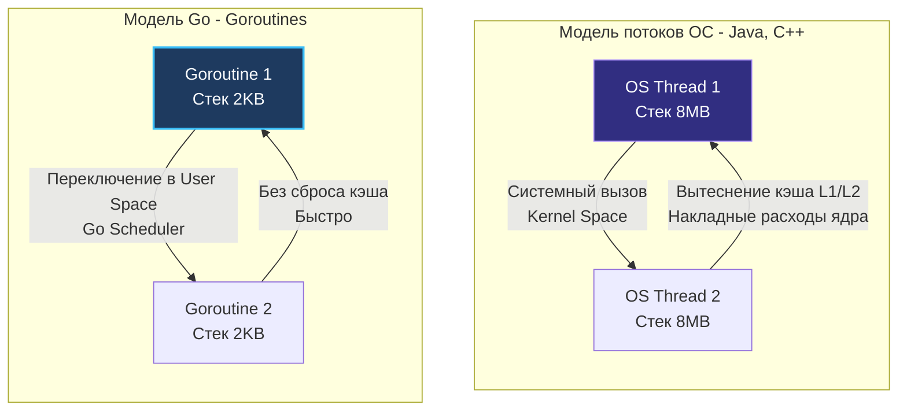

## Какие проблемы существующих языков пытался решить Go

> *«Управление сложностью — вот суть программирования».*    
> — Брайан Керниган

Каждый язык программирования несет на себе неизгладимый отпечаток своей эпохи. Язык C создавался в 1970-х годах в Bell Labs, когда оперативная память компьютеров измерялась десятками килобайт, а процессоры имели ровно одно ядро. Язык C++ родился в 1980-х годах, когда индустрия поверила, что сложнейшие предметные области можно выразить через монументальные иерархии классов. Java появилась в середине 1990-х, обещая переносимость «Write Once, Run Anywhere» за счет виртуальных машин.

Но к концу 2000-х годов ландшафт вычислений претерпел тектонический сдвиг:
- Закон Мура по росту тактовой частоты уперся в тепловой барьер, и серверы стали многоядерными.
- Сервисы превратились в распределенные сетевые системы, обрабатывающие сотни тысяч одновременных сетевых запросов.
- Кодовые базы выросли до десятков миллионов строк, над которыми одновременно работали тысячи инженеров.

Инструменты прошлого века начали трещать по швам под тяжестью масштаба. Go был спроектирован не для того, чтобы добавить еще один академический синтаксис в мир IT, а для того, чтобы решить **пять фундаментальных кризисов промышленной разработки бэкенда**.

---

### Бытовая аналогия: Рецепт торта и история сельского хозяйства

Чтобы ощутить разницу между C++ и Go, представьте поваренную книгу:
- **Подход C++ (`#include`):** Вы открываете рецепт шарлотки. В строке «возьмите 200 грамм муки» компилятор делает `#include <flour.h>`. Но в файле муки содержится подробная 500-страничная монография об истории одомашнивания пшеницы в Древнем Египте, химическом составе удобрений и чертежах дизельного комбайна. В результате обычный рецепт шарлотки раздувается до 20 000 страниц текста, которые компилятор обязан читать и парсить заново каждый раз, когда вы хотите испечь пирог.
- **Подход Go (модули и пакеты):** Рецепт шарлотки ссылается на предварительно скомпилированный стандарт: «Мука пшеничная высшего сорта, ГОСТ 200г». Компилятор Go считывает компактный бинарный заголовок за полмикросекунды, гарантируя, что ни один файл не будет прочитан дважды.

---

## 1. Проблема времени компиляции (Сломанный I/O)

В C/C++ используется текстовый препроцессор и механизм `#include`. Если у вас есть заголовочный файл `a.h`, который включается в `b.h`, а тот — в `c.h`, компилятору приходится читать и парсить один и тот же текст множество раз. В огромных монорепозиториях (как у Google) компиляция превращалась в процесс сложности $O(N^2)$ или хуже. 

На уровне железа это означало колоссальную избыточную нагрузку на дисковую подсистему (I/O) и процессор (постоянное построение одних и тех же абстрактных синтаксических деревьев — AST).

**Решение в Go:** 
Go ввел строгую иерархию пакетов (packages) и категорический запрет циклических зависимостей (`import cycle not allowed`). Если пакет `A` зависит от `B`, а `B` зависит от `C`, компилятор собирает их строго снизу вверх по ориентированному ациклическому графу (DAG). 
Когда `A` компилируется, компилятору **не нужно** читать исходники `C`. Он читает только уже скомпилированный объектный файл пакета `B` (`.a` файл), в котором в бинарном виде сохранена метаинформация об экспортируемых типах (включая транзитивные зависимости из `C`).
Каждый файл исходного кода парсится ровно **один раз**. Это снижает I/O нагрузку на порядки и делает сборку Go-кода молниеносной.

---

## 2. Кризис многопоточности и "Проблема C10K"

В середине 2000-х годов серверы начали получать многоядерные процессоры, а сетевые нагрузки выросли. Появилась проблема **C10K** — как одновременно держать 10 000 активных сетевых соединений (например, для долгоживущих соединений или вебсокетов).

Классические языки (Java, C++, PHP) предлагали два пути:
1.  **Thread per request (Поток ОС на запрос):** Один сетевой клиент = один OS Thread.
2.  **Асинхронный I/O с коллбэками (Event Loop):** Как в Node.js или Python (asyncio), где код выполняется в одном потоке, но использует epoll/kqueue.

Оба подхода имели критические системные изъяны.

### Mechanical Sympathy: Почему потоки ОС (OS Threads) — это дорого?

Если вы создаете 10 000 потоков ОС (в Java или C++), ядро Linux должно выделить каждому потоку стек памяти. По умолчанию это 1-8 МБ. Просто для того, чтобы держать 10 000 спящих потоков, вам потребуется **от 10 до 80 Гигабайт RAM**.

Вторая проблема — **Переключение контекста (Context Switch)**. Чтобы переключить выполнение с Потока 1 на Поток 2, процессор должен:
1. Выполнить прерывание или системный вызов и перейти в Kernel Space (Ring 0).
2. Сохранить полный набор регистров процессора в память структуры потока.
3. Выполнить логику планировщика ОС (CFS в Linux) по выбору следующей задачи.
4. Загрузить регистры нового потока и вернуться в User Space (Ring 3).
5. При переключении между разными *процессами* дополнительно перезагружается регистр `CR3` со сбросом кэша трансляции адресов (TLB Flush).

Даже для потоков одного процесса переключение через ядро занимает от 1 до 2 микросекунд (тысячи тактов CPU), а смена рабочего набора данных вытесняет строки из горячих кэшей L1/L2 (Cache Pollution), заставляя процессор простаивать в ожидании оперативной памяти (RAM).

**Решение в Go:** 
Внедрение модели `M:N` через **Goroutines** (горутины). 
Горутины — это легковесные потоки в User Space. Рантайм Go создает небольшое количество реальных потоков ОС (обычно равное числу ядер процессора), и мультиплексирует на них тысячи горутин.
*   Стартовый стек горутины — всего **2 КБ** (увеличивается динамически через непрерывный стек). 10 000 горутин занимают ~20 МБ.
*   Переключение контекста между горутинами делает сам рантайм Go в User Space (без системных вызовов в ядро и смены стеков ОС), сохраняя локальность горячих данных в кэшах CPU.

Подробнее мы изучим этот механизм в [[24. Concurrency Is Not Parallelism. Философия конкурентности в Go]].

---

## 3. Ад зависимостей и сложность деплоя

В мире C/C++ и Python приложение часто зависит от динамических библиотек (`.so` в Linux или `.dll` в Windows). Если вы собрали программу на Ubuntu 18.04 и перенесли бинарник на CentOS 7, программа может упасть при запуске с ошибкой `GLIBC_2.28 not found`. 
В мире Java и C# вам нужно было устанавливать на сервер правильную версию виртуальной машины (JRE или .NET Runtime) перед тем, как запустить код.

Это порождало "Dependency Hell" и знаменитое оправдание: *«На моей машине всё работает»*.

**Решение в Go:** 
**Статическая линковка по умолчанию.** Компилятор Go пакует весь ваш код, рантайм языка (GC, планировщик) и стандартную библиотеку в один независимый исполняемый файл (Fat Binary). 
Вам больше не нужна среда выполнения. Вы можете взять пустой Docker-контейнер (`FROM scratch`), положить туда бинарник Go, и он будет работать на любом дистрибутиве Linux с подходящей архитектурой процессора.

---

## 4. Хрупкость ООП и проблема базового класса

В 90-е и 00-е годы языки (Java, C++, C#) навязывали глубокие иерархии наследования. Разработчики тратили недели на проектирование "идеальных" деревьев классов (например, `Animal` -> `Mammal` -> `Dog`).
Однако в реальных бизнес-приложениях требования меняются быстро. Когда вам нужно было добавить поведение, которое не вписывалось в иерархию, приходилось переписывать базовые классы. Это приводило к **Fragile Base Class Problem** (проблеме хрупкого базового класса): изменение в корне дерева ломало логику во всех наследниках.

Знаменитая цитата создателя Erlang Джо Армстронга описывает эту проблему так: 
> *"Вы хотели получить банан, но в итоге получили гориллу, которая держит этот банан, и все джунгли в придачу."*

**Решение в Go:** 
Отказ от классического ООП-наследования. В Go нет ключевого слова `extends` или `class`. 
Вместо этого Go предлагает строгую композицию (структуры встраиваются в структуры) и неявные интерфейсы (Duck Typing). Вам не нужно заранее заявлять, что тип реализует интерфейс, — достаточно просто реализовать нужные методы. Это делает архитектуру невероятно гибкой. 
Более детально это рассмотрено в [[12. Composition Over Inheritance. Почему в Go нет наследования]].

---

## 5. Неявный поток управления (Магия и Исключения)

В C++ можно перегрузить оператор `+`. Вы видите в коде `a + b`, но на самом деле под капотом выполняется тяжелая функция, делающая сетевой запрос.
В Java и Python активно используются исключения (`try/catch`). Функция `process()` выглядит безобидно, но может выбросить 10 разных видов исключений, прерывая нормальный поток выполнения и заставляя процессор "раскручивать стек" (Stack Unwinding) в поисках подходящего обработчика.

Все это создает "магию", которая усложняет чтение кода. Для Google, где чужой код каждый день читают тысячи инженеров, неявное поведение было критической проблемой.

**Решение в Go:** 
Полный запрет на перегрузку операторов, отсутствие макросов и отказ от исключений как средства управления бизнес-логикой. 
В Go ошибки — это просто значения. Программист вынужден писать `if err != nil`, что делает поток управления (Control Flow) абсолютно прозрачным. Читая код, вы точно знаете: *вот здесь* программа может вернуть ошибку. 

> [!warning] Ловушка / Gotcha
> Многие разработчики, приходящие в Go, пытаются эмулировать `try/catch` с помощью механизмов `panic` и `recover`. Это грубейшее нарушение философии языка. Паника в Go предназначена исключительно для невосстановимых ошибок времени выполнения (например, выход за границы массива или разыменование nil-указателя), а не для бизнес-логики.
> *(Подробнее в [[9. Errors Are Values. Почему в Go нет исключений]])*

---

## Резюме

Go не пытался стать "лучшим языком для всего". Это узкоспециализированный инструмент для создания масштабируемых, сетевых, высоконагруженных бэкенд-систем.
Он решил проблемы тяжеловесности С++, громоздкости деплоя Java и медлительности Python, пожертвовав при этом некоторой выразительностью синтаксиса ради строгой инженерной предсказуемости.

Теперь, понимая проблемы, которые решал язык, нам будет проще увидеть, в чем именно заключаются его фундаментальные отличия от мейнстрима. В следующей статье мы разберем: [[4. Почему Go не похож на Java, C++ и C#]].