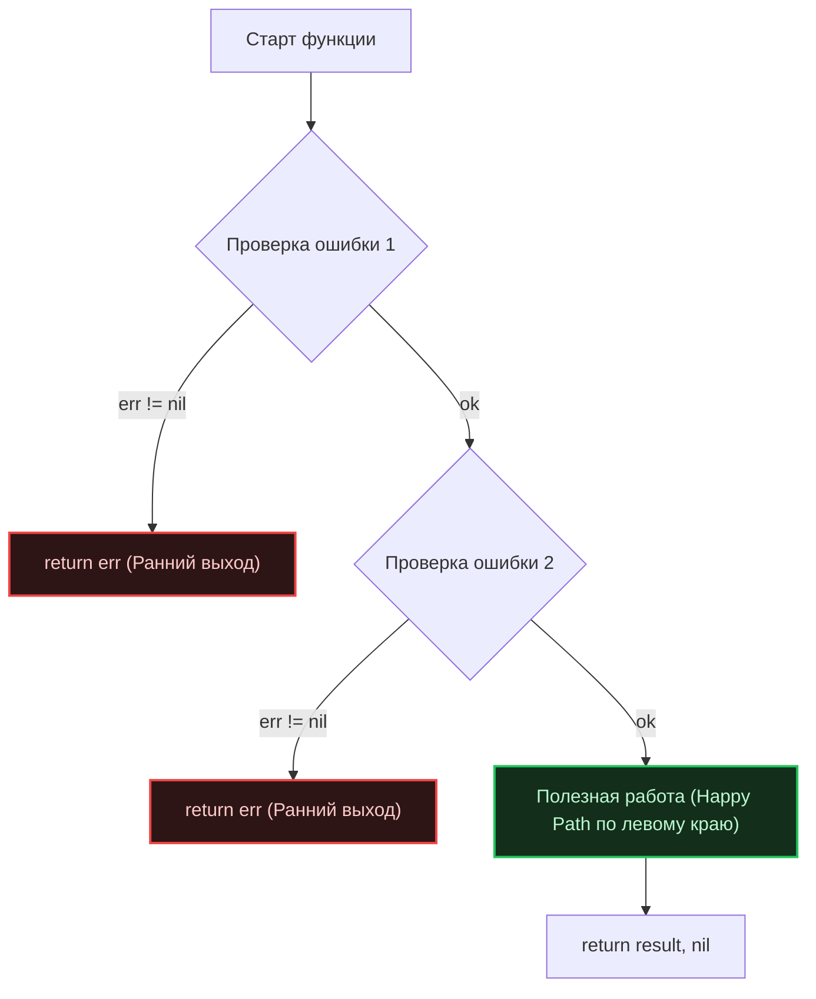

## Чтение кода — главный навык Senior-инженера

В классических корпоративных фреймворках (например, Java со Spring или C# с ASP.NET) чтение бизнес-логики нередко превращается в расследование невидимых связей. Инженер ищет аннотации вроде `@Autowired` или `[Inject]`, листая конфигурационные файлы и пытаясь догадаться, какой именно невидимый «магический» контейнер соберет этот класс в рантайме.

В Go все устроено принципиально иначе. Фундаментальная философия языка (изложенная в [[5. Философия Go. Простота, читаемость и прагматизм]]) и сознательный отказ от неявной магии ([[19. Почему в Go избегают магии и скрытого поведения]]) делают код предельно прозрачным и линейным.

Как однажды заметил Брайан Керниган, *код читается во много раз чаще, чем пишется*. Чтобы ориентироваться в чужих проектах на Go с крейсерской скоростью, достаточно понимать архитектурные конвенции сообщества и выработать привычку правильного сканирования исходников.

Ниже представлен проверенный гайд по эффективной навигации и анализу идиоматичных Go-кодовых баз.

---

## 1. Точка входа: Начинайте с `main.go`

В объектно-ориентированных экосистемах файл запуска часто состоит из единственной вычурной строчки `Application.Run()`, а вся конфигурация зависимостей скрыта в недрах XML или аннотаций. 

Идиоматичный проект на Go устроен прямолинейно: файл `main.go` служит **Корнем композиции (Composition Root)**.

При первом знакомстве с репозиторием придерживайтесь четкого маршрута:
1. Откройте директорию приложения: `cmd/<app_name>/main.go`.
2. Внимательно прочитайте функцию `main()`. В качественном коде здесь в абсолютно открытом виде разворачивается весь граф системы: инициализируются логгеры, поднимаются пулы коннектов к базам данных, создаются репозитории, передаются в сервисы и регистрируются в маршрутизаторах.

```go
// Пример типичного идиоматичного main.go
func main() {
    // 1. Инициализация инфраструктуры
    cfg := config.Load()
    db := postgres.NewDB(cfg.DBConn)
    defer db.Close() // Сразу видим, кто владеет и управляет ресурсом

    // 2. Внедрение зависимостей (DI) явным кодом
    userRepo := postgres.NewUserRepository(db)
    userService := user.NewService(userRepo)
    userHandler := http.NewUserHandler(userService)

    // 3. Запуск маршрутизатора и сервера
    router := chi.NewRouter()
    router.Post("/users", userHandler.Create)

    // ... graceful shutdown
}
```

> [!tip] Собеседование
> **Вопрос:** Почему в Go-сообществе избегают тяжелых DI-фреймворков (Dependency Injection Containers), привычных для Java или C#?
> **Ответ:** Явная инициализация зависимостей в `main.go` формирует прозрачный граф, который верифицируется компилятором на этапе сборки. Если разработчик забудет передать зависимость или ошибется в типе, компилятор немедленно укажет на ошибку. Фреймворки внедрения зависимостей на базе рефлексии (`Reflection-based DI`) переносят проверку корректности графа на момент старта приложения в рантайме, что создает риск внезапных падений в продакшене. О нелюбви Go к скрытой магии рефлексии мы говорили в лекции [[19. Почему в Go избегают магии и скрытого поведения]].

---

## 2. Line of Sight (Линия видимости)

Читая функции в Go, обращайте пристальное внимание на геометрию отступов. В идиоматичном коде действует непреложное правило «линии видимости» (*Line of Sight*): **основной успешный путь исполнения («Happy Path») всегда прижат к левому краю экрана.**

Вы практически никогда не встретите в хорошем коде глубоких «лесенок» вложенных условий `if-else` или громадных блоков `try-catch`, уползающих вправо за пределы видимости монитора. Логика течет строго сверху вниз. Ошибки отсекаются немедленно через быстрый возврат (см. [[10. Обработка ошибок в Go. if err != nil как часть дизайна]]).



**Техника чтения:** Сканируйте глазами только левый край функции. Вы мгновенно поймете суть выполняемой задачи, скользя взглядом мимо стандартных трехстрочников `if err != nil`. Ошибки в Go — это защитные барьеры на шоссе: они критически важны для безопасности, но не должны заслонять саму дорогу.

---

## 3. Трекинг потока выполнения (Context)

В традиционных языках с системными потоками (`OS Threads`) широко используется механизм `Thread-Local Storage` — скрытое хранилище, невидимо привязанное к текущему системному потоку. Туда обычно прячут авторизационные токены, идентификаторы трейсинга и транзакции.

В Go горутины исчисляются сотнями тысяч и динамически мигрируют между потоками ядра под управлением планировщика (`G-M-P`). Концепция Thread-Local Storage здесь неприменима архитектурно. Вся контекстная информация передается исключительно **явно через аргумент `context.Context`**.

**Золотое правило чтения:** Если первым аргументом функции объявлен `ctx context.Context`, значит, данная процедура:
1. Выполняет потенциально длительную операцию ввода-вывода (сеть, СУБД, чтение файла);
2. Поддерживает отмену исполнения (`Cancellation`) и соблюдение дедлайнов (таймаутов);
3. Способна порождать фоновые горутины, чье время жизни привязано к дереву этого контекста.

Читая незнакомый проект, мысленно отслеживайте траекторию `ctx`. Если вы видите вызов `context.Background()`, перед вами точка зарождения нового независимого жизненного цикла задачи.

---

## 4. Как читать конкурентный код

Анализ конкурентного кода требует предельной концентрации, поскольку единая нить исполнения расщепляется на множество параллельных потоков. Для понимания взаимодействия горутин используйте **Принцип лексического владения (Lexical Confinement)**.

Всегда ищите **Владельца (Owner)** ресурса:
1. Горутина, создавшая канал (`make(chan T)`), обязана быть его полноправным владельцем: именно она пишет в него данные и именно она обязана закрыть его (`close(ch)`).
2. Функция, порождающая горутину через `go func()`, обязана гарантировать, когда и при каких условиях эта горутина гарантированно завершит свою работу.

> [!warning] Ловушка / Gotcha
> Если при аудите кода вы видите функцию, которая возвращает канал, но нигде в ее лексическом окружении не определены условия его закрытия — перед вами классическая утечка горутин (`Goroutine Leak`). 
> 
> Сборщик мусора (`GC`) физически не способен освободить память горутины, заблокированной на вечном чтении из незакрытого канала: планировщик считает такую горутину живой и сохраняет ее дескриптор. Фундаментальные принципы безопасного обмена сообщениями через каналы мы разбирали в лекции [[25. Share Memory By Communicating. Почему каналы важнее Mutex]].

---

## 5. Чтение с прицелом на Mechanical Sympathy

Опытный Senior-разработчик смотрит на исходный код не просто как на текст, а как на сценарий расхода процессорного времени и оперативной памяти. В этом проявляется инженерное сочувствие к машине (**Mechanical Sympathy**).

### Аллокации и Escape Analysis
Встретив в коде взятие адреса переменной (оператор `&`), задайте себе вопрос: покинет ли этот объект пределы текущего кадра стека?
* Если указатель передается в локальную вспомогательную функцию — память останется на горячем стеке (в кэш-памяти L1/L2).
* Если указатель сохраняется в долгоживущую структуру, пишется в мапу или отправляется в канал — компилятор переместит объект в кучу (`Heap`). Это означает дополнительную нагрузку на Garbage Collector.

### Работа со слайсами
Вызов `make([]int, 0)` внутри объемного цикла — классический тревожный маркер. Идиоматичный Go стремится к минимизации лишних перевыделений памяти.
* Профессиональный паттерн: предварительное выделение непрерывной памяти (`Continuous Memory`) через явное указание емкости: `make([]int, 0, len(source))`. Это исключает лавину промежуточных аллокаций при исчерпании `capacity`.

### Интерфейсы и динамическая диспетчеризация
Благодаря неявной типизации ([[15. Duck Typing и неявная реализация интерфейсов]]), интерфейсы в Go не требуют объявления `implements`. 

**Как быстро обнаружить конкретную реализацию интерфейса?**  
Откройте соответствующие тесты: в файлах `_test.go` разработчики всегда конструируют реальные структуры или мок-объекты для передачи в интерфейсные контракты. Тесты — это самая надежная и живая документация системы.

> [!info] Под капотом: `itab` и вызовы
> Читая строчку `userRepo.Save()`, где `userRepo` — это интерфейсный тип, помните о физике процесса. Процессор считывает структуру `iface`, находит указатель на таблицу интерфейсных методов `itab`, вычисляет адрес метода и совершает косвенный переход (Indirect Call). Такой вызов принципиально не может быть заинлайнен, а в случае полиморфного потока данных (когда тип реализации динамически меняется) предсказатель ветвлений (`Branch Predictor`) рискует допустить ошибку, вызвав сброс конвейера инструкций. В критичных высоконагруженных циклах (High Performance) интерфейсы сознательно заменяют прямыми вызовами конкретных структур.

---

## Итог

1. **Топология проекта:** Начинайте аудит репозитория с файла `cmd/.../main.go`, где собран весь скелет и граф зависимостей системы.
2. **Линия видимости:** Читайте код по левому краю (Happy Path). Ранние выходы по `if err != nil` — это защитные клапаны, сохраняющие чистоту бизнес-логики.
3. **Кровеносная система:** Отслеживайте передачу `context.Context` для контроля отмен и распределенных тайм-аутов.
4. **Механическое сочувствие:** Оценивайте аллокации на лету: различайте бесплатные операции на стеке, побег в кучу и стоимость косвенных вызовов через интерфейсные таблицы `itab`.

---

Мы проделали колоссальный путь: разобрались, почему Go отвергает громоздкое наследование, почему он предпочитает явные ошибки исключениям и как устроена его уникальная модель конкурентности. 

Пришло время свести все полученные знания в единую стройную систему взглядов. В заключительной статье нашего модуля мы сформулируем ключевые принципы правильного профессионального майндсета инженера на Go: [[31. Итоги раздела. Правильный майндсет Go-разработчика]].
